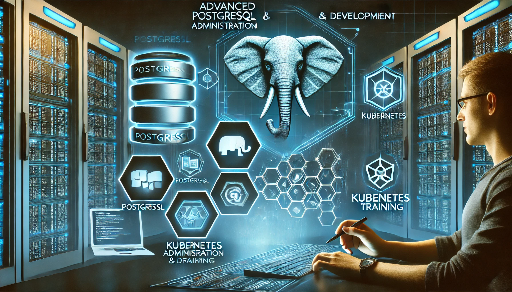

# **Advanced PostgreSQL Administration Development Kubernetes Eğitimi**

- [Güncel PDF'i İndir](https://www.vebende.com.tr/pdfs/advanced-posgress-development-kubernetes.pdf)
- [En güncel eğitimlerimiz için www.vebende.com.tr ziyaret edin](https://www.vebende.com.tr/postgresql)

## **Eğitim Süresi**

- **Format 1**
  - **10 Gün**
  - **Ders Süresi:** 50 dakika
  - **Eğitim Saati:** 10:00 - 17:00

- **Format 2**
  - **15 Gün**
  - **Ders Süresi:** 50 dakika
  - **Eğitim Saati:** 10:00 - 17:00

- > Her iki eğitim formatında eğitimler 50 dakika + 10 dakika moladır. 12:00-13:00 saatleri arasında 1 saat yemek arasındaki verilir. Günde toplam 6 saat eğitim verilir. 10 günlük formatta 60 saat eğitim, 15 günlük formatta toplam 90 saat eğitim verilmektedir. 15 günlük eğitmde katılımcılar kod yazar ve eğitmenle birlikte sorulan sorulara ve taleplere uygun içerikler ve örnekler çalışılır.

- > Eğitimler uzaktan eğitim formatında tasarlanmıştır. Her eğitim için teams linkleri gönderilir. Katılımcılar bu linklere girerek eğitimlere katılırlar. Ayrıca farklı remote çalışma araçları da eğitmen tarafından tüm katılımlara sunulur. Katılımcılar bu araçları kullanarak eğitimlere katılırlar. 

- > Eğitim yapay zeka destekli kendi kendine öğrenme formasyonu ile tasarlanmıştır. Katılımcılar eğitim boyunca kendi kendine öğrenme formasyonu ile eğitimlere katılırlar. Bu eğitim formatı sayesinde tüm katılımcılar gelecek tüm yaşamlarında kendilerini güncellemeye devam edebilecekler ve her türlü sorunun karşısında çözüm bulabilecekleri yeteneklere sahip olacaklardır.

## **PostgreSQL ile Yüksek Performanslı Veritabanı Yönetimi**  

PostgreSQL dünyasına güçlü bir giriş yapmaya hazır mısınız? Bu eğitim, PostgreSQL’in temel özelliklerinden ileri seviye performans optimizasyonlarına kadar geniş bir yelpazede bilgi edinmenizi sağlar.  

Veri yönetimi süreçlerinizi güçlendirmek, veritabanı güvenliğini sağlamak ve büyük veri kümelerini etkin bir şekilde işlemek için PostgreSQL’in tüm yeteneklerinden faydalanın. **15 günlük kapsamlı eğitim programı** ile kurulumdan replikasyona, performans takibinden yüksek erişilebilirlik stratejilerine kadar tüm kritik konulara hakim olacaksınız.  

Kubernetes entegrasyonundan, JSON/NoSQL özelliklerine kadar PostgreSQL’in modern veri yönetimindeki gücünü keşfedin. Sistem yöneticileri, veri mühendisleri ve yazılım geliştiriciler için özel olarak tasarlanmış bu eğitimle, PostgreSQL’i en verimli şekilde kullanmayı öğrenin!

## **Eğitim Hedefi**  

Bu eğitim, katılımcıların **PostgreSQL** veritabanı yönetim sistemini ileri düzeyde anlamalarını ve kurumsal ortamlarda etkin bir şekilde kullanabilmelerini hedeflemektedir. Eğitimin sonunda, PostgreSQL’in güçlü özelliklerini kullanarak veri yönetimini optimize etme, performans iyileştirmeleri yapma ve yüksek erişilebilirlik sağlayan çözümleri uygulayabilir hale gelmeyi amaçlıyoruz.  

Katılımcılar, **temel kurulum ve yapılandırma işlemlerinden, gelişmiş SQL sorgularına, replikasyon tekniklerinden Kubernetes entegrasyonuna kadar** PostgreSQL’in tüm kritik bileşenlerini öğreneceklerdir. Ayrıca, PostgreSQL’in **JSON/NoSQL desteği, indexleme stratejileri, performans izleme araçları ve güvenlik konuları** gibi modern veritabanı yönetimi için hayati önem taşıyan alanlarında derinlemesine bilgi sahibi olacaklardır.  

Bu eğitim, özellikle **sistem yöneticileri, veri mühendisleri ve yazılım geliştiriciler** için tasarlanmıştır. PostgreSQL’in güçlü ve az bilinen özelliklerini keşfederek, **kurumsal seviyede ölçeklenebilir, güvenli ve performanslı veritabanı çözümleri** oluşturabilirsiniz.

## **Eğitim İçeriği**

### **1. PostgreSQL’e Giriş ve Temelleri**

- PostgreSQL nedir?
- PostgreSQL’in tarihçesi ve gelişimi
- PostgreSQL’in kullanım alanları
- PostgreSQL’in diğer veritabanı sistemlerinden farkları
- PostgreSQL mimarisi (Veritabanı, Şema, Tablo, Index, vb.)

### **2. PostgreSQL Kurulumu ve Yapılandırması**

- Windows, Linux ve macOS üzerinde PostgreSQL kurulumu
- PostgreSQL’in Docker ve Kubernetes ile çalıştırılması
    - Kubernetes üzerinde PostgreSQL kurulumu
    - Kubernetes’in PostgreSQL üzerindeki avantajları
- pgAdmin ve Komut Satırı Arayüzü (psql)
    - pgAdmin kullanımı ve PostgreSQL ile etkileşim
    - psql ile temel işlemler
- PostgreSQL servis yönetimi (Başlatma, durdurma, yeniden başlatma)
- PostgreSQL yapılandırma dosyaları (postgresql.conf, pg_hba.conf)

### **3. Temel SQL Komutları ve Veri Türleri**

- Temel SQL komutları (SELECT, INSERT, UPDATE, DELETE)
- Veri türleri (INTEGER, VARCHAR, TEXT, BOOLEAN, JSONB, ARRAY vb.)
- WHERE, ORDER BY, GROUP BY kullanımı
- JOIN türleri (INNER, LEFT, RIGHT, FULL)
- Alt sorgular ve CTE (Common Table Expressions)
- Hata ayıklama ve debug işlemleri

### **4. PostgreSQL İleri Seviye SQL Konuları**

- **Indexleme ve Performans Optimizasyonu**
    - Index türleri: B-tree, Hash, GiST, GIN
    - EXPLAIN ANALYZE kullanımı
    - Query tuning (Sorgu optimizasyonu)
- **Partitioning (Bölümlendirme)**
    - Range ve List Partitioning
    - Hash Partitioning
    - Subpartitioning
- **Transaction ve ACID Prensipleri**
    - Transaction yönetimi
    - ACID ilkeleri ve PostgreSQL’in bu prensiplere uyumu
    - Locking ve Deadlock yönetimi
- **Stored Procedure ve Fonksiyonlar**
    - PL/pgSQL ile fonksiyonlar
    - Fonksiyon yazma, parametre kullanımı, dönen değerler
- **Triggers ve Event Listeners**
    - Trigger çeşitleri: BEFORE, AFTER, INSTEAD OF
    - Event Trigger’lar

### **5. PostgreSQL ve JSON Özellikleri**

- **JSON ve JSONB veri türleri**
    - JSON ve JSONB arasındaki farklar
    - JSON verileri ile çalışmak
- **PostgreSQL’de NoSQL Kullanımı**
    - PostgreSQL ile NoSQL özellikleri
    - Veri modeli tasarımı ve NoSQL entegrasyonu
- **JSON Sorgulama Yöntemleri**
    - JSON içeriği üzerinde sorgulama ve manipülasyon

### **6. PostgreSQL Replikasyon ve Yüksek Erişilebilirlik**

- **Streaming Replication**
    - Master-Slave yapısında replikasyon
    - Replikasyon parametreleri ve yapılandırması
- **Logical Replication**
    - Logical Replication ile veri paylaşımı
    - Publisher ve Subscriber yönetimi
- **Failover ve Backup Yöntemleri**
    - Yedekleme stratejileri ve yönetimi
    - PITR (Point In Time Recovery)
    - Yüksek erişilebilirlik senaryoları

### **7. PostgreSQL Güvenlik ve Yetkilendirme**

- **Kullanıcı ve Rol Yönetimi**
    - Kullanıcı oluşturma, silme ve güncelleme
    - Rol atamaları ve yönetimi
- **Yetkilendirme ve Erişim Kontrolleri**
    - Veri tabanı erişim kontrolü (GRANT, REVOKE)
    - Veritabanı ve tablo seviyesinde yetki kontrolü
- **Veri Şifreleme ve Güvenlik Önlemleri**
    - SSL/TLS şifreleme
    - Veritabanı şifrelemesi (pgcrypto modülü)
    - Güvenlik açıkları ve önlemler

### **8. PostgreSQL Performans İzleme ve Optimizasyon**

- **Performans İzleme**
    - PostgreSQL izleme araçları: pg_stat_statements, pgAdmin, Prometheus
    - Log analizi ve uyarılar
- **Performans Optimizasyonu**
    - İndeks optimizasyonu ve stratejileri
    - Query plan analizi ve iyileştirme
    - Sorgu performansı ve disk I/O yönetimi

### **9. PostgreSQL’de Uygulama Geliştirme ve Kodlama**

- **PL/pgSQL ile Programlama**
    - PL/pgSQL diline giriş
    - Değişkenler, kontrol yapıları ve döngüler
    - Hata yönetimi
- **PostgreSQL ile Web ve API Entegrasyonu**
    - PostgreSQL kullanarak basit bir REST API geliştirme
    - JSON verileri ile API’lere entegrasyon
    - Uygulama düzeyinde hata ayıklama
- **PostgreSQL ile Kurumsal Uygulama Geliştirme**
    - Kurumsal uygulamalar için PostgreSQL kullanımı
    - Uygulama veritabanı tasarımı
    - Yüksek performanslı uygulama için PostgreSQL optimizasyonu

### **10. PostgreSQL ve Kubernetes Entegrasyonu**

- Kubernetes üzerinde PostgreSQL uygulaması
    - PostgreSQL pod’larının kurulumu ve yönetimi
    - Kubernetes ile ölçeklenebilirlik ve yüksek erişilebilirlik sağlama
- Kubernetes üzerinde PostgreSQL replikasyon yapılandırması
- PostgreSQL için Kubernetes ile otomatik yedekleme ve güncelleme

## **Eğitim Yöntemi**  

- **Teorik Bilgi:** PostgreSQL’in temel ve ileri düzey kavramlarının anlatımı, en iyi uygulamalar ve güncel teknolojiler hakkında bilgi paylaşımı.  
- **Uygulamalı Örnekler:** Gerçek hayattan senaryolar ve PostgreSQL üzerinde pratik uygulamalar ile konuların pekiştirilmesi.  
- **Etkileşimli Tartışmalar:** Katılımcıların aktif katılım sağlayacağı, soru-cevap oturumları ile bilgilerin derinlemesine ele alınması.  
- **Proje Tabanlı Öğrenme:** Eğitimin son aşamasında, katılımcılar öğrendiklerini pratiğe dökerek kapsamlı bir PostgreSQL projesi gerçekleştireceklerdir.

## **Hedef Kitle**  

- **Veritabanı Yöneticileri (DBA’ler):** PostgreSQL yönetimi, yapılandırması ve performans optimizasyonu konusunda uzmanlaşmak isteyen yöneticiler.  
- **Sistem Yöneticileri:** PostgreSQL’i Linux ve bulut tabanlı altyapılarda yönetmek isteyen sistem yöneticileri.  
- **Yazılım Geliştiricileri:** PostgreSQL’i projelerinde verimli bir şekilde kullanmak isteyen back-end ve full-stack yazılım geliştiricileri.  
- **Veri Analistleri ve Mühendisleri:** Büyük veri yönetimi, SQL sorgu optimizasyonu ve veri işleme süreçlerinde PostgreSQL’den faydalanmak isteyen analistler ve mühendisler.  
- **DevOps ve Bulut Mühendisleri:** PostgreSQL’i Docker ve Kubernetes ortamlarında kullanmak ve CI/CD süreçlerine entegre etmek isteyen mühendisler.  
- **Teknoloji Yöneticileri:** PostgreSQL tabanlı veri çözümlerini kurumlarına entegre etmek ve yönetmek isteyen teknoloji liderleri.

## **Katılımcılardan Beklentilerimiz**  

- **Temel SQL Bilgisi:** Katılımcıların temel SQL sorgularını yazabiliyor olması beklenmektedir.  
- **Linux Temelleri:** PostgreSQL'in Linux tabanlı sistemlerde yaygın olarak kullanılması nedeniyle, temel Linux komutlarını bilmek avantaj sağlayacaktır.  
- **Veritabanı Kavramları:** İlişkisel veritabanı sistemleri hakkında genel bir anlayışa sahip olmak faydalı olacaktır.  
- **Öğrenmeye Açıklık ve Aktif Katılım:** Eğitim sürecinde teorik ve uygulamalı bölümler yer alacağından, katılımcıların aktif olarak sürece dahil olmaları beklenmektedir.

[Eğitim Materyalleri (Eğitmenlere Özel)](https://github.com/TuncerKARAARSLAN-VB/training-kit-advanced-postgre-sql-administration-development-kubernetes)
