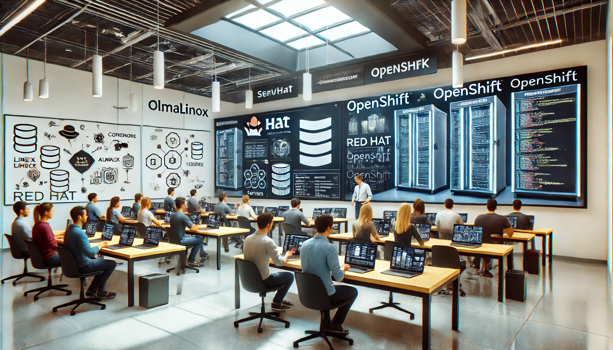

# **Bilinmeyen Yönleri ile Red Hat ve OpenShift Eğitimi**

## Eğitim Süresi:

**Format 1**

- **5 Gün**
- **Ders Süresi:** 50 dakika
- **Eğitim Saati:** 10:00 - 17:00

**Format 2**

- **12 Gün**
- **Ders Süresi:** 50 dakika
- **Eğitim Saati:** 10:00 - 17:00

## **Bilinmeyen Yönleri ile Red Hat ve OpenShift Eğitimi**

Kurumsal altyapınızın gerçek gücünü ortaya çıkarmaya hazır mısınız? Bu eğitim, Red Hat ve OpenShift teknolojilerinin gizli kalan özelliklerini kullanarak sistemlerinizi daha verimli, güvenli ve ölçeklenebilir hale getirmenizi sağlar. AlmaLinux ve OpenShift’in sunduğu ileri düzey çözümlerle kurumunuzun dijital dönüşümünü hızlandırın. Bu eğitim, sistem yöneticileri, DevOps mühendisleri ve teknoloji liderlerine, kurumsal seviyede konteyner tabanlı uygulamaların yönetimi ve otomasyonu konusunda derinlemesine bilgi kazandırmak için tasarlanmıştır. Kurumunuzun teknolojik gücünü en üst seviyeye çıkarın!

AlmaLinux Redhat ücretsiz dağıtımıdır. Birebir redhat ile aynı özelliklere sahiptir. OpenShift ise Redhat tarafından geliştirilen bir konteyner yönetim platformudur. OpenShift, konteyner tabanlı uygulamaları oluşturmak için kullanılır. ALmalinux üzerine openshift kurmak uzmanlık gerektirir. Bu eğitim ile openshift kurulumu ve yönetimi hakkında bilgi edineceksiniz.

## Eğitim Hedefi:

Bu eğitim, katılımcıların Red Hat ve OpenShift teknolojilerini ileri düzeyde anlamalarını ve kurumsal ortamlarda bu sistemleri etkin bir şekilde kullanabilmelerini hedeflemektedir. Eğitimin sonunda, Red Hat Enterprise Linux (RHEL) işletim sistemi ile güçlü bir altyapı kurma ve OpenShift platformunda konteyner tabanlı uygulamaların yönetimi, dağıtımı ve otomasyonunu gerçekleştirebilir hale gelmeyi amaçlıyoruz. Katılımcılar, Red Hat ve OpenShift'in az bilinen fakat güçlü özelliklerini keşfedecek, bu teknolojilerle sistemlerini daha verimli ve güvenli hale getirmeyi öğreneceklerdir. Redhat lisanslı bir sürüm olduğu için katılımcıların almalinux üzerinden eğitimleri verilecek. Almalinux redhat ekibi tarafından geliştirilen ve redhat ile birebir aynı sürümdür. Özellikle eğitimlerde kullanılmak için tasarlanmıştır.

**Alma Linux Güncellemesi:** Bu eğitim, katılımcıların AlmaLinux ve OpenShift teknolojilerini ileri düzeyde anlamalarını ve kurumsal ortamlarda bu sistemleri etkin bir şekilde kullanabilmelerini hedeflemektedir. Eğitimin sonunda, AlmaLinux tabanlı bir işletim sistemi üzerinde güçlü bir altyapı kurma ve OpenShift platformunda konteyner tabanlı uygulamaların yönetimi, dağıtımı ve otomasyonunu gerçekleştirebilir hale gelmeyi amaçlıyoruz. Katılımcılar, AlmaLinux ve OpenShift'in az bilinen fakat güçlü özelliklerini keşfedecek, bu teknolojilerle sistemlerini daha verimli ve güvenli hale getirmeyi öğreneceklerdir.

## Eğitim İçeriği:

### **Gün 1: AlmaLinux Temelleri ve Kurulumu**

- **AlmaLinux Nedir?** AlmaLinux’un tarihçesi ve RHEL ile ilişkisi.
- **AlmaLinux Kurulumu:** AlmaLinux’un adım adım kurulumu, disk yapılandırması, ağ ayarları.
- **Temel Linux Komutları ve Yönetim:** Dosya sistemi yönetimi, kullanıcı ve grup yönetimi, dosya izinleri ve süreç yönetimi.
- **Performans Ayarlamaları:** Çekirdek yönetimi, sistem optimizasyonu ve AlmaLinux’ta performans iyileştirme yöntemleri.
- **SELinux Yapılandırması:** SELinux (Security-Enhanced Linux) temel güvenlik ilkeleri ve yapılandırma yöntemleri.

### **Gün 2: AlmaLinux Sistem Yönetimi ve Otomasyon**

- **Sistem Yönetimi:** Servis yönetimi, ağ yapılandırması, depolama yönetimi (LVM, RAID).
- **Paket Yönetimi:** DNF ve YUM ile paket kurulumu, güncelleme, bağımlılık yönetimi.
- **Sistem İzleme ve Performans Ölçümü:** AlmaLinux’ta log yönetimi, izleme araçları ve sistem kaynaklarının takibi.
- **Ansible ile Otomasyon:** Ansible kullanarak sistem yönetimi, playbook oluşturma ve otomasyon süreçleri.
- **Güvenlik ve Uyumluluk:** AlmaLinux’ta güvenlik en iyi uygulamaları, güvenlik güncellemeleri, firewall yapılandırması.

### **Gün 3: OpenShift Nedir ve Kurulumu**

- **OpenShift’e Giriş:** OpenShift’in temelleri, Kubernetes ile ilişkisi ve farkları.
- **Konteyner Orkestrasyonu:** Kubernetes ve OpenShift'in birlikte nasıl çalıştığı, OpenShift’in Kubernetes üzerindeki katkıları.
- **OpenShift Kurulumu:** AlmaLinux üzerinde OpenShift kurulumu ve konfigürasyonu.
- **Konteyner Yönetimi:** Pod dağıtımı, konteyner replikasyonu, ölçekleme işlemleri ve hata yönetimi.
- **Sürükle ve Bırak ile Uygulama Geliştirme:** OpenShift Developer Console kullanarak hızlı uygulama geliştirme ve deployment.

### **Gün 4: OpenShift İleri Düzey Konular**

- **OpenShift Rotaları ve Servis Ağı:** OpenShift’in ağ yönetimi, HTTP/S routing ve ingress controller yapılandırması.
- **Depolama Yönetimi:** Persistent Volume (PV) ve Persistent Volume Claim (PVC) kullanımı, dinamik depolama entegrasyonu.
- **Güvenlik ve Erişim Kontrolleri:** RBAC (Role-Based Access Control), kullanıcı ve grup yönetimi, proje bazlı erişim kontrolü.
- **OpenShift Operatörleri:** OpenShift Operator Framework ile uygulama yönetimi ve operasyon süreçlerinin otomasyonu.
- **OpenShift GitOps:** GitOps yaklaşımı ile OpenShift’te CI/CD süreçlerinin otomasyonu, ArgoCD kullanımı.

### **Gün 5: OpenShift ve DevOps Entegrasyonu**

- **CI/CD Pipeline Yönetimi:** Jenkins ve OpenShift entegrasyonu, build ve deploy pipeline’larının oluşturulması.
- **Konteyner Güvenliği:** OpenShift üzerinde konteyner imajlarının güvenliği, imaj taramaları, güvenli imaj yönetimi.
- **Monitoring ve Loglama:** OpenShift'te Prometheus ve Grafana ile izleme ve metrik toplama, log yönetimi.
- **Cluster Yönetimi ve Ölçekleme:** Cluster yönetimi, node ekleme/çıkarma, yüksek erişilebilirlik (HA) ve yedekleme stratejileri.
- **Proje Çalışması:** Katılımcılar öğrendiklerini OpenShift üzerinde uygulayarak bir proje geliştirir ve sunar.

## Eğitim Yöntemi:

- **Teorik Bilgi:** Güncel bilgiler ve konseptlerin anlatımı.
- **Uygulamalı Örnekler:** Gerçek senaryolarla pratik uygulamalar.
- **Etkileşimli Tartışmalar:** Katılımcıların aktif katılım sağlayacağı, soru-cevap şeklinde tartışmalar yapılacak oturumlar.
- **Proje Tabanlı Öğrenme:** Eğitimin son günü, katılımcıların öğrendiklerini pratikte uygulayacakları kapsamlı bir proje çalışması yapılacak.

## Hedef Kitle:

- **Sistem Yöneticileri:** AlmaLinux ve OpenShift altyapılarında çalışmak isteyen sistem yöneticileri.
- **DevOps Mühendisleri:** CI/CD süreçlerini OpenShift ile entegre etmek isteyen mühendisler.
- **Yazılım Geliştiricileri:** Konteyner tabanlı uygulamalar geliştiren veya geliştirmeyi planlayan yazılımcılar.
- **Bulut Mühendisleri:** OpenShift’i bulut ortamlarında kullanmak isteyen bulut altyapı mühendisleri.
- **Teknoloji Yöneticileri:** Kurumlarının AlmaLinux ve OpenShift tabanlı çözümlere geçişini yönetmek isteyen teknoloji liderleri.

## Katılımcılardan Beklentilerimiz:

- Katılımcıların temel Linux bilgisine sahip olmaları.
- Temel seviyede konteyner ve Kubernetes bilgisi önerilir, ancak zorunlu değildir.
- Aktif katılım ve öğrenme isteği.

[Eğitim ana materyalleri, sadece eğitmenler için](https://github.com/TuncerKARAARSLAN-VB/training-kit-bilinmeyen-yonleriyle-red-hat-openshift)
