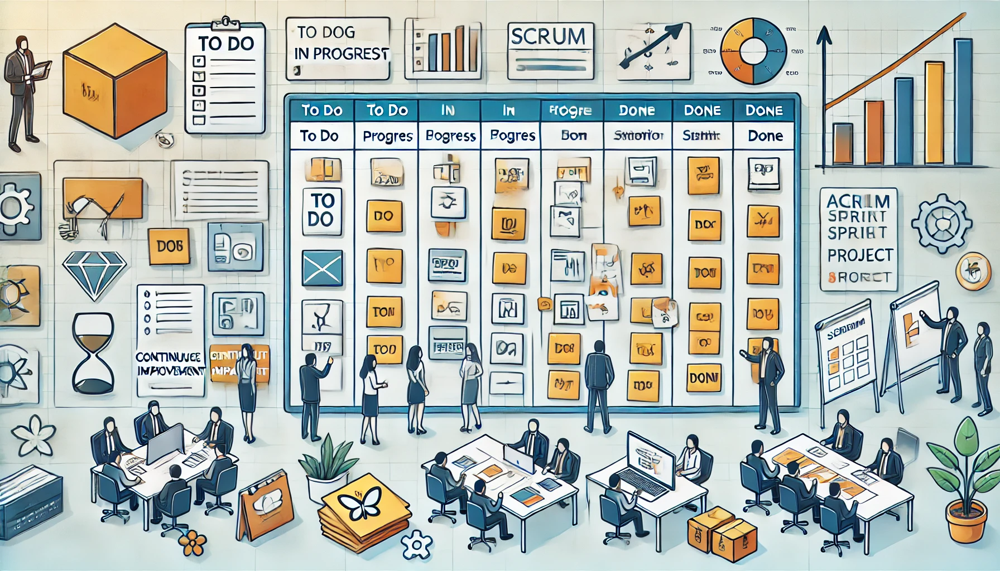

# **Agile Proje Yönetimi**

## **Eğitim Süresi**

- **Format 1**
  - **5 Gün**
  - **Ders Süresi:** 50 dakika
  - **Eğitim Saati:** 10:00 - 17:00

- **Format 2**
  - **12 Gün**
  - **Ders Süresi:** 50 dakika
  - **Eğitim Saati:** 10:00 - 17:00

- > Her iki eğitim formatında eğitimler 50 dakika + 10 dakika moladır. 12:00-13:00 saatleri arasında 1 saat yemek arasındaki verilir. Günde toplam 6 saat eğitim verilir. 5 günlük formatta 30 saat eğitim, 12 günlük formatta toplam 72 saat eğitim verilmektedir. 12 saatlik eğitmde katılımcılar kod yazar ve eğitmenle birlikte sorulan sorulara ve taleplere uygun içerikler ve örnekler çalışılır.

- > Eğitimler uzaktan eğitim formatında tasarlanmıştır. Her eğitim için teams linkleri gönderilir. Katılımcılar bu linklere girerek eğitimlere katılırlar. Ayrıca farklı remote çalışma araçları da eğitmen tarafından tüm katılımlara sunulur. Katılımcılar bu araçları kullanarak eğitimlere katılırlar. 

- > Eğitim içeriğinde github ve codespace kullanılır. Katılımcılar bu platformlar üzerinden örnek projeler oluşturur ve eğitmenle birlikte eğitimlerde sorulan sorulara ve taleplere uygun iceriğe cevap verir. Katılımcılar bu araçlarla eğitimlerde sorulan sorulara ve taleplere uygun iceriğe cevap verir.

- > Eğitim yapay zeka destekli kendi kendine öğrenme formasyonu ile tasarlanmıştır. Katılımcılar eğitim boyunca kendi kendine öğrenme formasyonu ile eğitimlere katılırlar. Bu eğitim formatı sayesinde tüm katılımcılar gelecek tüm yaşamlarında kendilerini güncellemeye devam edebilecekler ve her türlü sorunun karşısında çözüm bulabilecekleri yeteneklere sahip olacaklardır.  

## **Agile Yönetimi**

Agile Yönetimi, geleneksel ve hiyerarşik proje yönetimi yöntemlerinin sınırlamalarını aşarak, projelerin daha hızlı, esnek ve verimli bir şekilde yönetilmesini sağlayan bir yaklaşımı ifade eder. Hızla değişen iş dünyasında, müşteri taleplerine hızla uyum sağlamak ve rekabetçi kalmak için esneklik ve hızlı adaptasyon yeteneği oldukça önemlidir. Agile, bu ihtiyaçları karşılamak amacıyla geliştirilmiş bir yönetim felsefesidir ve projelerin her aşamasında sürekli iyileştirme, şeffaflık ve takım içi işbirliğini ön planda tutar.

Agile Yönetimi, yazılım geliştirme dünyasında ortaya çıkmış olsa da, günümüzde çok farklı sektörlerde ve organizasyonel yapılarla uygulanmaya başlanmıştır. Bu yaklaşım, projelerin daha dinamik bir şekilde yönetilmesine olanak sağlar ve hedeflere ulaşmak için gerekli olan esnekliği sunar. Temel amacı, projelerin sürekli olarak gözden geçirilmesi, uyarlanması ve geliştirilmesidir. Geleneksel metodolojilerin aksine, Agile proje yönetimi, değişime ve belirsizliğe daha hızlı tepki verebilir.

## **Eğitim Hedefi**

1. **Agile Prensiplerini Anlamak ve Uygulamak**: Katılımcılar, Agile metodolojilerinin temel prensiplerini öğrenerek, bu prensipleri projelerinde nasıl uygulayacaklarını ve çevik bir yaklaşım benimsemelerini sağlayacak beceriler kazanacaklardır. Bu, proje ekiplerinin daha hızlı, esnek ve etkili bir şekilde çalışmasını mümkün kılacaktır.

2. **Scrum ve Kanban Uygulamalarını Derinlemesine Öğrenmek**: Eğitim, Scrum ve Kanban gibi yaygın Agile yöntemlerini kapsamlı bir şekilde ele alacak ve katılımcıların bu yöntemleri projelerinde nasıl etkin bir şekilde kullanabileceklerini gösterecektir. Katılımcılar, Scrum’ın sprint bazlı çalışma modelini ve Kanban’ın görsel iş akışı yönetimini doğru bir şekilde uygulayabileceklerdir.

3. **Çevik Takımlar Oluşturmak ve Yönetmek**: Agile proje yönetimi, takım üyelerinin özelleşmiş görevlerde yetkin olmalarını ve birbirleriyle sürekli iletişim içinde olmalarını gerektirir. Katılımcılar, çevik takımlar oluşturma ve bu takımları verimli bir şekilde yönetme konusunda derinlemesine bilgi edineceklerdir.

4. **Agile Dönüşümünü Sağlamak**: Eğitim, organizasyonlarda Agile dönüşümünü nasıl gerçekleştirebileceğine dair stratejiler sunacak ve katılımcılara bu dönüşümü sağlamak için gerekli becerileri kazandıracaktır. Bu, değişim yönetimi, liderlik yaklaşımları ve organizasyonel kültür değişimlerinin nasıl ele alınacağına dair pratik bilgiler içerir.

5. **İş Birliği ve İletişimi Güçlendirmek**: Agile, takım içi iş birliği ve etkili iletişimi ön planda tutar. Katılımcılar, proje yönetiminde açık ve etkin iletişimin nasıl kurulacağı ve işbirliğinin nasıl güçlendirileceği konularında beceri kazanacaklardır.

6. **Değer Odaklı Proje Yönetimi**: Agile yönetimi, müşteri değeri ve iş sonuçlarına odaklanır. Katılımcılar, projelerde değer yaratmayı ve her adımda müşteri memnuniyetini artırmayı hedefleyen stratejileri nasıl uygulayacaklarını öğreneceklerdir.

7. **Çevik Liderlik ve Koçluk Becerilerini Geliştirmek**: Eğitim, katılımcılara çevik liderlik ve koçluk becerilerini kazandırarak, projelerdeki liderlik rollerini nasıl etkili bir şekilde üstleneceklerini ve ekipleri nasıl yönlendireceklerini öğretecektir.

8. **Sürekli İyileştirme ve Geri Bildirim Kültürünü Kurmak**: Katılımcılar, projelerde sürekli iyileştirme sağlamak ve geri bildirim kültürünü benimsemek için gerekli araç ve teknikleri öğrenerek, projelerin daha verimli hale getirilmesini sağlayacaklardır.

9. **Risk Yönetimi ve Esneklik**: Agile, projelerde esneklik ve hız sağlar. Katılımcılar, riskleri daha hızlı tespit etme ve etkili çözümler üretme becerisi kazanacaklardır.

10. **Agile Araçları ve Tekniklerini Kullanabilmek**: Eğitim, Agile projelerde yaygın olarak kullanılan araçları (örneğin, Jira, Trello, Azure DevOps) etkin bir şekilde kullanma becerisi kazandıracaktır. Katılımcılar, bu araçlarla projelerinin planlamasını, izlenmesini ve yönetilmesini kolaylaştırabileceklerdir.

Bu eğitim, katılımcılara yalnızca Agile yönetim metodolojilerini öğretmekle kalmayacak, aynı zamanda bu bilgileri gerçek projelerde uygulama becerisi kazandırarak, daha verimli ve çevik projeler yürütmelerini sağlayacaktır.

## **Eğitim İçeriği**

### **Agile Yönetim Metodolojileri - Uygulamalı Senaryolar İle**  

#### **Agile Yolculuğuna İlk Adım: Bir Takım Hikayesi**  

- **Senaryo:** Bir yazılım geliştirme şirketi, müşteri memnuniyeti düşük ve projeler zamanında teslim edilemiyor. Takımın, geleneksel yöntemlerden çevik yaklaşıma geçiş hikayesi ile başlıyoruz.  
- **İçerik:**  
  - Agile'ın ne olduğunu gerçek bir iş dünyası örneği üzerinden açıklama.  
  - Agile’a geçişin zorlukları ve başarı hikayeleri.  
  - Katılımcıların kendi deneyimlerini paylaşmaları için grup tartışmaları.  

#### **Agile Manifestosu: İlham Veren Bir Değişim**  

- **Senaryo:** Bir müşterinin değişen talepleri nedeniyle sürekli yön değiştiren bir projeyi kurtarmak için Agile manifestosunun uygulanışı.  
- **İçerik:**  
  - Agile manifestosu ve 12 prensip, örnek olaylarla açıklanır.  
  - Manifesto değerlerini uygulamayan bir ekibin düşüşü ve bu değerlerin benimsenmesiyle gelen başarı.  
  - Katılımcılar, manifestoyu kendi projelerine nasıl adapte edebileceklerini tartışır.  

#### **Scrum ile Başarıya Koşmak: Bir Futbol Maçı Analojisi**  

- **Senaryo:** Bir futbol takımı gibi çalışan bir ekip hayal edin. Hangi oyuncunun hangi pozisyonda olduğuna karar veriliyor ve stratejiyle bir maçı kazanıyorlar.  
- **İçerik:**  
  - Scrum’un temel rolleri (Product Owner, Scrum Master, Development Team), futbol analojisiyle anlatılır.  
  - Sprint planlaması, maç hazırlığı gibi detaylandırılır.  
  - Katılımcılar, kendi Scrum takımlarını oluşturup kısa bir “Sprint” simülasyonu yaparlar.  

#### **Kanban ile Süreç Yönetimi: Uçak Yönlendirme Hikayesi**  

- **Senaryo:** Bir havaalanındaki uçak yönlendirme sistemi gibi, sürekli iyileştirme ve iş akışını görselleştirerek işlerin yönetilmesi.  
- **İçerik:**  
  - Kanban’ın temelleri, iş akışını görselleştirme.  
  - "To-Do", "In-Progress", "Done" aşamaları üzerinden örnek bir pano oluşturulur.  
  - Katılımcılar, kendi panolarını tasarlayıp ekip süreçlerini simüle eder.  

#### **Agile Proje Yönetimi: Teknoloji Şirketi Dönüşümü**  

- **Senaryo:** Bir teknoloji şirketi, geleneksel yöntemlerle müşteri kaybederken Agile proje yönetimini benimseyerek sektörde liderliğe yükseliyor.  
- **İçerik:**  
  - Agile prensiplerinin gerçek bir iş ortamına entegrasyonu.  
  - Değer yaratmanın yolları: Minimum Viable Product (MVP) geliştirme süreci.  
  - Katılımcılar, kendi projelerinde değer yaratmak için fikir üretiyor.  

#### **Yüksek Performanslı Takımlar: Dağ Tırmanışı Simülasyonu**  

- **Senaryo:** Bir dağ tırmanışı ekibi gibi çalışarak zirveye ulaşmak. Herkesin görevi net, liderlik ve takım çalışması olmazsa hedefe ulaşmak imkânsız.  
- **İçerik:**  
  - Takım içi rollerin önemi ve liderlik.  
  - Agile takımlarında motivasyon artırıcı yöntemler.  
  - Katılımcılar, bir ekip oluşturup belirli hedeflere ulaşmak için bir “tırmanış” simülasyonu gerçekleştirir.  

#### **Teslimat ve İlerleme Takibi: Roket Başlatma Görevi**  

- **Senaryo:** Bir uzay görevi hazırlığı, teslimat ritmi belirlenerek adım adım başarıya ulaşılır.  
- **İçerik:**  
  - Teslimat ritmi belirleme ve sürdürülebilir gelişim.  
  - Artımlı teslimatın önemi: Her aşama bir roket modülü gibi düşünülür.  
  - Katılımcılar, kendi “roket görevlerini” planlayıp uygulamalarını tasarlar.  

#### **Eğitim Kapanışı: Kendi Agile Hikayenizi Yazın**  

- **Senaryo:** Katılımcılar, öğrendikleri bilgilerle kendi Agile başarı hikayelerini tasarlar ve paylaşır.  
- **İçerik:**  
  - Öğrenilenlerin değerlendirilmesi.  
  - Katılımcılara, projelerinde kullanabilecekleri kişisel stratejiler geliştirme fırsatı.  
  - Eğitimin sonunda, bireysel ve takım bazlı ödüllerle motivasyon artırılır.  

## **Eğitim Yöntemi**

- **Teorik Bilgi:** Güncel bilgiler ve konseptlerin anlatımı.
- **Uygulamalı Örnekler:** Gerçek senaryolarla pratik uygulamalar.
- **Etkileşimli Tartışmalar:** Katılımcıların aktif katılım sağlayacağı, soru-cevap şeklinde tartışmalar yapılacak oturumlar.
- **Proje Tabanlı Öğrenme:** Eğitimin son günü, katılımcıların öğrendiklerini pratikte uygulayacakları kapsamlı bir proje çalışması yapılacak.

## Hedef Kitle

1. **Proje Yöneticileri:** Proje yönetimi süreçlerini Agile metodolojisi ile iyileştirmek isteyenler.
2. **Yazılım Geliştiriciler:** Yazılım geliştirme süreçlerinde Agile uygulamalarını öğrenmek isteyen yazılımcılar.
3. **Ürün Sahipleri:** Ürün geliştirme süreçlerinde daha esnek ve etkili yönetim yöntemleri arayan ürün sahipleri.
4. **Scrum Masterlar:** Scrum uygulamalarını ve Agile prensiplerini daha iyi anlamak isteyen Scrum Masterlar.
5. **Ekip Liderleri:** Takım dinamiklerini geliştirmek ve yüksek performanslı ekipler oluşturmak isteyen liderler.
6. **İş Analistleri:** Proje gereksinimlerini daha etkili bir şekilde belirlemek isteyen iş analistleri.
7. **Yönetim ve Üst Düzey Yöneticiler:** Organizasyonel düzeyde Agile dönüşümünü desteklemek isteyen yöneticiler.
8. **Yeni Mezunlar ve Stajyerler:** Proje yönetimi ve yazılım geliştirme alanında kariyer yapmayı hedefleyen yeni mezunlar veya stajyerler.
9. **Danışmanlar:** Müşterilerine Agile dönüşüm süreçlerinde rehberlik etmek isteyen danışmanlar.

## Katılımcılardan Beklentilerimiz:

- Katılımcıların temel Linux bilgisine sahip olmaları.
- Temel seviyede konteyner ve Kubernetes bilgisi önerilir, ancak zorunlu değildir.
- Aktif katılım ve öğrenme isteği.

[Eğitim Materyalleri (Eğitmenlere Özel)](https://github.com/TuncerKARAARSLAN-VB/training-kit-cevik-proje-yonetimi)
