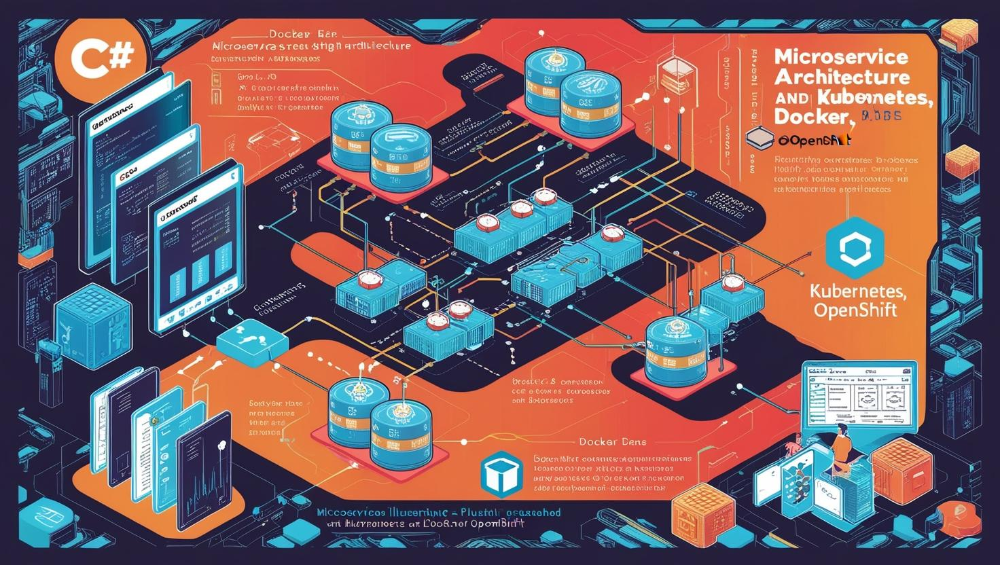
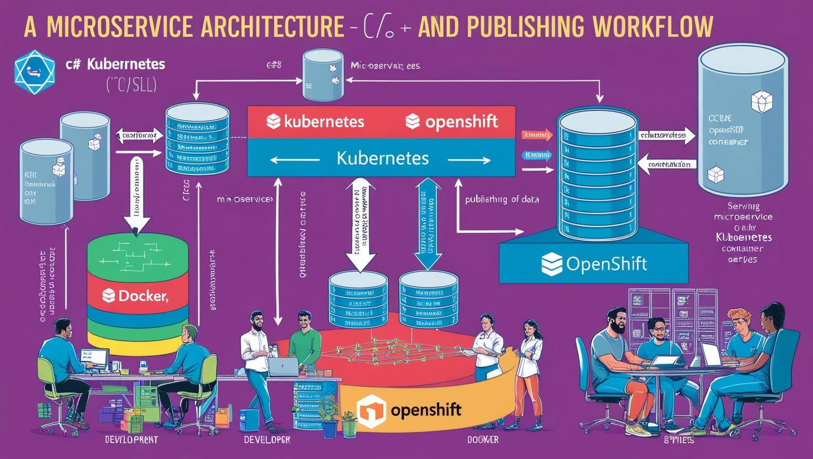

# **C# ile Microservis Mimarisi ve Yayınlama (Kubernetes, Docker, OpenShift)**

- [Güncel PDF'i İndir](https://www.vebende.com.tr/pdfs/csharp.pdf)
- [En güncel eğitimlerimiz için www.vebende.com.tr ziyaret edin](https://www.vebende.com.tr/csharp-microservis-yazilimlari)

## **Eğitim Süresi**

- **Süre:** 5 gün
- **Ders Süresi:** 50 dakika
- **Eğitim Saati:** 10:00 - 17:00

- > Her iki eğitim formatında eğitimler 50 dakika + 10 dakika moladır. 12:00-13:00 saatleri arasında 1 saat yemek arasındaki verilir. Günde toplam 6 saat eğitim verilir. 5 günlük formatta 30 saat eğitim, 12 günlük formatta toplam 72 saat eğitim verilmektedir. 12 saatlik eğitmde katılımcılar kod yazar ve eğitmenle birlikte sorulan sorulara ve taleplere uygun içerikler ve örnekler çalışılır.

- > Eğitimler uzaktan eğitim formatında tasarlanmıştır. Her eğitim için teams linkleri gönderilir. Katılımcılar bu linklere girerek eğitimlere katılırlar. Ayrıca farklı remote çalışma araçları da eğitmen tarafından tüm katılımlara sunulur. Katılımcılar bu araçları kullanarak eğitimlere katılırlar.

- > Eğitim içeriğinde github ve codespace kullanılır. Katılımcılar bu platformlar üzerinden örnek projeler oluşturur ve eğitmenle birlikte eğitimlerde sorulan sorulara ve taleplere uygun iceriğe cevap verir. Katılımcılar bu araçlarla eğitimlerde sorulan sorulara ve taleplere uygun iceriğe cevap verir.

- > Eğitim yapay zeka destekli kendi kendine öğrenme formasyonu ile tasarlanmıştır. Katılımcılar eğitim boyunca kendi kendine öğrenme formasyonu ile eğitimlere katılırlar. Bu eğitim formatı sayesinde tüm katılımcılar gelecek tüm yaşamlarında kendilerini güncellemeye devam edebilecekler ve her türlü sorunun karşısında çözüm bulabilecekleri yeteneklere sahip olacaklardır.

## **C# ile Microservis Mimarisi**

Bu eğitim, yazılım geliştirme dünyasında giderek daha fazla önem kazanan mikroservis mimarisi, konteynerleştirme ve bulut tabanlı dağıtım süreçleri konularında derinlemesine bilgi edinmek isteyen yazılım geliştiricileri, DevOps mühendisleri ve sistem yöneticileri için tasarlanmıştır. Eğitim, C# dilinde mikroservis geliştirme, Docker ile konteynerleştirme ve modern bulut platformları olan Kubernetes ve OpenShift üzerinde dağıtım yapma süreçlerini kapsamlı bir şekilde ele alacaktır.

Bu 5 günlük eğitim, katılımcıların mikroservis mimarisine dair sağlam bir temel oluşturmalarına ve mikroservislerin nasıl geliştirileceği, yönetileceği, ölçeklendirileceği ve dağıtılacağı konusunda pratik bilgi edinmelerine olanak tanır. Katılımcılar, günümüz yazılım geliştirme ve operasyon süreçlerinde yaygın olarak kullanılan Docker konteyner teknolojileri, Kubernetes orkestrasyon araçları ve OpenShift platformu üzerinde uygulamalarını nasıl yönetebileceklerini öğreneceklerdir.

## **Eğitim Hedefi**

- Katılımcılar, mikroservis mimarisinin temellerini öğrenip, modern yazılım geliştirme süreçlerinde nasıl etkili bir şekilde uygulayabileceklerini keşfedecekler.
- C# dilinde mikroservis geliştirme konusunda derinlemesine bilgi sahibi olacaklar.
- Docker ile mikroservislerin konteynerleştirilmesini ve Docker Compose ile çoklu servisin nasıl yönetileceğini öğrenecekler.
- Kubernetes ile konteynerleştirilmiş uygulamaların nasıl orkestre edileceği ve yönetileceği hakkında bilgi sahibi olacaklar.
- OpenShift üzerinde uygulamaların yönetimi, dağıtımı ve ölçeklenmesi konularında uygulamalı bilgiler edinerek bulut tabanlı ortamlarda üretim uygulamaları geliştirme yetkinliği kazanacaklar.

## **Eğitim İçeriği**

### **Bölüm 1: Microservis Mimarisi ve C# ile Geliştirme**

1. **Microservis Mimarisi Nedir?**
   - **Microservislerin Tanımı ve Temel Kavramlar:**
     - Microservislerin tanımı, monolitik yapılarla karşılaştırılması
     - Microservislerin avantajları: Bağımsız dağıtım, ölçeklenebilirlik, esneklik
     - Microservislerin zorlukları: Servisler arası iletişim, veri yönetimi, izleme
   - **Microservislerin Genel Özellikleri:**
     - Her servis kendi işlevini yerine getirir
     - Bağımsız dağıtım ve ölçeklendirme
     - Dağıtık sistemler

2. **C# ile Microservis Geliştirme**
   - **C# ve .NET ile Microservis Geliştirmenin Avantajları:**
     - .NET Core ve .NET 5/6 ile platform bağımsızlık
     - C#’ın güçlü özellikleri ve mikro hizmetlere uygunluğu
   - **C# ile REST API Geliştirme:**
     - ASP.NET Core ile API geliştirme
     - HTTP, RESTful servisler, JSON veri formatı
     - Routing, Controllers, Dependency Injection kullanımı
   - **C# ile Microservis Mimarisi için Kullanılan Çerçeveler:**
     - **ASP.NET Core Web API:** Hızlı ve verimli API geliştirme
     - **MassTransit:** Microservisler arası mesajlaşma için açık kaynak çerçeve
     - **MediatR:** Command/Query modeline dayalı işlem yönetimi
   - **Microservislerde Servisler Arası İletişim:**
     - HTTP API (REST)
     - Message Queues (RabbitMQ, Kafka)
     - gRPC ile hızlı ve düşük gecikmeli iletişim

---

### **Bölüm 2: Docker ile Konteynerleştirme**

1. **Docker’a Giriş**
   - **Docker Nedir?**
     - Konteynerleştirme nedir? Docker’ın amacı ve avantajları
     - Docker’ın mikro hizmet mimarisindeki rolü
   - **Docker’ın Temel Bileşenleri:**
     - **Docker Image:** Uygulamanın çalıştırılabilir hali
     - **Docker Container:** Çalışan bir image
     - **Dockerfile:** İmajın nasıl oluşturulacağını belirten dosya
   - **Docker Komutları ve Kullanımı:**
     - `docker build`, `docker run`, `docker ps`, `docker logs`, `docker-compose` komutları
   - **Docker Compose ile Çoklu Servislerin Yönetimi:**
     - Microservislerin bir arada çalıştığı projelerde Docker Compose kullanımı
     - Docker Compose ile bağımlı servislerin kolayca başlatılması

2. **C# Uygulamasını Docker ile Konteynerleştirme**
   - **C# Uygulaması İçin Dockerfile Yazma:**
     - .NET Core için Dockerfile oluşturma
     - Multi-stage build kullanımı ile imaj boyutunu optimize etme
   - **C# Microservisini Docker Konteynerinde Çalıştırma:**
     - Docker ile C# REST API çalıştırma
     - Veritabanı bağlantıları ve diğer mikro hizmetlerle entegrasyon
   - **Docker ile Hızlı Testler ve Debugging:**
     - Konteyner içerisinde debugging
     - Log yönetimi ve hata ayıklama

---

### **Bölüm 3: Kubernetes ile Orkestrasyon**

1. **Kubernetes’e Giriş**
   - **Kubernetes Nedir?**
     - Kubernetes’in tanımı ve mikro hizmet mimarilerindeki rolü
     - Pod, Deployment, Service, ConfigMap gibi temel bileşenler
   - **Kubernetes Bileşenleri:**
     - **Pod:** En küçük dağıtım birimi
     - **Deployment:** Uygulamaları ölçeklendirme ve yönetme
     - **Service:** Pod’ları birbirine bağlama
     - **Ingress:** Dış dünyaya erişim sağlamak
   - **Kubernetes API ve CLI Aracı (kubectl) Kullanımı**

2. **C# Microservislerini Kubernetes Üzerinde Yayınlama**
   - **Kubernetes ile Pod ve Deployment Yönetimi:**
     - Kubernetes deployment’ları ile Go veya C# microservislerini çalıştırma
   - **Kubernetes ile Service Yapılandırması:**
     - C# microservisleri için Kubernetes servisleri oluşturma
     - Cluster içi ve dışı erişim sağlama
   - **Kubernetes ile Yük Dengeleme ve Auto-Scaling:**
     - Horizontal Pod Autoscaler ile otomatik ölçeklendirme
     - Kubernetes LoadBalancer kullanarak dış erişim
   - **Kubernetes ConfigMap ve Secret Kullanımı:**
     - Yapılandırma dosyalarını ve hassas verileri yönetme
     - Çevresel değişkenler ve yapılandırma yönetimi

3. **CI/CD Süreçlerinin Kubernetes ile Entegrasyonu**
   - **Jenkins, GitLab CI veya Azure DevOps ile Kubernetes için CI/CD Pipeline’ları:**
     - Kubernetes üzerinde otomatik derleme ve dağıtım süreçlerini oluşturma
     - Kubernetes üzerinde uygulama dağıtımı ve güncelleme
   - **Helm ile Paketleme ve Dağıtım:**
     - Helm Charts kullanarak uygulama paketleme ve dağıtma

---

### **Bölüm 4: OpenShift ile Yayınlama ve Yönetim**

1. **OpenShift’e Giriş**
   - **OpenShift Nedir?**
     - OpenShift, Kubernetes’in kurumsal düzeydeki versiyonudur. Güvenlik, kullanıcı yönetimi, geliştirici araçları ve daha fazlasını sunar.
   - **OpenShift ve Kubernetes Arasındaki Farklar:**
     - OpenShift ekosistemi ve Kubernetes üzerindeki avantajları
     - OpenShift CLI (`oc`) ve Kubernetes CLI (`kubectl`) arasındaki farklar

2. **C# Microservislerini OpenShift Üzerinde Yayınlama**
   - **OpenShift ile Deployment ve Pod Yönetimi:**
     - OpenShift üzerinde C# uygulamaları dağıtma
     - Pod’lar ve Deployment’lar üzerinde yönetim
   - **Service ve Route Konfigürasyonu:**
     - C# microservisleri için OpenShift Routes kullanarak dış erişim sağlama
   - **OpenShift ile Kaynak Yönetimi ve İzinler:**
     - RBAC (Role-Based Access Control) kullanarak kaynaklara erişimi yönetme
     - Güvenlik ve kaynak sınırlandırmaları

3. **OpenShift ile CI/CD Yönetimi**
   - **OpenShift Pipelines ile Otomatik Dağıtım:**
     - OpenShift Pipelines (Tekton) kullanarak sürekli entegrasyon ve sürekli dağıtım
   - **Jenkins ile OpenShift Entegrasyonu:**
     - Jenkins kullanarak OpenShift üzerinde otomatik derleme ve dağıtım süreçleri kurma
   - **OpenShift ve Helm ile Dağıtım:**
     - Helm Charts kullanarak OpenShift üzerinde microservis dağıtımı

---

### **Bölüm 5: Mikroservis Yönetimi, İzleme ve Güvenlik**

1. **Microservis İzleme ve Performans Yönetimi**
   - **Prometheus ve Grafana ile İzleme:**
     - Kubernetes üzerinde Prometheus ve Grafana ile metrikler toplama ve görselleştirme
   - **ELK Stack ile Log Yönetimi:**
     - Elasticsearch, Fluentd, Kibana (EFK) stack kullanarak logları toplama ve analiz etme

2. **Mikroservis Güvenliği**
   - **OAuth2, JWT ile Kimlik Doğrulama ve Yetkilendirme:**
     - C# ile JWT token oluşturma ve doğrulama
   - **Mutual TLS ile Güvenli İletişim:**
     - Microservisler arası güvenli iletişim için mutual TLS yapılandırması
   - **API Gateway ve Rate Limiting:**
     - API Gateway kullanarak servisler arası güvenlik ve rate limiting yönetimi

3. **Mikroservislerde Hata Yönetimi**
   - **Distributed Tracing ve Jaeger ile İzleme:**
     - Jaeger kullanarak mikroservislerin iletişimini ve hatalarını izleme
   - **Health Check ve Readiness Probes:**
     - Kubernetes ve OpenShift üzerinde mikroservislerin sağlık durumlarını izleme

## **Eğitim Yöntemi:**

- **Teorik Dersler**: Temel kavramların anlatımı, mikro servislerin temelleri.
- **Canlı Kodlama**: Gerçek dünyadan örnekler üzerinden mikro servislerin adım adım geliştirilmesi.
- **Uygulamalı Projeler**: Katılımcıların öğrendiklerini uygulamalı olarak geliştirmeleri.
- **Etkileşimli Tartışmalar ve Soru-Cevap**: Katılımcıların soruları üzerinden derinlemesine tartışmalar.
- **Proje Tabanlı Öğrenme**: Eğitim sonunda katılımcılara, öğrendikleri bilgileri projelere uygulama fırsatı.

---

## **Hedef Kitle:**

- Yazılım geliştiriciler ve mühendisler.
- C# ile mikro servis geliştirmeyi öğrenmek isteyenler.
- Kubernetes, Docker ve OpenShift üzerinde dağıtım yapacak profesyoneller.
- DevOps mühendisleri ve yazılım mimarları.
- Yeni teknolojilere ilgi duyan ve mikro servis mimarisi ile bulut çözümlerini öğrenmek isteyen tüm profesyoneller.

## **Katılımcılardan Beklentilerimiz**

1. **Temel Linux Bilgisi:**
   Katılımcıların temel Linux bilgisine sahip olmaları, eğitimde kullanılan ortamların yönetimi ve terminal komutları ile çalışmada kolaylık sağlayacaktır.

2. **Temel Konteyner ve Kubernetes Bilgisi:**
   Temel seviyede konteyner ve Kubernetes bilgisi, eğitimde işlenecek kavramların daha iyi anlaşılmasına yardımcı olacaktır. Ancak, bu bilgi zorunlu değildir; temel kavramlar eğitim sırasında açıklanacaktır.

3. **Temel Programlama Bilgisi (C#):**
   Katılımcıların C# diline temel düzeyde aşina olmaları, eğitimdeki API geliştirme süreçlerini daha verimli takip etmelerini sağlayacaktır.

4. **Web ve API Geliştirme Konseptlerine Hakimiyet:**
   Katılımcıların API geliştirme ve RESTful servisler gibi temel web geliştirme konseptlerine dair bilgi sahibi olmaları, eğitimdeki C# API geliştirme kısmını daha kolay anlamalarına yardımcı olacaktır.

5. **Aktif Katılım:**
   Eğitim sürecinde katılımcıların aktif katılım göstermeleri, grup çalışmaları, kodlama pratikleri ve tartışmalara dahil olmaları beklenir. Bu, öğrenilen bilgilerin daha hızlı ve etkin bir şekilde pekişmesini sağlar.

6. **Öğrenmeye İstekli Olma:**
   Katılımcıların yeni konulara ve teknolojiye açık olmaları, öğrenmeye istekli olmaları eğitim sürecini daha verimli hale getirecektir.

7. **Takım Çalışmasına Yatkınlık:**
   Microservices ve Kubernetes gibi konular, takım çalışmasını gerektirir. Katılımcıların işbirliği yaparak çözümler geliştirebilmesi, projelerin başarıyla tamamlanmasına katkı sağlar.

8. **Problem Çözme Yeteneği:**
   Katılımcıların, karşılaştıkları teknik sorunları çözme ve farklı çözüm yolları geliştirme yeteneğine sahip olmaları, eğitimde işlenecek konuları daha kolay uygulamalı hale getirecektir.

9. **Zaman Yönetimi:**
   Eğitimde verilen sürelere uyum sağlamak ve belirli zaman dilimlerinde görevleri tamamlamak, eğitimde başarıyı artıracaktır.

10. **Sürekli Geri Bildirim Alabilme:**
    Katılımcıların geri bildirim almayı ve bu geri bildirimleri kişisel gelişimlerine dahil etmeyi kabul etmeleri gereklidir.

11. **Esneklik ve Adaptasyon Yeteneği:**
    Microservices mimarisi ve Kubernetes gibi dinamik teknolojilerle çalışırken, katılımcıların esnek olmaları ve yeni teknolojiye hızla adapte olmaları gerekmektedir.

12. **Eleştirel Düşünme ve Analitik Yaklaşım:**
    Katılımcıların, geliştirme süreçlerini eleştirel bir bakış açısıyla değerlendirebilmeleri, daha iyi çözümler geliştirebilmelerine olanak tanır.

13. **Kendi Gelişimini Takip Etme:**
    Katılımcıların eğitim süreci boyunca kendi gelişimlerini takip etmeleri ve eksik olduğu alanlarda öğrenmeye devam etmeleri beklenir.

14. **Pratik Uygulamalar Yapabilme:**
    Eğitimde öğrendikleri teorik bilgileri gerçek dünya senaryolarında uygulayabilme yeteneğine sahip olmaları, katılımcıların daha hızlı gelişmelerine yardımcı olur.

[Eğitim Materyalleri (Eğitmenlere Özel)](https://github.com/TuncerKARAARSLAN-VB/training-kit-csharp-ile-mikro-servis-mimarisi)
