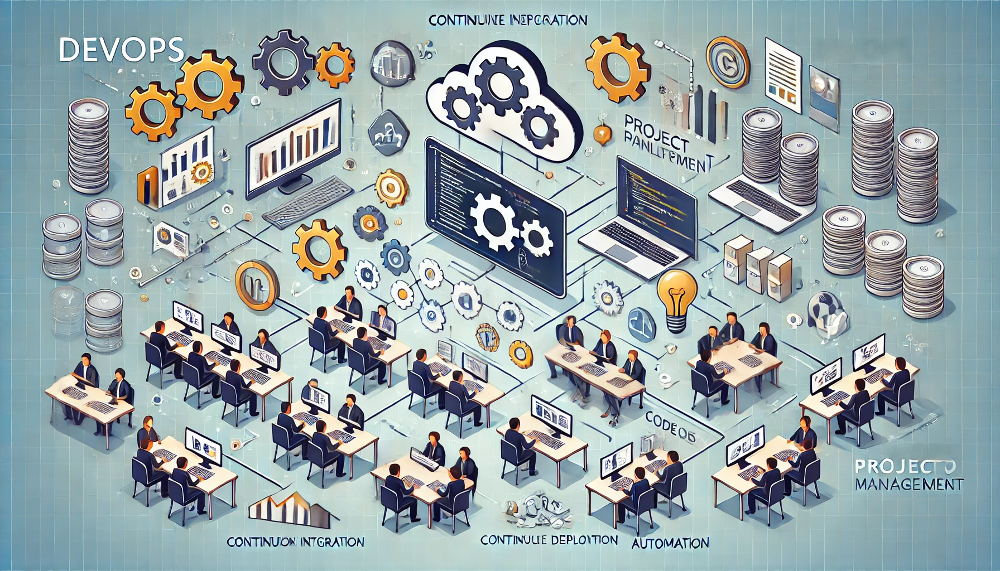
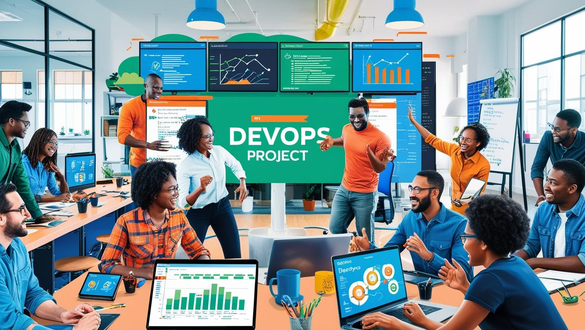

# **Devops Proje Yönetimi**

[Download PDF Version](./devops.pdf)

## **Eğitim Süresi**

- **Format 1**
  - **5 Gün**
  - **Ders Süresi:** 50 dakika
  - **Eğitim Saati:** 10:00 - 17:00

- **Format 2**
  - **12 Gün**
  - **Ders Süresi:** 50 dakika
  - **Eğitim Saati:** 10:00 - 17:00

## Eğitim Süresi:

**Format 1**

- **5 Gün**
- **Ders Süresi:** 50 dakika
- **Eğitim Saati:** 10:00 - 17:00

**Format 2**

- **12 Gün**
- **Ders Süresi:** 50 dakika
- **Eğitim Saati:** 10:00 - 17:00

- > Her iki eğitim formatında eğitimler 50 dakika + 10 dakika moladır. 12:00-13:00 saatleri arasında 1 saat yemek arasındaki verilir. Günde toplam 6 saat eğitim verilir. 5 günlük formatta 30 saat eğitim, 12 günlük formatta toplam 72 saat eğitim verilmektedir. 12 saatlik eğitmde katılımcılar kod yazar ve eğitmenle birlikte sorulan sorulara ve taleplere uygun içerikler ve örnekler çalışılır.

- > Eğitimler uzaktan eğitim formatında tasarlanmıştır. Her eğitim için teams linkleri gönderilir. Katılımcılar bu linklere girerek eğitimlere katılırlar. Ayrıca farklı remote çalışma araçları da eğitmen tarafından tüm katılımlara sunulur. Katılımcılar bu araçları kullanarak eğitimlere katılırlar. 

- > Eğitim içeriğinde github ve codespace kullanılır. Katılımcılar bu platformlar üzerinden örnek projeler oluşturur ve eğitmenle birlikte eğitimlerde sorulan sorulara ve taleplere uygun iceriğe cevap verir. Katılımcılar bu araçlarla eğitimlerde sorulan sorulara ve taleplere uygun iceriğe cevap verir.

- > Eğitim yapay zeka destekli kendi kendine öğrenme formasyonu ile tasarlanmıştır. Katılımcılar eğitim boyunca kendi kendine öğrenme formasyonu ile eğitimlere katılırlar. Bu eğitim formatı sayesinde tüm katılımcılar gelecek tüm yaşamlarında kendilerini güncellemeye devam edebilecekler ve her türlü sorunun karşısında çözüm bulabilecekleri yeteneklere sahip olacaklardır.

## **DevOps Proje Yönetimi**

DevOps Proje Yönetimi eğitimimizde, katılımcılara DevOps kültürü, araçları ve uygulamaları hakkında derinlemesine bilgi sunarak, bu bilgilerin projelerde nasıl başarılı bir şekilde yönetileceğini öğretmeyi amaçlamaktadır. Eğitim, DevOps'un temel ilkelerinden başlayarak, yazılım geliştirme ve IT operasyonları arasındaki işbirliğini güçlendirmek için kullanılan modern yöntemleri, araçları ve stratejileri kapsamlı bir şekilde ele alacaktır. Katılımcılar, DevOps süreçlerinin her aşamasını yönetme yetkinliği kazanacak ve bu süreçlerin organizasyonel düzeyde nasıl sürdürülebilir ve verimli hale getirilebileceğini öğreneceklerdir.

Eğitimde, DevOps kavramı, sadece bir yazılım geliştirme süreci değil, aynı zamanda bir kültür değişikliği olarak ele alınacaktır. DevOps, ekipler arasında güçlü bir işbirliği ve sürekli iletişim gerektiren bir modeldir ve bu eğitimde, katılımcılar, organizasyonel düzeyde DevOps kültürünü nasıl oluşturabileceklerini ve bu kültürün projelerde nasıl etkili bir şekilde yönetileceğini keşfedeceklerdir.

## **Eğitim Hedefi**

- DevOps'un temellerini öğrenmek ve proje yönetiminde nasıl etkili bir şekilde uygulayabileceğinizi keşfetmek.
- DevOps süreçlerini (CI/CD, otomasyon, test süreçleri, izleme) yönetme becerisi kazandırmak.
- DevOps araçları ve uygulamaları hakkında bilgi sahibi olmak (Jenkins, GitLab, Docker, Kubernetes, Terraform vb.).
- DevOps kültürünü, iletişim süreçlerini ve iş birliğini güçlendirecek projelerde nasıl liderlik yapılacağını öğrenmek.
- Yazılım geliştirme, operasyonel süreçler ve DevOps süreçleri arasında verimli bir entegrasyon sağlamak.

## **Eğitim İçeriği**

### **1. DevOps'a Giriş ve Temel Prensipler**  

- **DevOps Nedir?**  
  - Tanım, tarihçe ve yazılım geliştirme ile IT operasyonları arasındaki ilişki.  
- **DevOps Kültürü**  
  - İşbirliği, iletişim ve kültür değişikliği üzerine.  
- **Temel İlkeler**  
  - Sürekli Entegrasyon (CI), Sürekli Dağıtım (CD), otomasyon, izleme, geri bildirim ve hızlı teslimat süreçleri.  
- **Agile ve DevOps**  
  - İki yaklaşımın birbirini nasıl tamamladığı.  
- **Proje Yönetimi**  
  - DevOps projelerini başlatma, planlama ve yönetim için stratejiler.  

### **2. Sürekli Entegrasyon (CI) ve Sürekli Dağıtım (CD)**  

- **CI**  
  - Avantajlar, uygulama stratejileri ve araçlar (ör. Jenkins, GitLab CI).  
  - Otomatik test süreçleri, kod kalitesi kontrolü ve pipeline tasarımı.  
- **CD**  
  - CI ile entegrasyon, yazılım güncellemelerinin hızlı aktarımı.  
  - Canary releases, blue-green deployment ve rolling updates gibi dağıtım modelleri.  

### **3. Otomasyon ve Altyapı Yönetimi**  

- **Altyapı Otomasyonu**  
  - Infrastructure as Code (IaC) ve konfigürasyon yönetimi.  
- **Popüler Araçlar**  
  - Terraform, Ansible ile altyapı yönetimi.  
  - Docker (konteynerleşme) ve Kubernetes (orkestrasyon) kullanımı.  
- **Bulut Entegrasyonu**  
  - AWS, Azure, Google Cloud ile uyumlu altyapı yönetimi.  

### **4. İzleme ve Performans Yönetimi**  

- **İzleme Araçları**  
  - Prometheus, Grafana, ELK Stack gibi araçlarla uygulama ve altyapı izleme.  
- **Log Yönetimi ve Analiz**  
  - Merkezi loglama ve anormallik tespiti.  
- **Performans Optimizasyonu**  
  - Otomatik alarm sistemleri ve hata çözümleme yöntemleri.  

### **5. İleri Düzey Uygulamalar ve Yönetim**  

- **Proje Yönetimi**  
  - Scrum, Kanban gibi Agile metodolojiler ile uyum.  
  - Ekip içi işbirliği ve liderlik becerileri.  
- **Risk ve Güvenlik Yönetimi**  
  - DevSecOps yaklaşımı ve güvenlik süreçleri.  
- **Metrikler ve KPI'lar**  
  - Performans göstergeleri ve verimlilik artırıcı uygulamalar.  
- **Başarı Hikayeleri**  
  - Gerçek dünya örnekleri ve kazanılan deneyimler.  

## **Eğitim Yöntemi**

- **Teorik Bilgi:** Eğitimde, DevOps proje yönetimiyle ilgili temel kavramlar, ilkeler ve metodolojiler katılımcılara anlatılacaktır. DevOps kültürünün temelleri, sürekli entegrasyon (CI), sürekli dağıtım (CD), otomasyon araçları ve izleme gibi konularda kapsamlı bir teorik bilgi sunulacaktır. Bu, katılımcıların DevOps'un nasıl çalıştığını ve projelerde nasıl uygulanması gerektiğini anlamalarına yardımcı olacaktır.

- **Uygulamalı Örnekler:** Gerçek dünyadan alınan senaryolar ve projeler üzerinden yapılan pratik uygulamalarla, katılımcıların DevOps araçlarını ve süreçlerini nasıl kullanacaklarını öğrenmeleri sağlanacaktır. Bu, teorik bilgilerin gerçek projelerde nasıl hayata geçirileceğine dair somut örnekler sunacak ve katılımcılara daha derin bir anlayış kazandıracaktır.

- **Etkileşimli Tartışmalar:** Katılımcıların aktif katılımını teşvik etmek amacıyla, her bölümde etkileşimli tartışmalar ve soru-cevap oturumları düzenlenecektir. Bu oturumlar, katılımcıların eğitimde öğrendiklerini birbirleriyle paylaşmalarını, sorunlar üzerinde düşünmelerini ve grup içinde çözüm önerileri geliştirmelerini sağlayacaktır. Bu yöntem, eğitimin daha dinamik ve katılımcı bir ortamda gerçekleşmesini sağlayacaktır.

- **Proje Tabanlı Öğrenme:** Eğitimin son günü, katılımcıların eğitim boyunca öğrendiklerini pratikte uygulayabilecekleri kapsamlı bir proje çalışması yapılacaktır. Bu projede, katılımcılar gerçek bir DevOps projesinde karşılaşabilecekleri süreçleri simüle ederek, öğrendikleri teknikleri ve yönetim becerilerini pratikte test edebileceklerdir. Proje, katılımcıların eğitim sonunda kazandıkları bilgi ve becerilerin pekişmesini sağlayacak ve uygulamaya yönelik deneyim kazandıracaktır.

- **Gruplar ve İşbirliği:** Eğitimde, katılımcılar küçük gruplara ayrılarak belirli görevleri birlikte tamamlayacaklardır. Bu işbirlikçi ortam, takım çalışmasını teşvik ederken, katılımcıların birlikte sorun çözme ve proje yönetimi becerilerini geliştirmelerine olanak sağlayacaktır. Bu sayede, DevOps’un işbirliği odaklı yapısı daha etkili bir şekilde deneyimlenmiş olacaktır.

- **Geri Bildirim ve Değerlendirme:** Eğitimin her aşamasında, katılımcılara düzenli geri bildirim verilecektir. Bu, katılımcıların gelişimlerini izlemelerini ve eksik oldukları alanlarda daha fazla çalışmaları için fırsatlar yaratacaktır. Ayrıca, eğitim sonunda genel bir değerlendirme yapılacak ve katılımcıların öğrendikleri bilgileri ne derece kavradıkları ölçülerek, daha ileriye dönük gelişim önerileri sunulacaktır.

## **Katılıcılardan Beklentilerimiz**

1. **Temel Proje Yönetimi Bilgisi:**
   Katılımcıların, proje yönetimi ilkelerine ve süreçlerine aşina olmaları, Agile ve DevOps metodolojilerinin daha iyi anlaşılmasına yardımcı olacaktır.

2. **Temel Teknoloji Bilgisi:**
   Yazılım geliştirme, test etme, dağıtım ve entegrasyon süreçlerine dair temel bir anlayışa sahip olmaları, eğitimde kullanılan araçları daha etkili bir şekilde kullanmalarını sağlayacaktır.

3. **İletişim Becerileri:**
   DevOps süreçlerinde etkili iletişim büyük önem taşır. Katılımcıların açık, net ve etkili iletişim kurma yetenekleri, işbirliğini ve süreçlerin verimli bir şekilde ilerlemesini sağlar.

4. **Takım Çalışmasına Yatkınlık:**
   DevOps, ekipler arasında işbirliği ve sürekli iletişim gerektirir. Katılımcıların grup içinde etkin bir şekilde çalışabilme ve takım ruhunu benimsemiş olmaları önemlidir.

5. **Değişime Açıklık:**
   DevOps, hızlı değişim ve sürekli iyileştirme anlayışına dayanır. Katılımcıların yeni yöntemlere ve süreçlere adaptasyon yeteneği, eğitimde edinilen bilgilerin etkili bir şekilde uygulanmasına olanak tanır.

6. **Aktif Katılım:**
   Eğitim süresince katılımcıların aktif bir şekilde katılım göstermeleri beklenir. Grup çalışmaları, tartışmalar ve etkileşimli öğrenme, teorik bilgilerin pratikte uygulanmasına yardımcı olur.

7. **Öğrenmeye İstekli Olma:**
   DevOps, pratik deneyimle öğrenilen bir yaklaşımdır. Katılımcıların yeni bilgiler edinmeye ve geri bildirim almaya açık olmaları, öğrenme sürecini daha verimli kılacaktır.

8. **Zaman Yönetimi:**
   DevOps projeleri hızlı ve verimli yönetilmelidir. Katılımcıların verilen zaman dilimlerine uyum sağlamaları, eğitim sürecinin etkin bir şekilde tamamlanmasını sağlayacaktır.

9. **Problem Çözme Yeteneği:**
   DevOps, karşılaşılan engelleri hızlı bir şekilde aşmayı gerektirir. Katılımcıların analitik düşünme ve problem çözme becerileri, süreçlerin daha verimli ilerlemesine katkı sağlar.

10. **Sürekli Geri Bildirim Alabilme:**
    Katılımcıların sürekli geri bildirim almayı kabul etmeleri ve bu geri bildirimleri kişisel gelişimlerine yansıtabilmeleri gerekmektedir. Bu, DevOps kültürünün önemli bir parçasıdır.

11. **Esneklik ve Adaptasyon Yeteneği:**
    Değişen iş koşullarına hızlı adaptasyon, DevOps’un temel taşlarındandır. Katılımcıların esnek olmaları, eğitim sürecinde öğrenilen bilgilerin daha etkili bir şekilde uygulanmasına olanak tanır.

12. **Eleştirel Düşünme ve Analitik Yaklaşım:**
    Katılımcıların, süreçleri analiz etme, sorunları tanımlama ve çözüm önerileri geliştirme konusunda eleştirel düşünme becerilerine sahip olmaları beklenir.

13. **Kendi Gelişimini Takip Etme:**
    Katılımcıların kendi gelişimlerini takip edebilmesi, hangi alanlarda gelişmeye ihtiyaç duyduklarını anlamalarına ve sürekli öğrenme süreçlerini daha verimli hale getirmelerine yardımcı olacaktır.

14. **Pratik Uygulamalar Yapabilme:**
    Eğitimde edinilen teorik bilgilerin pratikte uygulanması, katılımcıların gerçek dünya projelerinde başarılı olabilmeleri için kritik öneme sahiptir. Katılımcıların öğrendikleri kavramları gerçek senaryolarda kullanabilmeleri beklenir.

[Eğitim Materyalleri (Eğitmenlere Özel)](https://github.com/TuncerKARAARSLAN-VB/training-kit-devops)