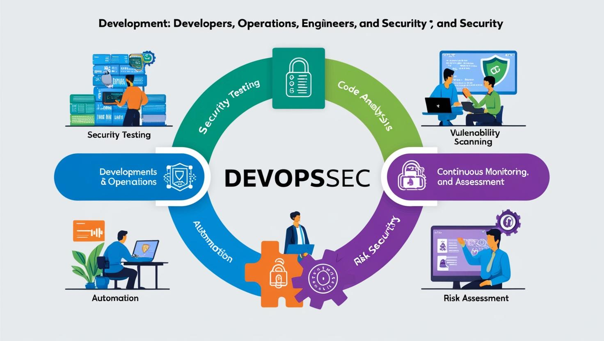

# **DevOpsSec Eğitimi**

[Download PDF Version](./devopssec.pdf)

## **Eğitim Süresi**

- **Format 1**
  - **5 Gün**
  - **Ders Süresi:** 50 dakika
  - **Eğitim Saati:** 10:00 - 17:00

- **Format 2**
  - **12 Gün**
  - **Ders Süresi:** 50 dakika
  - **Eğitim Saati:** 10:00 - 17:00

- > Her iki eğitim formatında eğitimler 50 dakika + 10 dakika moladır. 12:00-13:00 saatleri arasında 1 saat yemek arasındaki verilir. Günde toplam 6 saat eğitim verilir. 5 günlük formatta 30 saat eğitim, 12 günlük formatta toplam 72 saat eğitim verilmektedir. 12 saatlik eğitmde katılımcılar kod yazar ve eğitmenle birlikte sorulan sorulara ve taleplere uygun içerikler ve örnekler çalışılır.

- > Eğitimler uzaktan eğitim formatında tasarlanmıştır. Her eğitim için teams linkleri gönderilir. Katılımcılar bu linklere girerek eğitimlere katılırlar. Ayrıca farklı remote çalışma araçları da eğitmen tarafından tüm katılımlara sunulur. Katılımcılar bu araçları kullanarak eğitimlere katılırlar. 

- > Eğitim içeriğinde github ve codespace kullanılır. Katılımcılar bu platformlar üzerinden örnek projeler oluşturur ve eğitmenle birlikte eğitimlerde sorulan sorulara ve taleplere uygun iceriğe cevap verir. Katılımcılar bu araçlarla eğitimlerde sorulan sorulara ve taleplere uygun iceriğe cevap verir.

- > Eğitim yapay zeka destekli kendi kendine öğrenme formasyonu ile tasarlanmıştır. Katılımcılar eğitim boyunca kendi kendine öğrenme formasyonu ile eğitimlere katılırlar. Bu eğitim formatı sayesinde tüm katılımcılar gelecek tüm yaşamlarında kendilerini güncellemeye devam edebilecekler ve her türlü sorunun karşısında çözüm bulabilecekleri yeteneklere sahip olacaklardır.

## **DevOpsSec: Güvenlik ve Hızın Mükemmel Birleşimi**

Günümüzün hızla değişen dijital dünyasında, yazılım geliştirme süreçlerinin güvenli, hızlı ve verimli olması her zamankinden daha önemli hale gelmiştir. Bu noktada DevOpsSec devreye giriyor. DevOpsSec, yazılım geliştirme (Dev), operasyon (Ops) ve güvenlik (Sec) alanlarını birleştirerek, güvenliği yazılım geliştirme süreçlerinin her aşamasına entegre eden bir yaklaşım sunar.

**Neden DevOpsSec?**

Geleneksel güvenlik yaklaşımları genellikle yazılım geliştirme sürecinin son aşamalarına odaklanır. Ancak DevOpsSec, güvenliği baştan sona dahil ederek, daha güvenli bir yazılım geliştirme ortamı sağlar. Erken aşamalarda yapılan güvenlik taramaları ve testler, zafiyetlerin erken tespit edilmesine ve minimize edilmesine olanak tanır. Bu sayede, güvenlik açıkları daha hızlı kapanır ve yazılım projeleri daha güvenli hale gelir.

**DevOpsSec'in Faydaları:**

1. **Erken Güvenlik Testi ve Tarama**: Güvenlik testleri, yazılım geliştirme sürecinin ilk aşamalarında yapılır. Bu, zafiyetlerin erken tespit edilmesini ve daha düşük maliyetlerle çözülmesini sağlar.

2. **Otomasyon ve Sürekli İzleme**: DevOpsSec, güvenlik uygulamalarını otomatikleştirerek, sürekli izleme ve anında müdahale sağlar. Olası tehditler daha hızlı algılanır ve yanıt verilir.

3. **Hızlı Geliştirme ve Güvenlik Dengelemesi**: Yazılım geliştirme süreci hızlanırken güvenlik riskleri en aza indirilir. DevOpsSec, güvenlik ve hız arasındaki dengeyi mükemmel bir şekilde kurar.

4. **Ekipler Arası İşbirliği**: Geliştiriciler, operasyon ekipleri ve güvenlik uzmanları arasında güçlü bir işbirliği sağlar. Güvenlik, yalnızca bir departmanın sorumluluğu değil, tüm ekibin ortak sorumluluğudur.

5. **Risk Yönetimi**: DevOpsSec, sürekli risk değerlendirmesi ve yönetimi yaparak yazılımın her aşamasında potansiyel tehditleri en aza indirir.

**DevOpsSec ile Güvenli Geleceğe Adım Atın**

DevOpsSec, sadece güvenlikten ödün vermemekle kalmaz, aynı zamanda yazılım geliştirme süreçlerini daha hızlı, verimli ve esnek hale getirir. Herkesin güvenli bir dijital deneyim yaşaması için, yazılım geliştirme süreçlerinin her aşamasında güvenliği sağlamak artık bir zorunluluk. DevOpsSec, işte bu zorunluluğu yerine getiren güçlü bir çözümdür.

Bugün, yazılım geliştirme ve güvenlik dünyasında DevOpsSec'in sunduğu fırsatlardan faydalanın ve geleceğin güvenli dijital projelerine adım atın!

## **Eğitimin Hedefi**

1. **Güvenli Yazılım Geliştirme**: Katılımcılar, güvenliği yazılım geliştirme sürecinin başından itibaren nasıl entegre edeceklerini öğreneceklerdir. Kod yazımında güvenlik önlemleri almayı, güvenlik açıklarını erken tespit etmeyi ve çözmeyi öğreneceklerdir.
  
2. **Otomasyon ve Sürekli İzleme**: DevOpsSec sürecinde güvenlik testlerinin ve taramalarının otomatikleştirilmesi, sürekli izleme ve erken müdahale yöntemleri üzerine bilgiler edineceklerdir.

3. **Tehdit Yönetimi**: Yazılım sistemlerinde potansiyel güvenlik tehditlerini hızlı bir şekilde tanıyıp, bu tehditlere nasıl müdahale edileceğini anlayacaklardır.

4. **Ekip İçi İşbirliği**: Geliştirici, operasyon ve güvenlik ekiplerinin işbirliği yaparak daha güvenli bir yazılım geliştirme süreci oluşturmanın yollarını keşfedeceklerdir.

5. **Risk Değerlendirmesi ve Yönetimi**: Katılımcılar, güvenlik risklerini nasıl değerlendireceklerini ve yazılım geliştirme sürecinin her aşamasında bu riskleri nasıl yöneteceklerini öğreneceklerdir.

6. **DevOpsSec Araçları ve Teknikleri**: DevOpsSec ekosisteminde kullanılan araçlar, teknikler ve güvenlik uygulamalarına dair pratik bilgi edinerek, gerçek dünya projelerinde güvenliği etkin bir şekilde uygulayabileceklerdir.

Bu eğitim, DevOpsSec'in dinamik ve güvenli bir yazılım geliştirme süreci yaratma becerisi kazandırmayı amaçlamaktadır. Katılımcılar, güvenlik ve hız arasında mükemmel bir denge kurarak, güvenli dijital projeler geliştirmeye hazır hale geleceklerdir.

## **Eğitim İçeriği**

## **1. Gün: DevSecOps Temelleri**

- DevOps ve DevSecOps arasındaki farklar
- DevSecOps kültürü ve temel ilkeleri
- Yazılım geliştirme yaşam döngüsünde (SDLC) güvenliğin rolü
- "Shift Left" güvenlik yaklaşımı
- Güvenli kodlama ve güvenlik bilinci oluşturma

## **2. Gün: DevOps Araçlarına Giriş**

- CI/CD nedir? Temel kavramlar ve önemi
- Jenkins, GitLab CI, CircleCI, Travis CI gibi araçların tanıtımı
- CI/CD pipeline'larında güvenlik testlerinin rolü
- Otomasyon ve test süreçlerinin entegrasyonu

## **3. Gün: Sürekli Entegrasyon (CI)**

- CI araçlarının kullanımı
- Test otomasyonu: Unit testler, fonksiyonel testler ve code coverage
- API ve UI testlerinin entegrasyonu
- Kod kalitesi ve statik analiz araçları (SonarQube vb.)

## **4. Gün: Güvenlik Otomasyonu**

- CI/CD süreçlerinde güvenlik testlerinin otomasyonu
- SonarQube, Snyk, Trivy gibi güvenlik açıkları tarama araçları
- Statik kod analizi (SAST) ve CI süreçlerine entegrasyonu
- Güvenlik açığı tarama sonuçlarının yönetimi

## **5. Gün: Yazılım Güvenliği ve Güvenli Kodlama Pratikleri**

- OWASP Top 10: En yaygın güvenlik zafiyetleri
- SQL Injection, XSS ve CSRF saldırıları ve önlenmesi
- Güvenli kod inceleme süreçleri ve teknikleri

## **6. Gün: Statik ve Dinamik Güvenlik Testleri**

- Statik analiz araçları: SonarQube, Checkmarx
- Dinamik güvenlik test araçları: OWASP ZAP, Burp Suite
- SAST ve DAST karşılaştırması
- Pipeline'da SAST ve DAST entegrasyonu

## **7. Gün: Sürekli Dağıtım (CD)**

- Dağıtım stratejileri: Blue-Green, Canary, Rolling
- CD araçları ve dağıtım süreçlerinin güvenliğe entegre edilmesi
- Uygulama izleme ve geri dönüş stratejileri
- Load ve performans testleri

## **8. Gün: Konteyner ve Kubernetes Güvenliği**

- Docker ve Kubernetes güvenliği
- Güvenli Docker imajları oluşturma
- Aqua Security, Twistlock gibi konteyner güvenlik araçları
- Kubernetes'te güvenli yapılandırma ve izleme

## **9. Gün: Gizli Bilgilerin Yönetimi (Secrets Management)**

- Gizli anahtarlar ve şifrelerin güvenli yönetimi
- Vault, AWS Secrets Manager, Azure Key Vault kullanımı
- CI/CD pipeline'larında secrets yönetimi

## **10. Gün: Açık Kaynak Güvenlik Açıkları Yönetimi**

- Açık kaynak bağımlılıklarının güvenli yönetimi
- Snyk, Dependabot ile açık kaynak güvenlik açıklarını tarama
- Açık kaynak güvenlik yamalarının uygulanması

## **11. Gün: Infrastructure as Code (IaC) ve Güvenlik**

- Infrastructure as Code kavramı ve araçları (Terraform, CloudFormation)
- IaC güvenlik açıkları ve güvenli yapılandırma
- Bridgecrew, Checkov gibi güvenlik araçları ile IaC güvenliği

## **12. Gün: Sürekli İzleme ve Tehdit Tespiti**

- Güvenlik olaylarının izlenmesi ve raporlanması
- SIEM sistemleri: Splunk, ELK
- Log yönetimi ve anomali tespiti
- Wazuh ve OSSEC kullanımı

## **13. Gün: Zararlı Yazılım Analizi ve Koruma**

- Zararlı yazılımların tespiti ve analizi
- CI/CD süreçlerinde anti-malware araçlarının entegrasyonu
- Dosya bütünlüğü izleme ve güvenlik olaylarının araştırılması

## **14. Gün: Penetrasyon Testi ve Red Teaming**

- Penetrasyon testleri ve CI/CD entegrasyonu
- Pentest araçları: Metasploit, Nmap, Wireshark
- Red Team operasyonları ve güvenlik savunmalarının testi

## **15. Gün: Bulut Güvenliği**

- AWS, Azure ve Google Cloud güvenlik mimarileri
- Cloud Security Posture Management (CSPM) araçları
- Bulutta kimlik ve erişim yönetimi (IAM) güvenliği

## **16. Gün: Zero Trust Güvenlik Modeli**

- Zero Trust güvenlik yaklaşımı
- Kullanıcı doğrulama ve yetkilendirme stratejileri
- Mikro segmentasyon ve ağ güvenliği

## **17. Gün: Olay Müdahalesi (Incident Response)**

- Güvenlik ihlalleri karşısında olay müdahale süreçleri
- CI/CD pipeline'ında otomatik ihlal tespiti
- Incident response araçları ve playbook'lar

## **18. Gün: Sürekli Güvenlik Testleri ve Geri Bildirim Döngüsü**

- CI/CD pipeline'ında sürekli güvenlik testleri oluşturma
- Güvenlik testlerinin analiz edilmesi ve optimize edilmesi
- Sürekli güvenlik geri bildirim döngülerinin oluşturulması

## **19. Gün: DevSecOps Kültürü ve Organizasyonel Değişim**

- DevSecOps kültürünün organizasyona entegrasyonu
- Güvenlik ve geliştirme ekipleri arasında iş birliği
- Güvenlik bilincini artıran atölye çalışmaları
- Yalın (Lean) ve Agile metodolojilerinin DevSecOps ile entegrasyonu

## **20. Gün: Sonuç ve Sertifikasyon Süreçleri**

- DevSecOps projelerinin değerlendirilmesi
- DevSecOps'ta kariyer planlama ve sertifikasyon süreçleri
- Eğitim sonunda kapsamlı bir proje ve değerlendirme

## **Eğitim Yöntemi**

- **Teorik Bilgi:** Güncel bilgiler ve konseptlerin anlatımı.
- **Uygulamalı Örnekler:** Gerçek senaryolarla pratik uygulamalar.
- **Etkileşimli Tartışmalar:** Katılımcıların aktif katılım sağlayacağı, soru-cevap şeklinde tartışmalar yapılacak oturumlar.
- **Proje Tabanlı Öğrenme:** Eğitimin boyunca katılımcıların katılımcıların öğrendiklerini pratikte uygulayacakları eğitim formasyonu uygulanacaktır.

## **Hedef Kitle**

- **Yazılım Geliştiriciler**: Yazılım geliştirme süreçlerinde güvenlik önlemleri almak isteyen, güvenli yazılım geliştirme pratiği kazanmak isteyen profesyoneller.
- **DevOps Mühendisleri**: DevOps süreçlerine güvenliği entegre etmek isteyen ve CI/CD pipeline'larında güvenlik testlerinin rolünü öğrenmek isteyen mühendisler.
- **Sistem ve Altyapı Yöneticileri**: Altyapı güvenliği ile ilgilenen ve DevSecOps uygulamalarıyla bulut ve container güvenliğini sağlamak isteyen profesyoneller.
- **Güvenlik Uzmanları**: Yazılım geliştirme ve operasyon süreçlerinde güvenliği daha iyi yönetmek isteyen ve güvenlik açıklarını tespit etme konusunda daha derin bilgi sahibi olmak isteyen güvenlik profesyonelleri.
- **Test Mühendisleri**: Yazılım test süreçlerinde güvenlik testlerinin nasıl entegre edileceğini öğrenmek isteyen ve güvenlik test otomasyonuna odaklanmak isteyen test mühendisleri.
- **DevSecOps ve Agile Ekip Liderleri**: DevSecOps ve Agile metodolojilerini organizasyonlarına entegre etmek ve güvenlik kültürünü yaymak isteyen liderler.
- **Bulut Mühendisleri**: AWS, Azure ve Google Cloud gibi bulut platformlarında güvenlik önlemleri almak isteyen profesyoneller.
- **IT Yöneticileri ve CIO'lar**: Şirketlerinde güvenlik kültürünü güçlendirmek isteyen ve DevSecOps süreçlerini benimsemek isteyen üst düzey yöneticiler.

## **Katılımcılardan Beklentilerimiz**

- **Temel Yazılım Geliştirme Bilgisi**: Katılımcıların yazılım geliştirme süreçlerine dair temel bilgiye sahip olmaları, özellikle yazılım geliştirme yaşam döngüsüne (SDLC) hakim olmaları beklenir.
  
- **Temel DevOps Bilgisi**: Katılımcıların DevOps süreçlerini anlamaları ve CI/CD (Sürekli Entegrasyon/Sürekli Dağıtım) konularında temel bilgiye sahip olmaları beklenir. 

- **Güvenlik Bilinci**: Katılımcıların yazılım güvenliği konularında temel bir farkındalığa sahip olmaları, güvenlik açıkları ve savunma mekanizmaları hakkında bilgi sahibi olmaları gereklidir.

- **Aktif Katılım**: Eğitim boyunca interaktif bir şekilde aktif katılım göstermeleri, sorular sorarak ve tartışmalara dahil olarak öğrenme süreçlerini pekiştirmeleri beklenir.

- **Pratik Uygulama ve Deneyim**: Katılımcılardan, eğitimin sonunda öğrendikleri DevSecOps araçlarını ve güvenlik uygulamalarını kendi projelerine entegre edebilme becerisine sahip olmaları beklenir.

- **Problem Çözme Yetenekleri**: Katılımcıların yazılım geliştirme, test, güvenlik ve DevOps süreçlerinde karşılaşacakları potansiyel sorunları çözmek için yaratıcı ve analitik düşünme becerisi sergilemeleri beklenir.

- **Ekip Çalışması**: Katılımcıların, organizasyonlarında veya projelerinde DevSecOps uygulamaları için işbirliği ve takım çalışması yapabilecek düzeyde olmaları gereklidir. Eğitimde grup çalışmaları ve senaryo tabanlı uygulamalar yapılacaksa, işbirliğine açık olmaları önemlidir.

- **Teknoloji ve Araçlar Hakkında İleri Seviye Bilgi**: Eğitimde yer alan araçlar (Jenkins, GitLab CI, SonarQube, Snyk, vb.) hakkında daha fazla bilgi edinmeye istekli olmaları ve bu araçları etkin bir şekilde kullanmaya hazırlıklı olmaları beklenir.

- **Kapsamlı Düşünme**: Katılımcıların DevSecOps kültürünü sadece teknik seviyede değil, organizasyonel düzeyde de nasıl entegre edebileceklerini düşünmeleri ve uygulamaları beklenir.

[Eğitim Materyalleri (Eğitmenlere Özel)](https://github.com/TuncerKARAARSLAN-VB/training-kit-devsecops)
