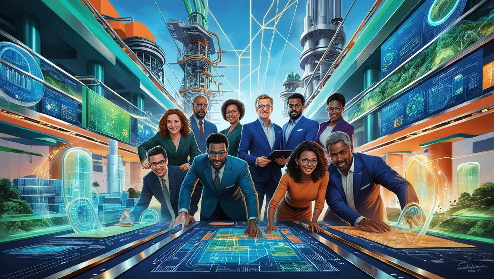
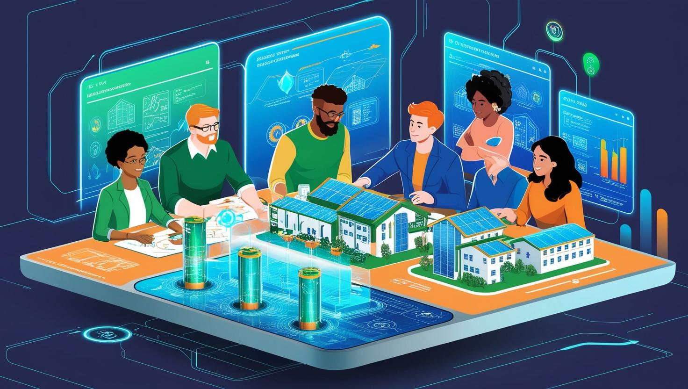

# Enerji Firmaları İçin Mimari Geliştirme ve Sürekli Kendini Yetiştirebilen Ekipler

[Download PDF Version](./energy.pdf)

## **Eğitim Süresi**

## Plan 1

Bu planda en kısa zamanda eğitim içeriğinin tamamlanması planlanmıştır.

- **Toplam Süre:** 8 hafta
- **Eğitim Günleri:** Haftada 5 gün
- **Eğitim Süresi:** Her gün 7 saat (tam gün)
- **Saat:** Toplam 280 saat

## Plan 2

Bu planda eğitim içeriği ile birlikte, firmanın ihityacı olan ek destek süreci de dahil edilmiştir. Her gün öğleden sonraki 3 saatte eğitimi alan personel ile handson yapılacaktır. İstenirse geliştirdikleri uygulamaların kurulumlarına uzaktan destek verilebilir.

- **Toplam Süre:** 12 hafta
- **Eğitim Günleri:** Haftada 5 gün
- **Eğitim Süresi:** Her gün 4 saat
- **Eğitim Süresi:** Her gün 3 saat (Birebir özel eğitim ve danışmanlık hizmetleri)
- **Saat:** Toplam 240 saat

## Plan 3

Plan 1 ya da Plan 2 seçilerek, sürenin sonunda yerinde uyarlama ve uygulama için destek verilebilir. Bu durumda en az 2 haftalık bir  destek programa dahil edilebilmektedir. Eğer projenizde kesin başarı istiyorsanız, her adımda yanınınzda deneyim sahibi iş ortağına ihtiyacınız varsa, tam gizlilik ve güvenlikli iş ortağı olarak bu planı istediğiniz süre için tercih edebilirsiniz. Eğitim paketlerine ek olarak en az 2 hafta (isteğe göre süre arttırılabilir) yerinde çalışma ve uygulama kurulumları, handson ve destek bu program dahilinde yapılacaktır.

Bu plan için konaklama ve gidiş geliş ulaşım firma tarafından sağlanacak, hafta için tam gün mesai süresinde çalışma yapılacaktır. Hafta içi mesai saatlerinde öğle yemeği firma personeli ile sağlanan yemekhanede birlikte yapılacak, tam gün mesai gerçekleştirilecektir.

- **Toplam Süre:** 2 hafta (ya da istenildiği kadar arttırılabilir)
- **Danışmanlık Günleri:** Haftada 5 gün

## Enerji Firmaları İçin Yazılım ve Alt Yapı Mimarilerive Yeni Nesil Geliştirme Ortamları

Enerji sektörü, hızla dijitalleşen ve veri yoğun bir sektör haline gelmiştir. Bu dijital dönüşümle birlikte, enerji üretiminden tüketimine kadar olan tüm süreçlerde veri işleme, depolama ve analizi giderek daha kritik bir hale gelmektedir. Ancak bu süreçlerin verimli bir şekilde yönetilmesi, birçok teknik ve operasyonel zorluğu beraberinde getirmektedir.

Enerji sektöründe veri işleme, genellikle farklı kaynaklardan gelen çok büyük miktarda verinin toplanması, işlenmesi ve analiz edilmesini içerir. Bu veriler, sensörler, çeşitli sayaçlar, SCADA sistemleri, IoT cihazları gibi çeşitli kaynaklardan gelir ve genellikle farklı formatlarda olur.

Bu süreçte karşılaşılan bazı yaygın veri işleme sorunları:

**Veri Hacmi:** Enerji sektörü büyük miktarda veri üretir. Örneğin, elektrik sayaçlarından, enerji üretim tesislerinden ve dağıtım ağlarından toplanan veriler sürekli olarak akmaktadır. Bu verilerin depolanması, işlenmesi ve analiz edilmesi büyük bir altyapı gerektirir.

**Veri Çeşitliliği:** Veri, yapılandırılmış, yarı yapılandırılmış ve yapılandırılmamış olabilir. Enerji sektörü, sensör verileri, enerji tüketim verileri, coğrafi veriler ve metin tabanlı veriler gibi farklı türlerde verilerle çalışır. Bu çeşitliliği yönetmek, veri entegrasyonunu zorlaştırır.

**Veri Kalitesi:** Verinin doğruluğu, güvenilirliği ve tutarlılığı kritik öneme sahiptir. Hatalı veya eksik veriler, enerji sistemlerinin verimliliğini ve güvenliğini tehlikeye atabilir.

**Gerçek Zamanlı Veri İşleme:** Enerji sektöründeki bazı uygulamalar, özellikle güç dağıtım ve üretim süreçlerinde, gerçek zamanlı veri işlemeyi gerektirir. Bu da yüksek performanslı işlem altyapıları ve hızlı veri akışları gerektirir.

**Akıllı Sayaçlar ve IoT Cihazları:** Uzaktan elektrik açma ve kapama işlemleri, genellikle akıllı sayaçlar ve IoT (Internet of Things) cihazları ile sağlanır. Bu cihazlar, enerji tüketimini anlık olarak izleyebilir, şebeke yönetimi ve bakım süreçlerini optimize edebilir. Sayaçlar, sadece enerji tüketimini ölçmekle kalmaz, aynı zamanda uzaktan komut alarak elektriği açma veya kapama işlevini yerine getirebilir.

**Veri Akışı ve Komutlar:** Uzaktan açma/kapama işlemleri, enerji dağıtım şirketlerinin merkezinden doğrudan elektrik hatlarına komut göndererek gerçekleştirilir. Bu komutlar, genellikle güvenli veri protokolleri üzerinden iletilir ve işlem gerçekleştirilmeden önce doğrulama yapılır.

**Mobil ve Web Tabanlı Uygulamalar:** Enerji sağlayıcıları, kullanıcılara uzaktan açma ve kapama işlemlerini sağlayacak mobil veya web tabanlı uygulamalar sunabilir. Bu uygulamalar, hem kullanıcıların enerji tüketimlerini yönetmelerine hem de acil durumlarda enerjiyi açıp kapatmalarına olanak verir.

**Hızlı Müdahale ve Daha Az Kesinti:** Enerji dağıtımında meydana gelen arızalar veya kullanıcı talepleri için hızlı bir şekilde müdahale edilebilir. Bu, özellikle ticari ve endüstriyel kullanıcılar için önemlidir. Arıza durumunda, ekiplerin sahada fiziksel müdahale yapmasına gerek kalmadan uzaktan açma veya kapama işlemi yapılabilir.

**Enerji Verimliliği:** Uzaktan izleme ve kontrol, enerji tüketiminin optimize edilmesini sağlar. Şebeke üzerinde daha fazla kontrol sağlandığı için, enerjinin verimli bir şekilde kullanılması ve sistemin dengede tutulması daha kolay olur.

**Maliyet Tasarrufu:** Elektrik açma ve kapama işlemleri için saha ekiplerine olan ihtiyaç azalır. Bu da operasyonel maliyetleri düşürür. Ayrıca, kullanıcıların belirli saatlerde enerji tüketimini kontrol etmeleri sağlanarak, enerji israfı önlenebilir.

**Kullanıcı Odaklı Hizmetler:** Kullanıcılar, kendi ihtiyaçlarına göre enerjiyi açıp kapama yeteneğine sahip olabilir. Örneğin, enerji sağlayıcıları, kullanıcılarının internet üzerinden ya da mobil uygulama aracılığıyla enerji yönetimini daha esnek bir şekilde yapmalarına olanak verir.

**Veri Güvenliği:** Uzaktan açma ve kapama işlemleri, veri güvenliği açısından büyük bir risk taşıyabilir. Elektrik hatları ve sayaçlar üzerinde yapılan işlemler, güvenli bir kanal üzerinden yapılmalı ve her işlem şifrelenmeli ve kimlik doğrulama ile korunmalıdır.

**İzleme ve Yönetim Altyapısı:** Uzaktan açma ve kapama işlemlerinin etkin bir şekilde yönetilebilmesi için güçlü bir izleme ve kontrol altyapısına ihtiyaç vardır. Bu altyapı, işlem geçmişini kaydetmeli, her işlemi raporlamalı ve olası hataları hızlıca tespit edebilmelidir.

**Regülasyon ve Hukuki Düzenlemeler:** Uzaktan kontrol işlemleri, enerji sektörü regülasyonlarına uygun olmalı ve müşteri hakları gözetilerek yapılmalıdır. Enerji sağlayıcıları, hizmetin güvenliğini ve yasal gereksinimleri yerine getirmelidir.

**Altyapı ve Teknoloji Entegrasyonu:** Uzaktan elektrik açma ve kapama sistemlerinin mevcut altyapıya entegrasyonu teknik olarak karmaşık olabilir. Yeni cihazlar ve yazılımlar mevcut şebeke altyapısına uyumlu olmalı, sistemlerin birbirleriyle sorunsuz iletişim kurmasını sağlamalıdır.

# **Eğitimin Hedefi**

1. **Enerji Sektöründeki Dijital Dönüşümü Anlamak:**
   - Katılımcılara enerji sektöründeki dijital dönüşümün önemini ve bu dönüşümün sektördeki operasyonel süreçlere etkilerini öğretmek.

2. **Veri İşleme ve Yönetim Becerileri Kazandırmak:**
   - Katılımcılara enerji sektöründe büyük veri işleme, analiz etme ve raporlama süreçlerini etkili bir şekilde yönetebilmelerini sağlamak.

3. **Bilişim Altyapısı Tasarımı:**
   - Katılımcılara, enerji sektöründe verimli bir bilişim altyapısı kurma ve yönetme konularında bilgi ve beceri kazandırmak.

4. **DevOps ve Sürekli Entegrasyon/Dağıtım (CI/CD) Süreçlerini Öğretmek:**
   - Katılımcılara, enerji sektörüne yönelik DevOps süreçlerinin nasıl işlediğini ve sürekli entegrasyon/dağıtım (CI/CD) uygulamalarının nasıl kullanılacağını anlatmak.

5. **Mikroservis Mimarisi ile Çalışma Yetkinliği Kazandırmak:**
   - Katılımcılara, enerji sektöründeki uygulamalarda mikroservis mimarisinin nasıl tasarlanıp uygulandığını öğretmek.

6. **Kubernetes ile Uygulama Yönetimi ve Dağıtımı:**
   - Katılımcılara, Kubernetes kullanarak enerji sektörü uygulamalarının nasıl yönetileceğini ve dağıtılacağını öğretmek.

7. **Uzaktan Elektrik Açma ve Kapama Hizmetlerini Uygulamak:**
   - Katılımcılara, uzaktan elektrik açma ve kapama hizmetlerini entegre etme ve yönetme becerisi kazandırmak.

8. **Veri Güvenliği ve Yönetimi:**
   - Katılımcılara, enerji sektöründeki veri güvenliği, kimlik doğrulama, şifreleme ve yasal düzenlemelere uyum konularında bilgi vermek.

9. **Yüksek Performanslı ve Esnek Altyapılar Kurmak:**
   - Katılımcılara, enerji sektörüne uygun, yüksek performanslı ve esnek altyapılar tasarlama yetkinliği kazandırmak.

10. **Gerçek Dünya Senaryolarıyla Uygulama ve Çözüm Üretme:**
    - Katılımcılara, teorik bilgileri gerçek dünya senaryoları ile pekiştirme fırsatı sunarak, pratik uygulama yeteneklerini geliştirmek.

11. **Sürekli İyileştirme ve Adaptasyon Yeteneği Kazandırmak:**
    - Katılımcılara, sürekli iyileştirme felsefesini ve değişen ihtiyaçlara hızlı adaptasyon yeteneğini aşılamak.

12. **İleri Seviye İletişim ve Takım Çalışması Becerileri:**
    - Katılımcılara, proje yönetimi ve DevOps süreçlerinde etkili iletişim ve takım çalışması becerilerini geliştirmelerini sağlamak.

## **Eğitim İçeriği**

**Eğitim İçeriği:** Büyük Trafikli Sistemler Geliştirme (ASP.NET Core, gRPC, RabbitMQ, Token-Based Authentication, Mobil Uygulama Entegrasyonu ve Kubernetes)

### **1. Codespace ve Cursor Eğitimi**

   - **Geliştirme Ortamlarının Tanıtımı**
     - Git ile versiyon kontrolü ve kod yönetimi.
     - Codespace üzerinde çalışma ve proje yönetimi.
   - **Cursor ile İşbirliği ve Kod İncelemesi**
     - Gerçek zamanlı işbirliği ve kod inceleme süreçleri.
     - Cursor kullanarak proje yönetimi ve görev dağılımı.

### **2. Giriş ve Temel Kavramlar**

   - **Büyük Trafikli Sistemlerin Tanımı ve Gereksinimleri**
     - Eşzamanlı 1 milyon sayaç iletişiminin yönetimi.
     - Her sayaçtan gelen yüzlerce farklı bilgi türünün tanımlanması ve işlenmesi.
     - Veri akışının optimize edilmesi için teknikler.
   - **Yük Dengeleme ve Ölçeklendirme Stratejileri**
     - Sayaç verilerinin farklı tüketicilere yönlendirilmesi ve yük dengelemesi.
     - Mikroservis mimarisi ile ilgili en iyi uygulamalar.

### **3. Token-Based Authentication**

   - **Kimlik Doğrulama ve Yetkilendirme**
     - Token sürelerinin yönetimi ve yenileme stratejileri, büyük veri akışı için.
     - Mobil uygulamalarda güvenli kimlik doğrulama yöntemleri.
   - **Güvenlik En İyi Uygulamaları**
     - Mesajların güvenli bir şekilde iletilmesi için token güvenliği.

### **4. RabbitMQ ile Mesajlaşma ve Dağıtık Sistemler**

   - **Mesaj Kuyrukları ve RabbitMQ’ya Giriş**
     - Sayaçlardan gelen verilerin yönetimi için RabbitMQ kuyruk tasarımı.
   - **Mesaj Kuyruğu Tasarım Desenleri**
     - Farklı iş tiplerine göre kuyruğa mesaj yönlendirme.
     - Sayaç arızası veya enerji tüketimi gibi durumlar için özel iş akışlarının tanımlanması.
   - **Uygulama Alanları**
     - Sayaçların arıza durumunu algıladığında başlatılan özel iş akışları.

### **5. ASP.NET Core ile Yüksek Performanslı Web API Geliştirme**

   - **Önbellekleme Stratejileri**
     - Sıkça kullanılan sayaç verilerinin önbelleğe alınması.
   - **Middleware ve Performans Optimizasyonu**
     - Gerçek zamanlı veri akışı için optimizasyon teknikleri.

### **6. gRPC ile Yüksek Performanslı İletişim**

   - **gRPC İstemci ve Sunucu Geliştirme**
     - Sayaç verilerinin verimli bir şekilde aktarılması için gRPC kullanımı.
   - **Performans Optimizasyonu**
     - Verilerin hızlı iletimi için gRPC’de kullanılan serileştirme teknikleri.

### **7. Mobil Uygulama Entegrasyonu**

   - **Android Native ile Mobil Arayüz Geliştirme**
     - Mobil uygulama ile sunucu arasındaki iletişim için gerekli API’lerin geliştirilmesi.
     - Gerçek zamanlı veri akışı için mobil uygulama optimizasyonları.
   - **Mobil Arayüzlerde Güvenlik**
     - Mobil uygulama üzerinde token tabanlı kimlik doğrulama yöntemleri.

### **8. RabbitMQ ile Arka Plan İşlemleri**

   - **Background Task Yönetimi**
     - Farklı iş tiplerine göre işleyici tüketicilerin yönetimi.
   - **Mesaj Kuyruğunda Hata Yönetimi**
     - Özel hata yönetimi senaryoları ve Dead Letter Queue (DLQ) kullanımı.

### **9. Mikroservis Mimarisi ve Dağıtık Sistemler**

   - **Mikroservis Mimarisi Tasarımı**
     - Sayaç verileriyle ilgili bağımsız mikroservislerin tasarımı.
   - **API Gateway ve Yük Dengeleme**
     - Yüksek trafikli sistemlerde API Gateway kullanımı.

### **10. Banka Tahsilat İşlemleri**

   - **Banka Entegrasyonu**
     - Banka API’leri ile güvenli tahsilat işlemlerinin yönetimi.
   - **Güvenlik Önlemleri**
     - Tahsilat işlemlerinde veri güvenliği ve uyum standartları.

### **11. CI/CD ve DevOps Süreçleri**

   - **CI/CD Pipeline Kurulumu**
     - RabbitMQ ve gRPC ile geliştirilen mikroservislerin otomatik dağıtımı.
   - **Docker ve Kubernetes ile Servis Yönetimi**
     - RabbitMQ ve mikroservislerin Kubernetes üzerinde ölçeklenmesi.
     - Kubernetes üzerinde pod yönetimi, hizmet keşfi ve yük dengelemesi.
     - Kubernetes kaynak yönetimi ve ölçeklendirme stratejileri.

### **12. Performans ve Yük Testleri**

   - **Yük Testi ve Performans Analizi**
     - 1 milyon sayaçtan gelen verilerin yük testleri.
   - **Sistemi Ölçeklendirme Stratejileri**
     - RabbitMQ’nun yatay ölçeklendirilmesi.
     - Kubernetes üzerinde otomatik ölçeklendirme ve kaynak izleme.

### **13. Güvenlik ve RabbitMQ**

   - **gRPC ve RabbitMQ Güvenliği**
     - mTLS kullanarak sayaç verilerinin güvenli bir şekilde iletilmesi.
   - **Veri Şifreleme ve Koruma**
     - Önemli veri türlerinin korunması için en iyi uygulamalar.

### **14. Proje ve Gerçek Hayat Uygulamaları**

   - **Gerçek Hayattan Proje Senaryosu**
     - Elektrik dağıtım şirketleri için gerçek zamanlı sayaç verilerinin işlenmesi.
   - **Final Projesi**
     - Yüksek trafikli bir sistemin tasarımı ve uygulanması.

## **Eğitim Yöntemi**

1. **Teorik Eğitim ve Kavramlar**
   - **Temel Bilgiler ve Kavramlar:** Katılımcılara enerji sektörü ve dijital dönüşümle ilgili temel bilgiler sunulacak, sektörün veri işleme, güvenlik ve altyapı gereksinimleri hakkında teorik bilgiler verilecektir.
   - **Eğitim Sunumları:** Eğitimler, sektördeki dijitalleşme sürecine dair açıklayıcı ve detaylı sunumlarla başlatılacaktır.

2. **Uygulamalı Eğitim ve Hands-On (Pratik Çalışmalar)**
   - **Gerçek Zamanlı Senaryolar:** Katılımcılar, teorik bilgilerini gerçek dünya senaryoları üzerinden pratik yaparak pekiştireceklerdir. Bu yöntem, katılımcıların karşılaştıkları zorlukları çözmelerine olanak sağlar.
   - **Kodlama Çalışmaları:** Mikroservis mimarisi, Kubernetes, RabbitMQ gibi teknolojilerle uygulama geliştirme ve yönetme pratiği yapılacaktır.

3. **Projeye Dayalı Eğitim (Project-Based Learning)**
   - **Projeler Üzerinden Eğitim:** Katılımcılar, eğitim süresi boyunca belirlenen projeler üzerinde çalışarak gerçek dünya problemlerini çözme becerisi kazanacaklardır. Projeler, enerji sektöründeki veri yönetimi, uzaktan kontrol sistemleri gibi alanlarda olacaktır.
   - **Proje Sunumları ve Değerlendirmeler:** Her proje sonunda, katılımcılar projelerini eğitmenlere ve diğer katılımcılara sunacaklar, geri bildirim alarak kendilerini geliştirme fırsatı bulacaklardır.

4. **Etkileşimli Eğitim (Interactivity)**
   - **Soru-Cevap Seansları:** Eğitim sırasında katılımcıların sorularını sorabileceği etkileşimli oturumlar düzenlenecek, eğitmenler her seviyedeki katılımcıya yardımcı olacaktır.
   - **Birebir Danışmanlık:** Bireysel olarak danışmanlık hizmeti verilecektir. Bu sayede katılımcılar, eğitim sırasında karşılaştıkları zorluklar için doğrudan çözüm bulma fırsatı elde edecektir.

5. **Simülasyonlar ve Modelleme**
   - **Simülasyonlar:** Gerçek dünya uygulamalarını simüle eden çalışmalar, katılımcıların karşılaştıkları zorlukları daha hızlı çözmelerini sağlar.
   - **Modelleme Çalışmaları:** Katılımcılar, enerji sektörüne uygun altyapı tasarımlarını ve yönetim çözümlerini modelleyerek uygulama pratiği yapacaklardır.

6. **Grupla Çalışma ve İşbirliği**
   - **Takım Çalışması:** Katılımcılar gruplar halinde çalışarak birlikte problem çözme ve uygulama geliştirme becerilerini geliştireceklerdir. Bu yöntem, takım içi iletişimi ve işbirliğini teşvik eder.
   - **Ekip İçin Çözüm Geliştirme:** Gruplar, belirli projeler için çözüm geliştirme ve uygulama süreçlerini birlikte yürüteceklerdir.

7. **DevOps Süreçlerinin Uygulamalı Eğitimle Öğretilmesi**
   - **Sürekli Entegrasyon ve Dağıtım (CI/CD) Eğitimleri:** Katılımcılara enerji sektörüne özel CI/CD süreçlerini ve DevOps süreçlerini öğretmek amacıyla uygulamalı eğitimler verilecektir.
   - **Yazılım Geliştirme ve Uygulama Yönetimi:** Uygulama geliştirme ve yönetim süreçlerinin nasıl yürütüleceği konusunda sürekli takip ve destek sağlanacaktır.

8. **Sürekli İyileştirme ve Geri Bildirim**
   - **Eğitim Sonrası Destek ve Geri Bildirim:** Eğitimin sonunda katılımcılar, öğrendikleri konularda geri bildirim alacak ve hangi alanlarda kendilerini daha fazla geliştirmeleri gerektiğini belirleyeceklerdir.
   - **Değerlendirme ve Takip:** Eğitim süreci sonunda katılımcılara bir değerlendirme yapılacak, öğrendikleri beceriler uygulamalı olarak ölçülecektir.

9. **Yerinde Eğitim ve Kurulum Destekleri**
   - **Yerinde Çalışma ve Kurulum:** Eğitim süresi sonunda, eğitim alınan konularda yerinde uygulama ve destek verilecektir. Katılımcılar, öğrendikleri becerileri gerçek ortamlarda uygulama fırsatı bulacaklardır.
   - **Ekiplerle Çalışma:** Eğitmenler ve danışmanlar, katılımcılara kurulum, uygulama ve test süreçlerinde yardımcı olacaklardır.

10. **Çevrimiçi Eğitim ve Destek**

   - **Online Platformlar:** Eğitim materyalleri ve kaynaklar çevrimiçi platformlar üzerinden paylaşılacak ve katılımcılara eğitim sonunda erişim imkanı sağlanacaktır.
   - **Uzaktan Danışmanlık:** Katılımcılar, eğitim sonrası ihtiyaç duyduklarında uzaktan destek alabilecektir.

## **Hedef Kitle**

1. **Enerji Sektöründeki Yöneticiler ve Karar Vericiler**
   - **Kapsam**: Enerji şirketlerinin üst düzey yöneticileri, proje yöneticileri, IT ve dijital dönüşüm departmanı yöneticileri, departman müdürleri.
   - **İhtiyaç**: Şirket stratejilerine uygun dijital dönüşüm süreçlerinin yönetilmesi, veri yönetimi ve güvenliği konusunda bilgi sahibi olmak, uzun vadeli teknolojik yatırımlar ve altyapı yatırımları hakkında kararlar almak.

2. **Enerji Şirketlerinin Yazılım ve Bilişim Ekipleri**
   - **Kapsam**: Yazılım geliştiriciler, sistem analistleri, DevOps mühendisleri, veri bilimciler, ağ yöneticileri.
   - **İhtiyaç**: Veri işleme, IoT cihazları entegrasyonu, mikroservis mimarisi, DevOps süreçleri, yüksek trafikli ve yüksek performanslı sistemlerin yönetilmesi konusunda bilgi ve beceri kazanmak.

3. **Enerji Dağıtım ve Tüketim Süreçlerini Yöneten Ekipler**
   - **Kapsam**: Elektrik dağıtım şirketleri ve enerji sağlayıcıları için çalışan mühendisler, saha teknikerleri, şebeke operatörleri.
   - **İhtiyaç**: Uzaktan açma/kapama sistemleri, akıllı sayaçlar, enerji verimliliği ve uzaktan izleme teknolojileri konularında eğitim almak.

4. **Veri Güvenliği ve İT Altyapısı Yöneticileri**
   - **Kapsam**: Enerji sektöründe veri güvenliği sağlayan, siber güvenlik ekipleri, veri koruma uzmanları, ağ güvenliği mühendisleri.
   - **İhtiyaç**: Veri güvenliği, şifreleme teknikleri, kimlik doğrulama, regülasyonlara uyum ve veri güvenliği protokolleri hakkında derinlemesine bilgi edinmek.

5. **İş Geliştirme ve Strateji Departmanı Çalışanları**
   - **Kapsam**: Enerji sektörü ile ilgili iş geliştirme, strateji belirleme ve dijital dönüşüm süreçlerini yöneten ekipler.
   - **İhtiyaç**: Dijital dönüşüm, yeni nesil enerji çözümleri, verimlilik artırma ve maliyet tasarrufu sağlama stratejileri konusunda bilgi edinmek.

6. **Endüstri 4.0 ve IoT Çözümleri Üzerine Çalışan Ekipler**
   - **Kapsam**: IoT, akıllı sayaçlar, veri toplama ve analiz süreçlerine dair çözümler geliştiren mühendisler, tasarımcılar, proje yöneticileri.
   - **İhtiyaç**: IoT cihazlarının entegrasyonu, uzaktan veri toplama, enerji yönetimi sistemlerinin kurulumu ve optimizasyonu hakkında bilgi sahibi olmak.

7. **Enerji Sektöründe Yazılım ve Donanım Geliştiren Start-up’lar ve Girişimciler**
   - **Kapsam**: Enerji sektörü ile ilgili yazılım, donanım ve IoT cihazları geliştiren yeni girişimler ve start-up’lar.
   - **İhtiyaç**: Büyük veri analitiği, enerji verimliliği, güvenli sistem entegrasyonu ve yüksek trafikli uygulamalar için yazılım geliştirme konusunda bilgi almak.

8. **Çevre ve Enerji Yönetimi İle İlgili Akademik Kurumlar ve Araştırmacılar**
   - **Kapsam**: Enerji yönetimi, çevre mühendisliği ve dijital dönüşüm konularında akademik çalışmalar yapan üniversiteler, araştırma kurumları.
   - **İhtiyaç**: Dijital dönüşüm, veri güvenliği ve enerji verimliliği konularında teorik ve pratik bilgi edinmek.

9. **Mobil Uygulama Geliştiricileri ve Yazılım Entegrasyon Uzmanları**
   - **Kapsam**: Mobil ve web tabanlı uygulama geliştiricileri, kullanıcı odaklı yazılım çözümleri geliştiren mühendisler.
   - **İhtiyaç**: Mobil ve web tabanlı enerji yönetim uygulamalarının geliştirilmesi, uzaktan kontrol ve elektrik açma/kapama sistemlerinin entegrasyonu üzerine bilgi edinmek.

10. **Dijital Dönüşüm Uzmanları ve Danışmanlar**
    - **Kapsam**: Dijital dönüşüm süreçlerinde danışmanlık veren, projelerde yer alan uzmanlar, enerji sektörü için dijital çözümler öneren firmalar.
    - **İhtiyaç**: Dijitalleşme stratejileri, DevOps ve CI/CD süreçleri, yüksek performanslı altyapılar konularında eğitim alarak, şirketlere dijital dönüşüm danışmanlığı yapmak.

11. **Regülasyon ve Hukuk Departmanları**
    - **Kapsam**: Enerji sektöründeki regülasyonlara uyum sağlamak, enerji sektörü ile ilgili yasal gereksinimleri takip eden hukuk danışmanları, uyum uzmanları.
    - **İhtiyaç**: Enerji sektörü düzenlemeleri, uzaktan açma/kapama sistemlerinin yasal gereksinimleri, veri güvenliği ve kullanıcı hakları üzerine derin bilgi almak.

Bu eğitim, enerji sektörü profesyonellerinin dijital dönüşüm ve yüksek performanslı, güvenli altyapıların tasarımı konularındaki yetkinliklerini artırmayı hedeflemektedir. Her bir hedef kitle grubunun farklı ihtiyaçlarını göz önünde bulundurarak, katılımcılar bu eğitimden maksimum verim alacaklardır.

## **Katılımcılardan Bekletiler**

1. **Enerji Sektöründe Yer Alan Altyapı Mühendisleri**
   - Katılımcıların, enerji sektöründe altyapı projelerinde deneyime sahip olmaları ve bu projelerin yönetimi konusunda bilgi sahibi olmaları beklenir.
   - Enerji üretimi, dağıtımı ve yönetimi konularındaki süreçleri anlayarak, yeni teknolojilerle altyapı geliştirme üzerine katkı sağlamaları beklenir.
   - İleri düzeyde teknik bilgi ve sorun çözme becerileri, enerji verimliliği ve sürdürülebilir altyapı geliştirme konusunda aktif katkı sağlamalıdır.

2. **Enerji Sektöründe Yazılım Projeleri Geliştirenler**
   - Enerji sektörüyle ilgili yazılım çözümleri geliştiren katılımcılar, özellikle enerji yönetim yazılımları, akıllı şebeke çözümleri, IoT tabanlı sistemler ve veri analitiği alanlarındaki deneyimlerini paylaşmalıdır.
   - Yazılım geliştirme süreçlerine hakim olmaları ve enerji sistemlerini optimize etmeye yönelik yazılım çözümleri konusunda bilgi sahibi olmaları beklenir.
   - Yeni yazılım araçları ve teknolojilerinin sektörde nasıl entegre edilebileceği hakkında önerilerde bulunarak, projelere katkı sağlamalıdır.

3. **Enerji Sektöründeki Teknoloji Partnerleri ve Teknoloji Tedarikçileri**
   - Katılımcıların, enerji sektörüne yönelik teknoloji çözümleri tedarik eden firmalarla işbirliği yapma deneyimine sahip olmaları beklenir.
   - Teknoloji tedarikçileri ve partnerler, sektördeki yeni ürün ve hizmetleri tanıtarak, enerji verimliliğini artırmaya yönelik çözümleri tartışmalıdır.
   - Enerji sektörü için yenilikçi, güvenli ve sürdürülebilir teknolojiler hakkında bilgi paylaşarak, sektöre sağladıkları değer ve katkıları aktarmalıdır.

4. **Aktif Katılım ve Öğrenme İsteği**
   - Katılımcıların etkinlik ve eğitimlere aktif katılım göstermeleri ve yeni bilgiler öğrenme konusunda istekli olmaları beklenir.
   - Enerji sektörü ve teknolojilerindeki en son gelişmeleri öğrenmeye hevesli olan katılımcılar, grup tartışmalarına katılarak fikir alışverişinde bulunmalıdır.
   - Katılımcılar, sektördeki zorluklar ve fırsatlar hakkında derinlemesine bilgi edinmeye yönelik sorular sorarak, topluluğun gelişimine katkı sağlamalıdır.

5. **İleri Düzey Teknolojik Bilgi ve Uygulama Becerileri**
   - Katılımcıların, enerji sektörüyle ilgili modern teknolojiler (IoT, yapay zeka, veri analitiği, enerji depolama sistemleri gibi) hakkında ileri düzey bilgiye sahip olmaları ve bunları enerji projelerinde uygulama yeteneği göstermeleri beklenir.
   - Enerji sektöründe dijital dönüşüm, akıllı şebekeler, sürdürülebilir enerji sistemleri ve veri odaklı çözümler hakkında teknik bilgi ve pratik deneyim sahibi olmaları gereklidir.

6. **İşbirliği ve Takım Çalışmasına Yatkınlık**
   - Katılımcıların, çok disiplinli ekiplerde çalışarak, enerji sektöründeki karmaşık projelere katkı sağlama konusunda işbirliği yapmaya istekli olmaları beklenir.
   - Enerji projelerinin başarısının ekip çalışmasıyla mümkün olacağını anlayarak, ekip üyeleriyle etkili iletişim kurmak ve projelerin hedeflerine ulaşmasına yardımcı olmak önemlidir.

7. **Yenilikçi ve Sürdürülebilir Çözümler Üretme İsteği**
   - Katılımcıların, enerji sektöründe verimliliği artırmaya yönelik yenilikçi ve sürdürülebilir çözümler üretmeye istekli olmaları beklenir.
   - Enerji tüketimi, kaynak kullanımı ve çevresel etkileri azaltmaya yönelik yenilikçi fikirler geliştirerek, sektördeki sürdürülebilirlik hedeflerine ulaşılmasına katkı sağlamalıdır.

8. **Teknolojik Gelişmeleri Takip Etme ve Uygulama Yeteneği**
   - Katılımcıların, sektördeki yeni teknolojileri takip etme ve bunları mevcut projelere entegre etme konusunda bilgi ve beceriye sahip olmaları beklenir.
   - Yeni yazılım ve donanım çözümlerinin etkin bir şekilde kullanılmasını sağlayarak, enerji sektöründe dijital dönüşümü hızlandırmaya yönelik katkı sağlamalıdır.

9. **Proje Yönetimi ve Stratejik Düşünme Becerisi**
   - Katılımcıların, enerji projelerinin planlanması, yürütülmesi ve yönetilmesi konusunda deneyime sahip olmaları beklenir.
   - Enerji projelerinin başarıyla tamamlanması için gerekli olan stratejik düşünme, zaman yönetimi, kaynak planlaması ve risk analizi gibi becerilere sahip olmaları önemlidir.

10. **Veri Güvenliği ve Gizlilik Konusunda Bilinç**
   - Katılımcıların, enerji sektörüyle ilgili veri güvenliği ve gizliliği sağlama konusundaki farkındalıkları yüksek olmalıdır.
   - IoT sistemlerinden ve diğer enerji çözümlerinden elde edilen verilerin güvenliğini sağlamak ve endüstri standartlarına uygun çözümler geliştirmek beklenir.

[Eğitim Materyalleri (Eğitmenlere Özel)](https://github.com/TuncerKARAARSLAN-VB/training-kit-enerji-firmalari-icin-mimari-gelistirmeler)
