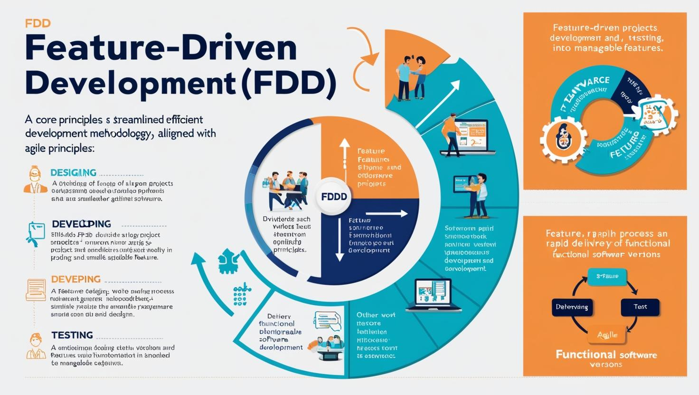

# **FDD Proje Yönetimi**

- [Güncel PDF'i İndir](https://www.vebende.com.tr/pdfs/fdd.pdf)
- [En güncel eğitimlerimiz için www.vebende.com.tr ziyaret edin](https://www.vebende.com.tr/sifirdan-zirveye-dockerla-sanallastirma)

## **Eğitim Süresi**

- **Süre:** 2 gün
- **Ders Süresi:** 50 dakika
- **Eğitim Saati:** 10:00 - 17:00

- > Her iki eğitim formatında eğitimler 50 dakika + 10 dakika moladır. 12:00-13:00 saatleri arasında 1 saat yemek arasındaki verilir. Günde toplam 6 saat eğitim verilir. 2 günlük formatta 12 saat eğitim verilmektedir.

- > Eğitimler uzaktan eğitim formatında tasarlanmıştır. Her eğitim için teams linkleri gönderilir. Katılımcılar bu linklere girerek eğitimlere katılırlar. Ayrıca farklı remote çalışma araçları da eğitmen tarafından tüm katılımlara sunulur. Katılımcılar bu araçları kullanarak eğitimlere katılırlar.

- > Eğitim içeriğinde github ve codespace kullanılır. Katılımcılar bu platformlar üzerinden örnek projeler oluşturur ve eğitmenle birlikte eğitimlerde sorulan sorulara ve taleplere uygun iceriğe cevap verir. Katılımcılar bu araçlarla eğitimlerde sorulan sorulara ve taleplere uygun iceriğe cevap verir.

- > Eğitim yapay zeka destekli kendi kendine öğrenme formasyonu ile tasarlanmıştır. Katılımcılar eğitim boyunca kendi kendine öğrenme formasyonu ile eğitimlere katılırlar. Bu eğitim formatı sayesinde tüm katılımcılar gelecek tüm yaşamlarında kendilerini güncellemeye devam edebilecekler ve her türlü sorunun karşısında çözüm bulabilecekleri yeteneklere sahip olacaklardır.

## **FDD (Feature-Driven Development) Nedir?**

Feature-Driven Development (FDD), yazılım geliştirme süreçlerinde proje yönetimini ve ekip çalışmalarını daha verimli hale getiren bir metodolojidir. Agile prensipleriyle uyumlu olarak, FDD, büyük projeleri küçük, bağımsız ve yönetilebilir parçalara (features) ayırarak, yazılım geliştirmeyi daha düzenli ve sistematik hale getirir. Bu yaklaşım, özellikle büyük ve karmaşık projelerde, işlevsel özelliklerin hızlı bir şekilde geliştirilmesi ve teslim edilmesi için etkili bir yöntem sunar.

FDD’nin temel amacı, her bir özelliğin tasarımı, geliştirilmesi ve test edilmesi sürecini net bir şekilde tanımlamak ve bu sayede sürekli ilerleme sağlamak, hata oranlarını azaltmak ve proje hedeflerine zamanında ulaşmaktır. Bu metodoloji, özellik odaklı (feature-driven) bir yaklaşım benimseyerek, her özelliği küçük birimler halinde ele alır ve bu birimler üzerinde yoğunlaşarak projeyi yönetir.

## **FDD’nin Temel Özellikleri**

1. **Özellik Odaklı Yaklaşım**: Proje, işlevsel özelliklere (features) odaklanarak küçük parçalara ayrılır. Her özellik, bağımsız olarak tasarlanabilir, geliştirilebilir ve test edilebilir.
   
2. **Hızlı Teslimat**: FDD, her özellik için hızlı bir geliştirme süreci sunar. Bu sayede yazılım, sürekli olarak küçük ama işlevsel sürümler halinde teslim edilir.

3. **İleriye Yönelik Planlama ve Yönetim**: FDD, proje süresince sürekli planlama yapmayı gerektirir. Her özellik, gelişen ihtiyaçlara göre önceliklendirilir ve buna göre kaynaklar tahsis edilir.

4. **Takım Bazlı Çalışma**: Her bir özellik için bir takım oluşturulur. Takımlar, özelliklerin tasarımından geliştirilmesine kadar tüm süreci yönetir. Bu takımlar genellikle küçük, bağımsız birimler olup, hızlı kararlar alabilir.

5. **Proje Takibi ve İlerleme Raporları**: FDD, proje ilerlemesini takip etmek için net bir yapı sunar. Her özelliğin geliştirilme süreci detaylı bir şekilde izlenir, böylece proje yöneticileri ve ekip üyeleri sürekli ilerlemeyi görebilir.

## **FDD'nin Faydaları**

- **Verimli Kaynak Kullanımı**: Her özellik için belirli bir zaman dilimi ve kaynak tahsisi yapılır, bu da projelerin daha verimli yönetilmesini sağlar.
- **Yüksek Kalite**: Her özellik bağımsız olarak test edilebilir, böylece yazılımın genel kalitesi artar ve hatalar daha erken tespit edilir.
- **Hızlı Sonuçlar**: Özellik bazında yapılan geliştirme, erken aşamalarda kullanılabilir yazılımlar üretmeye olanak tanır.
- **Daha İyi İletişim ve Takım Yönetimi**: Takımlar küçük ve odaklanmış olduğundan, iletişim daha etkili olur ve ekip üyeleri üzerinde odaklanabilirler.

## **FDD’nin Uygulama Alanları**

- Büyük ve karmaşık yazılım projeleri
- Hızlı teslimat gereksinimi olan projeler
- Dağıtık ekiplerle çalışılan projeler
- Sürekli olarak işlevsel özelliklerin eklenmesi gereken projeler

Sonuç olarak, FDD, yazılım projelerinde düzenli ilerleme ve yüksek kalite sağlamak için güçlü bir metodoloji sunar. Özellikle büyük ölçekli projelerde, özelliğe dayalı planlama ve geliştirme süreci, başarıya ulaşmak için kritik bir rol oynar.

## **Eğitim Hedefi**

### **Eğitimin Hedefi: Feature-Driven Development (FDD)**

Bu eğitimin temel hedefi, **Feature-Driven Development (FDD)** metodolojisini katılımcılara teorik ve pratik açıdan öğretmek ve uygulama yetkinliklerini kazandırmaktır. Eğitim, FDD’nin temel prensiplerini, yöntemlerini ve yazılım geliştirme süreçlerindeki etkisini derinlemesine inceleyerek katılımcıların büyük ve karmaşık projelerde FDD'yi etkin bir şekilde kullanmalarını sağlamayı amaçlar.  

1. **FDD’yi Anlama**  
   - Katılımcılara FDD’nin tanımını, prensiplerini ve Agile ile ilişkisini aktarmak.  
   - Özellik odaklı yaklaşımın yazılım geliştirme süreçlerine getirdiği avantajları göstermek.  

2. **FDD Süreçlerini Uygulama**  
   - FDD’nin temel adımlarını (modelleme, özellik listesi çıkarma, planlama, tasarım ve geliştirme) katılımcılarla uygulamalı olarak göstermek.  

3. **Ekip Yönetimi ve İletişim**  
   - FDD'deki takım odaklı çalışma prensiplerini ve iletişim stratejilerini açıklamak.  
   - Küçük, bağımsız ekiplerin etkili karar alma ve proje hedeflerine ulaşma süreçlerini öğretmek.  

4. **Kalite ve Verimlilik Sağlama**  
   - Özellik bazında geliştirme ile kaliteyi artırma, hata oranlarını düşürme ve süreç takibi yapabilme yetkinliklerini kazandırmak.  
   - Proje yönetiminde zaman ve kaynak kullanımını optimize etme becerileri geliştirmek.  

5. **FDD’nin Gerçek Hayatta Kullanımı**  
   - FDD’nin büyük ve karmaşık yazılım projelerindeki başarı hikayelerinden yola çıkarak katılımcıların pratikte karşılaşabilecekleri durumları çözümleyebilmelerini sağlamak.  

## **Eğitim İçeriği**

## **FDD’ye Giriş ve Temelleri**

- **FDD Nedir?**
  - Feature-Driven Development tanımı ve temel prensipleri
  - FDD'nin Agile, Scrum, Kanban gibi metodolojilerle karşılaştırılması
  - FDD'nin tarihçesi ve kökenleri

- **FDD Temel İlkeleri**
  - Modülerlik, küçük ve bağımsız özellikler (features) geliştirme
  - Hedef odaklı planlama ve yönetim

- **Feature Tanımlamaları**
  - Feature nedir? Yazılım projelerindeki rolü
  - Kullanıcı hikayelerinin feature’a dönüşmesi

- **Feature Listesi Oluşturma**
  - Feature listesi nasıl oluşturulur? Önceliklendirme ve görev dağılımı
  - Feature’ları küçük, bağımsız ve işlevsel parçalara ayırma

---

## **FDD Süreçleri ve Aşamaları**

- **İlk Planlama**
  - Proje hedeflerinin belirlenmesi
  - Feature listesi oluşturulması ve kaynak planlaması

- **Feature Baseline (Özellik Temeli)**
  - Feature’ların kapsamının belirlenmesi
  - Feature'ların doğrulanması ve kapsam yönetimi

- **Feature Tanımlama ve Tasarım**
  - Feature için ayrıntılı tasarım süreci
  - Tasarımda tutarlılığı sağlamak

- **Geliştirme ve İnşa Süreci**
  - Feature bazlı geliştirme takımları ve yazılım geliştirme aşamaları
  - Scrum ve Agile ile entegrasyon

---

## **FDD Ekip Yönetimi ve Organizasyonu**

- **Ekip Yapısı ve Rolleri**
  - Feature Owner, Developer, Designer, Tester gibi rollerin tanımlanması
  - Takım dinamikleri ve iletişim

- **Ekip İletişimi ve Koordinasyon**
  - FDD metodolojisinde takım içi iletişim araçları
  - Dağıtık takımların yönetilmesi

- **Ekip Performansının İzlenmesi**
  - Takım performansının izlenmesi
  - Sürekli iyileştirme süreçleri
  - Geri bildirim kültürünün oluşturulması

- **FDD Proje Yönetimi Teknikleri**
  - Zaman yönetimi, önceliklendirme ve kaynak tahsisi
  - Risk yönetimi ve proje izleme

---

## **İleri Düzey Uygulamalar ve Entegrasyon**

- **FDD ve Scrum/Kanban Entegrasyonu**
  - FDD ve Scrum metodolojisinin birleşimi
  - Scrum sprintlerinde feature bazlı yönetim
  - Kanban ile FDD projelerinin optimizasyonu

- **FDD ve DevOps Entegrasyonu**
  - Sürekli entegrasyon ve teslimat süreçlerinde FDD kullanımı
  - Feature bazlı test ve dağıtım süreçleri
  - DevOps araçlarının FDD projelerinde kullanımı

---

## **Uygulamalı Çalışmalar ve Proje Değerlendirmesi**

- **Case Study: FDD Projesi Yönetimi**
  - Gerçek bir proje üzerinden FDD yönteminin uygulanması
  - Feature tanımlama, geliştirme ve test süreçlerinin simülasyonu
  - Katılımcılar için senaryo tabanlı uygulamalar

- **Çalışma Grubu: Feature Listesi ve Zaman Çizelgesi Oluşturma**
  - Katılımcılar küçük gruplar halinde, gerçek bir proje üzerinde çalışacak
  - Feature listesi oluşturulacak ve zaman çizelgesi belirlenecek

- **Proje Başarı Kriterleri ve FDD’nin Rolü**
  - Feature odaklı başarı değerlendirmesi
  - Zamanında teslimat ve müşteri memnuniyeti
  - Kalite kontrol süreçlerinde FDD’nin rolü

- **Eğitim Sonu Değerlendirme ve Geri Bildirim**
  - Katılımcıların öğrenme süreçlerinin değerlendirilmesi
  - Geri bildirim ve gelişim alanları
  - Kapanış ve soru-cevap oturumu

## **Eğitim Yöntemi**

**1. Teorik Anlatım**  

- Eğitim süresince FDD'nin temel prensipleri, süreçleri ve uygulama alanları hakkında teorik bilgiler aktarılacaktır.  
- Konular, örnek olaylarla zenginleştirilerek, katılımcıların kavramları daha iyi anlaması sağlanacaktır.  
- Görsel materyaller, diyagramlar ve şemalar kullanılarak eğitim içeriği görselleştirilecektir.  

**2. Uygulamalı Çalışmalar**  

- Eğitimde, katılımcılar küçük gruplar halinde gerçekçi projeler üzerinde çalışacaklardır.  
- Her grup, bir feature listesi oluşturacak, bu listeyi önceliklendirecek ve planlama yapacaktır.  
- Feature tasarımı, geliştirilmesi ve test edilmesi süreçleri uygulamalı olarak gösterilecektir.  

**3. Etkileşimli Tartışmalar**  

- Eğitimde interaktif oturumlarla katılımcılar arasında bilgi paylaşımı teşvik edilecektir.  
- Sorular ve cevaplarla katılımcıların aktif katılımı sağlanacaktır.  

**4. Senaryo Tabanlı Çalışmalar**  

- Katılımcılar, gerçek dünya problemlerine yönelik senaryolar üzerinden FDD yöntemini uygulayacaklardır.  
- Bu çalışmalar, FDD’nin projelere nasıl uygulanacağını pratikte anlamalarına yardımcı olacaktır.  

**5. Grup Çalışmaları ve Ekip Rolleri**  

- Katılımcılar, takımlara ayrılarak farklı roller üstleneceklerdir (Feature Owner, Developer, Tester vb.).  
- Takım içi iletişim ve koordinasyon süreçleri deneyimlenerek öğrenilecektir.  

**6. Değerlendirme ve Geri Bildirim**  

- Eğitim sonunda yapılan uygulamalar değerlendirilecek ve her katılımcıya geri bildirim sağlanacaktır.  
- Katılımcıların güçlü yönleri ve geliştirilmesi gereken alanları hakkında bireysel öneriler verilecektir.  

## **Hedef Kitle**

1. **Yazılım Geliştiriciler**  
   - Özellik bazlı geliştirme yöntemlerini öğrenmek ve projelerinde uygulamak isteyen yazılım mühendisleri.  

2. **Proje Yöneticileri**  
   - Yazılım projelerini daha sistematik bir şekilde yönetmek, hızlı teslimatlar sağlamak ve takım koordinasyonunu geliştirmek isteyen yöneticiler.  

3. **Scrum Master ve Agile Koçları**  
   - Agile metodolojilerine ek olarak FDD yaklaşımını öğrenerek süreçlere entegre etmek isteyen profesyoneller.  

4. **Yazılım Takım Liderleri**  
   - Takımlarını FDD prensipleri doğrultusunda yönlendirmek ve proje başarısını artırmak isteyen liderler.  

5. **Test Uzmanları ve Kalite Güvence Ekipleri**  
   - Özellik bazlı test süreçlerini öğrenerek yazılımın genel kalitesini artırmak isteyen kalite profesyonelleri.  

6. **Ürün Sahipleri (Product Owners)**  
   - Feature odaklı yazılım geliştirme süreçlerini anlamak ve ürünlerin daha etkili bir şekilde geliştirilmesini sağlamak isteyen ürün yöneticileri.  

7. **Teknik Analistler**  
   - Özelliklerin tanımlanması, önceliklendirilmesi ve kapsam yönetiminde FDD metodolojisinin uygulanmasını öğrenmek isteyen analistler.  

8. **DevOps ve Sistem Mühendisleri**  
   - FDD’nin DevOps süreçleriyle entegrasyonunu öğrenmek ve sürekli entegrasyon/delivery (CI/CD) süreçlerinde rol almak isteyen mühendisler.  

## **Katılımcılardan Beklentilerimiz**

1. **Temel Yazılım Geliştirme Bilgisi**  
   Katılımcıların yazılım geliştirme süreçlerine dair temel bilgi ve deneyime sahip olmaları beklenmektedir. Özellikle yazılım geliştirme metodolojileri, Agile prensipleri ve takım çalışması konularında ön bilgi sahibi olmaları tercih edilir.  

2. **Aktif Katılım ve İletişim**  
   Eğitim sürecinde katılımcıların aktif olarak yer alması, grup çalışmalarına katkı sağlaması ve diğer katılımcılarla işbirliği içinde olmaları beklenmektedir. FDD’nin başarılı bir şekilde uygulanabilmesi için iletişim ve işbirliği kritik öneme sahiptir.  

3. **Açık Fikirli ve Öğrenmeye Yönelik Tutum**  
   Katılımcıların FDD metodolojisini öğrenmeye istekli, yeni yöntemlere açık ve çözüm odaklı bir yaklaşım benimsemeleri gerekmektedir. Eğitimde ele alınacak konularda farklı bakış açılarına sahip olabilme ve yeni bilgiye açık olma önemlidir.  

4. **Problem Çözme ve Uygulama Yetenekleri**  
   Katılımcıların FDD’nin gerçek dünya projelerine nasıl entegre edileceğine dair uygulamalı düşünme becerisine sahip olmaları beklenir. Bu bağlamda, teorik bilgilerin yanı sıra pratikte de etkin çözümler geliştirebilme yeteneği önemlidir.  

5. **Takım Çalışmasına Katkı**  
   Eğitim sürecinde grup çalışmaları ve senaryo tabanlı uygulamalar yapılacaktır. Katılımcıların takım içinde aktif bir şekilde rol almaları, fikirlerini paylaşmaları ve işbirliği yapmaları beklenmektedir.  

6. **Sürekli Geri Bildirim Almak ve Vermek**  
   Katılımcıların geri bildirim kültürüne açık olmaları, eğitim sırasında öğrenilenleri diğer katılımcılarla paylaşarak karşılıklı gelişime katkı sağlamaları beklenmektedir.  

7. **Zaman Yönetimi ve Proje Yönetimi İlgisi**  
   Katılımcıların zaman yönetimi, önceliklendirme ve kaynak tahsisi konularında FDD prensiplerini anlamaları ve bu bilgileri pratikte kullanabilme yeteneği geliştirmeleri beklenmektedir.  

[Eğitim Materyalleri (Eğitmenlere Özel)](https://github.com/TuncerKARAARSLAN-VB/training-kit-fdd-proje-yonetimi)
