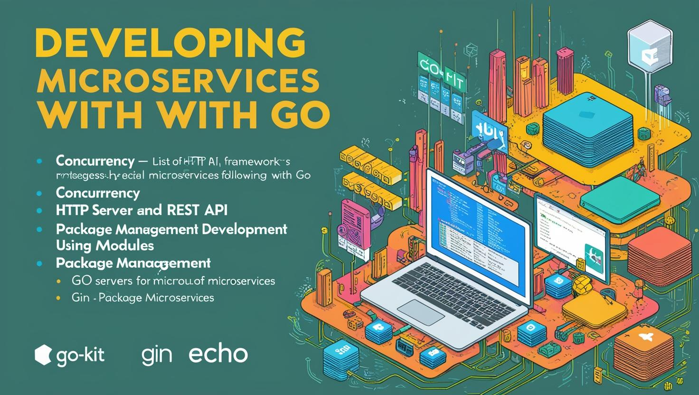
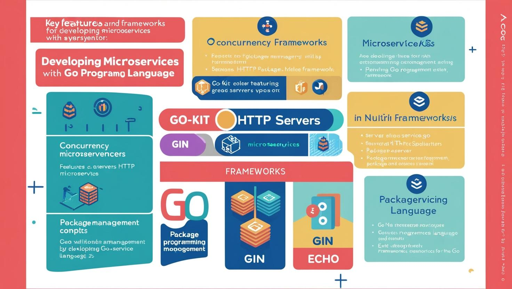

# **Go ile API Geliştirme, Microservis Mimarisi ve Yayınlama (Kubernetes, Docker, OpenShift) Eğitimi**

- [Güncel PDF'i İndir](https://www.vebende.com.tr/pdfs/go.pdf)
- [En güncel eğitimlerimiz için www.vebende.com.tr ziyaret edin](https://www.vebende.com.tr/go-microservis-yazilimlari)

## **Eğitim Süresi**

- **Süre:** 5 gün
- **Ders Süresi:** 50 dakika
- **Eğitim Saati:** 10:00 - 17:00

- > Her iki eğitim formatında eğitimler 50 dakika + 10 dakika moladır. 12:00-13:00 saatleri arasında 1 saat yemek arasındaki verilir. Günde toplam 6 saat eğitim verilir. 5 günlük formatta 30 saat eğitim verilmektedir.

- > Eğitimler uzaktan eğitim formatında tasarlanmıştır. Her eğitim için teams linkleri gönderilir. Katılımcılar bu linklere girerek eğitimlere katılırlar. Ayrıca farklı remote çalışma araçları da eğitmen tarafından tüm katılımlara sunulur. Katılımcılar bu araçları kullanarak eğitimlere katılırlar.

- > Eğitim içeriğinde github ve codespace kullanılır. Katılımcılar bu platformlar üzerinden örnek projeler oluşturur ve eğitmenle birlikte eğitimlerde sorulan sorulara ve taleplere uygun iceriğe cevap verir. Katılımcılar bu araçlarla eğitimlerde sorulan sorulara ve taleplere uygun iceriğe cevap verir.

- > Eğitim yapay zeka destekli kendi kendine öğrenme formasyonu ile tasarlanmıştır. Katılımcılar eğitim boyunca kendi kendine öğrenme formasyonu ile eğitimlere katılırlar. Bu eğitim formatı sayesinde tüm katılımcılar gelecek tüm yaşamlarında kendilerini güncellemeye devam edebilecekler ve her türlü sorunun karşısında çözüm bulabilecekleri yeteneklere sahip olacaklardır.

### **Go ile API Geliştirme**  

**"Microservis Mimarisi ve Go’ya Giriş" Eğitimi**, modern yazılım geliştirme süreçlerinin temel taşlarından biri haline gelen **microservis mimarisi**, **Go programlama dili**, **konteynerleştirme**, ve **orkestrasyon** konularında uzmanlaşmak isteyenler için tasarlanmıştır.  

Bu eğitim, microservislerin sağladığı **ölçeklenebilirlik**, **bağımsız dağıtım** ve **hızlı geliştirme** gibi avantajlarını kavramanızı sağlarken, **Docker**, **Kubernetes**, ve **OpenShift** gibi popüler teknolojilerle bu servislerin nasıl yönetileceğini ve dağıtılacağını öğretecektir.  

- **Microservis Mimarisi**: Büyük ölçekli sistemlerin tasarımı, servisler arası iletişim ve veri tutarlılığı.  
- **Go ile Uygulama Geliştirme**: Hızlı, güvenli ve performanslı servislerin geliştirilmesi.  
- **Konteynerleşme**: Docker ile uygulamaları paketleme ve dağıtım.  
- **Kubernetes ve OpenShift**: Uygulamaların orkestrasyonu, ölçeklendirilmesi ve otomatik yönetimi.  
- **Monitoring ve Güvenlik**: Prometheus, Grafana ve Istio gibi araçlarla sistemlerin izlenmesi ve güvenli hale getirilmesi.  

Eğitim, yalnızca teknik bilgileri aktarmakla kalmayıp, aynı zamanda gerçek dünya projelerinde karşılaşılan zorluklara yönelik **en iyi uygulamaları**, **pratik çözümleri**, ve **DevOps entegrasyon stratejilerini** de kapsamaktadır.  

İster yazılım geliştirme alanında deneyimli olun ister bu alanda yeni başlayın, **"Microservis Mimarisi ve Go’ya Giriş" Eğitimi** size modern yazılım geliştirme dünyasında rekabetçi bir avantaj sağlayacaktır.  

## **Eğitim Hedefi**

**Microservis Mimarisi ve Go’ya Giriş Eğitimi**, katılımcılara modern yazılım geliştirme süreçlerinde kullanılan microservis mimarisi, konteynerleştirme, orkestrasyon, güvenlik ve performans yönetimi konularında derinlemesine bilgi ve beceri kazandırmayı hedeflemektedir. Bu eğitimin sonunda katılımcılar:

1. **Microservis Mimarisini Anlama:**
   - Büyük ölçekli sistemlerde microservislerin avantajlarını ve zorluklarını değerlendirerek uygun mimari kararlar alabileceklerdir.
   - Domain-Driven Design gibi en iyi uygulamaları kullanarak, modüler ve bağımsız bir sistem tasarlayabileceklerdir.

2. **Go ile Mikro Servis Geliştirme Yetkinliği:**
   - Go dilinin sunduğu performans, eşzamanlılık ve modüler yapılarla etkili microservisler geliştirme becerisi kazanacaklardır.
   - Go tabanlı popüler framework ve araçlarla REST API ve iş süreçlerini yönetebileceklerdir.

3. **Konteynerleştirme ve Orkestrasyon:**
   - Docker ve Kubernetes gibi teknolojilerle mikroservis uygulamalarını konteynerleştirme, dağıtma ve ölçeklendirme yetkinlikleri edineceklerdir.
   - Kubernetes ve OpenShift gibi platformlarla yüksek erişilebilirlik ve kolay yönetim sağlayabileceklerdir.

4. **Monitoring ve Güvenlik:**
   - Prometheus, Grafana ve Jaeger gibi araçları kullanarak sistemlerin izlenebilirliğini artıracak ve güvenli iletişim protokolleriyle uygulamaları güvenli hale getirebileceklerdir.
   - OAuth2, JWT ve API Gateway gibi modern güvenlik yaklaşımlarını kullanarak uygulamalarını koruma altına alabileceklerdir.

5. **DevOps Entegrasyonu ve CI/CD Süreçleri:**
   - Docker Compose, Jenkins ve OpenShift Pipelines gibi araçları kullanarak sürekli entegrasyon ve dağıtım süreçlerini otomatize edebileceklerdir.

6. **İleri Düzey Yönetim ve Optimizasyon:**
   - Servis mesh kullanarak microservisler arasındaki iletişim ve güvenliği optimize edeceklerdir.
   - Performans testleri, caching ve yük dengeleme stratejileri ile sistemlerin verimliliğini artıracaklardır.

## **Eğitim İçeriği**

### **Bölüm 1: Microservis Mimarisi ve Go’ya Giriş**

1. **Microservis Mimarisi Nedir?**
   - **Microservis Tanımı ve Temel Kavramlar:**
     Microservisler, büyük, monolitik uygulamaları daha küçük, bağımsız ve yönetilebilir parçalara ayıran bir yazılım mimarisidir. Her bir servis belirli bir işlevi yerine getirir ve birbirinden bağımsız çalışabilir.
   - **Microservislerin Avantajları:**
     - Yüksek ölçeklenebilirlik
     - Bağımsız dağıtım ve geliştirme
     - Hızlı hata tespiti ve düzeltme
   - **Microservislerin Zorlukları:**
     - Servisler arası iletişim
     - Veri tutarlılığı
     - Dağıtık sistemler yönetimi

2. **Go ile Microservis Geliştirme**
   - **Go Dilinin Microservis Geliştirmeye Uygunluğu:**
     Go’nun hızlı çalışma süresi, düşük bellek kullanımı ve yüksek performansı, onu microservis geliştirme için ideal bir dil haline getirir.
   - **Go Dilinin Temel Özellikleri:**
     - Go dilinde concurrency (eşzamanlılık)
     - HTTP sunucuları ve REST API'leri geliştirme
     - Paket yönetimi ve modüller
   - **Go ile Microservis Geliştirme Çerçeveleri:**
     - **Go-kit:** Microservisler için modüler bir çerçeve
     - **Gin ve Echo:** Hızlı HTTP sunucuları geliştirmek için popüler Go çerçeveleri

---

### **Bölüm 2: Docker ile Konteynerleştirme**

1. **Docker’a Giriş ve Temel Kavramlar**
   - **Docker Nedir?**  
     Docker, yazılımları ve uygulamaları bağımlılıklarıyla birlikte izole edilmiş konteynerlerde çalıştıran bir platformdur. Uygulamanın her ortamda aynı şekilde çalışmasını sağlar.
   - **Docker’ın Temel Bileşenleri:**
     - **Docker Image**: Uygulamanın bağımlılıklarıyla birlikte paketlenmiş hali.
     - **Docker Container**: Çalışan bir Docker image.
     - **Dockerfile**: Docker imajlarını oluşturmak için kullanılan yapılandırma dosyası.
   - **Docker Komutları ve Kullanımı:**
     - `docker build`, `docker run`, `docker ps`, `docker logs`
     - Docker Compose ile birden fazla konteyneri yönetme

2. **Go Uygulamasını Docker ile Konteynerleştirme**
   - **Go Uygulaması İçin Dockerfile Yazma**
     - Go uygulaması için uygun bir Dockerfile oluşturma
     - Multi-stage build kullanarak Docker imajını optimize etme
   - **Docker ile Go Microservisini Çalıştırma ve Test Etme**
     - Go uygulamasını Docker konteynerinde çalıştırma
     - Veritabanı ve diğer mikro hizmetlerle entegrasyon
   - **Docker Compose ile Çoklu Go Microservislerinin Yönetilmesi**
     - Docker Compose ile birden fazla Go mikro servisi çalıştırma
     - Konteynerler arası ağ yapılandırması

---

### **Bölüm 3: Kubernetes ile Orkestrasyon**

1. **Kubernetes’e Giriş**
   - **Kubernetes Nedir?**
     Kubernetes, konteynerleştirilmiş uygulamaların dağıtımı, ölçeklendirilmesi ve yönetilmesi için açık kaynaklı bir platformdur.
   - **Kubernetes Bileşenleri:**
     - **Pod:** En küçük dağıtım birimi.
     - **Deployment:** Pod’ları yönetme, güncelleme ve ölçeklendirme.
     - **Service:** Mikro hizmetlerin birbirine bağlanması ve dış dünyaya açılması.
     - **Ingress:** Dışarıdan gelen isteklerin yönlendirilmesi.
   - **Kubernetes API Server, Controller Manager ve Scheduler**

2. **Go Microservislerini Kubernetes Üzerinde Yayınlama**
   - **Kubernetes Deployment Oluşturma:**
     - Go uygulamaları için Kubernetes deployment’ları oluşturma
     - Pod’ların ölçeklenmesi
   - **Kubernetes Service ve Ingress Kullanımı:**
     - Go microservisleri arasındaki iletişimi sağlayacak Kubernetes servisleri oluşturma
     - Dışa açık erişim için Ingress yapılandırması
   - **Kubernetes ile Yük Dengeleme ve Auto-Scaling:**
     - Yük dengeleme
     - Horizontal Pod Autoscaler ile otomatik ölçeklendirme
     - Kaynak yönetimi (CPU, bellek)

3. **Kubernetes ile DevOps Entegrasyonu**
   - **CI/CD Pipeline’ları Kurma:**
     - Kubernetes üzerinde CI/CD süreçlerinin yapılandırılması
     - Jenkins, GitLab CI, CircleCI ile entegrasyon
   - **Kubernetes ve Helm ile Uygulama Dağıtımı**
     - Helm Charts kullanarak Kubernetes üzerinde Go microservis dağıtımı

---

### **Bölüm 4: OpenShift ile Yayınlama ve Yönetim**

1. **OpenShift’e Giriş**
   - **OpenShift Nedir?**
     OpenShift, Kubernetes tabanlı, kurumsal düzeyde konteyner yönetim platformudur. Kubernetes’i geliştirir ve birçok ek özellik sunar.
   - **OpenShift ile Kubernetes Arasındaki Farklar:**
     - OpenShift, güvenlik, çoklu kullanıcı yönetimi ve geliştirme araçları sunar.
   - **OpenShift Komutları ve Yönetim Araçları (oc CLI)**

2. **Go Microservislerini OpenShift Üzerinde Yayınlama**
   - **OpenShift ile Deployment ve Pod Yönetimi**
     - Go uygulamalarını OpenShift üzerinde dağıtmak için deployment ve pod’lar oluşturma
   - **OpenShift ile Service ve Route Yönetimi**
     - Mikroservislere dış erişim sağlamak için OpenShift Route oluşturma
   - **OpenShift ile Kaynak Yönetimi ve İzinler:**
     - Role-Based Access Control (RBAC)
     - OpenShift Security Context ve Network Policies

3. **OpenShift CI/CD Entegrasyonu**
   - **OpenShift Pipelines (Tekton) ile CI/CD Süreçleri:**
     - OpenShift üzerinde pipeline’lar kurma ve otomatik dağıtım yapma
     - Jenkins ile OpenShift entegrasyonu
   - **Automated Builds ve Deployments**
     - OpenShift ile Go uygulamalarını otomatik olarak derleyip dağıtma

---

### **Bölüm 5: Mikro Servislerin Yönetimi ve İzlenmesi**

1. **Mikro Servislerin İzlenmesi (Monitoring)**
   - **Prometheus ve Grafana ile İzleme:**  
     - Prometheus kullanarak Go microservislerini izleme
     - Grafana ile metriklerin görselleştirilmesi
   - **EFK Stack (Elasticsearch, Fluentd, Kibana) ile Log Yönetimi:**
     - Mikro servislerin loglarını toplama ve görselleştirme

2. **Mikro Servislerin Hata Yönetimi ve Debugging**
   - **Distributed Tracing ve Jaeger ile İzleme:**  
     - Go microservislerinde distributed tracing kullanma
     - Jaeger ile hataların izlenmesi
   - **Health Check ve Readiness Probe ile Servis Sağlığı İzleme:**
     - Kubernetes üzerinde sağlık kontrolleri ve hazır olma denetimleri

---

### **Bölüm 6: Uygulama Güvenliği ve İleri Düzey Konular**

1. **Mikro Servislerde Güvenlik**
   - **OAuth2 ve JWT ile Kimlik Doğrulama ve Yetkilendirme**
   - **Mutual TLS ile Güvenli Mikro Servis İletişimi**
   - **API Gateway ve Rate Limiting ile Güvenlik**

2. **Servis Mesh ile Mikro Servis İletişimi ve Güvenliği**
   - **Istio ve Linkerd ile Servis Mesh Kullanımı**
   - **Servis Mesh ile Tracing ve Monitoring**

3. **Yüksek Erişilebilirlik ve Felaket Kurtarma**
   - **Kubernetes ve OpenShift ile Yüksek Erişilebilirlik**
   - **Failover ve Yedekleme Stratejileri**

---

### **Bölüm 7: Proje Yönetimi ve En İyi Uygulamalar**

1. **Microservis Tasarımı ve İyi Uygulamalar**
   - **Domain-Driven Design (DDD) ve Microservis Tasarımı**
   - **Veritabanı Tasarımı: Veritabanı Şeması ve Veri Tabanı Bağımsızlığı**
   - **İletişim Modelleri: Synchronous vs Asynchronous**

2. **Microservislerin Performans Yönetimi ve Optimizasyonu**
   - **Performans Testleri ve Profilleme**
   - **Caching ve Load Balancing Stratejileri**

## **Eğitim Yöntemi**

- **Teorik Bilgi Aktarımı:** Her gün belirli konuların teorik anlatımı.
- **Uygulamalı Atölyeler:** Gerçek dünya senaryolarına dayalı uygulamalı çalışmalar. Katılımcılar, Go ile API ve microservis geliştirip Docker, Kubernetes ve OpenShift ile uygulamaları dağıtacaklar.
- **Grup Çalışmaları:** Katılımcıların küçük gruplar halinde çalışarak gerçek bir microservis mimarisi geliştirmeleri ve dağıtmaları.
- **Vaka Çalışmaları:** Gerçek hayattan başarılı Go microservis projelerinin incelenmesi, karşılaşılan zorluklar ve çözüm stratejileri üzerine tartışmalar.

## Hedef Kitle:

Bu eğitim, modern yazılım geliştirme süreçlerine hakim olmak isteyen ve **microservis mimarisi**, **Go programlama dili**, **konteynerleştirme**, ve **orkestrasyon** konularında bilgi ve yetkinlik kazanmayı hedefleyen bireylere yöneliktir.  

1. **Yazılım Geliştiriciler**  
   - Uygulama geliştirme süreçlerini microservis mimarisi ile modernize etmek isteyen yazılım geliştiriciler.  
   - Go dilinde uzmanlaşarak yüksek performanslı ve ölçeklenebilir çözümler üretmek isteyenler.  

2. **Yazılım Mimarları ve Teknik Liderler**  
   - Büyük ölçekli sistemlerin tasarımında microservis yaklaşımlarını etkin bir şekilde kullanmayı hedefleyen yazılım mimarları.  
   - Takımlarına modern teknolojileri entegre etmek isteyen teknik liderler.  

3. **DevOps ve Sistem Yöneticileri**  
   - Kubernetes, Docker ve OpenShift gibi teknolojilerle konteyner yönetimi ve orkestrasyon süreçlerinde uzmanlaşmak isteyen DevOps mühendisleri.  
   - Geliştirme ve operasyon ekipleri arasında köprü görevi gören sistem yöneticileri.  

4. **Yeni Teknolojilere İlgi Duşan Profesyoneller**  
   - Geleneksel yazılım geliştirme yöntemlerinden modern mikroservis mimarisine geçiş yapmak isteyen profesyoneller.  
   - Kariyerlerini geleceğin teknolojileriyle güçlendirmek isteyen bireyler.  

5. **Üniversite Öğrencileri ve Yeni Mezunlar**  
   - Yazılım geliştirme alanında kariyer yapmak isteyen ve modern yazılım mimarilerine ilgi duyan öğrenciler.  
   - İş piyasasında fark yaratmak için güçlü bir teknik altyapı oluşturmayı hedefleyen yeni mezunlar.  

[Eğitim ana materyalleri, sadece eğitmenler için](https://github.com/TuncerKARAARSLAN-VB/training-kit-go-ile-mikro-servis-mimarisi)
