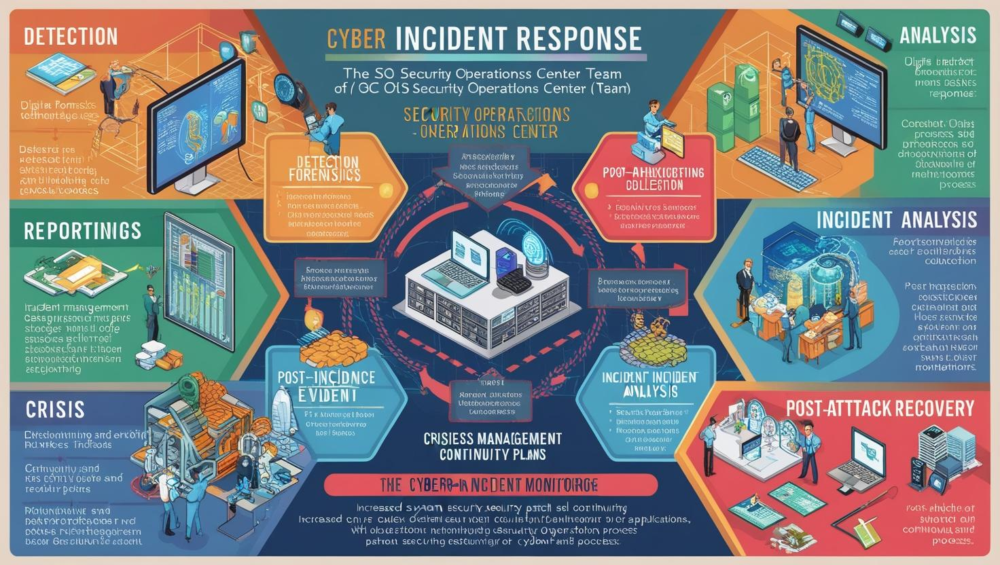
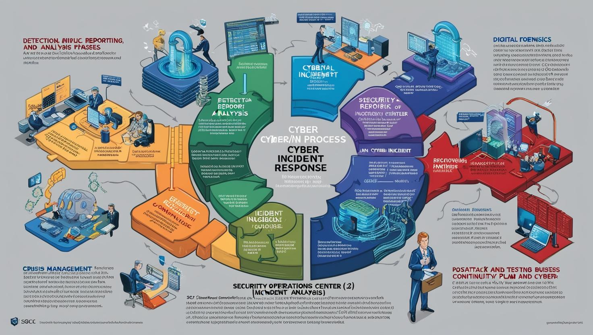

# İleri Seviye Siber Güvenlik Eğitimi

[Download PDF Version](./cyber-security-advanced-level.pdf)

## **Eğitim Süresi**

- **Format 1**
  - **5 Gün**
  - **Ders Süresi:** 50 dakika
  - **Eğitim Saati:** 10:00 - 17:00

- **Format 2**
  - **12 Gün**
  - **Ders Süresi:** 50 dakika
  - **Eğitim Saati:** 10:00 - 17:00

- > Her iki eğitim formatında eğitimler 50 dakika + 10 dakika moladır. 12:00-13:00 saatleri arasında 1 saat yemek arasındaki verilir. Günde toplam 6 saat eğitim verilir. 5 günlük formatta 30 saat eğitim, 12 günlük formatta toplam 72 saat eğitim verilmektedir. 12 saatlik eğitmde katılımcılar kod yazar ve eğitmenle birlikte sorulan sorulara ve taleplere uygun içerikler ve örnekler çalışılır.

- > Eğitimler uzaktan eğitim formatında tasarlanmıştır. Her eğitim için teams linkleri gönderilir. Katılımcılar bu linklere girerek eğitimlere katılırlar. Ayrıca farklı remote çalışma araçları da eğitmen tarafından tüm katılımlara sunulur. Katılımcılar bu araçları kullanarak eğitimlere katılırlar.

- > Eğitim içeriğinde github ve codespace kullanılır. Katılımcılar bu platformlar üzerinden örnek projeler oluşturur ve eğitmenle birlikte eğitimlerde sorulan sorulara ve taleplere uygun iceriğe cevap verir. Katılımcılar bu araçlarla eğitimlerde sorulan sorulara ve taleplere uygun iceriğe cevap verir.

- > Eğitim yapay zeka destekli kendi kendine öğrenme formasyonu ile tasarlanmıştır. Katılımcılar eğitim boyunca kendi kendine öğrenme formasyonu ile eğitimlere katılırlar. Bu eğitim formatı sayesinde tüm katılımcılar gelecek tüm yaşamlarında kendilerini güncellemeye devam edebilecekler ve her türlü sorunun karşısında çözüm bulabilecekleri yeteneklere sahip olacaklardır.

## **Siber Güvenlik ve Ağ Güvenliği Uzmanlığı Eğitim Programı**

Dijital dünyada güvenlik her geçen gün daha kritik bir hale geliyor. Kurumlar, sürekli artan siber tehditlerle mücadele etmek için yüksek nitelikli güvenlik uzmanlarına ihtiyaç duyuyor. Bu eğitim programı, ağ güvenliği, siber tehdit istihbaratı, penetrasyon testleri ve siber olay müdahale gibi alanlarda uzmanlaşmak isteyen profesyonellere yönelik tasarlanmıştır.

Eğitim, siber güvenlik dünyasının en önemli konularını kapsamlı bir şekilde ele alır. Katılımcılar, günümüzün en gelişmiş siber tehditlerine karşı etkili savunma stratejileri geliştirme ve siber saldırılara karşı kurumlarını koruma becerilerini kazanacaklardır. Ayrıca, uygulamalı laboratuvar çalışmaları ile teorik bilgilerin gerçek dünya senaryolarına nasıl uygulandığını görme fırsatı bulacaklardır.

1. **Siber Tehdit İstihbaratı ve Tehdit Analizi:** Tehdit aktörlerinin motivasyonlarını anlama, zararlı yazılım analiz teknikleri ve saldırı yüzeyi analizi gibi temel konularda derinlemesine bilgi edinilecek.
  
2. **Ağ Güvenliği ve Güvenlik Duvarı Yapılandırması:** Ağ segmentasyonu, güvenlik duvarı yönetimi, DDoS saldırıları ve IPS/IDS sistemleri gibi ağ güvenliği bileşenlerinin nasıl yapılandırılacağı öğrenilecek.

3. **Penetrasyon Testi ve Sızma Testleri:** Gerçek dünya saldırı senaryolarıyla, zafiyetlerin tespiti ve güvenlik açıklarının giderilmesi konusunda pratik beceriler kazanılacak.

4. **Uygulama Güvenliği:** Web uygulamaları ve API güvenliği, güvenli kod geliştirme, SQL enjeksiyonu ve XSS gibi yaygın güvenlik açıklarının tespiti yapılacak.

5. **Siber Olay Müdahale ve Kriz Yönetimi:** Olay müdahale süreçlerinin etkin yönetimi, kriz anlarında hızlı karar alma ve saldırı sonrası iyileştirme stratejileri gibi kritik konulara odaklanılacak.

## **Eğitim Hedefi**

Bu eğitim programının temel hedefi, katılımcılara günümüzün hızla gelişen siber tehdit ortamında etkili güvenlik stratejileri geliştirme ve uygulama becerisi kazandırmaktır. Eğitim, ağ güvenliği, siber tehdit istihbaratı, penetrasyon testi, uygulama güvenliği ve siber olay müdahale konularında derinlemesine bilgi ve pratik beceriler sunarak, katılımcıları siber saldırılara karşı koruyabilen ve siber güvenlik olaylarını yönetebilen profesyoneller olarak yetiştirmeyi amaçlamaktadır.

- **Siber tehdit istihbaratı** ve tehdit analizi tekniklerini öğrenerek, siber tehditlerin kaynağını ve hedeflerini analiz etme becerisi kazanacaklardır.
- **Ağ güvenliği** ve güvenlik duvarı yapılandırmalarını yönetme yetkinliği elde ederek, kurum içi ağları güvence altına alma yeteneği kazanacaklardır.
- **Penetrasyon testi** ve **sızma testleri** gibi yöntemlerle, güvenlik açıklarını tespit etme ve bunlara karşı önlemler geliştirme konusunda deneyim sahibi olacaklardır.
- **Uygulama güvenliği** ve **güvenli yazılım geliştirme** metodolojilerini benimseyerek, yazılım ve uygulamalardaki potansiyel güvenlik açıklarını analiz etme ve düzeltme yeteneği kazanacaklardır.
- **Siber olay müdahale** ve **kriz yönetimi** süreçlerini etkin bir şekilde yönetebilme yeteneği ile, siber saldırı anında hızlı ve doğru müdahalelerde bulunabileceklerdir.

Eğitim sonunda katılımcılar, siber güvenlik tehditlerine karşı etkin savunma yapabilen, güvenlik zafiyetlerini tespit edebilen, güvenlik olaylarını yöneten ve siber krizlere karşı hazırlıklı profesyoneller olarak görev alabileceklerdir.

## **Eğitim İçeriği**

### **Gün 1: Siber Tehdit İstihbaratı ve Tehdit Analizi**

- **Siber Tehdit İstihbaratı (CTI):** Tehdit istihbaratının tanımı, kaynakları ve kullanımı. Açık kaynak istihbaratı (OSINT) ve tehdit verilerinin nasıl toplandığı ve analiz edildiği. 
- **Tehdit Aktörleri:** Gelişmiş kalıcı tehditler (APT'ler), devlet destekli saldırılar, siber suç grupları ve hacktivistler gibi farklı tehdit aktörlerinin motivasyonları ve teknikleri. 
- **Zararlı Yazılım Analizi:** Zararlı yazılımların (malware) nasıl çalıştığının anlaşılması, tersine mühendislik (reverse engineering) teknikleri ve zararlı yazılımın tespit edilmesi. 
- **Saldırı Yüzeyi Analizi:** Kurumun saldırı yüzeylerinin tespiti, ağ yapısının incelenmesi ve saldırıya açık noktaların belirlenmesi. 

### **Gün 2: Ağ Güvenliği ve Güvenlik Duvarı Yapılandırması**

- **İleri Seviye Ağ Güvenliği:** Ağ segmentasyonu, honeypot ve honeynet kullanımı, güvenli veri akışı sağlama teknikleri.
- **Güvenlik Duvarı (Firewall) Yönetimi:** Güvenlik duvarlarının yapılandırılması, ileri seviye kuralların tanımlanması, trafik izleme ve olay yönetimi. 
- **Saldırı Tespit ve Önleme Sistemleri (IDS/IPS):** IDS ve IPS sistemlerinin çalışma prensipleri, konfigürasyon ve gelişmiş kullanım yöntemleri.
- **DDoS Saldırıları ve Koruma Yöntemleri:** Dağıtılmış hizmet dışı bırakma (DDoS) saldırılarının türleri ve korunma yöntemleri. Anti-DDoS çözümleri. 

### **Gün 3: Penetrasyon Testi ve Sızma Testleri**

- **Penetrasyon Testi (Pentest) Nedir?** Penetrasyon testinin tanımı, test süreçleri ve aşamaları. Black box, white box ve grey box testlerin farkları. 
- **Zafiyet Taraması:** Kurum içi ve dışı ağlarda zafiyetlerin tespiti, açık kaynak zafiyet tarama araçlarının kullanımı (Nmap, OpenVAS, Nessus). 
- **Sızma Testi Araçları:** Metasploit, Burp Suite, Wireshark gibi ileri seviye sızma testi araçlarının kullanımı ve pratik uygulamaları. 
- **Gerçek Dünya Senaryoları:** Gerçek saldırı senaryolarının canlandırılması, kurum içi sızma testleri ile güvenlik açıklarının tespiti ve iyileştirilmesi. 

### **Gün 4: Uygulama Güvenliği ve Güvenlik Açıkları**

- **Uygulama Güvenliğine Giriş:** Web uygulamaları, mobil uygulamalar ve API güvenliği. Uygulama katmanı güvenlik açıklarının (OWASP Top 10) detaylı incelenmesi.
- **Kod Analizi ve Güvenli Kod Geliştirme:** Kaynak kod analizi, zafiyetlerin tespiti ve güvenli yazılım geliştirme metodolojileri (DevSecOps).
- **Güvenlik Testleri:** Web uygulamaları üzerinde güvenlik testleri, SQL enjeksiyonu (SQL Injection), XSS (Cross-Site Scripting) ve CSRF (Cross-Site Request Forgery) gibi yaygın açıkların tespiti. 
- **İleri Seviye Uygulama Güvenliği:** Zero-day zafiyetleri, exploit geliştirme ve güvenlik test otomasyonu.

### **Gün 5: Siber Olay Müdahale ve Kriz Yönetimi**

- **Siber Olay Müdahale Süreçleri:** Siber olayların tespit edilmesi, raporlanması ve analiz edilmesi. Olay müdahale ekibinin (SOC) görev ve sorumlulukları.
- **Olay Müdahale ve Adli Bilişim:** Dijital adli bilişim teknikleri, olay sonrasında kanıt toplama, veri kurtarma ve olay analiz süreçleri.
- **Kriz Yönetimi ve İş Sürekliliği:** Siber saldırılar sırasında kriz yönetimi, iş sürekliliği planlarının hazırlanması ve test edilmesi.
- **Saldırı Sonrası İyileştirme:** Saldırı sonrası sistemlerin güvenlik seviyesinin artırılması, sistem yamalarının uygulanması ve sürekli izleme stratejileri.

## **Eğitim Yöntemi**

- **Teorik Bilgi:** İleri seviye siber güvenlik kavramları ve stratejilerinin anlatımı.
- **Uygulamalı Örnekler:** Gerçek dünya siber saldırı senaryoları üzerinden vaka çalışmaları ve pratik uygulamalar.
- **Etkileşimli Tartışmalar:** Katılımcılar arasında tehdit istihbaratı ve güvenlik açıkları üzerine etkileşimli tartışmalar.
- **Lab Çalışmaları:** Katılımcıların birebir uygulamalarla ileri seviye güvenlik araçlarını deneyimlemesi ve gerçek dünya saldırılarına karşı koruma stratejileri geliştirmesi.

### **Eğitim Yöntemi:**

Eğitim, teorik bilgi ve pratik uygulamaları birleştiren interaktif bir yaklaşım ile sunulacaktır. Katılımcıların konuları derinlemesine anlaması ve bu bilgileri gerçek dünyada nasıl uygulayacaklarını öğrenmesi hedeflenmektedir. Eğitim yöntemi şu unsurlardan oluşacaktır:

- **Teorik Eğitim**
   - Her günün başlangıcında, siber güvenlik, ağ güvenliği, uygulama güvenliği ve olay müdahale konularında teorik dersler verilecektir. Bu derslerde katılımcılara güncel tehditler, güvenlik protokolleri, teknik kavramlar ve uygulama yöntemleri anlatılacaktır.

- **Canlı Demonstrasyonlar**
   - Eğitimde öğretilen teorik bilgilerin canlı demo ortamlarında pratikte nasıl kullanılacağına dair örnekler verilecektir. Örneğin, penetrasyon testi araçlarının nasıl çalıştığı, sızma testlerinin nasıl yapıldığı gibi konular, uygulamalı gösterimler ile anlatılacaktır.

- **Vaka Çalışmaları ve Gerçek Senaryolar:**
   - Katılımcılar, gerçek dünya siber saldırı senaryoları üzerinden çözümler üretecek, siber tehditler karşısında alacakları önlemleri tartışacak ve bunlara yönelik stratejiler geliştireceklerdir. Bu sayede, karşılaşılan problemleri hızlıca çözme becerisi kazanacaklardır.

- **Atölye Çalışmaları ve Grup Çalışmaları:**
   - Eğitimde katılımcılar, grup çalışmaları ile belirli siber güvenlik tehditlerine karşı stratejiler geliştirecek ve uygulamalı çalışmalarda aktif olarak yer alacaklardır. Bu atölye çalışmaları, katılımcıların karşılaştıkları zorluklarla ilgili bilgi paylaşımı yapmalarını teşvik edecektir.

- **Simülasyonlar ve Testler:**
   - Eğitim sonunda, katılımcıların öğrendikleri bilgileri test edebilmesi için simülasyonlar ve quizler uygulanacaktır. Bu testler, öğrendikleri kavramları pekiştirmelerine ve hangi alanlarda geliştirme yapmaları gerektiğini belirlemelerine yardımcı olacaktır.

- **Eğitmen Desteği:**
   - Eğitim süresince katılımcılara eğitmenler tarafından sürekli rehberlik yapılacaktır. Katılımcılar, karşılaştıkları sorunlarla ilgili sorularını eğitmenlere yönlendirebilecek ve eğitimde öğrendiklerini daha iyi anlamak için bireysel desteğe ihtiyaç duyduklarında rehberlik alabileceklerdir.

Bu eğitim yöntemi, katılımcıların siber güvenlik alanında derinlemesine bilgi edinmelerine, mevcut becerilerini geliştirmelerine ve pratikte uygulayabilecekleri beceriler kazanmalarına olanak tanıyacaktır.

## **Hedef Kitle**

Bu eğitim, özellikle **siber güvenlik, ağ güvenliği** ve **tehdit analizi** gibi kritik alanlarda bilgi ve becerilerini geliştirmek isteyen profesyonellere yöneliktir. 

1. **Siber Güvenlik Uzmanları:**
   - Kurumlarında siber güvenlik stratejilerini geliştiren ve uygulayan uzmanlar. Bu eğitim, onları güncel tehditler, saldırı yöntemleri ve güvenlik önlemleri hakkında derinlemesine bilgilendirir.

2. **Ağ Güvenliği Uzmanları:**
   - Kurum ağlarını koruyan ve yöneten ağ güvenliği uzmanları. Eğitim, ağ altyapılarındaki güvenlik açıklarını tespit etme ve güvenlik duvarları, IDS/IPS gibi ileri seviye ağ güvenlik teknolojilerinin kullanımını öğretir.

3. **Penetrasyon Testi Uzmanları:**
   - Kurum içindeki güvenlik açıklarını test eden ve sızma testleri yapan profesyoneller. Eğitimde, penetrasyon test tekniklerini geliştirecek ve pratikte gerçek dünyadaki senaryoları uygulamalı olarak öğreneceklerdir.

4. **Uygulama Güvenliği Uzmanları:**
   - Web, mobil uygulamalar ve API güvenliği konusunda çalışan, uygulama güvenliği açıklarını tespit eden uzmanlar. Eğitim, güvenli yazılım geliştirme ve uygulama güvenliği analizine yönelik önemli bilgiler sunacaktır.

5. **Sistem ve Network Yöneticileri:**
   - Kurumlarındaki bilgi sistemlerini ve ağ altyapılarını yöneten kişiler. Eğitim, bu yöneticilere sistem ve ağ güvenliği konusunda kapsamlı bilgi sunarak altyapılarının daha güvenli hale gelmesini sağlar.

6. **IT Yöneticileri ve Güvenlik Yöneticileri:**
   - Kurumlarının genel güvenlik stratejilerinden sorumlu olan, güvenlik politikaları ve kriz yönetimi süreçlerini yöneten profesyoneller. Eğitim, onlara etkin bir güvenlik yönetim anlayışı kazandıracak ve siber güvenlik olaylarına müdahale süreçlerini geliştirmelerine yardımcı olacaktır.

7. **Geliştiriciler ve DevSecOps Uzmanları:**
   - Güvenli yazılım geliştirme ve güvenlik otomasyonunu sağlayan profesyoneller. Eğitim, onlara uygulama güvenliği ve güvenli yazılım geliştirme metodolojileri konusunda ileri düzey bilgiler sunar.

8. **Siber Güvenlik Alanına İlgi Duyan Diğer Profesyoneller:**
   - Siber güvenlik alanında kariyer yapmak isteyen, mevcut bilgilerini geliştirmek isteyen ve bu alanda uzmanlık kazanmak isteyen herkes. 

Bu eğitim, katılımcıların siber güvenlik dünyasında daha etkili olabilmesi, riskleri en aza indirebilmesi ve siber tehditlere karşı daha güçlü bir savunma hattı kurabilmesi için gerekli tüm araçları sağlayacaktır.

### **Katılımcılardan Beklentilerimiz**

1. **Temel Siber Güvenlik Bilgisi:**
   - Katılımcıların, siber güvenlik alanındaki temel kavramlar hakkında önceden bir bilgiye sahip olmaları beklenmektedir. Eğitimde ileri düzey konulara geçebilmek için temel güvenlik bilgisi gereklidir.

2. **Aktif Katılım:**
   - Eğitim, etkileşimli bir formatta gerçekleştirilecektir. Katılımcılardan, derse aktif bir şekilde katılmaları, soru sormaları ve grup çalışmalarına dahil olmaları beklenmektedir.

3. **Pratik Yapma ve Uygulama:**
   - Eğitimde yer alan teknik konuları, gerçek dünya senaryoları ve araçlar üzerinde uygulamalı olarak öğrenmek önemlidir. Katılımcılardan, verilen pratik egzersizleri tamamlamaları ve öğrendiklerini işyerlerinde uygulamaya koymaları beklenmektedir.

4. **Sorun Çözme Becerileri:**
   - Katılımcıların, karşılaştıkları sorunları analiz edebilme, çözüm geliştirme ve güvenlik açıklarını tespit etme yeteneklerini geliştirmeleri önemlidir. Eğitimde, bu tür becerilerin aktif olarak kullanılmasını bekliyoruz.

5. **Siber Güvenlik Araçlarını Kullanma:**
   - Eğitim sırasında kullanılacak siber güvenlik araçlarının etkin bir şekilde kullanılması gerekmektedir. Katılımcılardan, bu araçları öğrenip uygulamalı alıştırmalarda kullanmaları beklenmektedir.

6. **Güvenlik Standartlarına ve Politikalara Saygı:**
   - Katılımcıların, kurum içindeki güvenlik politikalarına ve endüstri standartlarına uygun davranmaları beklenmektedir. Eğitimde verilen bilgilerin yalnızca siber güvenlik tehditlerine karşı savunma değil, aynı zamanda etik bir şekilde uygulanması gerektiği vurgulanacaktır.

7. **Çalışma Alanlarında Güvenlik Kültürünü Yayma:**
   - Eğitim sonrasında, katılımcılardan öğrendiklerini kurumlarında veya çalışma alanlarında uygulayarak güvenlik bilincini yaymaları ve farkındalık yaratmaları beklenmektedir.

8. **Eğitim Sonrası Geri Bildirim:**
   - Eğitim sürecinin sonunda, katılımcılardan geri bildirim almak önemlidir. Katılımcılardan, eğitimin içeriği, yöntemi ve sunumu ile ilgili yapıcı yorumlar beklenmektedir. Bu geri bildirimler, eğitim süreçlerinin sürekli iyileştirilmesine katkı sağlayacaktır.

Katılımcıların bu beklentileri karşılaması, hem eğitimdeki verimliliği artıracak hem de siber güvenlik alanındaki uzmanlıklarını önemli ölçüde geliştirecektir.

[Eğitim Materyalleri (Eğitmenlere Özel)](https://github.com/TuncerKARAARSLAN-VB/training-kit-ileri-seviye-siber-guvenlik)
