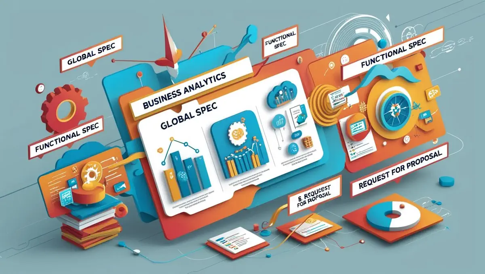

# **İş Analitiği Dokümantasyonları**

- [Güncel PDF'i İndir](https://www.vebende.com.tr/pdfs/is-analitigi.pdf)
- [En güncel eğitimlerimiz için www.vebende.com.tr ziyaret edin](https://www.vebende.com.tr/is-analitigi)
  
## **Eğitim Süresi**

- **Süre:** 3 gün
- **Ders Süresi:** 50 dakika
- **Eğitim Saati:** 10:00 - 17:00

- > Eğitim formatında eğitimler 50 dakika + 10 dakika moladır. 12:00-13:00 saatleri arasında 1 saat yemek arasındaki verilir. Günde toplam 6 saat eğitim verilir. 3 günlük formatta 18 saat eğitim verilmektedir.

- > Eğitimler uzaktan eğitim formatında tasarlanmıştır. Her eğitim için teams linkleri gönderilir. Katılımcılar bu linklere girerek eğitimlere katılırlar. Ayrıca farklı remote çalışma araçları da eğitmen tarafından tüm katılımlara sunulur. Katılımcılar bu araçları kullanarak eğitimlere katılırlar.

- > Eğitim içeriğinde github ve codespace kullanılır. Katılımcılar bu platformlar üzerinden örnek projeler oluşturur ve eğitmenle birlikte eğitimlerde sorulan sorulara ve taleplere uygun iceriğe cevap verir. Katılımcılar bu araçlarla eğitimlerde sorulan sorulara ve taleplere uygun iceriğe cevap verir.

- > Eğitim yapay zeka destekli kendi kendine öğrenme formasyonu ile tasarlanmıştır. Katılımcılar eğitim boyunca kendi kendine öğrenme formasyonu ile eğitimlere katılırlar. Bu eğitim formatı sayesinde tüm katılımcılar gelecek tüm yaşamlarında kendilerini güncellemeye devam edebilecekler ve her türlü sorunun karşısında çözüm bulabilecekleri yeteneklere sahip olacaklardır.  

## **İş Analizinin Temelleri Eğitimi**  

İş analizi, organizasyonların iş süreçlerini anlamaları, geliştirmeleri ve stratejik hedeflerine ulaşmaları için kritik bir araçtır. Bu eğitim, katılımcılara IIBA® (International Institute of Business Analysis) standartlarına uygun iş analisti yetkinlikleri kazandırmayı amaçlar. İş analizi, organizasyonların verimlilik artışı, paydaş katılımı, risk yönetimi ve teknolojik dönüşüm süreçlerinde daha etkili olmasını sağlar. Bu eğitim, katılımcılara iş analizi süreçlerini derinlemesine inceleyerek organizasyonlarını daha verimli hale getirme fırsatı sunar.

### **Neden İş Analizi?**  

İş analizi, organizasyonların ihtiyaçlarını doğru bir şekilde belirlemeleri ve stratejik hedeflerine ulaşmaları için vazgeçilmezdir. İş analizi, organizasyonel verimliliği artırmaya ve hedeflere ulaşmaya yönelik güçlü bir araçtır. İşte iş analizinin organizasyonlar için neden bu kadar önemli olduğuna dair bazı nedenler:

- **İş Gereksinimlerinin Tanımlanması:** İş analizi, organizasyonların ihtiyaçlarını ve hedeflerini net bir şekilde belirlemelerine yardımcı olur. Gereksinimlerin netleştirilmesi, projelerin başarısı için temel oluşturur.
  
- **Verimlilik Artışı:** Mevcut iş süreçlerinin incelenmesi, süreçlerin optimize edilmesi ve gereksiz maliyetlerin ortadan kaldırılması, organizasyonların daha verimli çalışmasını sağlar.
  
- **Paydaş Katılımı:** İş analizi, tüm paydaşların görüşlerinin alınmasını sağlar. Bu sayede projenin tüm aşamalarında paydaşların ihtiyaçları dikkate alınarak çözümler geliştirilir.

- **Risk Yönetimi:** Potansiyel riskler erken tespit edilerek, organizasyonlar riskleri yönetebilir ve olası sorunlara karşı önceden çözüm üretebilirler.

- **Teknolojik Dönüşüm:** İş analizi, organizasyonların teknolojik dönüşüm süreçlerini daha verimli yönetmelerine yardımcı olur. İş analistleri, organizasyonların dijitalleşme yolculuğunda doğru çözümleri belirlemekte önemli bir rol oynar.

### **İş Analizi ile İhtiyaçları Anlayın**  

Günümüzde işletmelerin başarı için doğru analizler yapmaları gerekmektedir. İş analizi, gereksinimlerin kapsamlı bir şekilde değerlendirilmesini sağlayarak etkili stratejiler geliştirilmesine olanak tanır. Bu süreç, organizasyonel verimliliği artırarak hedeflere ulaşmayı kolaylaştırır.

#### **İş Analizinin Temel Faydaları:**

- **Gereksinimlerin Netleştirilmesi:** İş analizi, tüm paydaşların ihtiyaçlarının belirlenmesini sağlayarak, projelerin daha başarılı bir şekilde tamamlanmasını sağlar.
  
- **Verimliliğin Artırılması:** Süreçlerin değerlendirilmesi, kaynakların etkin kullanımını sağlar ve iş süreçlerinde tasarruf sağlar.

- **Risklerin Yönetimi:** İş analizi, projelerin sürdürülebilirliğini artırmak için risklerin azaltılmasına yardımcı olur.

- **Teknolojik Uyum:** Organizasyonların dijital dönüşüm süreçlerine uyum sağlamasına ve modern iş çözümleri geliştirmesine olanak tanır.

- **Stratejik Planlama:** Analiz sonuçları, organizasyonel hedeflerin belirlenmesi ve stratejik adımların atılması için sağlam bir temel oluşturur.

### **Eğitim Hedefi**  

Bu eğitim, katılımcılara iş analizi kavramlarını, süreçlerini ve metodolojilerini etkili bir şekilde öğretmeyi amaçlamaktadır. Katılımcılar, iş gereksinimlerini analiz etme, süreçleri iyileştirme ve stratejik hedeflere ulaşmak için gerekli bilgi ve becerilere sahip olacaklardır.

Eğitim sonunda katılımcılar:  

- **İş analizi sürecini anlama ve uygulama becerisi kazanacak**,  
- **İhtiyaç analizi yapmayı**,  
- **Süreç geliştirme ve iyileştirme tekniklerini uygulamayı**,  
- **Paydaş yönetimi ve risk analizi yapmayı**,  
- **Teknolojik dönüşüm süreçlerini yönlendirmeyi** öğreneceklerdir.  

## **Eğitim İçeriği**

### **İş Analizi Temelleri ve Uygulamaları**

#### **1. İş Analizinin Tanımı ve Önemi**

- **İş Analizi Nedir?**  
  İş analizi, organizasyonların iş süreçlerini ve gereksinimlerini anlamak, optimize etmek ve stratejik hedeflere ulaşmak için kullanılan bir tekniktir.
- **İş Analizinin Stratejik Rolü:**  
  İş analizinin organizasyonlardaki önemini, süreçlerin verimli hale getirilmesi ve karar alma süreçlerine katkı sağlama yönünden ele alacağız.

#### **2. İş Analistinin Rolü ve Sorumlulukları**

- **İş Analistinin Temel Görevleri:**  
  İş analistinin organizasyon içinde oynadığı rol, süreçlerin doğru bir şekilde analiz edilmesi ve gereksinimlerin net bir şekilde belirlenmesi.
- **İş Analistinin Organizasyon İçindeki Yeri:**  
  İş analistinin proje takımlarındaki işlevi ve paydaşlarla etkileşimi.

#### **3. İş Analistinin Yetkinlikleri**

- **Temel Yetkinlikler:**  
  Analitik düşünme, problem çözme, etkili iletişim, müzakere becerileri ve ekip çalışması.
- **Teknik Yetkinlikler:**  
  Modelleme teknikleri, süreç analizi, gereksinim yönetimi ve yazılım analizi.

#### **4. İş Analizi Yaklaşımları ve Yazılım Süreçleri**

- **İş Analizi Yaklaşımları:**  
  Planlı (Waterfall), çevik (Agile) ve hibrit iş analizi yaklaşımları arasındaki farklar ve hangi durumda hangi yaklaşımın kullanılacağı.
- **Yazılım Geliştirme Yaşam Döngüsü (SDLC):**  
  İş analizi ve SDLC’nin kesişimi, analizlerin yazılım geliştirme süreçlerine nasıl entegre edildiği.

#### **5. Paydaş Analizi ve Yönetimi**

- **Paydaş Belirleme:**  
  Proje paydaşlarının tanımlanması, önceliklendirilmesi ve analiz edilmesi.
- **Paydaş İletişimi ve Yönetimi:**  
  Etkili iletişim stratejilerinin oluşturulması ve paydaş beklentilerinin yönetilmesi.

#### **6. Analizin Planlanması ve Yönetimi**

- **İş Analizi Planlaması:**  
  İş analizi süreçlerinin önceden planlanması, zaman yönetimi ve kaynak tahsisi.
- **Risk Yönetimi:**  
  Potansiyel risklerin belirlenmesi, izlenmesi ve etkili bir şekilde yönetilmesi.

#### **7. İş İhtiyacı ve Kapsam Analizi**

- **İş İhtiyaçlarının Belirlenmesi:**  
  Organizasyonel ihtiyaçların tespit edilmesi, önceliklendirilmesi ve iş hedefleriyle uyumlu hale getirilmesi.
- **Kapsam Tanımlama:**  
  Proje kapsamının belirlenmesi, sınırların çizilmesi ve gereksinimlerin kapsam dahilinde toplanması.

#### **8. İş Kurallarının ve Gereksinimlerin Çözümlenmesi**

- **İş Kurallarının Analizi:**  
  Organizasyonel politikalar, prosedürler ve yönetmeliklerin analiz edilmesi.
- **Gereksinim Çözümlenmesi:**  
  Fonksiyonel ve fonksiyonel olmayan gereksinimlerin detaylı bir şekilde çözümlenmesi ve doğru dokümantasyon.

#### **9. İş Analizi Dokümantasyonu**

- **Dokümantasyon Standartları:**  
  İş analizi belgelerinin oluşturulması, düzenlenmesi ve uluslararası standartlara uygunluğu.
- **Doküman Yönetimi:**  
  Versiyon kontrolü, doküman güncellemeleri ve takip süreçleri.

#### **10. Gereksinimlerin Analizi ve Modelleme**

- **Gereksinim Analizi:**  
  Gereksinimlerin derinlemesine analizi, önceliklendirilmesi ve analiz sonrası raporlama.
- **Modelleme Teknikleri:**  
  Use case diyagramları, süreç akışları, veri akış diyagramları ve diğer modelleme araçları.

#### **11. Kapsam Değişikliği ve Yönetimi**

- **Değişiklik Yönetimi:**  
  Proje gereksinimlerinde veya kapsamda meydana gelen değişikliklerin değerlendirilmesi ve yönetilmesi.
- **Etkililik Analizi:**  
  Değişikliklerin proje üzerindeki etkilerinin analiz edilmesi ve uygun çözüm yolları geliştirilmesi.

#### **12. Analizin Doğrulanması ve Onaylanması**

- **Doğrulama Teknikleri:**  
  Gereksinimlerin doğruluğunun test edilmesi, paydaşlarla yapılan toplantılar ve onay süreçleri.
- **Onay Süreci:**  
  Paydaşlardan gereksinimlerin onaylarının alınması ve gereksinimlerin doğruluğunun belgelendirilmesi.

## **Eğitim Yöntemi** (İş Analizi)

- **Teorik Bilgi:** İş analizi kavramları, süreçleri ve kullanılan teknikler detaylı bir şekilde anlatılacaktır.
- **Uygulamalı Örnekler:** Gerçek dünya iş analizi senaryoları üzerinden analiz ve çözümleme yöntemleri uygulanacaktır.
- **Etkileşimli Tartışmalar:** Katılımcılar, iş analizi süreçleri ve gereksinim toplama yöntemleri hakkında soru-cevap şeklinde etkileşimde bulunacaklardır.
- **Proje Tabanlı Öğrenme:** Eğitimin sonunda, katılımcılar kendi iş analizi projelerini oluşturacak ve uygulamalı olarak iş analizini gerçekleştireceklerdir.

## **Hedef Kitle**

1. **İş Analistleri:** İş süreçlerini daha iyi anlayarak ve gereksinimleri doğru bir şekilde belirleyerek organizasyonlarına değer katmak isteyen analistler.
2. **Yazılım Geliştiriciler:** Yazılım projelerinde iş analizi süreçlerine daha iyi hakim olmak isteyen yazılımcılar.
3. **Proje Yöneticileri:** Proje kapsamını, gereksinimlerini ve paydaşları yönetme konusunda bilgi sahibi olmak isteyen yöneticiler.
4. **Ürün Yöneticileri:** Ürünlerin gereksinimlerini toplamak ve müşteri beklentilerini doğru bir şekilde analiz etmek isteyen yöneticiler.
5. **İş Geliştirme Uzmanları:** İş süreçlerinin verimliliğini artırmak ve optimize etmek isteyen profesyoneller.
6. **Ekip Liderleri:** İş analizi projelerinin takımlarını yönetmek ve süreçleri optimize etmek isteyen liderler.
7. **Danışmanlar:** İş analizi süreçlerine dair bilgi sahibi olup, bu alanda danışmanlık hizmeti sunmak isteyen profesyoneller.
8. **İnsan Kaynakları Profesyonelleri:** Organizasyonel gereksinimleri doğru bir şekilde analiz etmek isteyen HR profesyonelleri.

## **Katılımcılardan Beklentilerimiz** (İş Analizi)

- Katılımcıların organizasyonel süreçler ve iş gereksinimlerinin analizine ilgi duymaları.
- İş analizi süreçlerini öğrenmeye ve uygulamaya açık olmaları.
- Etkileşimli çalışmalara aktif katılım, soru sorma ve takım çalışmasına istekli olmaları.
- Temel iş analizi kavramlarına (iş kuralları, gereksinim toplama, paydaş analizi) ilgi duymaları.

[Eğitim Materyalleri (Eğitmenlere Özel)](https://github.com/TuncerKARAARSLAN-VB/training-kit-is-analitigi)
