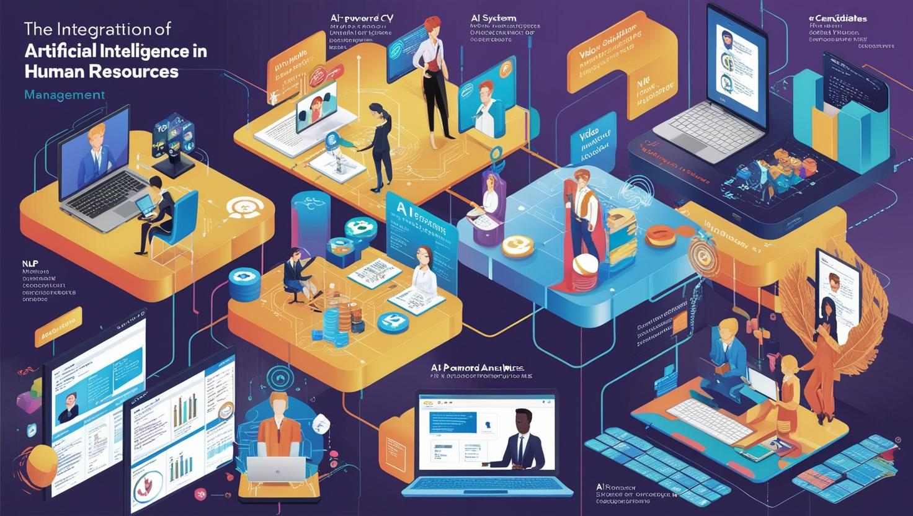
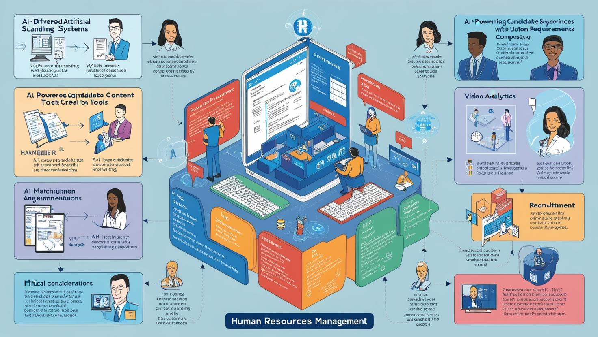

# **İş Gücü Yönetiminde Yapay Zeka ve İnsan Kaynakları Çözümleri**

[Download PDF Version](./hr.pdf)

## **Eğitim Süresi**

- **Format 1**
  - **5 Gün**
  - **Ders Süresi:** 50 dakika
  - **Eğitim Saati:** 10:00 - 17:00

- **Format 2**
  - **12 Gün**
  - **Ders Süresi:** 50 dakika
  - **Eğitim Saati:** 10:00 - 17:00

- > Her iki eğitim formatında eğitimler 50 dakika + 10 dakika moladır. 12:00-13:00 saatleri arasında 1 saat yemek arasındaki verilir. Günde toplam 6 saat eğitim verilir. 5 günlük formatta 30 saat eğitim, 12 günlük formatta toplam 72 saat eğitim verilmektedir. 12 saatlik eğitmde katılımcılar kod yazar ve eğitmenle birlikte sorulan sorulara ve taleplere uygun içerikler ve örnekler çalışılır.

- > Eğitimler uzaktan eğitim formatında tasarlanmıştır. Her eğitim için teams linkleri gönderilir. Katılımcılar bu linklere girerek eğitimlere katılırlar. Ayrıca farklı remote çalışma araçları da eğitmen tarafından tüm katılımlara sunulur. Katılımcılar bu araçları kullanarak eğitimlere katılırlar. 

- > Eğitim içeriğinde github ve codespace kullanılır. Katılımcılar bu platformlar üzerinden örnek projeler oluşturur ve eğitmenle birlikte eğitimlerde sorulan sorulara ve taleplere uygun iceriğe cevap verir. Katılımcılar bu araçlarla eğitimlerde sorulan sorulara ve taleplere uygun iceriğe cevap verir.

- > Eğitim yapay zeka destekli kendi kendine öğrenme formasyonu ile tasarlanmıştır. Katılımcılar eğitim boyunca kendi kendine öğrenme formasyonu ile eğitimlere katılırlar. Bu eğitim formatı sayesinde tüm katılımcılar gelecek tüm yaşamlarında kendilerini güncellemeye devam edebilecekler ve her türlü sorunun karşısında çözüm bulabilecekleri yeteneklere sahip olacaklardır.

## **Yapay Zeka ile İnsan Kaynakları Yönetimi**

Günümüz iş dünyası hızla değişirken, İnsan Kaynakları (İK) birimleri için yapay zeka (AI) vazgeçilmez bir araç haline geliyor. **"Yapay Zeka ile İnsan Kaynakları Yönetimi"** eğitim programımız, İK süreçlerinde verimliliği artırmak, doğru işe alım kararları vermek ve çalışanların gelişimini desteklemek için AI’ın gücünü nasıl kullanabileceğinizi anlatılıyor.

- **Temel Kavramlardan İleri Uygulamalara**  
  Yapay zekanın tarihi, makine öğrenimi ve derin öğrenme gibi alt dallarıyla tanışarak, İK süreçlerindeki rolünü keşfedin.  

- **İşe Alım Süreçlerinde Dönüşüm**  
  NLP tabanlı CV tarama, pozisyon analizleri, video analitiği ve AI destekli işe alım platformlarıyla doğru yetenekleri bulmanın yollarını öğrenin.  

- **Çalışan Performansını ve Yetkinliklerini Optimize Edin**  
  Performans analitiği, kişiselleştirilmiş eğitim planları ve görev rotasyonu gibi stratejilerle çalışanlarınızın potansiyelini maksimuma çıkarın.  

- **Etik ve Veri Güvenliği**  
  Yapay zeka kullanımında şeffaflık, algoritmik önyargılar ve GDPR gibi yasal çerçevelere uygun çözümler geliştirin.  

- **Uygulamalı Proje ve Simülasyonlar**  
  Gerçek dünya senaryoları üzerinde çalışarak, yapay zekayı işe alım, değerlendirme ve çalışan bağlılığı süreçlerine entegre edin.

## **Eğitim İçeriği**

### **1. Giriş ve Temel Kavramlar**

- **Yapay Zeka Nedir?**  
  - Tarihi gelişimi, alt dalları (Makine Öğrenimi, Derin Öğrenme).  
  - İnsan Kaynaklarında yapay zekanın yeri ve önemi.  
- **İnsan Kaynakları Yönetimi (HRM) Nedir?**  
  - İşe alım süreçleri, yetenek yönetimi, çalışan memnuniyeti.  

---

### **2. İşe Alım Süreçlerinde Yapay Zeka**

- **Otomatik CV Tarama Sistemleri**  
  - NLP (Doğal Dil İşleme) temelli sistemler.  
  - Önyargıyı azaltmak için kullanılan algoritmalar.  
- **Pozisyon Tanımına Uygun İçerik Üretimi**  
  - İş tanımları için AI tabanlı içerik oluşturma araçları.  
  - Pozisyon gerekliliklerini analiz eden ve bunlara uygun iş ilanı tasarlayan yapay zeka sistemleri.  
- **Deneyimlerin Ölçümlenmesi ve Uygunluk Analizi**  
  - Adayların profesyonel deneyimlerinin pozisyon gereklilikleri ile eşleştirilmesi.  
  - Yetkinlik haritaları oluşturan AI araçları ve metodolojileri.  
- **İşe Alımda Video Analitiği ve Yapay Zeka**  
  - Aday değerlendirme için yüz ifadeleri, ses tonu ve konuşma analizi.  
  - Etik sorunlar ve çözümler.  
- **Yapay Zeka Destekli İşe Alım Platformları**  
  - LinkedIn Talent Insights, HireVue gibi araçlar.  
  - Kullanım örnekleri ve sonuçları.  
- **Deneyim Tabanlı Pozisyon Değerlendirmesi**  
  - AI modelleri ile adayın geçmiş deneyimlerini analiz etme ve başarı potansiyelini öngörme.  
  - Sektör ve pozisyon bazlı uygunluk skorlarının hesaplanması.  
- **Pozisyonların Detaylı Tanımlanması**  
  - Şirketin mevcut kadrolarındaki rollerin yetkinlik, görev ve sorumluluk bazında detaylı şekilde modellenmesi.  
  - Yapay zeka ile organizasyonel yapı analizi ve eksiklerin tespit edilmesi.  
- **Yetkinlik ve Pozisyonların Sürekli Güncellenmesi**  
  - AI tabanlı analizlerle iş dünyasındaki değişimlere uygun yeni yetkinlik gerekliliklerinin belirlenmesi.  
  - Şirket içi eğitim programlarının sürekli güncellenerek pozisyonlara entegre edilmesi.  
- **Çalışan Eksikliklerinin Giderilmesi**  
  - Çalışan yetkinlik boşluklarının belirlenmesi için performans ve yetkinlik puantaj sistemleri.  
  - Eksikliklere yönelik kişiselleştirilmiş eğitim planlarının yapay zeka yardımıyla tasarlanması ve uygulanması.  

---

### **3. Yetenek Yönetimi ve Performans Değerlendirme**

- **Çalışan Veri Analitiği ve Tahmine Dayalı Modeller**  
  - Performans öngörüleri ve risk analizleri.  
  - Çalışan memnuniyetinin artırılması için öneri sistemleri.  
- **360 Derece Geri Bildirim ve Yapay Zeka**  
  - Geri bildirim süreçlerini optimize eden AI araçları.  
  - Anonimleştirme ve güvenlik ilkeleri.  
- **Eğitim ve Gelişim Planlamasında AI**  
  - Çalışanlara özel öğrenme yollarının oluşturulması.  
  - Gamification (oyunlaştırma) ve mikro-öğrenme yöntemleri.  

---

### **4. Çalışan Verimliliğini Artırmada Yapay Zeka**

- **Zaman Yönetimi ve AI Tabanlı Çözümler**  
  - Görev yönetimi ve zaman çizelgesi optimizasyon araçları.  
- **Çalışan Duygu Analizi**  
  - Çalışanların anlık ruh halini belirleyen sistemler.  
  - Uzaktan çalışmada motivasyon ve bağlılık artırma stratejileri.  
- **Sağlık ve Refah Yönetimi**  
  - Çalışan sağlığı için veri analitiği (ör. iş-yaşam dengesi).  
  - Wearable cihazlar ve sağlık takibi entegrasyonu.  

#### **4.1. Pozisyon ve Unvan Gereksinimlerinin Değerlendirilmesi**  

- **Yeni Unvanlar ve Gereksinimler**  
  - Organizasyon içi analizlerle pozisyonların değişen ihtiyaçlarına uygun yeni unvan ve sorumluluk alanlarının oluşturulması.  
  - Eksiklerin liste halinde çıkarılarak, bu açıkların kapatılmasına yönelik şirket içi görev tanımları oluşturulması.  

- **Görev Atama ve Yeniden Planlama**  
  - AI ile çalışanların güçlü yönlerine uygun şekilde görev atama süreçlerinin optimize edilmesi.  
  - Yeni projelerde çalışanların katılımını artıracak sistemler geliştirilmesi.  

#### **4.2. Performans ve Yükselme Analizleri**  

- **Performans Analitiği**  
  - Çalışan performansının puantaj ve diğer değerlendirme metrikleriyle sürekli izlenmesi.  
  - Performans analitiği sonuçlarına göre çalışanlara kişisel gelişim önerileri sunulması.  

- **Yükselme ve Kariyer Yönetimi**  
  - Yükselme kriterlerinin yapay zeka ile analiz edilmesi ve adil bir sistem oluşturulması.  
  - Çalışanların yükselme potansiyelini ölçmek için kariyer haritalarının çıkarılması.  

#### **4.3. Şirket İçi Eğitim ve Görev Rotasyonu**  

- **AI Destekli Eğitim Sistemleri**  
  - Eğitim ihtiyaçlarının analiz edilerek çalışanlara uygun modüllerin sunulması.  
  - Eğitim başarılarının performans değerlendirmeleriyle ilişkilendirilmesi.  

- **Görev Rotasyonu ve Deneyim Çeşitlendirme**  
  - Çalışanların farklı görevlerde deneyim kazanmasını sağlayacak rotasyon planlarının AI ile optimize edilmesi.  

---

### **5. Etik ve Yasal Çerçeve**

- **AI Etiği ve İnsan Kaynaklarında Uygulamalar**  
  - Şeffaflık ve algoritmik önyargıların yönetimi.  
- **Veri Güvenliği ve GDPR Uyumu**  
  - Çalışan verilerinin korunması.  
  - Yasal gerekliliklerin uygulanması.  

---

### **6. Yapay Zeka Araçları ve Platformları**

- **İnsan Kaynakları İçin Popüler AI Araçları**  
  - Workday, Oracle HCM Cloud, SAP SuccessFactors.  
  - Özellikleri, kullanımları ve karşılaştırmaları.  
- **Makine Öğrenimi Modellerinin HR Süreçlerine Entegrasyonu**  
  - Python ve R ile basit modeller geliştirme.  
  - Önceden eğitilmiş modellerin kullanımı.  

---

### **7. Uygulamalı Proje ve Simülasyonlar**

- **İşe Alım Simülasyonu**  
  - AI destekli işe alım süreçlerinin oluşturulması ve değerlendirilmesi.  
- **Performans Değerlendirme Sistemi Tasarımı**  
  - Tahmine dayalı analitik modellerle çalışan değerlendirme.  
- **Çalışan Bağlılığı İçin Yapay Zeka Çözümleri**  
  - Memnuniyet ve bağlılık ölçümü için chatbot geliştirme.  

---

### **8. İleri Konular**

- **Dijital İkizler ve İş Gücü Simülasyonu**  
  - İş gücü senaryolarının AI ile modellenmesi.  
- **Sesli ve Görüntülü Veri İşleme**  
  - AI ile çalışan anketlerinin analizi.  
- **Geleceğin İK Trendleri**  
  - Hyper-personalization (hiper kişiselleştirme).  
  - Metaverse ve sanal gerçeklik iş gücü yönetimi.  

---

### **9. Sertifikasyon ve Sürekli Eğitim**

- **AI ve İnsan Kaynakları Sertifikasyon Programları**  
  - SHRM AI in HR, Coursera, Udemy gibi platformlar.  
- **Networking ve Güncel Trendler**  
  - Global İnsan Kaynakları Zirvesi gibi etkinliklere katılım.  

Bu liste, hem teorik bilgi hem de pratik beceriler kazandıracak şekilde tasarlanmıştır. Her modül, gerçek dünya uygulamalarına odaklanarak kullanıcıların iş süreçlerine hızlıca adapte olmasına yardımcı olur.

## **Eğitim Yöntemi**

**1. Karma Öğrenme Modeli (Blended Learning):**  
Eğitim süreci, hem çevrimiçi hem de yüz yüze yöntemleri birleştirerek katılımcılara esneklik sağlar. Bu model sayesinde teorik bilgileri online olarak edinirken, uygulamalı oturumlarla gerçek dünya deneyimi kazanırsınız.

**2. Modüler Yaklaşım:**  
Eğitim, birbirinden bağımsız ancak birbiriyle bağlantılı modüllerden oluşur. Katılımcılar, ihtiyaçlarına göre belirli bir modüle odaklanabilir ya da tüm programı tamamlayabilir. 

**3. Uygulamalı Çalışmalar ve Simülasyonlar:**  

- **Case Study (Vaka Analizi):** Gerçek iş senaryolarını analiz ederek yapay zeka çözümlerini nasıl uygulayacağınızı öğrenirsiniz.  
- **Proje Geliştirme:** İşe alım süreçlerinde AI destekli araçlar geliştirme, çalışan memnuniyeti analizleri yapma ve performans yönetimi için tahmine dayalı modeller oluşturma.  
- **Simülasyonlar:** AI destekli işe alım, çalışan değerlendirme ve organizasyonel yapı planlamasını simüle ederek, edindiğiniz bilgileri pratikte test etme imkanı.  

**4. İnteraktif Oturumlar ve Grup Çalışmaları:**  
Canlı oturumlar ve grup projeleriyle katılımcılar arasında fikir alışverişi sağlanır. Sorularınızı birebir eğitmenlere yöneltebilir ve diğer katılımcılarla iş birliği yapabilirsiniz.

**5. Teknolojik Araçlarla Destek:**  

- **Eğitim Portalı:** Tüm materyallere erişim, video dersler, quizler ve ödevler.  
- **AI Araçlarının Kullanımı:** Python/R ile küçük projeler, LinkedIn Talent Insights gibi araçların tanıtımı ve kullanım kılavuzları.  

**6. Mentor Desteği ve Geri Bildirim:**  
Her modül sonunda, eğitmenler birebir geri bildirim sunarak gelişim alanlarınıza odaklanmanıza yardımcı olur. Uygulamalı projeler sırasında mentor desteği alabilirsiniz.

## **Hedef Kitle**

**1. İnsan Kaynakları Profesyonelleri**

- **İK Yöneticileri ve Uzmanları:** İşe alım, yetenek yönetimi, performans değerlendirme ve çalışan memnuniyeti gibi alanlarda deneyim sahibi olan, AI teknolojilerini İK süreçlerine entegre etmek isteyen profesyoneller.
- **İK Departmanı Çalışanları:** Çalışanlar ve organizasyonel yapı yönetimi konularında bilgi sahibi olan, AI'nin İK süreçlerine nasıl katkı sağladığını öğrenmek isteyen kişiler.
- **İK Danışmanları:** İK süreçlerinin iyileştirilmesine yönelik çözüm geliştiren ve yapay zekadan nasıl faydalanabileceklerini keşfetmek isteyen danışmanlar.

**2. Teknoloji ve Yapay Zeka İlgisi Olan İK Profesyonelleri**

- **AI’ye İlgi Duyan İK Profesyonelleri:** Yapay zeka ve makine öğrenimi teknolojilerini İnsan Kaynakları süreçlerine entegre etmeyi hedefleyen İK profesyonelleri.
- **Veri Analizi ve İleri Teknolojiler Konusunda İlgisi Olan İK Uzmanları:** Veri analitiği ve tahmine dayalı modelleme gibi AI tabanlı araçlarla daha verimli süreçler oluşturmak isteyen İK uzmanları.

**3. İnsan Kaynakları Yöneticisi Adayları ve İK Liderleri**

- **Yönetici Adayları:** İnsan Kaynakları departmanlarında liderlik pozisyonlarına gelmeyi hedefleyen, stratejik İK uygulamaları ve AI entegrasyonu konularında bilgi edinmek isteyen kişiler.
- **Kariyerinde Yükselmek İsteyen İK Profesyonelleri:** İnsan Kaynakları yönetiminde AI tabanlı süreçleri kullanarak, daha verimli, veriye dayalı kararlar almayı amaçlayan yöneticiler ve lider adayları.

**4. Veri Bilimi ve AI Alanında Kariyer Yapmak İsteyen İK Profesyonelleri**

- **AI ve Veri Bilimi İle İlgilenen İK Profesyonelleri:** AI ve makine öğrenimi gibi ileri düzey teknolojilere ilgisi olan ve bu alanı İnsan Kaynakları süreçlerine entegre etmek isteyen profesyoneller.
- **Teknoloji Odaklı İK Çalışanları:** İK süreçlerinde daha verimli analizler ve tahminler yapabilmek için yapay zeka ve veri bilimi uygulamalarına yönelik bilgi edinmek isteyen İK profesyonelleri.

**5. İnsan Kaynakları Yazılım ve Teknoloji Ürünleri Geliştiren Profesyoneller**

- **Yazılım Geliştiriciler ve Teknoloji Ürün Yöneticileri:** İnsan Kaynakları alanındaki yazılım çözümleri ve AI tabanlı uygulamalar geliştirmek isteyen yazılımcılar ve teknoloji ürün yöneticileri.
- **HR Yazılım Çözümleri Geliştirenler:** İnsan Kaynakları yazılım ürünlerini geliştiren, AI teknolojilerini bu yazılımlara entegre etmek isteyen profesyoneller.

## **Katılımcılardan Beklediklerimiz**

**1. Katılım ve Etkileşim:**

- **Aktif Katılım:** Eğitim sürecine düzenli katılım ve derslerde aktif olma beklenmektedir. Her modülde öğrenilen konuları tartışarak, grup çalışmalarına dahil olmanız önemlidir.
- **Sorular ve Geri Bildirim:** Katılımcılar, eğitmenlere ve diğer katılımcılara sorular sormaktan ve geri bildirimde bulunmaktan çekinmemelidir. Bu, öğrenme sürecini derinleştirir.

**2. İnisiyatif ve Kendi Kendine Öğrenme:**

- **Araştırma ve Keşif:** Eğitimde verilen teorik bilgilerin yanı sıra, katılımcıların konuya dair ek araştırmalar yapmaları, güncel gelişmeleri takip etmeleri ve kendi öğrenme süreçlerini aktif olarak yönetmeleri beklenir.
- **Özdisiplin:** Eğitim portalındaki materyalleri zamanında tamamlamak ve projeleri belirlenen sürede bitirmek önemlidir.

**3. Pratik Uygulamalar ve Proje Çalışmaları:**

- **Proje ve Simülasyonlar:** Katılımcıların, derslerde öğrendikleri bilgileri gerçek dünya senaryolarına uygulamaları beklenir. Bu, vaka analizleri, grup projeleri ve simülasyonlar gibi uygulamalı çalışmaları içerir.
- **Zaman Yönetimi:** Çalışmalar ve projeler üzerinde belirlenen sürelerde ilerlemek, sürecin etkin bir şekilde tamamlanmasını sağlar.

**4. Teknolojik Yeterlilik:**

- **Dijital Araçlar Kullanımı:** Eğitimde kullanılan yazılım ve araçları etkin bir şekilde kullanabilmek için temel teknolojik bilgi gereklidir. Python, R, AI araçları gibi platformlarla çalışmaya açık olmak önemlidir.
- **İnternet Erişimi:** Çevrimiçi eğitim materyallerine erişim sağlamak için stabil bir internet bağlantısına sahip olmanız gerekmektedir.

**5. İşbirliği ve Takım Çalışması:**

- **Grup Çalışmalarına Katılım:** Katılımcıların, grup çalışmalarında işbirliği yaparak kolektif öğrenme süreçlerine katkı sağlaması beklenir. Birlikte çalışarak farklı bakış açıları geliştirmek, öğrenmeyi güçlendirir.
- **Ekip İçi İletişim:** Çalışanlar arasında etkin iletişim kurmak, proje teslim sürelerine uyum sağlamak ve grup üyeleriyle uyum içinde çalışmak kritik önem taşır.

**6. Açıklık ve Gelişim Odaklılık:**

- **Yeni Fikirler ve Yöntemlere Açıklık:** Eğitim sürecinde, katılımcıların yeni fikir ve yöntemlere açık olmaları, yenilikçi çözümler geliştirebilmeleri için gereklidir.
- **Gelişime Yönelik Tutum:** Süreç boyunca kendinizi geliştirmek ve yeni beceriler kazanmak için aktif bir tutum sergilemek önemlidir.

[Eğitim Materyalleri (Eğitmenlere Özel)](https://github.com/TuncerKARAARSLAN-VB/training-kit-yapay-zeka-ve-insan-kaynaklari-cozumleri)
