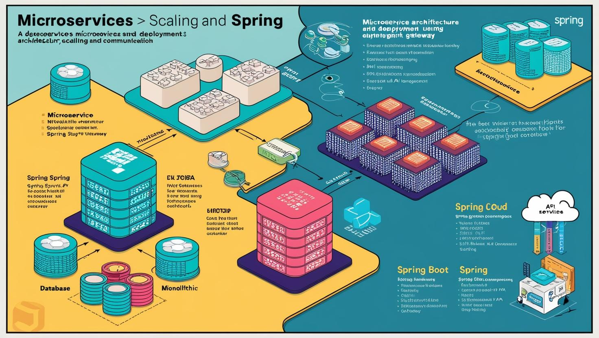
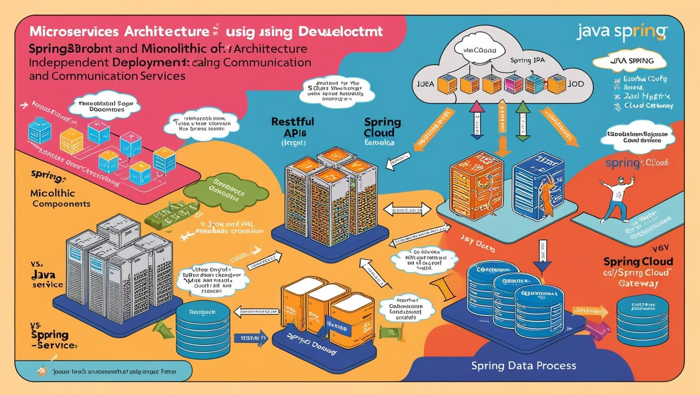

# **Java Spring ile Microservis Mimarisi Geliştirme ve Yayınlama (Kubernetes, Docker, OpenShift)**

[Download PDF Version](./javaspring.pdf)

## **Eğitim Süresi**

- **Format 1**
  - **5 Gün**
  - **Ders Süresi:** 50 dakika
  - **Eğitim Saati:** 10:00 - 17:00

- **Format 2**
  - **12 Gün**
  - **Ders Süresi:** 50 dakika
  - **Eğitim Saati:** 10:00 - 17:00

- > Her iki eğitim formatında eğitimler 50 dakika + 10 dakika moladır. 12:00-13:00 saatleri arasında 1 saat yemek arasındaki verilir. Günde toplam 6 saat eğitim verilir. 5 günlük formatta 30 saat eğitim, 12 günlük formatta toplam 72 saat eğitim verilmektedir. 12 saatlik eğitmde katılımcılar kod yazar ve eğitmenle birlikte sorulan sorulara ve taleplere uygun içerikler ve örnekler çalışılır.

- > Eğitimler uzaktan eğitim formatında tasarlanmıştır. Her eğitim için teams linkleri gönderilir. Katılımcılar bu linklere girerek eğitimlere katılırlar. Ayrıca farklı remote çalışma araçları da eğitmen tarafından tüm katılımlara sunulur. Katılımcılar bu araçları kullanarak eğitimlere katılırlar. 

- > Eğitim içeriğinde github ve codespace kullanılır. Katılımcılar bu platformlar üzerinden örnek projeler oluşturur ve eğitmenle birlikte eğitimlerde sorulan sorulara ve taleplere uygun iceriğe cevap verir. Katılımcılar bu araçlarla eğitimlerde sorulan sorulara ve taleplere uygun iceriğe cevap verir.

- > Eğitim yapay zeka destekli kendi kendine öğrenme formasyonu ile tasarlanmıştır. Katılımcılar eğitim boyunca kendi kendine öğrenme formasyonu ile eğitimlere katılırlar. Bu eğitim formatı sayesinde tüm katılımcılar gelecek tüm yaşamlarında kendilerini güncellemeye devam edebilecekler ve her türlü sorunun karşısında çözüm bulabilecekleri yeteneklere sahip olacaklardır.

## **Java Spring ile Microservis Mimarisi Geliştirme**

Modern yazılım geliştirme dünyasında hızla popülerleşen **microservis mimarisi**, işletmelerin uygulamalarını daha hızlı, esnek ve ölçeklenebilir hale getirmelerine olanak tanıyor. Bu eğitim ile, **microservislerin temellerinden**, **Java Spring** ile nasıl etkili uygulamalar geliştireceğinize kadar her şeyi öğrenecek ve teknolojik becerilerinizi bir üst seviyeye taşıyacaksınız.

**Geleceğin Yazılım Geliştiricileri İçin Vazgeçilmez Beceriler**
Microservis mimarisi, monolitik yapıların ötesine geçerek, her bir fonksiyonel alanı bağımsız servisler olarak yapılandırmanıza olanak sağlar. Bu eğitimde, Java Spring ile bu yapıları kurmayı öğrenirken, aynı zamanda **Docker**, **Kubernetes**, **OpenShift** gibi güncel araçları kullanarak uygulamalarınızı nasıl verimli şekilde yönetebileceğinizi keşfedeceksiniz.

- **Microservis Mimarisi**: Bağımsız servislerin avantajları ve yönetimi
- **Java Spring**: Spring Boot ile RESTful API’ler ve microservis uygulamaları
- **Docker & Kubernetes**: Uygulamalarınızı nasıl konteynerleştirip, orkestrasyon yapabileceğinizi
- **OpenShift & DevOps**: Kurumsal dağıtım süreçlerinde kullanabileceğiniz araçlar ve CI/CD entegrasyonu
- **Güvenlik ve İzleme**: Prometheus, Grafana, OAuth2 ve JWT ile uygulamanızın güvenliğini sağlama

**Sizde bu dünyada yerinizi almak için bu fırsatı kaçırmayın!**
Bu eğitim sayesinde, **microservis mimarisi** ve **DevOps süreçlerine** hakim olacak, daha verimli, güvenli ve ölçeklenebilir uygulamalar geliştirme becerisi kazanacaksınız. Hem bireysel kariyerinizde hem de iş yerinizde fark yaratacak bilgiye sahip olabilirsiniz. Şimdi adım atın ve geleceğe hazırlanın!

## **Eğitim İçeriği**

### **Bölüm 1: Microservis Mimarisi ve Java Spring ile Geliştirme**

1. **Microservis Mimarisi Nedir?**
   - **Microservislerin Tanımı ve Temel Kavramlar:**
     - Microservislerin genel yapısı ve monolitik yapılarla karşılaştırılması
     - Microservislerin avantajları ve zorlukları
   - **Microservislerin Genel Özellikleri:**
     - Bağımsız geliştirme, dağıtım ve ölçeklendirme
     - Dağıtık sistemler ve servisler arası iletişim
   - **Microservis Mimarisi için Temel Prensipler:**
     - Kendi veritabanına sahip olma
     - API-gateway kullanımı
     - Her servisin işlevsel odaklı olması

2. **Java Spring ile Microservis Geliştirme**
   - **Spring Framework Nedir?**
     - Spring Boot, Spring Cloud ve Spring MVC'nin özellikleri
     - Spring ile microservis geliştirme neden yaygın ve tercih edilen bir yöntemdir?
   - **Spring Boot ile Microservis Geliştirme:**
     - Spring Boot ile hızlı uygulama kurulumları
     - RESTful API’ler oluşturma (Controllers, RequestMapping)
     - JSON ve XML veri işleme
     - Spring Data JPA ile veritabanı bağlantıları ve CRUD işlemleri
   - **Spring Cloud ile Microservis Tabanlı Mimari:**
     - **Eureka:** Servis keşfi ve load balancing
     - **Spring Cloud Config:** Merkezi yapılandırma yönetimi
     - **Hystrix:** Servisler arası iletişimde hata yönetimi
     - **Zuul / Spring Cloud Gateway:** API Gateway kullanımı
   - **DevOps ve Spring Boot ile Microservis CI/CD Süreçleri:**
     - Jenkins veya GitLab CI kullanarak Spring Boot projelerinin derlenmesi ve dağıtılması
     - Unit testler ve entegrasyon testleri

3. **Microservisler Arası İletişim**
   - **REST API İletişimi:** 
     - HTTP metodları (GET, POST, PUT, DELETE) ve JSON formatı
     - Spring WebClient ve RestTemplate kullanımı
   - **Mesajlaşma ile İletişim:**
     - **RabbitMQ / Kafka:** Mesaj kuyruğu kullanarak servisler arası iletişim
     - **Spring AMQP ve Spring Kafka** entegrasyonu
   - **gRPC:** Hızlı ve düşük gecikmeli iletişim protokolü
   - **API Gateway ile Yönetim:** Servislerin dış dünyaya açılmasını sağlamak için API Gateway kullanımı

---

### **Bölüm 2: Docker ile Konteynerleştirme**

1. **Docker’a Giriş**
   - **Docker Nedir?**
     - Konteynerleştirme nedir ve microservisler ile ilişkisi
     - Docker’ın avantajları ve uygulama dağıtımındaki rolü
   - **Docker Bileşenleri:**
     - **Docker Image:** Uygulamanın çalıştırılabilir hali
     - **Docker Container:** Çalışan bir image
     - **Dockerfile:** İmajın nasıl oluşturulacağına dair talimatlar
   - **Docker Komutları ve Kullanımı:**
     - `docker build`, `docker run`, `docker ps`, `docker logs` komutları
     - **Docker Compose** ile çoklu servislerin yönetimi

2. **Spring Boot Uygulamasını Docker ile Konteynerleştirme**
   - **Dockerfile Yazma:**
     - Spring Boot için Dockerfile yazma
     - **Multi-stage Dockerfile** kullanarak imaj boyutunun azaltılması
   - **Spring Boot Microservislerini Docker Konteynerinde Çalıştırma:**
     - Java uygulamasını Docker konteynerinde çalıştırma
     - Veritabanı entegrasyonu (örneğin, PostgreSQL, MySQL) ve çevresel değişkenlerin kullanımı
   - **Docker Compose ile Çoklu Servislerin Yönetimi:**
     - Birden fazla microservisin çalıştırılması için `docker-compose.yml` dosyasının hazırlanması
     - Bağımlı servislerin (DB, MQ, vs.) birlikte çalıştırılması

---

### **Bölüm 3: Kubernetes ile Orkestrasyon**

1. **Kubernetes’e Giriş**
   - **Kubernetes Nedir?**
     - Kubernetes’in tanımı, amacı ve özellikleri
     - Kubernetes’in microservis mimarilerindeki rolü
     - Pod, Deployment, Service, ReplicaSet, ConfigMap gibi temel bileşenler
   - **Kubernetes Mimarisine Genel Bakış:**
     - Master ve Worker Node’lar
     - Pod’lar ve Deployment’lar
     - Service ve Ingress ile dış erişim sağlama
   - **Kubernetes CLI Aracı (kubectl) Kullanımı:**
     - `kubectl` komutlarıyla Kubernetes kaynaklarını yönetme

2. **Spring Boot Microservislerini Kubernetes Üzerinde Dağıtma**
   - **Kubernetes Deployment ve Pod Yapılandırması:**
     - Spring Boot uygulamalarının Kubernetes üzerinde çalıştırılması
     - Docker container’ları Kubernetes pod’larında çalıştırma
   - **Kubernetes Service ve Load Balancer Yapılandırması:**
     - Service kullanarak pod’lara erişim sağlama
     - External ve Internal servisler
   - **Kubernetes ile Auto-Scaling:**
     - Horizontal Pod Autoscaler kullanarak mikroservislerin otomatik olarak ölçeklenmesi

3. **Kubernetes ile DevOps Entegrasyonu**
   - **CI/CD Pipeline’ları Oluşturma:**
     - Jenkins, GitLab CI, veya Azure DevOps kullanarak Kubernetes üzerinde otomatik derleme ve dağıtım
     - Kubernetes ve Helm ile uygulama dağıtımı
   - **Helm ile Kubernetes Uygulama Dağıtımı:**
     - Helm Charts kullanarak Spring Boot microservislerinin Kubernetes ortamında dağıtılması

---

### **Bölüm 4: OpenShift ile Yayınlama ve Yönetim**

1. **OpenShift’e Giriş**
   - **OpenShift Nedir?**
     - Kubernetes’in kurumsal versiyonu olan OpenShift’in avantajları
     - OpenShift ekosistemi, GUI ve CLI araçları
   - **OpenShift ve Kubernetes Arasındaki Farklar:**
     - OpenShift ekosisteminin özellikleri ve Kubernetes üzerinde sağladığı avantajlar
     - OpenShift’in güvenlik, kullanıcı yönetimi ve izleme özellikleri
   - **OpenShift CLI (`oc`) ile Uygulama Yönetimi**

2. **Spring Boot Microservislerini OpenShift Üzerinde Dağıtma**
   - **OpenShift’te Proje Oluşturma ve Konfigürasyon:**
     - OpenShift üzerinde bir proje oluşturma ve kaynakları yönetme
   - **OpenShift Deployment ve Pod Yönetimi:**
     - Spring Boot uygulamalarını OpenShift üzerinde dağıtmak
   - **OpenShift Routes ve External Erişim:**
     - OpenShift Routes kullanarak dış erişim sağlama
   - **OpenShift ile Kaynak Yönetimi ve İzinler:**
     - OpenShift RBAC (Role-Based Access Control) kullanarak kaynaklara erişimi yönetme

3. **OpenShift ile CI/CD Yönetimi**
   - **OpenShift Pipelines (Tekton) ile DevOps Süreçleri:**
     - OpenShift Pipelines kullanarak Spring Boot microservislerinin otomatik dağıtım süreçleri
   - **OpenShift ve Jenkins ile Entegrasyon:**
     - Jenkins kullanarak OpenShift üzerinde microservis CI/CD pipeline’ları oluşturma

---

### **Bölüm 5: Microservis Yönetimi, İzleme ve Güvenlik**

1. **Microservis İzleme ve Performans Yönetimi**
   - **Prometheus ve Grafana ile İzleme:**
     - Kubernetes ve OpenShift üzerinde Prometheus ve Grafana ile izleme
   - **ELK Stack ile Log Yönetimi:**
     - Elasticsearch, Fluentd, Kibana kullanarak logları toplama ve analiz etme

2. **Microservis Güvenliği**
   - **OAuth2 ve JWT ile Kimlik Doğrulama ve Yetkilendirme:**
     - Spring Security kullanarak JWT token oluşturma ve doğrulama
   - **Mutual TLS ile Güvenli İletişim:**
     - Microservisler arası güvenli iletişim için mutual TLS yapılandırması
   - **API Gateway ve Rate Limiting:**
     - API Gateway kullanarak

## **Eğitim Yöntemi**

Bu eğitim, **teorik bilgileri uygulamalarla** pekiştirecek şekilde tasarlanmıştır. Katılımcılar, her bölümde öğrendikleri teknikleri gerçek dünya senaryolarında kullanarak, **microservis mimarisi** ve **DevOps süreçleri** hakkında derinlemesine bilgi sahibi olacaklardır.

- **Teorik Sunumlar ve Kavramlar**  
   Eğitim, **microservis mimarisi**, **Java Spring**, **Docker**, **Kubernetes** ve **OpenShift** gibi temel teknolojilerin teorik temelleriyle başlayacaktır. Her bölümde, konuya dair **temel kavramlar**, **avantajlar**, **kullanım senaryoları** ve **en iyi uygulama örnekleri** katılımcılara aktarılacaktır.

- **Canlı Demo ve Uygulamalı Çalışmalar**  
   Katılımcılar, her bir bölümde öğrendikleri bilgileri hemen **canlı demolar** ve **uygulamalı projeler** aracılığıyla pratiğe dökeceklerdir. Gerçek zamanlı kod yazma, **Spring Boot uygulamaları** geliştirme ve bunları **Docker konteynerlerine** entegre etme gibi aktivitelerle bilgilerini pekiştireceklerdir.

- **Soru-Cevap ve Etkileşimli Tartışmalar**  
   Her eğitim oturumunun sonunda, katılımcılar eğitmenlerle interaktif **soru-cevap seanslarına** katılabileceklerdir. Böylece, anlamadıkları veya daha fazla detaylı bilgi istedikleri konularda anında destek alabilirler. Bu sayede her katılımcının öğrenme süreci özelleştirilmiş olur.

- **Adım Adım Uygulama Geliştirme**  
   Eğitim boyunca katılımcılar, **adım adım bir uygulama geliştireceklerdir**. Bu uygulama, tüm microservis mimarisi prensiplerine dayalı olarak inşa edilecek ve her katılımcı kendi hızında, adım adım uygulama yaparak öğrenme sürecini yönlendirecektir. Eğitim sonunda, katılımcılar kendi projelerini oluşturabilecek ve bu projeleri dağıtma, test etme ve ölçeklendirme becerisine sahip olacaklardır.

- **Gerçek Zamanlı DevOps Süreçleri**  
   **CI/CD pipeline**'ları ile Spring Boot microservislerinin **otomatik dağıtımını** öğrenecek, **Jenkins** veya **GitLab CI** gibi araçlarla projenizin dağıtım süreçlerini otomatik hale getireceksiniz. Ayrıca, **Kubernetes** üzerinde **auto-scaling** ve **servis yönetimi** gibi işlemleri gerçek dünya örnekleriyle pratik yaparak öğrenmiş olacaksınız.

- **Proje Tabanlı Öğrenme ve İleri Seviye Senaryolar**  
   Eğitim sonunda, katılımcılar kendi projelerini oluşturmak ve bu projeleri **OpenShift** ortamında dağıtmak için gerekli tüm bilgiye sahip olacaklar. Ayrıca, **güvenlik** ve **izleme** gibi ileri düzey konularda derinlemesine bilgi edinerek, uygulamalarının verimli ve güvenli bir şekilde çalışmasını sağlayacaklardır.

**Eğitim Yöntemimiz ile Öğrenme Süreci:**

- **Hızlı ve Etkili:** Her aşama, öğrenmenin hızını ve verimliliğini artıracak şekilde tasarlanmıştır.
- **Uygulamalı ve Gerçek Dünya Odaklı:** Her katılımcı, öğrendiklerini hemen pratiğe dökerek gerçek projelerle deneyim kazanır.
- **Katılımcı Destekli:** Eğitim, katılımcıların ihtiyaçlarına göre şekillendirilir ve her adımda destek sağlanır.

Eğitim sonunda katılımcılar, yalnızca mikroservis mimarisi ile ilgili teorik bilgiye sahip olmakla kalmayacak, aynı zamanda modern **DevOps araçları** ve **konteynerleştirme teknolojileri** ile güçlü bir yazılım geliştirme ve dağıtım becerisi kazanacaklardır.

## **Hedef Kitle**

1. **Yazılım Geliştiricileri (Junior ve Orta Seviye)**  
   Mikroservis mimarisi, Docker, Kubernetes ve DevOps süreçlerini öğrenmek isteyen yazılım geliştiriciler için ideal bir fırsattır. Eğitim, katılımcıların mevcut yazılım bilgilerini mikroservis mimarisi gibi modern yazılım geliştirme paradigmasına taşımalarına olanak tanıyacaktır.

2. **Kıdemli Yazılım Geliştiriciler ve Mimarlar**  
   Mevcut yazılım sistemlerini mikroservis tabanlı mimarilere dönüştürmek isteyen kıdemli geliştiriciler ve yazılım mimarları, bu eğitim sayesinde modern mimariler hakkında derinlemesine bilgi edinebilirler. Ayrıca, **DevOps** süreçlerinin yazılım geliştirme döngüsüne entegrasyonu konusunda becerilerini geliştirebilirler.

3. **DevOps Mühendisleri ve Süreç Yöneticileri**  
   DevOps süreçlerini uygulamak ve yönetmek isteyen profesyoneller için eğitim, **CI/CD** pipeline'ları ve otomatik dağıtım gibi kritik konuları kapsamaktadır. Katılımcılar, mikroservislerin otomatik dağıtımını ve yönetimini öğrenerek, modern yazılım geliştirme süreçlerini daha verimli hale getirebilirler.

4. **Sistem Yöneticileri ve Bulut Mühendisleri**  
   **Docker** ve **Kubernetes** ile konteynerleştirilmiş uygulamaların yönetilmesi ve **OpenShift** üzerinde dağıtılması konusunda deneyim kazanmak isteyen sistem yöneticileri ve bulut mühendisleri için eğitimde önemli bilgiler sunulmaktadır. Bu eğitimle, bulut altyapısındaki mikroservislerin verimli yönetimi konusunda gerekli bilgi ve beceriler kazandırılacaktır.

5. **İş Analistleri ve Proje Yöneticileri**  
   Mikroservis tabanlı projeleri yönetmek ve uygulamak isteyen iş analistleri ve proje yöneticileri, bu eğitimle yazılım geliştirme süreçlerine dair daha derin bir anlayış kazanacaklardır. Böylece, projelerini mikroservis mimarisi ile daha etkili bir şekilde planlayıp yönetebileceklerdir.

6. **Start-up ve Küçük Şirketlerin Teknoloji Ekipleri**  
   Mikroservis mimarisini benimseyerek daha esnek ve ölçeklenebilir uygulamalar geliştirmek isteyen start-up'lar ve küçük teknoloji firmalarındaki ekipler için bu eğitim, mevcut sistemlerini modernize etmelerine yardımcı olacaktır.

## **Katılımcılardan Beklentilerimiz**

1. **Temel Yazılım Geliştirme Bilgisi**  
   Katılımcıların, yazılım geliştirme konusunda temel bir anlayışa sahip olmaları beklenmektedir. Java veya benzeri dillerde yazılım geliştirme deneyimi olan katılımcılar, mikroservisler, Docker ve Kubernetes gibi daha ileri düzey konuları daha kolay kavrayacaklardır.

2. **Açık Fikirli Olma ve Yeni Teknolojilere İlgi**  
   Eğitim sürecinde katılımcıların yeni teknolojilere karşı açık fikirli olmaları ve sürekli öğrenmeye istekli olmaları bekleniyor. Mikroservisler ve konteynerleştirme gibi yeni paradigmaları öğrenmeye ve uygulamalı olarak deneyimlemeye istekli bir yaklaşım benimsemeleri önemlidir.

3. **Aktif Katılım ve Pratik Yapma İsteği**  
   Bu eğitim uygulamalı bir içerik sunmaktadır. Katılımcılardan, her bölümde yer alan uygulamalı çalışmalara katılım göstermeleri, soruları ve yorumları ile interaktif olarak eğitimi desteklemeleri beklenmektedir. **Pratik yapmak**, öğrenilen bilgilerin pekiştirilmesi açısından çok önemlidir.

4. **Temel Web ve API Konseptlerine Aşinalık**  
   Katılımcıların, web tabanlı uygulamalar ve API'ler hakkında temel bir bilgiye sahip olmaları beklenir. Örneğin, HTTP metodları (GET, POST, PUT, DELETE) ve RESTful API'ler gibi kavramların temel düzeyde anlaşılması, eğitim sürecinde ilerlemeyi kolaylaştıracaktır.

5. **Yapılandırma ve Ortam Kurulumu**  
   Katılımcıların, eğitim sırasında verilen ortam kurulumu talimatlarını takip etmeleri beklenir. Docker, Kubernetes gibi teknolojilerin bilgisayarlarında kurulmuş olması, eğitimdeki uygulamalı derslere katılım sağlamalarını kolaylaştıracaktır.

6. **Zaman Yönetimi ve Devamlılık**  
   Eğitim boyunca düzenli ve disiplinli bir şekilde katılım sağlanması beklenmektedir. Eğitim modülleri arasında geçiş yaparken ve verilen ödevler üzerinde çalışırken zaman yönetimi becerisi, katılımcıların süreci verimli bir şekilde tamamlamalarını sağlayacaktır.

7. **İleri Düzey Teknolojilere Uygulamalı İlgi**  
   Eğitimde ele alınan ileri düzey konular (Kubernetes, OpenShift, DevOps süreçleri) katılımcılar için yeni olabilir. Bu nedenle, **meraklı bir tutum** ve **yeni teknolojileri öğrenme isteği** bu süreçte başarıya ulaşmak için önemlidir.

[Eğitim ana materyalleri, sadece eğitmenler için](https://github.com/TuncerKARAARSLAN-VB/training-kit-java-spring-ile-mikro-servis-mimarisi)
