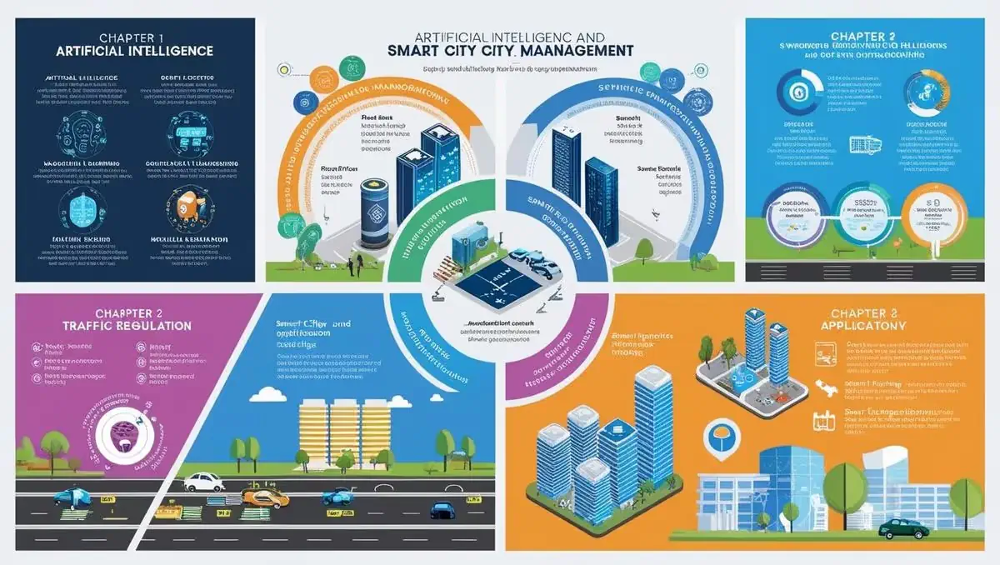

# **KURUMSAL EĞİTİM, KAMUDA YAPAY ZEKAYLA AKILLI ŞEHİR ÇÖZÜMLERİ**

- [Download PDF Version](https://www.vebende.com.tr/pdfs/kamu-alaninda-yapay-zeka-uygulamalari-egitimi-akilli-sehir-planlama-egitimi.pdf)
- [En güncel eğitimlerimiz için www.vebende.com.tr ziyaret edin](https://www.vebende.com.tr/kamu-alaninda-yapay-zeka-uygulamalari-egitimi-akilli-sehir-planlama-egitimi)

## **Eğitim Süresi**

- **Süre:** 3 Gün
- **Ders Süresi:** 50 dakika
- **Eğitim Saati:** 10:00 - 17:00

- > Her iki eğitim formatında eğitimler 50 dakika + 10 dakika moladır. 12:00-13:00 saatleri arasında 1 saat yemek arasındaki verilir. Günde toplam 6 saat eğitim verilir. 3 günlük formatta 18 saat eğitim verilmektedir.

- > Eğitimler uzaktan eğitim formatında tasarlanmıştır. Her eğitim için teams linkleri gönderilir. Katılımcılar bu linklere girerek eğitimlere katılırlar. Ayrıca farklı remote çalışma araçları da eğitmen tarafından tüm katılımlara sunulur. Katılımcılar bu araçları kullanarak eğitimlere katılırlar. 

- > Eğitim içeriğinde github ve codespace kullanılır. Katılımcılar bu platformlar üzerinden örnek projeler oluşturur ve eğitmenle birlikte eğitimlerde sorulan sorulara ve taleplere uygun iceriğe cevap verir. Katılımcılar bu araçlarla eğitimlerde sorulan sorulara ve taleplere uygun iceriğe cevap verir.

- > Eğitim yapay zeka destekli kendi kendine öğrenme formasyonu ile tasarlanmıştır. Katılımcılar eğitim boyunca kendi kendine öğrenme formasyonu ile eğitimlere katılırlar. Bu eğitim formatı sayesinde tüm katılımcılar gelecek tüm yaşamlarında kendilerini güncellemeye devam edebilecekler ve her türlü sorunun karşısında çözüm bulabilecekleri yeteneklere sahip olacaklardır.

## **Akıllı Şehirler ve Yapay Zeka Eğitimi**

Geleceğin şehirlerini inşa etmek için siz de yerinizi alın!  
**"Akıllı Şehirler ve Yapay Zeka Eğitimi"** programı, şehir yönetiminde dijital dönüşüm, veriye dayalı karar alma ve yapay zeka entegrasyonu konularında uzmanlaşmak isteyen profesyonellere yönelik olarak hazırlanmıştır. Bu eğitim ile şehir yönetiminde yapay zekanın nasıl kullanılacağını keşfedecek, geleceğin şehirlerini inşa etmek için gerekli bilgi ve becerileri kazanacaksınız.

- **Yapay Zekanın Kritik Alanlardaki Kullanımı**  
  Ulaşım, enerji, çevre, sağlık gibi alanlarda yapay zekanın potansiyelinden nasıl faydalanılacağını öğrenin.

- **Veri Toplama ve Analizi**  
  Akıllı şehirlerin dijital altyapısında kullanılan veri toplama, analiz ve güvenli yönetim süreçlerini detaylı bir şekilde keşfedin.

- **İleri Düzey Akıllı Şehir Uygulamaları**  
  Şehirlerin dijital dönüşümünde yapay zekanın nasıl etkin bir şekilde kullanılacağına dair ileri düzey uygulamalı çözümler geliştirin.

- **Kamu Hizmetlerinin İyileştirilmesi**  
  Toplum geri bildirimlerini ve büyük veri analitiğini kullanarak, yapay zeka ile kamu hizmetlerinin verimliliğini artırma yollarını öğrenin.

- **Veri Güvenliği ve Etik**  
  Yapay zeka uygulamalarında veri güvenliği, etik ve sürdürülebilirlik gibi kritik konulara dikkat ederek şeffaf çözümler geliştirin.

- **Teoriden Pratiğe Geçiş**  
  Belediye çalışanları, yazılım geliştiriciler, mühendisler ve şehir planlamacıları için özel olarak hazırlanan bu eğitim, teoriyi pratiğe dökme fırsatı sunar.

### **Eğitim Hedefi**  

Bu eğitim, yapay zeka ve akıllı şehir konseptlerini anlamaya, bu teknolojilerin kamu yönetimi ve toplum hizmetlerinde nasıl entegre edilebileceğini öğrenmeye odaklanmaktadır. Katılımcılar, akıllı şehirlerin planlanması ve yönetimi süreçlerinde yapay zeka teknolojilerinin kullanımını teorik ve uygulamalı olarak öğrenirken, şehirlerin dijitalleşmesiyle ortaya çıkan veri toplama, analiz ve raporlama süreçlerine dair stratejiler geliştireceklerdir.

Eğitim, katılımcıların şehir yönetiminde yenilikçi ve veriye dayalı çözümler geliştirmeleri için gereken becerileri kazandırmayı amaçlamaktadır.

### **Eğitim İçeriği**  

- Yapay zekanın temel prensipleri ve akıllı şehir uygulamalarındaki rolü  
- Ulaşım, enerji, çevre, sağlık ve toplum odaklı hizmetlerde yapay zeka kullanımı  
- Kamu hizmetlerinde büyük veri analitiği ve toplum geri bildirimlerinin optimizasyonu  
- Veri güvenliği, etik ve sürdürülebilirlik  
- Akıllı şehirlerin planlanması ve yönetimi ile ilgili uygulamalı çözümler

## **Eğitim İçeriği**

### **1. Giriş ve Temel Kavramlar**

- **Yapay Zeka Nedir?**  
  - Tarihi gelişimi, temel bileşenleri, alt dalları (Makine Öğrenimi, Derin Öğrenme, Doğal Dil İşleme).
  - Kamu sektöründe yapay zekanın rolü ve etkileri.
  
- **Akıllı Şehir Nedir?**  
  - Akıllı şehirlerin tanımı, temel bileşenleri ve dijital dönüşüm süreci.
  - Akıllı şehirlerin hedefleri ve önemi.
  - Yapay zeka ile akıllı şehirlerin birleşimi ve şehirlerin dijitalleşmesi.

### **2. Yapay Zeka ve Akıllı Şehir Yönetimi**

- **Ulaşım ve Trafik Yönetimi**
  - Yapay zeka destekli trafik akışının düzenlenmesi, akıllı trafik ışıkları ve otonom araçlar.
  - Akıllı park yerleri yönetimi ve trafik yoğunluğu tahminleri.

- **Enerji Verimliliği ve Yönetimi**
  - Yapay zeka ile enerji tüketimi analizi, akıllı elektrik şebekeleri ve enerji tasarrufu stratejileri.
  - Akıllı aydınlatma ve sürdürülebilir enerji politikalarına etkisi.

- **Çevre İzleme ve Kirlilik Kontrolü**
  - Hava kalitesi ve çevre kirliliği izleme, yapay zeka tabanlı çevre tahminleri.
  - Atık yönetimi ve geri dönüşüm süreçlerinde yapay zeka uygulamaları.

- **Su Yönetimi ve Altyapı İzleme**
  - Akıllı su yönetimi, su tasarrufu çözümleri ve su borusu ağlarının izlenmesi.
  - Veriye dayalı altyapı planlaması ve altyapı bakım süreçleri.

### **3. Kamu Hizmetlerinin İyileştirilmesi ve Toplum Odaklı Uygulamalar**

- **Sağlık Hizmetlerinde Yapay Zeka**
  - Akıllı sağlık izleme sistemleri, kişisel sağlık verisi analizi ve sağlık krizlerinde yapay zekanın rolü.
  
- **Eğitim ve Toplumsal Hizmetlerde AI**
  - Akıllı eğitim sistemleri, veriye dayalı karar destek sistemleri ve yapay zeka ile toplumsal hizmetlerin optimize edilmesi.

- **Toplum ve Vatandaş Etkileşimi**
  - Akıllı şehirlerde vatandaş katılımı, dijital vatandaşlık ve toplumsal bilinç artırma.
  - AI destekli kamu anketleri ve halkın projelere katılımı.

### **4. Akıllı Şehirler İçin Verinin Rolü ve Yönetimi**

- **Veri Toplama ve Yönetimi**
  - Sensörler ve IoT cihazları ile veri toplama yöntemleri, büyük veri analitiği.
  - Akıllı şehirlerde veri yönetiminin önemi ve veri güvenliği.

- **Yapay Zeka ile Veri Analizi**
  - Veriye dayalı karar verme, öngörü analitiği ve kamu politikası geliştirme süreçlerinde yapay zekanın etkisi.

### **5. Yapay Zeka ile Akıllı Şehir Planlamasında Gelecek Perspektifleri**

- **Yapay Zeka ve Kamu Politikaları**
  - Yapay zeka destekli şehir planlaması, sürdürülebilir kalkınma hedefleri ve uzun vadeli şehir stratejilerinin planlanması.

- **Yapay Zeka ve Toplumsal Etkiler**
  - Teknolojik eşitsizlikler, dijital uçurum ve yapay zekanın toplumsal etkileri.

- **Geçiş Süreci ve İnovasyon**
  - Yapay zeka tabanlı dönüşüm süreçlerinin yönetimi ve belediyelerin inovasyon süreçlerinde rolü.

### **6. Verilerin Toplanması, İşlenmesi ve Raporlanması**

- **Hayvan Barınakları ve Şikayet Hatlarının Analizi**
  - Yapay zeka ile hayvan barınaklarındaki verilerin toplanması ve analiz edilmesi.
  - Halktan gelen şikayet ve geri bildirimlerin verimli şekilde işlenmesi ve raporlanması.

- **Halktan Gelen Verilerin Kullanımı**
  - Sosyal medya ve diğer platformlardan alınan verilerin analizi, kamu şikayetleri ve geri bildirimlerinin değerlendirilmesi.

### **7. Yapay Zeka ile Kamu Hizmetlerinin İyileştirilmesi ve Etkileşim**

- **Veriye Dayalı Toplum Odaklı Uygulamalar**
  - Kamu hizmetleri için veriye dayalı karar destek sistemlerinin entegrasyonu ve halkın geri bildirimlerinin hızla analiz edilmesi.

- **Kamu Hizmetlerinde Verimlilik ve Hızlı Karar Alımı**
  - Yapay zeka ile kamu hizmetlerinde hız kazandırma ve karar alım süreçlerinin otomasyonu.

## **Eğitim Yöntemi**

**1. Veri Tabanlı Çalışmalar:**  
Katılımcılar, şehirlerden toplanan verilerin analizi ve raporlanması süreçlerinde yapay zekanın nasıl kullanılacağını öğrenir. Bu, katılımcıların veri analitiği ve yapay zeka araçlarını pratikte kullanmalarını sağlar.

**2. Simülasyonlar ve Uygulamalı Eğitim:**  
Akıllı şehir yönetimi için geliştirilmiş yazılımlar ve araçlarla pratik eğitimler yapılır. Bu oturumlar, katılımcıların gerçek dünya senaryolarına dayalı olarak teknoloji kullanımı hakkında bilgi edinmelerine olanak tanır.

**3. Örnek Olay Çalışmaları:**  
Kamu hizmetlerinin verimliliğini artırmaya yönelik yapay zeka çözümleriyle ilgili vaka çalışmaları incelenir. Bu sayede katılımcılar, mevcut çözümleri değerlendirip, farklı yaklaşımlar geliştirir.

## **Hedef Kitle**

**1. Kamu Sektöründe Çalışan Profesyoneller:**  
Belediye çalışanları, şehir planlamacıları, kamu hizmetleri yöneticileri ve strateji geliştiren kişiler, akıllı şehir projeleriyle ilgilenen devlet daireleri ve kurumlar.

**2. Teknoloji ve Yazılım Geliştiricileri:**  
Yapay zeka, veri analitiği, makine öğrenimi ve IoT teknolojilerine ilgi duyan yazılım mühendisleri, veri bilimcileri ve sistem analistleri.

**3. Mühendisler ve Şehir Planlamacıları:**  
Altyapı, ulaşım, enerji verimliliği, çevre izleme ve su yönetimi gibi alanlarda çalışan mühendisler ve akıllı şehir projelerinde yer alan mühendislik ekipleri.

**4. Sosyal Hizmetler ve Eğitim Alanında Çalışan Profesyoneller:**  
Eğitim teknolojileri, sağlık hizmetleri ve toplumsal hizmetlerde çalışan profesyoneller.

**5. İnovasyon ve Dijital Dönüşüm Uzmanları:**  
Dijital dönüşüm süreçlerine yön veren ve akıllı şehirlerin geleceği için strateji geliştiren iş liderleri ve inovasyon yöneticileri.

**6. Yönetim ve Strateji Danışmanları:**  
Akıllı şehir ve yapay zeka uygulamalarının ekonomik ve stratejik etkilerini analiz etmek isteyen danışmanlar ve yönetim profesyonelleri.

## **Katılımcılardan Beklediklerimiz**

**1. Temel Teknoloji ve Yapay Zeka Bilgisi:**  
Katılımcıların yapay zeka, veri analitiği ve dijital teknolojilere ilgi duyması ve temel düzeyde bilgiye sahip olması beklenmektedir.

**2. Katılım ve İletişim:**  
Eğitim sırasında aktif katılım göstermeleri, grup tartışmalarına dahil olmaları ve fikirlerini paylaşmaları beklenir. Ayrıca teorik bilgileri uygulamalı çalışmalarla ilişkilendirebilmeleri önemlidir.

**3. Problem Çözme ve Analitik Yaklaşım:**  
Eğitim boyunca verilen vaka çalışmaları ve senaryolara çözüm üretirken analitik düşünme becerilerini kullanmaları beklenir.

**4. Uygulama ve Geri Bildirim:**  
Yapay zeka ve akıllı şehir çözümlerini analiz ederek, yenilikçi öneriler geliştirmeleri beklenir. Eğitim sürecine yönelik geri bildirim vererek içeriğin iyileştirilmesine katkı sağlamaları da teşvik edilir.

**5. Disiplinler Arası İş Birliği:**  
Farklı mesleklerden gelen katılımcılarla birlikte çalışarak, ekip çalışmalarına uyum sağlama ve disiplinler arası bir perspektif geliştirme becerisi göstermeleri beklenmektedir.

**6. Etik ve Sürdürülebilirlik Farkındalığı:**  
Yapay zeka ve akıllı şehir uygulamalarında etik, veri güvenliği ve sürdürülebilirlik konularına duyarlılık göstermeleri önemlidir. Eğitim boyunca tartışılan projelerde toplum yararını önceliklendirmeleri beklenir.

[Eğitim Materyalleri (Eğitmenlere Özel)](https://github.com/TuncerKARAARSLAN-VB/training-kit-kamu-alaninda-yapay-zeka-uygulamalari-egitimi-akilli-sehir-planlama-egitimi)
