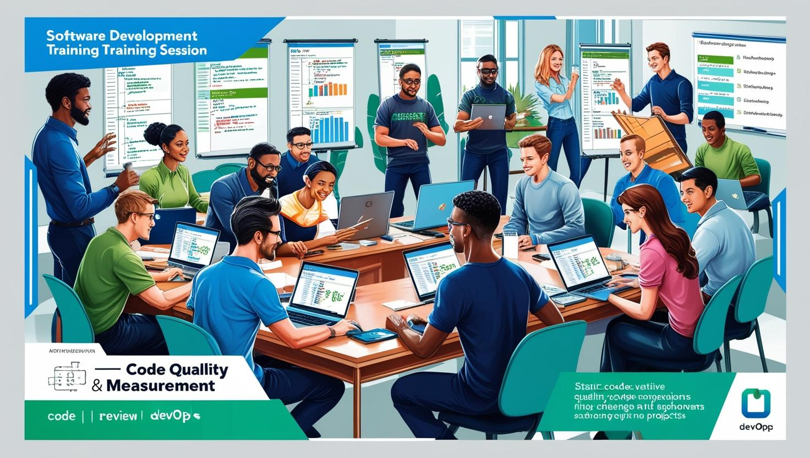

# **Kod Kalite ve Ölçümleme**

[Download PDF Version](./code-quality.pdf)

## **Eğitim Süresi**

- **Format 1**
  - **5 Gün**
  - **Ders Süresi:** 50 dakika
  - **Eğitim Saati:** 10:00 - 17:00

- **Format 2**
  - **12 Gün**
  - **Ders Süresi:** 50 dakika
  - **Eğitim Saati:** 10:00 - 17:00

- > Her iki eğitim formatında eğitimler 50 dakika + 10 dakika moladır. 12:00-13:00 saatleri arasında 1 saat yemek arasındaki verilir. Günde toplam 6 saat eğitim verilir. 5 günlük formatta 30 saat eğitim, 12 günlük formatta toplam 72 saat eğitim verilmektedir. 12 saatlik eğitmde katılımcılar kod yazar ve eğitmenle birlikte sorulan sorulara ve taleplere uygun içerikler ve örnekler çalışılır.

- > Eğitimler uzaktan eğitim formatında tasarlanmıştır. Her eğitim için teams linkleri gönderilir. Katılımcılar bu linklere girerek eğitimlere katılırlar. Ayrıca farklı remote çalışma araçları da eğitmen tarafından tüm katılımlara sunulur. Katılımcılar bu araçları kullanarak eğitimlere katılırlar. 

- > Eğitim içeriğinde github ve codespace kullanılır. Katılımcılar bu platformlar üzerinden örnek projeler oluşturur ve eğitmenle birlikte eğitimlerde sorulan sorulara ve taleplere uygun iceriğe cevap verir. Katılımcılar bu araçlarla eğitimlerde sorulan sorulara ve taleplere uygun iceriğe cevap verir.

- > Eğitim yapay zeka destekli kendi kendine öğrenme formasyonu ile tasarlanmıştır. Katılımcılar eğitim boyunca kendi kendine öğrenme formasyonu ile eğitimlere katılırlar. Bu eğitim formatı sayesinde tüm katılımcılar gelecek tüm yaşamlarında kendilerini güncellemeye devam edebilecekler ve her türlü sorunun karşısında çözüm bulabilecekleri yeteneklere sahip olacaklardır.

## **Kod Kalite ve Ölçümleme Eğitimi**

Bu eğitim, yazılım geliştirme dünyasında başarıyı yakalamak için kritik öneme sahip olan "Kod Kalitesi" konusuna derinlemesine bir bakış sunuyor. Yazılım projelerinin sürdürülebilirliği, güvenliği, verimliliği ve bakım kolaylığı doğrudan kod kalitesine bağlıdır. Bu eğitimde, kodun sadece çalışması değil, aynı zamanda sürdürülebilir, anlaşılabilir ve güvenli bir şekilde yazılması gerektiği üzerinde durulacaktır.

Eğitimde katılımcılar, **kod kalitesinin temel ölçütleri** olan okunabilirlik, bakım kolaylığı, performans, güvenlik, test edilebilirlik ve yeniden kullanılabilirlik gibi unsurları detaylı bir şekilde öğrenecekler. Kodun kalitesini nasıl ölçebileceğinizi, bu ölçütlere göre nasıl iyileştirmeler yapabileceğinizi ve yazılımın her aşamasında kalitenin nasıl sürdürüleceğini keşfedeceksiniz. Bu eğitim, yazılım geliştiricilerinden yazılım yöneticilerine kadar herkes için önemli bir kaynak olacak ve projelerde daha kaliteli, daha güvenli ve daha sürdürülebilir yazılımlar geliştirmeye yönelik derinlemesine bilgiler sunacaktır.

Katılımcılar, **statik kod analizi**, **kod incelemeleri**, **kod metrikleri** gibi modern araçları kullanarak kod kalitesini nasıl ölçebileceğini ve analiz edebileceğini öğrenecekler. Ayrıca, **DevOps** ve **CI/CD** süreçleriyle kod kalitesinin nasıl yönetileceği ve otomatik kalite kontrolünün nasıl entegre edileceği hakkında bilgi sahibi olacaklardır. Kodun performansını iyileştirmek, hatalardan öğrenmek, ve düşük kaliteli kodu optimize etmek için kullanılan teknikler ve metodolojilerle donanmış olarak, yazılım projelerinde daha etkili bir yaklaşım benimseyecekler.

**Kod kalitesi standartları ve en iyi uygulamalar** ile yazılımın her aşamasında kaliteli ve sürdürülebilir kod yazmanın temellerini atacak, yazılım geliştirme sürecini daha verimli hale getirecek yöntemler öğrenilecektir. **Test-driven development (TDD)**, **behavior-driven development (BDD)** gibi metodolojilerle kodun kalitesini nasıl artıracağınızı ve kodu nasıl sürekli iyileştirebileceğinizi keşfedeceksiniz.

Son olarak, **gerçek dünya örnekleri** ve **başarı hikayeleri** ile eğitimde öğrendiklerinizi nasıl uygulayacağınızı göreceksiniz. Bu eğitim, sadece teorik bilgi değil, aynı zamanda pratik beceriler kazandırarak katılımcıların profesyonel yazılım geliştirme becerilerini bir üst seviyeye taşıyacaktır.

Eğitim, yazılım projelerinin kalitesini artırmak, sürdürülebilirliğini sağlamak ve ekip verimliliğini en üst düzeye çıkarmak isteyen tüm yazılım geliştiriciler, yazılım mühendisleri ve ekip liderleri için mükemmel bir fırsattır. Katılımcılar, eğitim sonunda yazılım projelerinde daha verimli, güvenli ve sürdürülebilir çözümler üretebilecek yetkinliğe sahip olacaklardır.

## **Eğitim Hedefi**

Eğitim hedefi, katılımcıların yazılım geliştirme süreçlerinde kod kalitesinin önemini anlamalarını sağlamak, kod kalitesini değerlendirmek ve iyileştirmek için gerekli araç ve teknikleri öğrenmelerini sağlamaktır. Katılımcılar, yazılım projelerinin sürdürülebilirliğini artırmak, bakım maliyetlerini düşürmek ve ekip verimliliğini yükseltmek amacıyla kod kalitesini nasıl yönetebileceklerini keşfedeceklerdir. Ayrıca, kod yazma standartlarını benimseme, kod inceleme süreçlerini etkin bir şekilde kullanma ve DevOps entegrasyonu ile otomatik kalite kontrolü uygulama konularında bilgi sahibi olacaklardır. Eğitim, katılımcılara gerçek dünya örnekleri ve başarı hikayeleri ile pratik bir bakış açısı kazandırmayı amaçlamaktadır.

## **Eğitim İçeriği**

## 1. **Kod Kalitesi Nedir?**

  - Kod kalitesinin tanımı
  - Kod kalitesinin yazılım projelerindeki önemi
   - Kod kalitesinin yazılımın sürdürülebilirliği, bakım maliyetleri ve ekip verimliliği üzerindeki etkisi
   - Kod kalitesinin işlevsel ve işlevsel olmayan gereksinimler açısından değerlendirilmesi

## 2. **Kod Kalitesi Ölçütleri**

   - **Okunabilirlik (Readability)**: Kodun anlaşılabilir olması
   - **Bakım Kolaylığı (Maintainability)**: Kodun değişikliklere, hata düzeltmelerine veya yeni özellik eklemelere ne kadar uygun olduğu
   - **Performans (Performance)**: Kodun verimli çalışıp çalışmadığı
   - **Güvenlik (Security)**: Kodu güvenlik açıklarına karşı değerlendirme
   - **Test Edilebilirlik (Testability)**: Kodun ne kadar kolay test edilebileceği
   - **Yeniden Kullanılabilirlik (Reusability)**: Kodun başka projelerde veya modüllerde ne kadar yeniden kullanılabilir olduğu

## 3. **Kod Kalitesini Ölçme Araçları ve Teknikleri**

   - **Static Code Analysis (Statik Kod Analizi)**: Kodun çalışma zamanına ihtiyaç duymadan analiz edilmesi
     - Araçlar: SonarQube, ESLint, PMD, Checkstyle
   - **Code Review (Kod İnceleme)**: Ekip üyelerinin birbirlerinin kodlarını gözden geçirmesi
   - **Code Metrics (Kod Metrikleri)**: Kodun farklı yönlerini sayısal olarak değerlendiren metrikler
     - Örnek metrikler: Lines of Code (LOC), Cyclomatic Complexity, Depth of Inheritance, Coupling, Cohesion
   - **Automated Testing (Otomatik Testler)**: Test senaryoları kullanarak kodun doğruluğunun ölçülmesi
     - Unit Testing, Integration Testing, End-to-End Testing
   - **Code Coverage (Kod Kapsama)**: Testlerin, kodun ne kadar kısmını kapsadığını gösteren metrik

## 4. **Kod Kalitesi Ölçütlerinin Uygulanması**

   - Metriklerin proje için nasıl anlamlı hale getirileceği
   - Hangi metriklerin hangi projelerde daha faydalı olacağı
   - Metriklerin nasıl analiz edileceği ve iyileştirme alanlarının nasıl belirleneceği
   - Kod inceleme ve analiz süreçlerinin iş akışına entegrasyonu

## 5. **Kod Kalitesi Standartları ve En İyi Uygulamalar**

   - Kod yazma standartları ve kuralları (naming conventions, indentation, documentation)
   - Kodun okunabilirliğini artırmaya yönelik ipuçları (modüler yapı, fonksiyonel yöntemler)
   - Yavaş ve düşük kaliteli kodu tespit etme ve optimize etme
   - Kodun yeniden yapılandırılması (refactoring) ve iyileştirilmesi

## 6. **Kod Kalitesi Yönetimi ve Sürekli İyileştirme**

   - **DevOps ve CI/CD** süreçlerinde kod kalitesinin nasıl yönetileceği
   - Sürekli entegrasyon (CI) ve sürekli teslimat (CD) ile otomatik kalite kontrolünün entegrasyonu
   - Kod kalitesi raporlarının otomatik olarak oluşturulması ve izlenmesi
   - Takım üyeleri için eğitim ve bilgilendirme yöntemleri
   - Kod kalitesine odaklanarak yazılım geliştirme sürecinin nasıl iyileştirileceği

## 7. **Kod Kalitesi İyileştirme Stratejileri**

   - Zayıf kod kalitesinin tespit edilmesi ve çözülmesi
   - Refactoring (yeniden yapılandırma) ve kod optimizasyonu teknikleri
   - Test-driven development (TDD) ve behavior-driven development (BDD) gibi metodolojilerle kod kalitesinin artırılması
   - Kodun performansını iyileştirmek için kullanılabilecek araçlar ve teknikler
   - Hata analizi ve hatalardan öğrenme

## 8. **Kod Kalitesinin İzlenmesi ve İzleme Araçları**

   - **SonarQube**: Kodun kalitesini ve güvenliğini izleme
   - **Codacy**: Kodun kalitesini değerlendirme
   - **Coverity**: Yazılım hatalarını ve güvenlik açıklarını tespit etme
   - **StyleCI**: Kod formatını ve stilini iyileştirme

## 9. **Kod Kalitesinin Ekip Üzerindeki Etkisi**

   - Takım üyeleri arasındaki işbirliğinin artması
   - Ekip içi kod standardizasyonunun sağlanması
   - Kod kalitesinin, yazılım geliştirme sürecinde verimliliği ve hata oranını nasıl etkilediği
   - Sürekli iyileştirme ve takım performansı üzerindeki uzun vadeli etkiler

## 10. **Örnek Uygulamalar ve Case Study’ler**

   - Gerçek dünyadan projelerle kod kalitesi ölçümünün nasıl yapıldığına dair örnekler
   - Kod kalitesi raporlarının yorumlanması ve iyileştirme planlarının oluşturulması
   - Başarı hikayeleri: Kod kalitesinin iyileştirilmesi ile elde edilen başarılar

## 11. **Sonuç ve Eğitimde Öğrenilenler**

   - Kod kalitesinin yazılım projelerinde nasıl sürdürülebilir hale getirileceği
   - Eğitimden elde edilen önemli çıkarımlar
   - Katılımcılara yönelik son öneriler ve kaynaklar

## **Eğitim Yöntemi**

- **Teorik Bilgi:** Güncel bilgiler ve konseptlerin anlatımı.
- **Uygulamalı Örnekler:** Gerçek senaryolarla pratik uygulamalar.
- **Etkileşimli Tartışmalar:** Katılımcıların aktif katılım sağlayacağı, soru-cevap şeklinde tartışmalar yapılacak oturumlar.
- **Proje Tabanlı Öğrenme:** Eğitimin son günü, katılımcıların öğrendiklerini pratikte uygulayacakları kapsamlı bir proje çalışması yapılacak.

## **Hedef Kitle**

- **Yazılım Geliştiriciler ve Programcılar**: Kod kalitesini iyileştirmek isteyen, sürdürülebilir yazılım çözümleri geliştirmeyi amaçlayan yazılım geliştiricileri.
- **Yazılım Mühendisleri**: Yazılım projelerinde kalite standartlarını benimsemek ve uygulamak isteyen mühendisler.
- **Teknik Liderler ve Ekip Yöneticileri**: Takımındaki kod kalitesini izlemek ve sürekli iyileştirme süreçlerini yönlendirmek isteyen liderler.
- **DevOps Mühendisleri**: Sürekli entegrasyon ve sürekli teslimat (CI/CD) süreçlerinde kod kalitesini otomatik izleme ve yönetme amacı güden mühendisler.
- **Test Mühendisleri ve QA Uzmanları**: Yazılımın doğruluğunu test etmek ve iyileştirmek isteyen, otomatik testler ve test metrikleriyle ilgilenen profesyoneller.
- **Ürün Yöneticileri**: Ürün geliştirme süreçlerinde kaliteyi artırmayı amaçlayan ve yazılım geliştirme ekibiyle iş birliği içinde çalışan yöneticiler.
- **Yazılım Mimarı ve Tasarımcılar**: Yazılımın genel yapısını, sürdürülebilirliğini ve verimliliğini sağlamak için kod kalitesini yönlendiren profesyoneller.
- **Yeni Başlayan Yazılım Öğrencileri ve Stajyerler**: Kod yazma becerilerini geliştirerek kaliteli yazılım çözümleri oluşturmayı öğrenmek isteyen öğrenciler ve stajyerler.

## **Katılımcılardan Beklentilerimiz**

- **Temel Yazılım Geliştirme Bilgisi**: Katılımcıların yazılım geliştirme süreçleri ve temel programlama dilleri hakkında bilgi sahibi olmaları beklenmektedir. Eğitim, ileri düzeyde yazılım becerilerine sahip katılımcılar için daha faydalı olacaktır.
  
- **Açık İletişim ve Katılım**: Eğitim sırasında interaktif bir öğrenme ortamı sağlanacaktır. Katılımcıların sorular sorması, görüşlerini paylaşması ve grup içindeki tartışmalara aktif olarak katılmaları önemlidir.
  
- **Öğrenmeye Açıklık**: Katılımcıların yeni yaklaşımlara, tekniklere ve araçlara açık olmaları, yazılım geliştirme süreçlerinde kaliteyi artırmaya yönelik öğrendikleri bilgileri kendi projelerine nasıl entegre edebileceklerini keşfetmeleri beklenmektedir.

- **Uygulama ve Pratik Yapma**: Katılımcıların teorik bilgilerin yanı sıra öğrendiklerini pratikte uygulama konusunda istekli olmaları önemlidir. Kod kalitesi iyileştirmeleri ve araçlarının kullanımı ile ilgili uygulamalı örnekler üzerinden geçilecek, bu nedenle katılımcıların eğitim sürecinde aktif katılım göstermeleri önerilmektedir.

- **Geri Bildirim ve Değerlendirme**: Eğitim sonunda katılımcılardan eğitim materyalleri ve sunumlar hakkında geri bildirim sağlanması beklenmektedir. Bu geri bildirimler, gelecekteki eğitimlerin içeriğini geliştirmek için önemli olacaktır.

- **Zamanında Katılım**: Eğitimde etkili bir öğrenme süreci sağlamak için katılımcıların belirlenen saatlerde katılım göstermeleri ve tüm oturumlara devam etmeleri beklenmektedir.

- **İşbirliği ve Takım Çalışması**: Katılımcıların, diğer ekip üyeleriyle işbirliği yaparak eğitim sırasında verilen görev ve aktivitelerde birlikte çalışmaları önemlidir. Takım çalışması, yazılım geliştirme sürecinin önemli bir parçası olduğundan, bu becerinin geliştirilmesi teşvik edilmektedir.

[Eğitim ana materyalleri, sadece eğitmenler için](https://github.com/TuncerKARAARSLAN-VB/training-kit-kod-kalite-ve-olcumleme)
