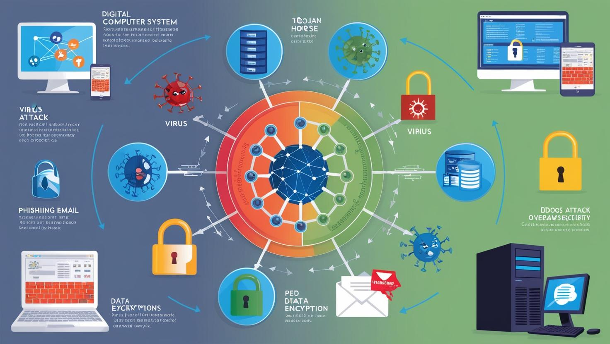
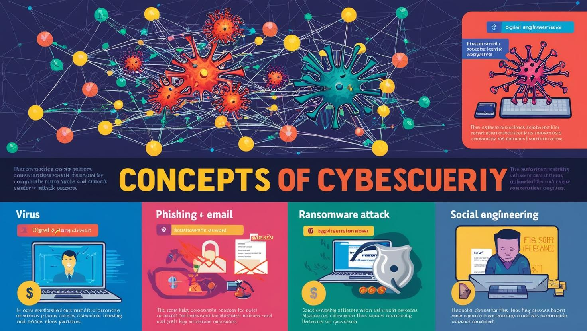

# Kurum Çalışanları İçin Siber Güvenlik Eğitimi

[Download PDF Version](./cyber-security-for-workers.pdf)

## **Eğitim Süresi**

- **Format 1**
  - **5 Gün**
  - **Ders Süresi:** 50 dakika
  - **Eğitim Saati:** 10:00 - 17:00

- **Format 2**
  - **12 Gün**
  - **Ders Süresi:** 50 dakika
  - **Eğitim Saati:** 10:00 - 17:00

- > Her iki eğitim formatında eğitimler 50 dakika + 10 dakika moladır. 12:00-13:00 saatleri arasında 1 saat yemek arasındaki verilir. Günde toplam 6 saat eğitim verilir. 5 günlük formatta 30 saat eğitim, 12 günlük formatta toplam 72 saat eğitim verilmektedir. 12 saatlik eğitmde katılımcılar kod yazar ve eğitmenle birlikte sorulan sorulara ve taleplere uygun içerikler ve örnekler çalışılır.

- > Eğitimler uzaktan eğitim formatında tasarlanmıştır. Her eğitim için teams linkleri gönderilir. Katılımcılar bu linklere girerek eğitimlere katılırlar. Ayrıca farklı remote çalışma araçları da eğitmen tarafından tüm katılımlara sunulur. Katılımcılar bu araçları kullanarak eğitimlere katılırlar. 

- > Eğitim içeriğinde github ve codespace kullanılır. Katılımcılar bu platformlar üzerinden örnek projeler oluşturur ve eğitmenle birlikte eğitimlerde sorulan sorulara ve taleplere uygun iceriğe cevap verir. Katılımcılar bu araçlarla eğitimlerde sorulan sorulara ve taleplere uygun iceriğe cevap verir.

- > Eğitim yapay zeka destekli kendi kendine öğrenme formasyonu ile tasarlanmıştır. Katılımcılar eğitim boyunca kendi kendine öğrenme formasyonu ile eğitimlere katılırlar. Bu eğitim formatı sayesinde tüm katılımcılar gelecek tüm yaşamlarında kendilerini güncellemeye devam edebilecekler ve her türlü sorunun karşısında çözüm bulabilecekleri yeteneklere sahip olacaklardır.

## **Kurum Çalışanlarına Özel Siber Güvenlik Eğitimi**

Şirket çalışanlarınızın siber güvenlik konusundaki farkındalığını artırmak için kapsamlı bir eğitim programı sunuyoruz. Bu eğitim, temel siber güvenlik kavramlarından ağ ve cihaz güvenliğine, veri koruma stratejilerinden kriz yönetimi ve siber saldırılara müdahale yöntemlerine kadar geniş bir yelpazede bilgi sunuyor. Çalışanlarınızın dijital dünyadaki tehditlere karşı bilinçli olmasını sağlamak, güvenlik protokollerine uyumlarını artırmak ve kurumsal verilerinizi korumak için özel olarak tasarlanmış bu eğitim, şirketinizin güvenliğini güçlendirmeye yönelik güçlü bir adım olacaktır.

## **Eğitim Hedefi**

Bu eğitim, kurum çalışanlarının temel siber güvenlik farkındalığını artırmayı, dijital güvenlik risklerini tanımayı ve bu risklere karşı doğru adımlar atmayı hedeflemektedir. Katılımcılar, siber tehditleri tanımlamayı, güvenli bilgi işlem pratiklerini uygulamayı ve olası güvenlik açıklarına karşı nasıl davranmaları gerektiğini öğreneceklerdir. Eğitim sonunda, siber güvenlik politikalarının neden önemli olduğunu anlayarak, güvenlik ihlalleri ve tehditlere karşı bilinçli bir şekilde hareket edebilecek seviyeye ulaşacaklardır.

## **Eğitim İçeriği**

### **Gün 1: Siber Güvenlik Temelleri**

- **Siber Güvenlik Nedir?**  
  - Tanım: Siber güvenlik, dijital sistemlerin, ağların, cihazların, verilerin ve uygulamaların korunması sürecidir. 
  - Önemi: Artan dijitalleşme ile siber tehditler de çoğalmaktadır. Şirketlerin siber güvenlik önlemleri, iş sürekliliği ve itibarlarını korumak için hayati öneme sahiptir.  
  - Temel Kavramlar:  
    - **Siber Saldırılar:** Bilgisayar sistemlerine, ağlara veya cihazlara yapılan zararlı müdahaleler.
    - **Güvenlik Açıkları:** Sistemlerin savunmasız olduğu noktalar, bu açıklar siber saldırganlar tarafından kullanılır.
    - **Veri İhlalleri:** Yetkisiz kişilerin hassas bilgilere erişimi.
  
- **Siber Tehdit Türleri**  
  - **Virüsler:** Kendisini çoğaltarak zararlı yazılımlar, sistemleri yavaşlatabilir veya dosyaları silebilir.
  - **Trojanlar:** Kullanıcıları kandırarak zararlı yazılımı sisteme sızdırır.
  - **Fidye Yazılımları (Ransomware):** Kullanıcının dosyalarını şifreler ve karşılığında para talep eder.
  - **Oltalama (Phishing):** Kullanıcıları kandırarak kişisel verilerini çalmaya yönelik e-posta ve web sitesi saldırıları.
  - **DDoS Saldırıları:** Hedeflenen bir web sitesini ya da servisi aşırı trafikle felç etme.

- **Sosyal Mühendislik Saldırıları**  
  - Sosyal mühendislik, insan psikolojisini manipüle ederek güvenlik ihlali yapma yöntemidir.
  - **Örnekler:** E-posta yoluyla kandırma, telefonla bilgi toplama, fiziksel erişim sağlama.
  - **Korunma Yöntemleri:** Şüpheli iletişimlere dikkat etme, eğitimli olma ve güvenli uygulama protokollerine sadık kalma.

- **Güvenli Parola Yönetimi**  
  - **Parola Oluşturma Yöntemleri:** Karmaşık ve uzun parolalar kullanma, parola kombinasyonları ve hatırlanması kolay olmayan şifreler.  
  - **Parola Yöneticileri:** Güvenli parola saklama ve yönetme yazılımları.
  - **İki Faktörlü Kimlik Doğrulama (2FA):** Parolanın yanı sıra ekstra bir güvenlik katmanı ekler.

---

### **Gün 2: Ağ Güvenliği**

- **Ağ Güvenliğine Giriş**  
  - **Kurum İçi Ağlar:** Kurumsal ağların içindeki verilerin ve iletişimin güvenliği.
  - **Ağ Saldırıları ve Önlemleri:** Ağ tıkanıklığı, verilerin ele geçirilmesi veya yıkıcı saldırılar.
  - **Firewall ve Ağ Segmentasyonu:** Ağları izole etme, tehlikeli trafiği engelleme ve kurum içindeki güvenliği artırma.

- **Wi-Fi Güvenliği**  
  - Güvenli Wi-Fi ağı kullanımı ve güçlü şifreleme protokolleri (WPA2, WPA3).
  - **Açık Wi-Fi Ağları:** Güvenli olmayan ağlarda dikkat edilmesi gerekenler ve riskler.
  
- **VPN Kullanımı**  
  - **Sanal Özel Ağ (VPN):** İnternete bağlanırken kimliğinizi ve verilerinizi şifreler, güvenli bir bağlantı sağlar.
  - **Kullanım Alanları:** İşyerinde veya dışarıdayken güvenli internet erişimi sağlama.
  
- **E-posta Güvenliği**  
  - **Zararlı E-posta Ekleri:** E-posta eklerinde gizli zararlı yazılımlar, kimlik avı saldırıları.
  - **E-posta Şifreleme:** Verilerin korunmasını sağlamak için şifreli e-posta kullanma.

---

### **Gün 3: Bilgi Güvenliği ve Veri Koruma**

- **Bilgi Güvenliği Politikaları**  
  - **Kurumsal Politikalara Uyumluluk:** Şirket içindeki tüm güvenlik protokollerine sadık kalma, yetkilendirme ve gizliliğe özen gösterme.
  - **Bilgi Sınıflandırma:** Verilerin gizlilik seviyelerine göre sınıflandırılması, korunması gereken verilerin belirlenmesi.
  
- **Veri Şifreleme**  
  - **Şifreleme Türleri:**  
    - **Simetrik Şifreleme:** Aynı anahtar ile şifreleme ve çözme.
    - **Asimetrik Şifreleme:** Public ve private key kullanarak güvenli veri iletimi.
  - **Veri Şifreleme Uygulamaları:** Verilerin sadece yetkili kişiler tarafından okunabilmesi için şifrelenmesi.

- **Kişisel Verilerin Korunması (KVKK ve GDPR)**  
  - KVKK ve GDPR'nin şirketler için önemi.
  - **Kişisel Verilerin Korunması:** Verilerin toplanması, işlenmesi, saklanması ve silinmesi ile ilgili yasal düzenlemelere uyum.
  
- **Veri Yedekleme ve Kurtarma**  
  - **Yedekleme Stratejileri:** Verilerin düzenli olarak yedeklenmesi ve yedeklerin güvenli bir şekilde saklanması.
  - **Veri Kurtarma Planları:** Olası veri kaybı durumunda acil müdahale ve kurtarma süreçlerinin belirlenmesi.

---

### **Gün 4: Uygulama ve Cihaz Güvenliği**

- **Mobil Cihaz Güvenliği**  
  - **BYOD Politikaları:** Çalışanların kendi cihazlarını iş ortamında kullanırken dikkat etmeleri gereken güvenlik önlemleri.
  - **Mobil Cihaz Yönetimi (MDM):** Kurumsal cihazların güvenliği için yönetim yazılımlarının kullanımı.

- **İşletim Sistemi Güvenliği**  
  - **Windows, macOS ve Linux Güvenliği:** Bu işletim sistemlerinin güvenlik güncellemelerinin düzenli yapılması.
  - **Yama Yönetimi:** Bilgisayarların sürekli güncel tutulması, güvenlik açıklarının kapatılması.

- **Güvenli Uygulama Kullanımı**  
  - Kurumsal yazılımların güvenli kullanımı, uygulama güncellemeleri ve üçüncü parti yazılımlarla ilgili dikkat edilmesi gerekenler.
  
- **Zararlı Yazılımlardan Korunma**  
  - **Antivirüs ve Antimalware Yazılımları:** Bilgisayar ve cihazlarda zararlı yazılımlara karşı koruma sağlamak.
  - **Zararlı Yazılım Tespit Yöntemleri:** Potansiyel tehditlerin erkenden tespit edilmesi için kullanılabilecek araçlar.

---

### **Gün 5: Kriz Yönetimi ve Siber Olaylara Müdahale**

- **Siber Güvenlik Olaylarına Müdahale**  
  - **Siber Saldırı Anında Yapılması Gerekenler:** Olay yönetimi süreçleri, ilk yardım adımları ve koordinasyon sağlanması.
  - **Kriz Yönetimi:** Olası bir siber saldırı durumunda izlenecek adımlar.

- **Güvenlik İhlallerinin Bildirilmesi**  
  - **Raporlama:** Güvenlik ihlali durumunda yetkili kişilere bilgi verilmesi, olay sonrası analiz.
  
- **Siber Güvenlik Farkındalığının Artırılması**  
  - **Eğitim ve Bilgilendirme:** Kurum içinde düzenli olarak siber güvenlik farkındalık eğitimleri verilmesi.
  - **Bilinçli Çalışanlar:** Çalışanların, şirketin dijital güvenliği konusunda proaktif bir yaklaşım sergilemesi.
  
- **Sonuçlar ve Değerlendirme**  
  - Eğitim boyunca öğrenilen bilgilerin gözden geçirilmesi, kurum içi güvenlik politikalarının güncellenmesi.

## **Eğitim Yöntemi**

- **Teorik Bilgi:** Siber güvenlik kavramları ve stratejilerinin anlatımı.
- **Uygulamalı Örnekler:** Gerçek senaryolar üzerinden pratik uygulamalar ve vaka çalışmaları.
- **Etkileşimli Tartışmalar:** Katılımcıların siber güvenlik konularında aktif katılım sağlayacağı oturumlar ve soru-cevap bölümleri.
- **Proje Tabanlı Öğrenme:** Katılımcıların eğitim sonunda öğrendiklerini uygulayarak kurumsal bir güvenlik politikası tasarlamaları.

## **Hedef Kitle**

- **Kurum Çalışanları:** Temel bilgisayar kullanımı yapan tüm çalışanlar, günlük işlerinde güvenli bilgi işlem süreçlerini öğrenmek isteyenler.
- **Sistem Yöneticileri ve IT Çalışanları:** Kurumun ağ güvenliği ve veri korumasından sorumlu kişiler.
- **Yönetici ve Departman Liderleri:** Kurumun siber güvenlik politikalarını oluşturmak ve uygulamakla yükümlü yöneticiler.
- **Yeni Mezunlar ve Stajyerler:** Kariyerine siber güvenlik alanında adım atmak isteyenler.

## **Katılımcılardan Beklentilerimiz**

- Katılımcıların temel bilgisayar bilgisine sahip olması.
- Siber güvenlik konularında öğrenmeye açık olmaları ve farkındalık oluşturmayı hedeflemeleri.

[Eğitim ana materyalleri, sadece eğitmenler için](https://github.com/TuncerKARAARSLAN-VB/training-kit-kurum-calisanlarina-siber-guvenlik)
