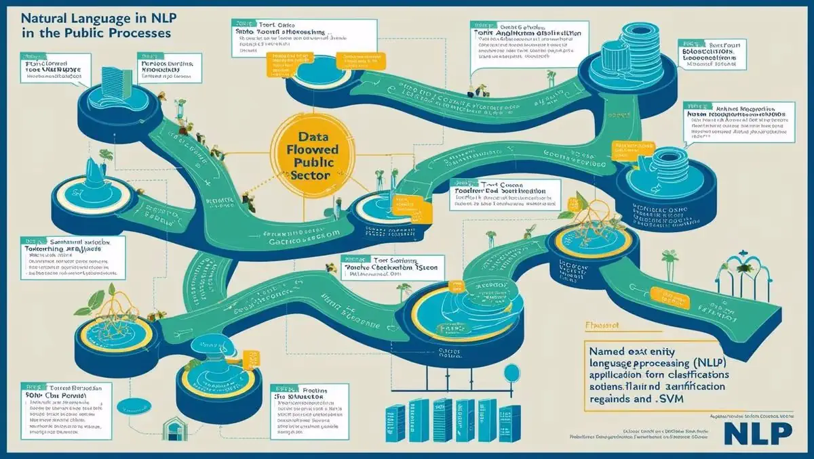
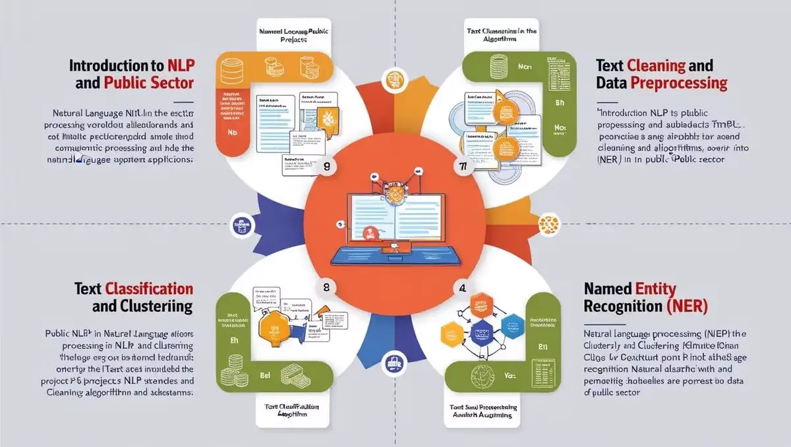

# **KURUMSAL EĞİTİM, KURUMSAL NLP GELİŞTİRME**

- [Güncel PDF'i İndir](https://www.vebende.com.tr/pdfs/kurumsal-nlp-egitimi.pdf)
- [En güncel eğitimlerimiz için www.vebende.com.tr ziyaret edin](https://www.vebende.com.tr/kurumsal-nlp-egitimi)
  
## **Eğitim Süresi**

- **Süre:** 12 gün
- **Ders Süresi:** 50 dakika
- **Eğitim Saati:** 10:00 - 17:00

- > Eğitim formatında eğitimler 50 dakika + 10 dakika moladır. 12:00-13:00 saatleri arasında 1 saat yemek arasındaki verilir. Günde toplam 6 saat eğitim verilir. 12 günlük formatta 72 saat eğitim verilmektedir.

- > Eğitimler uzaktan eğitim formatında tasarlanmıştır. Her eğitim için teams linkleri gönderilir. Katılımcılar bu linklere girerek eğitimlere katılırlar. Ayrıca farklı remote çalışma araçları da eğitmen tarafından tüm katılımlara sunulur. Katılımcılar bu araçları kullanarak eğitimlere katılırlar.

- > Eğitim içeriğinde github ve codespace kullanılır. Katılımcılar bu platformlar üzerinden örnek projeler oluşturur ve eğitmenle birlikte eğitimlerde sorulan sorulara ve taleplere uygun iceriğe cevap verir. Katılımcılar bu araçlarla eğitimlerde sorulan sorulara ve taleplere uygun iceriğe cevap verir.

- > Eğitim yapay zeka destekli kendi kendine öğrenme formasyonu ile tasarlanmıştır. Katılımcılar eğitim boyunca kendi kendine öğrenme formasyonu ile eğitimlere katılırlar. Bu eğitim formatı sayesinde tüm katılımcılar gelecek tüm yaşamlarında kendilerini güncellemeye devam edebilecekler ve her türlü sorunun karşısında çözüm bulabilecekleri yeteneklere sahip olacaklardır.  

## **Kurumlar ve Kuruluşlar İçin Doğal Dil İşleme (NLP) Eğitimi**  

### **Kamu Sektöründe Doğal Dil İşleme: Dijital Dönüşüm ve Verimlilik Artışı**  

Kamu kurumları ve büyük kuruluşlar için Doğal Dil İşleme (NLP) teknolojilerinin entegrasyonu, verimliliği artırma, süreçleri iyileştirme ve vatandaşlara daha hızlı hizmet sunma gibi önemli avantajlar sağlar. **NLP teknolojileri**, kamu hizmetlerinin dijitalleşmesine yardımcı olarak daha verimli ve etkili projelerin geliştirilmesine olanak tanır. Bu eğitim, katılımcılara **NLP projelerinin geliştirilmesi, uygulanması ve yönetilmesi** konusunda derinlemesine bilgi sunarak, kamu sektöründe dijital dönüşüm sürecini destekleyecektir.  

Eğitimde, sesli yönlendirme, WhatsApp entegrasyonu, kişiye özel ürün katalogu gönderimi ve kişiye özel fiyatlandırma gibi **uygulamalı çözümler** de yer alacaktır.  

## **Eğitimin Hedefleri**  

Bu eğitimin amacı, katılımcılara **doğal dil işleme teknolojilerinin kamu hizmetlerinde etkin bir şekilde kullanılmasını** öğretmektir. Katılımcılar, NLP'nin temel prensiplerinden başlayarak, veri güvenliği, vatandaş etkileşimi ve kamu hizmetlerinde yenilikçi çözümler geliştirme konusunda yetkinlik kazanacaklardır.  

### **Katılımcılar Eğitimin Sonunda:**  

✅ **NLP teknolojilerini kamu hizmetlerinde kullanma** becerisi kazanacaklardır.  
✅ **Veri güvenliği ve KVKK uyumu** konularında gerekli bilgi ve becerilere sahip olacaklardır.  
✅ **Metin işleme, sınıflandırma ve duygu analizi** gibi temel NLP uygulamalarını kullanarak kamu verilerini analiz edebileceklerdir.  
✅ **Sohbet botları ve etkileşimli sistemler** geliştirerek vatandaşlarla etkileşimi daha verimli hale getireceklerdir.  
✅ **Derin öğrenme ve gelişmiş NLP uygulamaları** kullanarak daha sofistike çözümler geliştirme yetkinliği kazanacaklardır.  
✅ **Proje yönetimi, etik ve kamu verilerinin güvenliği** gibi önemli konular hakkında bilgi sahibi olacaklardır.  
✅ **Gerçek dünya uygulamaları** ile öğrendikleri teknikleri somut projelerde uygulama fırsatı bulacaklardır.  

## **Eğitim İçeriği**

### **Gün 1: Doğal Dil İşleme ve Kamu Sektöründeki Rolü**

- **NLP’nin Tanımı ve Önemi:** Doğal Dil İşleme (NLP) nedir? Kamu hizmetlerinde NLP’nin sağlayabileceği avantajlar ve verimlilik artışı.
- **Kamu Sektöründe NLP Uygulamaları:** Kamu hizmetlerinde NLP teknolojilerinin nasıl kullanıldığı, vatandaş hizmetleri, veri analizi ve raporlama gibi alanlarda sağladığı faydalar.
- **Kamu Verisi ve NLP:** Kamuya ait verilerin işlenmesi ve özel güvenlik gereksinimlerinin yönetilmesi, veri güvenliği ve gizlilik.
  
### **Gün 2: Metin Temizleme ve Veri Ön İşleme**

- **Metin Temizleme Adımları:** Ham metin verilerinin ön işlenmesi, stopword kaldırma, tokenizasyon, öznitelik çıkarımı.
- **Kamu Verilerinin Özellikleri:** Kamu verileri ile çalışırken dikkat edilmesi gereken hususlar (veri güvenliği, anonimlik, gizlilik).
- **Veri Temizleme ve Güvenlik:** Kamuya ait hassas verilerin doğru şekilde işlenmesi ve güvenliği.

### **Gün 3: Metin Sınıflandırma ve Kümeleme**

- **Metin Sınıflandırma Yöntemleri:** Duygu analizi, konu etiketleme, başvuru formları sınıflandırma gibi uygulamalar.
- **Algoritmalar:** Naive Bayes, Logistic Regression, SVM algoritmalarının kullanımı ve kamuya yönelik uygulamaları.
- **Kümeleme Yöntemleri:** KMeans, DBSCAN ile metin kümelenmesi ve toplumsal analiz.

### **Gün 4: İsimli Varlık Tanıma (NER) ve Kamu Projeleri**

- **NER’nin Temelleri:** Kişi, organizasyon, yer isimleri gibi varlıkların tanınması.
- **NER Kullanımı:** Kamuya ait yazılı belgelerde önemli varlıkların tanınması ve derin öğrenme yöntemleriyle isimli varlık tanıma.
- **Proje Örneği:** Kamu belgelerinde kişi adları ve kurumlar arası ilişki analizi.

### **Gün 5: Sohbet Botları ve Kamu Kurumlarına Özel Uygulamalar**

- **Sohbet Botları:** Vatandaş hizmetlerinde kullanılacak etkileşimli sohbet botlarının geliştirilmesi.
- **Rasa ile Sohbet Botu Geliştirme:** Özelleştirilmiş diyalog yönetimi ve veri tabanlı soru-cevap sistemleri.
- **Transformer Modelleri ile Sohbet Botları:** GPT-3 ve BERT kullanarak daha doğal sohbet botları geliştirme.
- **Uygulama Örneği:** Belediye veya sağlık kurumlarına yönelik otomatik bilgi verme sistemleri.

### **Gün 6: Duygu ve Yorum Analizi**

- **Duygu Analizi (Sentiment Analysis):** Kamu geri bildirimlerinin, oylama, şikayet gibi durumların analiz edilmesi.
- **Yorum Analizi:** Sosyal medya ve online platformlarda vatandaşların geri bildirimlerinin analizi.
- **Proje Örneği:** Sosyal medya paylaşımlarının analiz edilmesi ve kamu politikalarına etkisinin incelenmesi.

### **Gün 7: Derin Öğrenme ve NLP Uygulamaları**

- **Derin Öğrenme Teknikleri:** NLP projelerinde kullanılan sinir ağları, LSTM, RNN ve Transformer tabanlı modellerin açıklamaları.
- **BERT ve GPT-3 ile Gelişmiş NLP Uygulamaları:** Metin anlayışı ve yazı üretme üzerine teknikler.
- **Transfer Öğrenme:** Kamuya özel verilerle transfer öğrenme yöntemlerinin uygulanması.

### **Gün 8: Kamu Kurumlarında NLP Proje Yönetimi ve Etik**

- **Proje Yönetimi:** NLP projelerinde ekip çalışması, zaman yönetimi ve proje sürecinin yönetilmesi.
- **Etik ve Veri Güvenliği:** Kamu verilerinin güvenliği, etik sorunlar ve veri gizliliği.
- **Halkla İletişim ve Yasal Gereklilikler:** Kamu projelerinde dikkat edilmesi gereken yasal düzenlemeler.

### **Gün 9: Gerçek Dünya Proje Uygulamaları ve Vaka Çalışmaları**

- **Proje 1:** Belediye için sohbet botu geliştirilmesi.
- **Proje 2:** Vatandaş geri bildirimlerinin duygu analizi ile değerlendirilmesi.
- **Proje 3:** Kamu sektöründeki metin verilerinin sınıflandırılması ve özetlenmesi.
- **Proje 4:** Sesli yönlendirme sistemleri entegre edilerek vatandaşlara hızlı erişim imkânı sağlanması.
- **Proje 5:** WhatsApp entegrasyonu ile vatandaşların anlık sorularına cevap verilmesi.

## **Eğitim Yöntemi**

- **Teorik Sunumlar ve Kavramsal Anlatım:** Eğitim, doğal dil işleme (NLP) teknolojileri ve bunların kamu sektöründe nasıl kullanılacağı hakkında temel kavramların öğretilmesiyle başlayacaktır. Katılımcılar, NLP'nin kamu hizmetlerine sağladığı faydalar ve çeşitli uygulama alanları hakkında bilgilendirici sunumlarla güçlü bir teorik altyapı kazanacaklardır.

- **Canlı Demonstrasyonlar ve Uygulamalı Çalışmalar:** NLP uygulamalarıyla ilgili canlı gösterimler yapılacak ve katılımcılar, metin sınıflandırma, duygu analizi, sohbet botları geliştirme gibi görevleri kendi bilgisayarlarında uygulamalı olarak gerçekleştireceklerdir. Ayrıca, Docker ve Kubernetes gibi araçlar üzerinde NLP projelerinin kurulumu ve yönetimi yapılacaktır.

- **Vaka Çalışmaları ve Gerçek Dünya Projeleri:** Kamu sektöründeki gerçek dünya projelerinden örnekler incelenecek ve bu projelerde karşılaşılan zorluklar ile çözüm önerileri tartışılacaktır. Katılımcılar, vaka çalışmaları üzerinden projelerine dair fikir geliştirecek ve uygulamalı çözümler üreteceklerdir.

- **Grup Çalışmaları ve Proje Geliştirme:** Katılımcılar küçük gruplara ayrılarak belirli NLP projeleri üzerinde çalışacaklardır. Bu süreç, ekip çalışması, proje yönetimi ve problem çözme becerilerini geliştirecek fırsatlar sunacaktır. Eğitim sonunda, katılımcılar gruplarıyla tamamladıkları projeleri sunacaklardır.

- **Bireysel Proje ve Değerlendirme:** Katılımcılar eğitim sonunda kendi NLP projelerini geliştirecek ve eğitmenlerden bireysel geri bildirim alacaklardır. Bu süreç, katılımcıların öğrendikleri bilgileri ve teknikleri uygulamaya koymalarına olanak tanıyacaktır.

- **Soru-Cevap ve Tartışma Oturumları:** Eğitim boyunca katılımcıların soruları anında cevaplanacak ve düzenli tartışma oturumlarıyla daha derinlemesine bilgi edinme fırsatı sunulacaktır. Katılımcılar, NLP teknolojilerinin kamu sektöründeki uygulamaları üzerine aktif tartışmalar yapabileceklerdir.

## **Hedef Kitle**

Bu eğitim, doğal dil işleme teknolojilerini kamu sektöründe kullanmayı hedefleyen profesyonellere yöneliktir:

1. **Kamu Sektörü Çalışanları ve Yöneticileri:** Kamu hizmetlerinde dijital dönüşüm sağlamak isteyen, verimliliği artırmayı amaçlayan yöneticiler ve uzmanlar.
2. **Veri Bilimcileri ve Analistler:** Kamu verisi üzerinde analiz yapan ve NLP tekniklerini kullanarak verileri işlemek isteyen profesyoneller.
3. **Yazılım Geliştiriciler ve Mühendisler:** Kamu sektöründe NLP uygulamalarını entegre etmek isteyen yazılım mühendisleri ve geliştiriciler.
4. **IT ve Teknoloji Departmanları:** Kamu kurumlarında dijital çözümler geliştirmek isteyen bilgi teknolojileri ekipleri.
5. **Hukuk ve Kamu Politika Uzmanları:** Kamu belgelerindeki metinleri analiz etmek isteyen hukuk ve kamu politika uzmanları.
6. **Araştırmacılar ve Akademisyenler:** Kamu sektöründe NLP uygulamaları konusunda araştırma yapan akademisyenler ve araştırmacılar.
7. **Proje Yöneticileri ve Danışmanlar:** NLP projelerinin yönetimini üstlenen kamu sektörü proje yöneticileri ve danışmanlar.

## **Katılımcılardan Beklentilerimiz**

- **Temel Bilgi Düzeyi:** Katılımcıların temel bilgisayar ve yazılım bilgisine sahip olmaları beklenir. Ayrıca, temel programlama bilgisi (özellikle Python) ve veri işleme konusunda deneyim sahibi olmaları eğitimin etkinliğini artıracaktır.
  
- **Aktif Katılım:** Katılımcıların, derslerde ve uygulamalı çalışmalarda aktif bir şekilde katılım göstermeleri beklenmektedir. Bu, öğrenilen bilgilerin pekiştirilmesine ve gerçek dünya uygulamalarıyla ilişkilendirilmesine yardımcı olacaktır.

- **Uygulamalı Çalışmalara Katılım:** Eğitimin pratik kısmı oldukça önemlidir. Katılımcıların, örnek projeler ve vaka çalışmaları üzerinde çalışarak öğrendiklerini gerçek dünya senaryolarında uygulamaları beklenmektedir.

- **İleri Düzey Sorulara İlgi:** Katılımcıların, NLP teknolojileri ile ilgili ileri düzey soruları sormaktan çekinmemeleri, teknolojiyi derinlemesine anlamaları için önemlidir.

- **İşbirliği ve Grup Çalışmaları:** Eğitimin bazı bölümlerinde grup çalışmaları yapılacaktır. Katılımcılardan, grup çalışmalarına katkı sağlamak ve işbirliği içinde çalışmak beklenmektedir.

- **Teknolojiye Açıklık:** NLP ve derin öğrenme teknolojileri gibi yeni nesil teknolojilere açık olmaları, öğrenme süreçlerini hızlandıracaktır. Katılımcıların, yeni teknolojileri ve araçları keşfetmeye istekli olmaları gerekmektedir.

- **Yenilikçi Düşünme ve Problem Çözme Yeteneği:** Katılımcılardan, eğitim boyunca ortaya çıkan sorunlara yenilikçi çözümler geliştirmeleri, öğrendikleri teorik bilgileri pratiğe dökme konusunda yaratıcı olmaları beklenmektedir.

- **Eğitim Sonrası Uygulama:** Katılımcıların, eğitim sonunda edindikleri bilgileri kendi çalışma alanlarında uygulamaya koyarak, NLP’nin kamu sektöründeki potansiyel faydalarını gerçekleştirebilmeleri önemlidir.

- **Geri Bildirim ve İletişim:** Katılımcılardan, eğitim sürecinde karşılaştıkları zorluklar ve geliştirilmesi gereken alanlarla ilgili geri bildirimde bulunmaları beklenmektedir. Bu geri bildirimler, hem eğitim içeriği hem de katılımcıların öğrenme deneyimleri için faydalıdır.

[Eğitim Materyalleri (Eğitmenlere Özel)](https://github.com/TuncerKARAARSLAN-VB/training-kit-kurumsal-nlp-egitimi)
