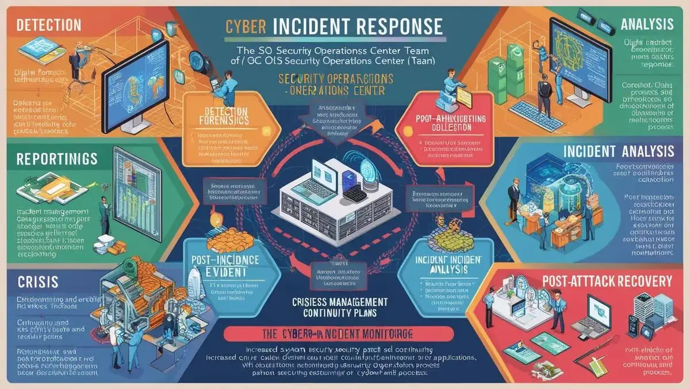
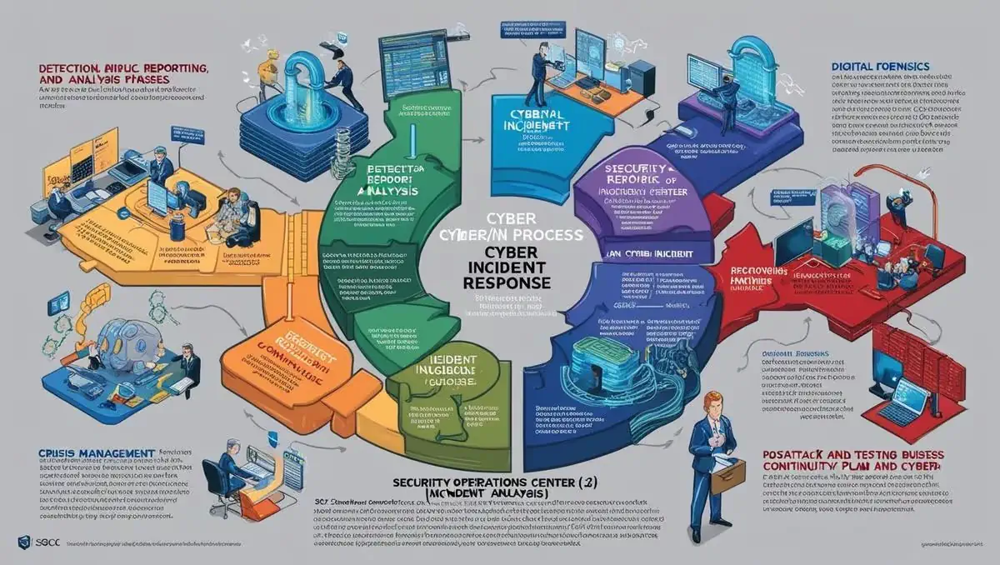

# **KURUMSAL EĞİTİM, SİBER GÜVENLİK VE AĞ GÜVENLİĞİ**

- [Güncel PDF'i İndir](https://www.vebende.com.tr/pdfs/mimarlara-siber-guvenlik-egitimi.pdf)
- [En güncel eğitimlerimiz için www.vebende.com.tr ziyaret edin](https://www.vebende.com.tr/sistem-guvenlik-uzmanlarina-yazilim-gelistiricilere-siber-guvenlik-egitimi)
  
## **Eğitim Süresi**

- **Süre:** 15 gün
- **Ders Süresi:** 50 dakika
- **Eğitim Saati:** 10:00 - 17:00

- > Eğitim formatında eğitimler 50 dakika + 10 dakika moladır. 12:00-13:00 saatleri arasında 1 saat yemek arasındaki verilir. Günde toplam 6 saat eğitim verilir. 15 günlük formatta 90 saat eğitim verilmektedir.

- > Eğitimler uzaktan eğitim formatında tasarlanmıştır. Her eğitim için teams linkleri gönderilir. Katılımcılar bu linklere girerek eğitimlere katılırlar. Ayrıca farklı remote çalışma araçları da eğitmen tarafından tüm katılımlara sunulur. Katılımcılar bu araçları kullanarak eğitimlere katılırlar.

- > Eğitim içeriğinde github ve codespace kullanılır. Katılımcılar bu platformlar üzerinden örnek projeler oluşturur ve eğitmenle birlikte eğitimlerde sorulan sorulara ve taleplere uygun iceriğe cevap verir. Katılımcılar bu araçlarla eğitimlerde sorulan sorulara ve taleplere uygun iceriğe cevap verir.

- > Eğitim yapay zeka destekli kendi kendine öğrenme formasyonu ile tasarlanmıştır. Katılımcılar eğitim boyunca kendi kendine öğrenme formasyonu ile eğitimlere katılırlar. Bu eğitim formatı sayesinde tüm katılımcılar gelecek tüm yaşamlarında kendilerini güncellemeye devam edebilecekler ve her türlü sorunun karşısında çözüm bulabilecekleri yeteneklere sahip olacaklardır.  

## **Siber Güvenlik ve Ağ Güvenliği Uzmanlığı Eğitimi Programı**

Dijital dünyada güvenlik her geçen gün daha kritik bir hale gelmektedir. Kurumlar, sürekli artan siber tehditlerle mücadele etmek için yüksek nitelikli güvenlik uzmanlarına ihtiyaç duymaktadır. Bu eğitim programı, ağ güvenliği, siber tehdit istihbaratı, penetrasyon testleri ve siber olay müdahale gibi alanlarda uzmanlaşmak isteyen profesyonellere yönelik tasarlanmıştır.

Eğitim, siber güvenlik dünyasının en önemli konularını kapsamlı bir şekilde ele almaktadır. Katılımcılar, günümüzün en gelişmiş siber tehditlerine karşı etkili savunma stratejileri geliştirme ve siber saldırılara karşı kurumlarını koruma becerilerini kazanacaklardır. Ayrıca, uygulamalı laboratuvar çalışmaları ile teorik bilgilerin gerçek dünya senaryolarına nasıl uygulandığını görme fırsatı bulacaklardır.

### **Eğitim Hedefi**

Bu eğitim programının temel hedefi, katılımcılara günümüzün hızla gelişen siber tehdit ortamında etkili güvenlik stratejileri geliştirme ve uygulama becerisi kazandırmaktır. Eğitim, ağ güvenliği, siber tehdit istihbaratı, penetrasyon testi, uygulama güvenliği ve siber olay müdahale konularında derinlemesine bilgi ve pratik beceriler sunarak, katılımcıları siber saldırılara karşı koruyabilen ve siber güvenlik olaylarını yönetebilen profesyoneller olarak yetiştirmeyi amaçlamaktadır.

Eğitim sonunda katılımcılar şunları başaracaklardır:

- **Siber tehdit istihbaratı ve tehdit analizi tekniklerini öğrenerek:** Siber tehditlerin kaynağını ve hedeflerini analiz etme becerisi kazanacaklardır.
- **Ağ güvenliği ve güvenlik duvarı yapılandırmalarını yönetme yetkinliği elde ederek:** Kurum içi ağları güvence altına alma yeteneği kazanacaklardır.
- **Penetrasyon testi ve sızma testleri gibi yöntemlerle:** Güvenlik açıklarını tespit etme ve bunlara karşı önlemler geliştirme konusunda deneyim sahibi olacaklardır.
- **Uygulama güvenliği ve güvenli yazılım geliştirme metodolojilerini benimseyerek:** Yazılım ve uygulamalardaki potansiyel güvenlik açıklarını analiz etme ve düzeltme yeteneği kazanacaklardır.
- **Siber olay müdahale ve kriz yönetimi süreçlerini etkin bir şekilde yönetebilme yeteneği ile:** Siber saldırı anında hızlı ve doğru müdahalelerde bulunabileceklerdir.

Eğitim sonunda katılımcılar, siber güvenlik tehditlerine karşı etkin savunma yapabilen, güvenlik zafiyetlerini tespit edebilen, güvenlik olaylarını yöneten ve siber krizlere karşı hazırlıklı profesyoneller olarak görev alabileceklerdir. 

## **Eğitim İçeriği**  

### **Siber Tehdit İstihbaratı ve Tehdit Analizi**

#### **1. Siber Tehdit İstihbaratı (CTI)**  

- **Tanım ve Kullanım:**  
  - Tehdit istihbaratının tanımı, kaynakları ve kullanım alanları.  
  - Açık kaynak istihbaratı (OSINT) ve tehdit verilerinin toplanması, analiz edilmesi.  

#### **2. Tehdit Aktörleri**  

- **Farklı Tehdit Aktörleri ve Motivasyonları:**  
  - Gelişmiş kalıcı tehditler (APT'ler), devlet destekli saldırılar, siber suç grupları ve hacktivistlerin motivasyonları ve teknikleri.  

#### **3. Zararlı Yazılım Analizi**  

- **Zararlı Yazılımlar ve Tersine Mühendislik:**  
  - Zararlı yazılımların çalışma prensipleri, tersine mühendislik teknikleri ve zararlı yazılım tespiti.  

#### **4. Saldırı Yüzeyi Analizi**  

- **Saldırı Yüzeylerinin Tespiti:**  
  - Kurumun ağ yapısının incelenmesi, saldırıya açık noktaların belirlenmesi.  

### **Ağ Güvenliği ve Güvenlik Duvarı Yapılandırması**

#### **1. İleri Seviye Ağ Güvenliği**  

- **Ağ Segmentasyonu ve Honeypot Kullanımı:**  
  - Ağ segmentasyonu, honeypot ve honeynet kullanımı ile güvenli veri akışı sağlama teknikleri.  

#### **2. Güvenlik Duvarı Yönetimi**  

- **Yapılandırma ve Olay Yönetimi:**  
  - Güvenlik duvarlarının yapılandırılması, ileri seviye kuralların tanımlanması, trafik izleme ve olay yönetimi.  

#### **3. Saldırı Tespit ve Önleme Sistemleri (IDS/IPS)**  

- **IDS/IPS Sistemlerinin Kullanımı:**  
  - Saldırı tespit ve önleme sistemlerinin prensipleri, konfigürasyon ve gelişmiş kullanım yöntemleri.  

#### **4. DDoS Saldırıları ve Koruma Yöntemleri**  

- **DDoS Saldırıları ve Anti-DDoS Çözümleri:**  
  - DDoS saldırılarının türleri, korunma yöntemleri ve Anti-DDoS çözümleri.  

### **Penetrasyon Testi ve Sızma Testleri**

#### **1. Penetrasyon Testi Nedir?**  

- **Tanım ve Test Süreçleri:**  
  - Penetrasyon testinin tanımı, test süreçleri ve aşamaları, Black box, white box ve grey box testlerin farkları.  

#### **2. Zafiyet Taraması**  

- **Zafiyetlerin Tespiti ve Araçlar:**  
  - Kurum içi ve dışı ağlarda zafiyetlerin tespiti, açık kaynak zafiyet tarama araçlarının kullanımı (Nmap, OpenVAS, Nessus).  

#### **3. Sızma Testi Araçları**  

- **Metasploit ve Burp Suite Kullanımı:**  
  - Metasploit, Burp Suite, Wireshark gibi ileri seviye araçların kullanımı ve pratik uygulamaları.  

#### **4. Gerçek Dünya Senaryoları**  

- **Saldırı Senaryoları ve Güvenlik Açıkları:**  
  - Gerçek saldırı senaryolarının canlandırılması, kurum içi sızma testleri ile güvenlik açıklarının tespiti ve iyileştirilmesi.  

### **Uygulama Güvenliği ve Güvenlik Açıkları**

#### **1. Uygulama Güvenliğine Giriş**  

- **Web ve Mobil Uygulama Güvenliği:**  
  - Web uygulamaları, mobil uygulamalar ve API güvenliği. Uygulama katmanı güvenlik açıklarının (OWASP Top 10) detaylı incelenmesi.  

#### **2. Kod Analizi ve Güvenli Kod Geliştirme**  

- **Zafiyetlerin Tespiti ve Güvenli Yazılım Geliştirme:**  
  - Kaynak kod analizi, zafiyetlerin tespiti ve güvenli yazılım geliştirme metodolojileri (DevSecOps).  

#### **3. Güvenlik Testleri**  

- **Yaygın Güvenlik Açıkları ve Testler:**  
  - SQL enjeksiyonu (SQL Injection), XSS (Cross-Site Scripting) ve CSRF (Cross-Site Request Forgery) gibi açıkların tespiti ve güvenlik testleri.  

#### **4. İleri Seviye Uygulama Güvenliği**  

- **Zero-day Zafiyetleri ve Exploit Geliştirme:**  
  - Zero-day zafiyetlerinin analizi, exploit geliştirme ve güvenlik test otomasyonu.  

### **Siber Olay Müdahale ve Kriz Yönetimi**

#### **1. Siber Olay Müdahale Süreçleri**  

- **Olay Tespiti ve Raporlanması:**  
  - Siber olayların tespiti, raporlanması ve analiz edilmesi, olay müdahale ekibinin (SOC) görev ve sorumlulukları.  

#### **2. Olay Müdahale ve Adli Bilişim**  

- **Dijital Adli Bilişim Teknikleri:**  
  - Dijital adli bilişim, kanıt toplama, veri kurtarma ve olay analiz süreçleri.  

#### **3. Kriz Yönetimi ve İş Sürekliliği**  

- **Kriz Anında Hızlı Müdahale:**  
  - Siber saldırılar sırasında kriz yönetimi, iş sürekliliği planlarının hazırlanması ve test edilmesi.  

#### **4. Saldırı Sonrası İyileştirme**  

- **Sistem Güvenliğinin Artırılması:**  
  - Saldırı sonrası güvenlik seviyesinin artırılması, sistem yamalarının uygulanması ve sürekli izleme stratejileri.  

## **Eğitim Yöntemi**

- **Teorik Bilgi:** Siber güvenlik tehditleri, güvenlik açıkları, ağ güvenliği, veri koruma ve güvenli yazılım geliştirme gibi temel konular detaylı bir şekilde ele alınacaktır.
- **Etkileşimli Tartışmalar:** Katılımcılar, günlük yaşamda karşılaşabilecekleri siber tehditler ve çözüm önerileri hakkında interaktif tartışmalara katılacaklardır.
- **Simülasyonlar ve Olay Çalışmaları:** Gerçek dünyadan alınan örneklerle siber saldırılara karşı nasıl müdahale edileceği üzerine uygulamalı simülasyonlar yapılacaktır.
- **Proje Tabanlı Öğrenme:** Katılımcılar, öğrendikleri bilgileri bir araya getirerek güvenlik stratejilerini uygulayacakları küçük projeler yapacaklardır.

## **Hedef Kitle**

Bu eğitim, tüm kurum çalışanlarına hitap etmektedir ve özellikle aşağıdaki gruplar için uygundur:

1. **IT Destek ve Yönetim Ekipleri:** Teknolojik altyapının güvenliğini sağlamak ve güvenlik ihlallerine hızlı müdahale etmek isteyen ekipler.
2. **Yazılım Geliştiriciler:** Güvenli yazılım geliştirme süreçlerine hakim olmak isteyen yazılımcılar.
3. **İş Birimi Çalışanları:** Günlük iş akışlarında dijital güvenliği sağlamak isteyen, ancak teknik bilgi gerektirmeyen pratik çözümler arayan çalışanlar.
4. **Yönetici ve Liderler:** Kurum genelinde güvenlik kültürünü aşılamak ve güvenlik politikalarını uygulamak isteyen yöneticiler.
5. **Yeni Mezunlar ve Stajyerler:** Dijital güvenlik konusunda temel bilgi edinmek isteyen genç profesyoneller.

## **Katılımcılardan Beklentilerimiz**

- Katılımcıların temel seviyede bilgisayar kullanım bilgisine sahip olmaları beklenir.
- Dijital güvenlik hakkında genel bilgiye sahip olmaları önerilir, ancak zorunlu değildir.
- Eğitim süresince aktif katılım, soru sorma ve güvenlik bilincini geliştirme konusunda açık fikirli olmaları beklenir.

[Eğitim Materyalleri (Eğitmenlere Özel)](https://github.com/TuncerKARAARSLAN-VB/training-kit-mimarlara-siber-guvenlik-egitimi)
