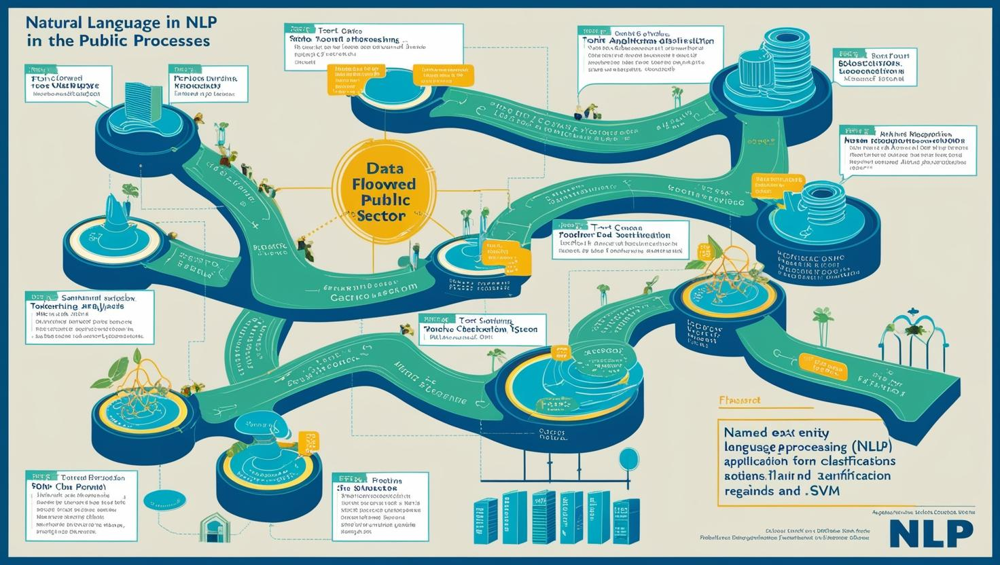
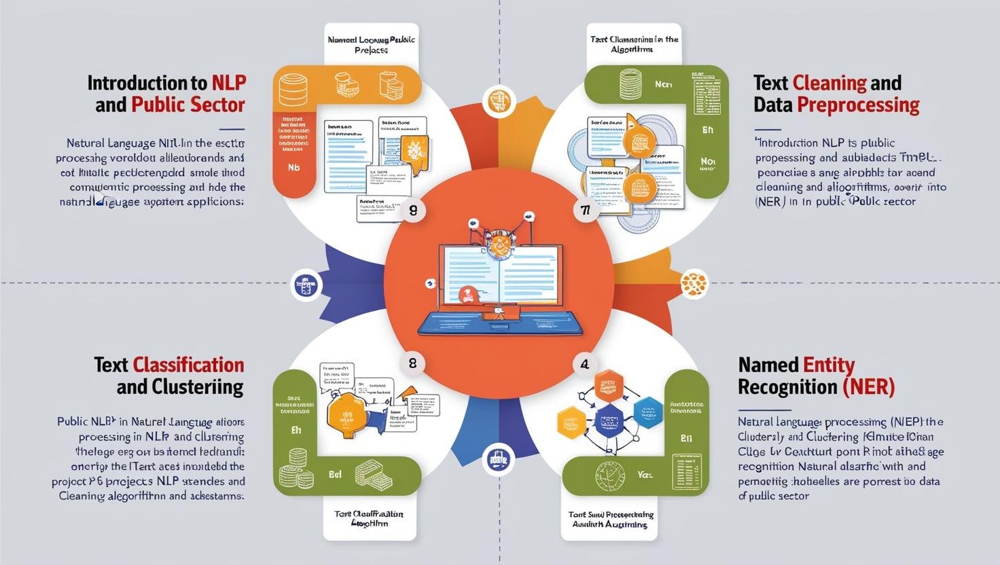

# **Kurumsal NLP Eğitimi - Kurumlar ve Kuruluşlar için Doğal Dil İşleme**

[Download PDF Version](./nlp.pdf)

## **Eğitim Süresi**

- **Format 1**
  - **5 Gün**
  - **Ders Süresi:** 50 dakika
  - **Eğitim Saati:** 10:00 - 17:00

- **Format 2**
  - **12 Gün**
  - **Ders Süresi:** 50 dakika
  - **Eğitim Saati:** 10:00 - 17:00

- > Her iki eğitim formatında eğitimler 50 dakika + 10 dakika moladır. 12:00-13:00 saatleri arasında 1 saat yemek arasındaki verilir. Günde toplam 6 saat eğitim verilir. 5 günlük formatta 30 saat eğitim, 12 günlük formatta toplam 72 saat eğitim verilmektedir. 12 saatlik eğitmde katılımcılar kod yazar ve eğitmenle birlikte sorulan sorulara ve taleplere uygun içerikler ve örnekler çalışılır.

- > Eğitimler uzaktan eğitim formatında tasarlanmıştır. Her eğitim için teams linkleri gönderilir. Katılımcılar bu linklere girerek eğitimlere katılırlar. Ayrıca farklı remote çalışma araçları da eğitmen tarafından tüm katılımlara sunulur. Katılımcılar bu araçları kullanarak eğitimlere katılırlar. 

- > Eğitim içeriğinde github ve codespace kullanılır. Katılımcılar bu platformlar üzerinden örnek projeler oluşturur ve eğitmenle birlikte eğitimlerde sorulan sorulara ve taleplere uygun iceriğe cevap verir. Katılımcılar bu araçlarla eğitimlerde sorulan sorulara ve taleplere uygun iceriğe cevap verir.

- > Eğitim yapay zeka destekli kendi kendine öğrenme formasyonu ile tasarlanmıştır. Katılımcılar eğitim boyunca kendi kendine öğrenme formasyonu ile eğitimlere katılırlar. Bu eğitim formatı sayesinde tüm katılımcılar gelecek tüm yaşamlarında kendilerini güncellemeye devam edebilecekler ve her türlü sorunun karşısında çözüm bulabilecekleri yeteneklere sahip olacaklardır.

## **Kurumlar ve Kuruluşlar için Doğal Dil İşleme**

Bu eğitim, kamu kurumları ve büyük kuruluşlar için **Doğal Dil İşleme (NLP)** projelerinin geliştirilmesi, uygulanması ve yönetilmesi konularında derinlemesine bir eğitim sunmaktadır. Kamu sektöründe NLP teknolojilerinin kullanımı, verimliliği artırma, süreçleri iyileştirme ve vatandaşlara daha hızlı hizmet sunma gibi önemli faydalar sağlar. Katılımcılar, NLP teknolojileri ile kamuya yönelik hizmetlerdeki süreçlerini dijitalleştirerek daha verimli ve etkili projeler geliştirebileceklerdir.

Ayrıca, eğitime **sesli yönlendirme**, **WhatsApp entegrasyonu**, **mail ile kişiye özel ürün katalogu gönderimi** ve **kişiye özel fiyatlandırma** gibi uygulamalı çözümler de dahil edilecektir.

## **Eğitim Hedefi**

Bu eğitim, kamu kurumların dijital dönüşüm sürecinde, doğal dil işleme (NLP) teknolojilerini etkin bir şekilde kullanmalarını sağlamak amacıyla tasarlanmıştır. Katılımcılar, NLP’nin temel prensiplerinden başlayarak, kamu hizmetleri, veri güvenliği, ve vatandaş etkileşimi alanlarında uygulamalı çözümler geliştirme konusunda yetkinlik kazanacaklardır.

- **Kamu Sektöründe NLP Kullanımı**: Katılımcılar, doğal dil işleme teknolojilerinin kamu hizmetlerinde nasıl kullanılabileceğini ve bu teknolojilerin hizmet kalitesini nasıl artırabileceğini öğreneceklerdir.
- **Veri Güvenliği ve KVKK Uyum**: Katılımcılar, kamuya ait verilerin güvenli bir şekilde işlenmesi ve KVKK ile uyumlu projeler geliştirilmesi için gerekli olan bilgileri edineceklerdir.
- **Metin İşleme ve Sınıflandırma Yöntemleri**: Katılımcılar, metin temizleme, sınıflandırma, duygu analizi gibi temel NLP uygulamalarıyla kamu verilerini etkin bir şekilde analiz etmeyi öğreneceklerdir.
- **Sohbet Botları ve Etkileşimli Sistemler**: Katılımcılar, vatandaşlarla etkileşim kuran sohbet botlarını geliştirme ve daha akıllı, kullanıcı dostu sistemler tasarlama yeteneği kazanacaklardır.
- **Derin Öğrenme ve Gelişmiş NLP Uygulamaları**: Katılımcılar, derin öğrenme ve transfer öğrenme gibi teknikleri kullanarak daha sofistike NLP çözümleri geliştirebileceklerdir.
- **Proje Yönetimi ve Etik**: Katılımcılar, NLP projelerinin yönetilmesi, etik sorunlar ve kamu verilerinin güvenliği konularında bilgi sahibi olacaklardır.
- **Gerçek Dünya Uygulamaları**: Eğitim, katılımcıların öğrendikleri teknikleri gerçek dünyada uygulayarak, somut proje örnekleriyle becerilerini pekiştirmelerini sağlayacaktır.

Bu eğitim, kamu sektörü projelerinde doğal dil işleme teknolojilerinin etkin kullanımını sağlayarak, katılımcıların bu alandaki bilgi ve becerilerini geliştirmeyi hedeflemektedir.

## **Eğitim İçeriği**

### **1. Giriş: Doğal Dil İşleme ve Kamu Sektöründeki Rolü**

- **NLP’nin Tanımı ve Önemi**: NLP nedir? Kamu hizmetlerinde ne gibi avantajlar sağlar?
- **Kamu Sektöründe NLP Uygulamaları**: İletişim, vatandaş hizmetleri, veri analizi ve raporlama gibi alanlarda NLP’nin kullanımı.
- **Kamu Verisi ve NLP**: Kamu verilerinin işlenmesi ve özel güvenlik gereksinimleri.
- **NLP Araçları ve Kütüphaneler**: NLTK, spaCy, Hugging Face ve TensorFlow gibi araçlar ve kamu sektörü projelerinde kullanımı.

---

### **2. Metin Temizleme ve Veri Ön İşleme**

- **Metin Temizleme Adımları**: Ham metin verilerinin ön işlenmesi (stopword kaldırma, tokenizasyon, öznitelik çıkarımı).
- **Kamu Verilerinin Özellikleri**: Kamu verisi ile çalışırken dikkat edilmesi gerekenler (veri güvenliği, anonimlik, gizlilik).
- **Veri Temizleme ve Güvenlik**: Kamuya ait hassas verilerin doğru şekilde işlenmesi ve güvenliği.

---

### **3. Metin Sınıflandırma ve Kümeleme**

- **Metin Sınıflandırma Yöntemleri**: Duygu analizi, konu etiketleme, başvuru formları sınıflandırma gibi kamuya yönelik uygulamalar.
  - **Algoritmalar**: Naive Bayes, Logistic Regression, SVM.
  - **Kullanım Alanları**: Sosyal medya geri bildirimleri, vatandaş taleplerinin sınıflandırılması.
- **Kümeleme Yöntemleri**: KMeans, DBSCAN.
  - **Uygulamalar**: Kamu hizmetlerinden gelen verilerin kümelenmesi, toplumsal analiz.

---

### **4. İsimli Varlık Tanıma (NER) ve Kamu Projeleri**

- **NER’nin Temelleri**: Kişi, organizasyon, yer isimleri gibi varlıkların tanınması.
- **NER Kullanımı**: Kamuya ait yazılı belgelerdeki önemli varlıkların tanınması (hukuki belgeler, raporlar).
- **Derin Öğrenme Yöntemleri**: LSTM ve CRF ile İsimli Varlık Tanıma uygulamaları.
- **Proje Örneği**: Kamu belgelerinde kişi adları ve kurumlar arası ilişki analizi.

---

### **5. Sohbet Botları ve Kamu Kurumlarına Özel Uygulamalar**

- **Sohbet Botları**: Kullanıcı etkileşimli botlar ile vatandaş hizmetleri sunma.
  - **Rasa ile Sohbet Botu Geliştirme**: Özelleştirilmiş diyalog yönetimi, veri tabanlı soru-cevap sistemleri.
  - **Transformer Modelleri ile Sohbet Botları**: GPT-3 ve BERT kullanarak daha doğal sohbet botları.
- **Uygulama Örneği**: Belediye veya sağlık kurumlarına yönelik otomatik bilgi verme sistemleri.

---

### **6. Duygu ve Yorum Analizi**

- **Duygu Analizi (Sentiment Analysis)**: Kamu geri bildirimlerinin (oylamalar, şikayetler) analizi.
- **Yorum Analizi**: Vatandaşların, sosyal medya ve online platformlarda paylaştığı geri bildirimlerin analizi.
- **Proje Örneği**: Sosyal medya paylaşımlarının analiz edilmesi ve kamu politikalarına etkisinin incelenmesi.

---

### **7. Derin Öğrenme ve NLP Uygulamaları**

- **Derin Öğrenme Teknikleri**: NLP projelerinde kullanılan sinir ağları, LSTM, RNN, Transformer tabanlı modeller.
- **BERT ve GPT-3 ile Gelişmiş NLP Uygulamaları**: Metin anlayışı ve yazı üretme.
- **Transfer Öğrenme**: Kamuya özel verilerle transfer öğrenme yöntemlerinin uygulanması.

---

### **8. Kamu Kurumlarında NLP Proje Yönetimi ve Etik**

- **Proje Yönetimi**: NLP projelerinde ekip çalışması, zaman yönetimi ve proje sürecinin yönetilmesi.
- **Etik ve Veri Güvenliği**: Kamu verilerinin güvenliği, etik sorunlar, veri gizliliği.
- **Halkla İletişim ve Yasal Gereklilikler**: Kamu projelerinde iletişimde dikkate alınması gereken yasal düzenlemeler.

---

### **9. Gerçek Dünya Proje Uygulamaları ve Vaka Çalışmaları**

- **Proje 1**: Belediye için sohbet botu geliştirilmesi.
- **Proje 2**: Vatandaş geri bildirimlerinin duygu analizi ile değerlendirilmesi.
- **Proje 3**: Kamu sektöründeki metin verilerinin sınıflandırılması ve özetlenmesi.
- **Proje 4**: Sesli yönlendirme sistemleri entegre edilerek vatandaşlara hızlı erişim imkânı sağlanması.
- **Proje 5**: WhatsApp entegrasyonu ile vatandaşların anlık sorularına cevap verilmesi.

## **Eğitim Yöntemi:**

- **Teorik Sunumlar ve Kavramsal Anlatım**: Eğitim, NLP'nin temel kavramları, yöntemleri ve kamu sektöründe nasıl kullanılacağı hakkında bilgilendirici sunumlarla başlayacaktır. Katılımcılar, NLP'nin kamu hizmetlerinde sunduğu avantajları ve çeşitli araçları öğrenerek güçlü bir teorik altyapıya sahip olacaklardır.

- **Uygulamalı Çalışmalar ve Canlı Demonstrasyonlar**: Eğitimde, NLP uygulamalarıyla ilgili canlı gösterimler yapılacak ve katılımcılara adım adım rehberlik edilecektir. Katılımcılar, metin sınıflandırma, duygu analizi, sohbet botları geliştirme gibi görevleri kendi bilgisayarlarında uygulamalı olarak gerçekleştireceklerdir.

- **Vaka Çalışmaları ve Gerçek Dünya Projeleri**: Eğitim sırasında, gerçek dünya kamu sektörü projelerinden örnekler incelenecek ve bu projelerde karşılaşılan zorluklar ile çözüm önerileri tartışılacaktır. Katılımcılar, bu vaka çalışmaları üzerinden kendi projeleri için fikir geliştirecek ve uygulamalı çözümler üreteceklerdir.

- **Grup Çalışmaları ve Proje Geliştirme**: Katılımcılar, küçük gruplara ayrılarak belirli NLP projeleri üzerinde çalışacaklardır. Bu süreç, ekip çalışması, proje yönetimi ve problem çözme becerilerini geliştirmek için fırsat sunacaktır. Eğitim sonunda, katılımcılar gruplarıyla tamamladıkları projeleri sunacaklardır.

- **Bireysel Proje ve Değerlendirme**: Eğitim sonunda, her katılımcıya kendi NLP projesini geliştirme görevi verilecektir. Katılımcılar, öğrendikleri bilgileri ve teknikleri kullanarak kendi projelerini oluşturacak ve eğitmenler tarafından bireysel geri bildirim alacaklardır.

- **Soru-Cevap ve Tartışma Oturumları**: Eğitim boyunca katılımcıların sorularına anında cevap verilecek ve tartışma oturumları düzenlenecektir. Bu sayede katılımcılar, konulara dair daha derinlemesine bilgi edinme fırsatı bulacaklardır.

## **Hedef Kitle:**

Bu eğitim, kamu sektöründe teknoloji ve doğal dil işleme (NLP) teknolojilerini kullanmayı hedefleyen kurumlar için tasarlanmıştır.

1. **Kamu Sektörü Çalışanları ve Yöneticileri**: Kamu kurumlarında çalışan ve vatandaşlara yönelik dijital hizmetlerin iyileştirilmesinden sorumlu olan, hizmetlerde verimlilik ve etkileşimi artırmayı amaçlayan yöneticiler ve uzmanlar. Bu grup, NLP'yi hizmet içi süreçleri optimize etmek, vatandaş geri bildirimlerini analiz etmek ve otomatik sistemler oluşturmak amacıyla kullanabilir.

2. **Veri Bilimcileri ve Analistler**: Kamu verisi üzerinde analiz yapan ve bu verilerden anlamlı sonuçlar çıkaran profesyoneller. NLP tekniklerini kullanarak büyük veri kümelerinden metin verisi işleme ve analiz etme becerilerini geliştirmeyi hedefleyen veri bilimcileri için faydalıdır.

3. **Yazılım Geliştiriciler ve Mühendisler**: Kamu sektörü projelerinde çalışan yazılım geliştiricileri, NLP teknolojilerini entegre etmek isteyen mühendisler. Bu eğitim, onlara doğal dil işleme ile ilgili temel bilgiler ve gelişmiş uygulamalar hakkında beceri kazandırmayı amaçlar.

4. **IT ve Teknoloji Departmanları**: Kamu kurumlarındaki bilgi teknolojileri ekipleri, yeni nesil dijital çözümler geliştirmek için NLP teknolojilerine ihtiyaç duyan ekipler. Bu eğitim, kamu sektöründeki dijital dönüşüm sürecinde yer alan profesyonelleri hedef alır.

5. **Hukuk ve Kamu Politika Uzmanları**: Kamuya ait yazılı belgelerdeki metinlerin analiz edilmesi ve sınıflandırılması üzerine çalışacak olan hukuk ve kamu politika uzmanları. NLP, hukuki belgelerde isimli varlık tanıma, duygu analizi gibi işlemler için kullanılabilir.

6. **Araştırmacılar ve Akademisyenler**: Kamu sektöründe ve NLP alanında araştırmalar yapan akademisyenler ve araştırmacılar. Bu grup, NLP teknolojilerinin kamu hizmetlerinde nasıl uygulanabileceği konusunda derinlemesine bilgi edinmek isteyebilir.

7. **Proje Yöneticileri ve Danışmanlar**: Kamu sektörü projelerinde yer alan ve NLP projelerinin yönetiminden sorumlu olan profesyoneller. Bu eğitim, proje yönetimi ve NLP projelerinin etkili bir şekilde uygulanması için gerekli bilgiler sağlar.

## **Katılımcılardan Beklentilerimiz:**

Bu eğitime katılacak katılımcılardan beklediğimiz bazı temel noktalar şunlardır:

1. **Temel Bilgi Düzeyi**: Katılımcıların, temel bilgisayar ve yazılım bilgisine sahip olmaları beklenir. Ayrıca, temel programlama bilgisi (özellikle Python) ve veri işleme konusunda deneyim sahibi olmaları eğitimin etkinliğini artıracaktır.

2. **Aktif Katılım**: Katılımcılardan, derslerde ve uygulamalı çalışmalarda aktif bir şekilde katılım göstermeleri beklenmektedir. Bu, öğrenilen bilgilerin pekiştirilmesine ve gerçek dünya uygulamalarıyla ilişkilendirilmesine yardımcı olacaktır.

3. **Uygulamalı Çalışmalara Katılım**: Eğitimin pratik kısmı oldukça önemlidir. Katılımcıların, örnek projeler ve vaka çalışmaları üzerinde çalışarak öğrendiklerini gerçek dünya senaryolarında uygulamaları beklenmektedir.

4. **İleri Düzey Sorulara İlgi**: Katılımcıların, NLP teknolojileri ile ilgili ileri düzey soruları sormaktan çekinmemeleri, teknolojiyi derinlemesine anlamaları için önemlidir.

5. **İşbirliği ve Grup Çalışmaları**: Eğitimin bazı bölümlerinde grup çalışmaları yapılacaktır. Katılımcılardan, grup çalışmalarına katkı sağlamak ve işbirliği içinde çalışmak beklenmektedir.

6. **Teknolojiye Açıklık**: NLP ve derin öğrenme teknolojileri gibi yeni nesil teknolojilere açık olmaları, öğrenme süreçlerini hızlandıracaktır. Katılımcıların, yeni teknolojileri ve araçları keşfetmeye istekli olmaları gerekmektedir.

7. **Yenilikçi Düşünme ve Problem Çözme Yeteneği**: Katılımcılardan, eğitim boyunca ortaya çıkan sorunlara yenilikçi çözümler geliştirmeleri, öğrendikleri teorik bilgileri pratiğe dökme konusunda yaratıcı olmaları beklenmektedir.

8. **Eğitim Sonrası Uygulama**: Katılımcıların, eğitim sonunda edindikleri bilgileri kendi çalışma alanlarında uygulamaya koyarak, NLP’nin kamu sektöründeki potansiyel faydalarını gerçekleştirebilmeleri önemlidir.

9. **Geri Bildirim ve İletişim**: Katılımcılardan, eğitim sürecinde karşılaştıkları zorluklar ve geliştirilmesi gereken alanlarla ilgili geri bildirimde bulunmaları beklenmektedir. Bu geri bildirimler, hem eğitim içeriği hem de katılımcıların öğrenme deneyimleri için faydalıdır.

10. **Zamanında Katılım**: Eğitim sürecinde aktif bir şekilde yer almak ve verilen süreler içinde katılım sağlamak, eğitimin etkinliğini artıracak ve katılımcıların öğrenme süreçlerini hızlandıracaktır.

Bu beklentiler doğrultusunda, katılımcılar daha verimli bir eğitim deneyimi yaşayacak ve NLP teknolojilerini kamu sektörü uygulamalarında başarıyla kullanabilecek bilgi ve becerilere sahip olacaklardır.

[Eğitim Materyalleri (Eğitmenlere Özel)](https://github.com/TuncerKARAARSLAN-VB/training-kit-nlp-dogal-dil-isleme-proje-gelistirme)
