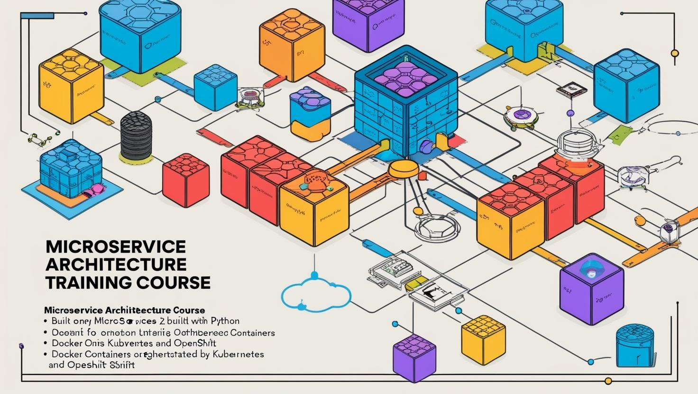
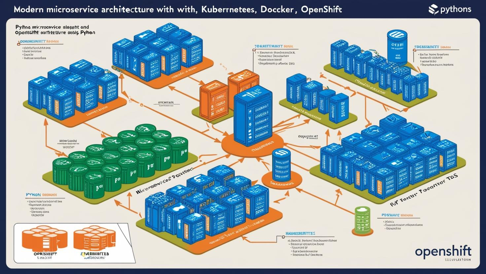

# **Python ile Microservis Mimarisi ve Yayınlama (Kubernetes, Docker, OpenShift)**

- [Güncel PDF'i İndir](https://www.vebende.com.tr/pdfs/python.pdf)
- [En güncel eğitimlerimiz için www.vebende.com.tr ziyaret edin](https://www.vebende.com.tr/python-microservis-yazilimlari)

## **Eğitim Süresi**

- **Süre:** 5 gün
- **Ders Süresi:** 50 dakika
- **Eğitim Saati:** 10:00 - 17:00

- > Her iki eğitim formatında eğitimler 50 dakika + 10 dakika moladır. 12:00-13:00 saatleri arasında 1 saat yemek arasındaki verilir. Günde toplam 6 saat eğitim verilir. 5 günlük formatta 30 saat eğitim verilmektedir.

- > Eğitimler uzaktan eğitim formatında tasarlanmıştır. Her eğitim için teams linkleri gönderilir. Katılımcılar bu linklere girerek eğitimlere katılırlar. Ayrıca farklı remote çalışma araçları da eğitmen tarafından tüm katılımlara sunulur. Katılımcılar bu araçları kullanarak eğitimlere katılırlar.

- > Eğitim içeriğinde github ve codespace kullanılır. Katılımcılar bu platformlar üzerinden örnek projeler oluşturur ve eğitmenle birlikte eğitimlerde sorulan sorulara ve taleplere uygun iceriğe cevap verir. Katılımcılar bu araçlarla eğitimlerde sorulan sorulara ve taleplere uygun iceriğe cevap verir.

- > Eğitim yapay zeka destekli kendi kendine öğrenme formasyonu ile tasarlanmıştır. Katılımcılar eğitim boyunca kendi kendine öğrenme formasyonu ile eğitimlere katılırlar. Bu eğitim formatı sayesinde tüm katılımcılar gelecek tüm yaşamlarında kendilerini güncellemeye devam edebilecekler ve her türlü sorunun karşısında çözüm bulabilecekleri yeteneklere sahip olacaklardır.

## **Microservis Mimarisi ve Python ile Uygulama Geliştirme**

Bu eğitim, microservis mimarisi, Docker, Kubernetes, OpenShift ve uygulama güvenliği gibi konuları kapsayarak, katılımcılara Python ile güçlü ve ölçeklenebilir mikro hizmetler geliştirme yeteneği kazandıracaktır. Eğitim, aşağıdaki temel başlıklarda derinlemesine bilgi sunmaktadır:

1. **Microservis Mimarisi ve Python’a Giriş**: Microservislerin temellerini öğrenip, Python ile hızlı API geliştirme framework'leri (Flask, FastAPI, Django) hakkında bilgi sahibi olacaksınız. Ayrıca, mikro hizmetler için uygun veritabanı tasarımı üzerine de bilgi edinirsiniz.

2. **Docker ve Konteynerleştirme**: Docker ile Python uygulamalarını konteynerleştirmeyi ve çoklu mikro servisi yönetmek için Docker Compose kullanmayı öğreneceksiniz.

3. **Kubernetes ile Orkestrasyon**: Kubernetes üzerinde Python mikro servislerinin nasıl dağıtılacağını, servis yönlendirmeyi, yük dengeleme ve auto-scaling gibi konuları kapsamlı bir şekilde inceleyeceksiniz.

4. **OpenShift ile Microservis Yönetimi**: OpenShift platformunda mikro hizmetlerin dağıtımı, CI/CD süreçleri ve güvenlik yönetimi üzerinde durulacak.

5. **Mikro Servislerin Yönetimi ve İzlenmesi**: Prometheus ve Grafana ile izleme, EFK Stack ile log yönetimi ve Jaeger ile hata yönetimi teknikleriyle mikro servislerinizi optimize edeceksiniz.

6. **Uygulama Güvenliği ve İleri Düzey Konular**: OAuth2, JWT ve servis mesh gibi güvenlik konuları ile mikro servislerinizin güvenliğini sağlamak için gerekli becerileri kazanacaksınız.

## **Eğitim Hedefi**

Bu eğitimin amacı, katılımcılara modern yazılım geliştirme süreçlerinde önemli bir yer tutan microservis mimarisini anlamalarını ve Python ile mikro hizmet tabanlı uygulamalar geliştirme becerisi kazandırmaktır. Eğitimi tamamlayan katılımcılar, aşağıdaki hedeflere ulaşmış olacaktır:

1. **Microservis Mimarisi Temelleri**: Microservis mimarisinin avantajlarını ve zorluklarını, monolitik yapılarla karşılaştırarak kavrayabilecek ve büyük uygulamaları mikro hizmetlere ayırarak nasıl geliştireceklerini öğrenebileceklerdir.

2. **Python ile Microservis Geliştirme**: Python tabanlı framework'ler (Flask, FastAPI, Django Rest Framework) kullanarak RESTful API'ler geliştirme becerisi kazanacak, ayrıca mikro hizmetler için veritabanı tasarımını uygulamalı olarak öğreneceklerdir.

3. **Docker ile Konteynerleştirme**: Python uygulamalarını Docker ile konteynerleştirerek taşınabilir, izole ve verimli çalışma ortamları yaratabileceklerdir.

4. **Kubernetes ile Orkestrasyon**: Kubernetes üzerinde Python mikro servislerini dağıtma, yönetme ve ölçeklendirme konularında deneyim kazanacak, mikro servislerin birbirine bağlanması ve yük dengeleme işlemlerini gerçekleştirebileceklerdir.

5. **OpenShift ile Yönetim ve Güvenlik**: OpenShift platformu kullanarak mikro hizmetlerin dağıtımını ve güvenliğini sağlama, ayrıca CI/CD süreçlerini entegrasyonlarla otomatikleştirme becerisi kazanacaklardır.

6. **Mikro Servis İzleme ve Yönetim**: Prometheus, Grafana ve EFK Stack gibi araçlarla mikro servislerin izlenmesi ve log yönetimi hakkında derinlemesine bilgi sahibi olacak, Jaeger ve health check kullanarak hata yönetimini optimize edebileceklerdir.

7. **Uygulama Güvenliği ve En İyi Uygulamalar**: Mikro servislerin güvenliğini sağlamak için OAuth2, JWT, ve servis mesh gibi ileri düzey güvenlik tekniklerini öğrenerek, uygulamalarını güvenli bir şekilde yöneteceklerdir.

Bu eğitim, katılımcıların mikro hizmet mimarisi, konteynerleştirme, orkestrasyon ve güvenlik konularında yetkinlik kazanmalarını sağlayarak, modern yazılım geliştirme dünyasında başarılı projelere imza atmalarına yardımcı olacaktır.

## **Eğitim İçeriği**

### **Bölüm 1: Microservis Mimarisi ve Python’a Giriş**

1. **Microservis Mimarisi Nedir?**
   - **Microservis Tanımı ve Temel Kavramlar:**  
     Microservisler, büyük, monolitik uygulamaları küçük, bağımsız çalışabilen servisler halinde bölerek geliştirmeyi amaçlayan bir yazılım mimarisidir. Her bir mikro servis tek bir işlevi yerine getirir ve bağımsız olarak çalışabilir.
   - **Monolitik Yapılar ile Microservis Mimarisi Karşılaştırması**
   - **Microservislerin Avantajları ve Zorlukları:**
     - Avantajlar: Esneklik, ölçeklenebilirlik, hızlı dağıtım
     - Zorluklar: Servisler arası iletişim, veri tutarlılığı, hata yönetimi

2. **Python ile Microservis Geliştirme**
   - **Python İçin Microservis Framework'leri:**
     - **Flask ve FastAPI:** Flask, mikro hizmetler için minimal bir web çatısı olarak, FastAPI ise hızlı API geliştirme için idealdir.
     - **Django Rest Framework (DRF):** Django ile RESTful API’ler geliştirmek için kullanılır.
   - **Python ile HTTP ve REST API Geliştirme:**  
     - HTTP protokolü, GET, POST, PUT, DELETE istekleri ve RESTful API ilkeleri.
   - **Microservisler İçin Veritabanı Tasarımı:**  
     - Her mikro servisin kendi veritabanına sahip olması, veri tutarlılığı ve entegrasyonu.
     - Veritabanı yönetimi için Python araçları: SQLAlchemy, Tortoise ORM, Django ORM.

---

### **Bölüm 2: Docker ve Konteynerleştirme**

1. **Docker'a Giriş ve Temel Kavramlar**
   - **Docker Nedir?**  
     Docker, yazılım uygulamalarının, bağımlılıklarıyla birlikte bir konteynırda paketlenmesini sağlar. Bu, taşınabilirlik ve izole çalışma ortamları sağlar.
   - **Docker’ın Temel Bileşenleri:**
     - **Docker Image**: Yazılımın tüm bağımlılıklarıyla birlikte paketlendiği dosya.
     - **Docker Container**: Docker Image’tan çalıştırılabilir bir konteyner.
     - **Dockerfile**: Uygulamanın nasıl paketleneceğini ve çalıştırılacağını belirten dosya.
   - **Docker Komutları ve Kullanım:**
     - `docker build`, `docker run`, `docker ps`, `docker logs`
     - Docker Compose ile çoklu konteyner yönetimi

2. **Python Uygulamasını Docker ile Konteynerleştirme**
   - **Python Uygulaması İçin Dockerfile Yazma**
   - **Konteynerleştirilmiş Python Microservisini Çalıştırma ve Test Etme**
   - **Docker Compose ile Microservislerin Yönetilmesi:**
     - Çoklu Python mikro servislerini bir arada çalıştırma
     - Veritabanı bağlantılarının yapılandırılması
     - Konteyner ağlarının oluşturulması

---

### **Bölüm 3: Kubernetes ile Orkestrasyon**

1. **Kubernetes Nedir?**
   - **Kubernetes Temel Kavramları ve Yapısı:**
     - **Pod**: Kubernetes'teki en küçük dağıtım birimi.
     - **Deployment**: Pod’ların çoğaltılması ve yönetilmesi için kullanılan yapı.
     - **Service**: Mikro servislerin birbirine bağlanmasını ve dış dünyaya açılmasını sağlar.
     - **ConfigMap ve Secret**: Konfigürasyon ve gizli verilerin yönetilmesi.
     - **Ingress Controller**: Dışarıdan gelen isteklerin yönlendirilmesi.
   - **Kubernetes Cluster Yapılandırması:**
     - Kubernetes kontrol düğümü ve işçi düğümleri
     - Kubernetes API Server, Controller Manager, Scheduler, Kubelet

2. **Python Microservislerinin Kubernetes Üzerinde Dağıtılması**
   - **Kubernetes Pod ve Deployment Oluşturma:**
     - Kubernetes YAML dosyaları ile deployment oluşturma
     - Replikasyon ve ölçekleme
   - **Kubernetes ile Servis Yönlendirme:**
     - Python mikro servislerinin birbirine bağlanması
     - Kubernetes Service türleri: ClusterIP, NodePort, LoadBalancer
   - **Kubernetes ile Yük Dengeleme ve Auto-Scaling:**
     - Yük dengeleme ve otomatik ölçekleme (Horizontal Pod Autoscaler)
     - Kaynak yönetimi ve limitler (CPU, bellek)

3. **Kubernetes ile DevOps Entegrasyonu**
   - **CI/CD (Continuous Integration/Continuous Deployment) Pipeline’ları:**  
     - Kubernetes üzerinde CI/CD süreçlerinin yapılandırılması
     - Jenkins, GitLab CI, CircleCI ile Kubernetes entegrasyonu

---

### **Bölüm 4: OpenShift ile Microservislerin Yönetimi**

1. **OpenShift Nedir?**
   - **OpenShift’in Temel Özellikleri ve Kubernetes ile Farkları**
     - OpenShift, Kubernetes üzerine inşa edilen ve kurumsal düzeyde güvenlik, çoklu ortam yönetimi ve uygulama yönetim araçları sağlayan bir platformdur.
   - **OpenShift Cluster Yapılandırması**
     - OpenShift projeleri, namespace'ler, kullanıcı yönetimi
     - OpenShift CLI (oc) kullanımı

2. **Python Microservislerini OpenShift Üzerinde Yayınlama**
   - **OpenShift ile Deployment ve Pod Yönetimi**
   - **OpenShift Route ile Dış Erişim Sağlama**
   - **OpenShift ile Kaynak Yönetimi ve İzinler:**
     - OpenShift Security Context, Network Policies, Role-Based Access Control (RBAC)
     - OpenShift Secrets ve ConfigMaps yönetimi

3. **OpenShift CI/CD Entegrasyonu**
   - **Jenkins ile OpenShift Entegrasyonu**
   - **OpenShift Pipelines (Tekton) ile CI/CD Otomasyonu**
   - **Automated Builds and Deployments**

---

### **Bölüm 5: Mikro Servislerin Yönetimi ve İzlenmesi**

1. **Mikro Servislerin İzlenmesi (Monitoring)**
   - **Prometheus ve Grafana ile İzleme:**  
     - Prometheus kullanarak microservislerin izlenmesi
     - Grafana ile metriklerin görselleştirilmesi
   - **Elasticsearch, Fluentd ve Kibana (EFK Stack) ile Log Yönetimi:**
     - Mikro servislerin loglarının toplanması ve analizi

2. **Mikro Servislerin Hata Yönetimi ve Debugging**
   - **Distributed Tracing ve Jaeger ile İzleme:**  
     - Microservisler arasında isteklerin izlenmesi
     - Jaeger kullanarak hataların ve gecikmelerin tespiti
   - **Health Check ve Readiness Probe ile Servis Sağlığı İzleme**

---

### **Bölüm 6: Uygulama Güvenliği ve İleri Düzey Konular**

1. **Mikro Servislerde Güvenlik**
   - **OAuth2 ve JWT ile Kimlik Doğrulama ve Yetkilendirme**
   - **Mutual TLS ile Güvenli Mikro Servis İletişimi**
   - **API Gateway ve Rate Limiting ile Güvenlik**

2. **Servis Mesh ile Mikro Servis İletişimi ve Güvenliği**
   - **Istio ve Linkerd ile Servis Mesh Kullanımı**
   - **Servis Mesh ile Tracing ve Monitoring**

3. **Yüksek Erişilebilirlik ve Felaket Kurtarma**
   - **Kubernetes ve OpenShift ile Yüksek Erişilebilirlik**
   - **Failover ve Yedekleme Stratejileri**

---

### **Bölüm 7: Proje Yönetimi ve En İyi Uygulamalar**

1. **Microservis Proje Yönetimi**
   - **Microservis Geliştirme ve Dağıtımında En İyi Uygulamalar**
   - **CI/CD ile Sürekli Dağıtım ve Sürekli Entegrasyon**
   - **Modülerlik ve Servis Bağımlılıkları Yönetimi**

2. **Sürekli Öğrenme ve İyileştirme**
   - **Mikro Servislerin Sürekli Geliştirilmesi

   

## **Eğitim Yöntemi**

- **Canlı Oturumlar ve Uygulamalı Çalışmalar:** Eğitimde, her bölümde konu anlatımı ardından, katılımcılara uygulamalı alıştırmalar yapılacaktır. Bu alıştırmalar, gerçek zamanlı mikro hizmet geliştirme ve yönetim senaryoları üzerinde odaklanacaktır.

- **Mentorluk ve Grup Çalışmaları:** Katılımcılara, grup içinde işbirliği yapma, birbirlerine geri bildirim verme ve uzman eğitmenlerden mentorluk alarak sorun çözme fırsatı sunulacaktır. Bu yöntem, katılımcıların hem teorik bilgilerini pekiştirmelerini hem de uygulama deneyimlerini artırmalarını sağlayacaktır.

**Destek ve Geri Bildirim:**

- **Eğitmen Desteği:** Katılımcılar eğitim süresince, eğitmenlerinden birebir destek alabilir ve teknik sorularını çözebilirler.

**Katılımcı Gereksinimleri:**

- Temel Python bilgisi gereklidir. Eğitimde Python dilini kullanarak mikro hizmetler geliştireceğiz, bu nedenle Python'a aşina olmak önemlidir.
- Docker, Kubernetes ve OpenShift gibi teknolojiler hakkında temel bilgi, eğitim sürecini daha verimli hale getirecektir, ancak bu konular eğitimin içinde detaylıca ele alınacaktır.

**Eğitim Sonrası Katılımcı Yararları:**

- Katılımcılar, Python ile mikro servis geliştirme, Docker ve Kubernetes kullanarak konteynerleştirme ve orkestrasyon yapabilme becerisi kazanacaklardır.
- Gerçek dünyada uygulayabilecekleri pratik bilgi ve deneyimle donanmış olacaklardır.
- Mikro servis güvenliği, izleme, hata yönetimi gibi ileri düzey konularda yetkinlik kazandıkları için, endüstrideki projelerde etkin rol alabileceklerdir.

Bu eğitim, katılımcılara modern yazılım geliştirme süreçlerinde başarılı olmak için gerekli tüm bilgi ve becerileri kazandırmayı amaçlamaktadır.

## **Hedef Kitle**

1. **Yazılım Geliştiriciler (Junior ve Senior Seviye):**  
   - Python ve mikro hizmet mimarisi ile ilgili temel bilgiye sahip yazılım geliştiriciler, mikro servis geliştirme becerilerini ileriye taşıyacaklar.
   - Docker, Kubernetes gibi konteyner teknolojilerini kullanarak uygulama yönetimini öğrenmek isteyen geliştiriciler.

2. **DevOps Uzmanları ve Sistem Yöneticileri:**  
   - Mikro servislerin dağıtımı ve yönetimi konusunda deneyim kazanmak isteyen DevOps mühendisleri.
   - Kubernetes, Docker ve OpenShift gibi platformlar üzerinde uygulama izleme ve yönetim konularında bilgi sahibi olmak isteyen sistem yöneticileri.

3. **Yazılım Mimarı ve Teknoloji Liderleri:**  
   - Mikro servis mimarisini anlamak ve mevcut projelerine entegre etmek isteyen yazılım mimarları.
   - Sistemlerin ölçeklenebilirliğini ve yönetilebilirliğini iyileştirmek isteyen teknoloji liderleri.

4. **Startup ve KOBİ Geliştiricileri:**  
   - Küçük ve orta ölçekli işletmelerde (KOBİ) veya startup şirketlerinde çalışan yazılım geliştiriciler, mikro servisler ve konteyner teknolojileri kullanarak ölçeklenebilir uygulamalar oluşturmak isteyenler.

5. **Kariyer Değişikliği Yapmak İsteyen Yazılımcılar:**  
   - Web uygulama geliştirme ya da başka yazılım alanlarında deneyim kazanmış olan ancak mikro servis mimarisine geçiş yapmak isteyen profesyoneller.

6. **Eğitim ve Mentorluk Arayan Profesyoneller:**  
   - Mikro servisler hakkında daha derinlemesine bilgi edinmek, gelişmiş yazılım mimarisi becerilerini öğrenmek ve iş dünyasında fark yaratmak isteyen profesyoneller.

## **Katılımcılardan Beklentilerimiz**

**Katılımcılardan Beklentiler:**

Bu eğitimi başarıyla tamamlamak ve maksimum fayda sağlamak için katılımcılardan aşağıdaki beklentiler bulunmaktadır:

1. **Aktif Katılım ve İlgili Olma:**  
   - Eğitim boyunca interaktif tartışmalara katılmak ve öğreticilere sorular sormak.
   - Gerçek dünyadaki senaryolarla ilgili örnekler üzerinden tartışmalar yapmak.

2. **Temel Yazılım Geliştirme Bilgisi:**  
   - Python dilinde temel bilgiye sahip olmak (değişkenler, döngüler, fonksiyonlar vb.).
   - Web geliştirme ve API tasarımı hakkında temel bilgi edinmiş olmak.

3. **Konteyner Teknolojilerine İlgi:**  
   - Docker ve Kubernetes gibi konteyner yönetim platformlarına yönelik temel anlayışa sahip olmak.
   - Bu araçları öğrenmeye istekli ve gelişmiş düzeyde kullanmaya yönelik motivasyon.

4. **Pratik Çalışmalar ve Uygulamalar:**  
   - Eğitimde verilen teorik bilgileri pratik çalışmalarla pekiştirmek için uygulama yapmaya istekli olmak.
   - Mikro servislerin geliştirilmesi, test edilmesi ve yönetilmesi konularında pratik yapma.

5. **Kendi Bilgisayarında Eğitim Ortamının Hazırlanması:**  
   - Eğitimde kullanılacak araçların (Docker, Kubernetes, Python framework’leri vb.) kurulumlarını önceden yaparak, uygulamalı derslerde aktif olabilecek ortamı hazırlamak.
   - Eğitim için gerekli olan yazılımları ve araçları kurmak.

6. **Problem Çözme Yeteneği:**  
   - Karşılaşılan teknik sorunları çözmek için analitik düşünme ve yaratıcı çözüm üretme becerisi sergilemek.
   - Kendi projelerindeki mikro servis altyapılarıyla ilgili soruları ve zorlukları bu eğitimde çözümlemek.

7. **Zaman Yönetimi ve Dönemsel Görevlerin Tamamlanması:**  
   - Eğitim sırasında verilen uygulamalı görevleri zamanında tamamlamak.
   - Her bölüm sonunda öğrendiklerini küçük projelerle pekiştirmek için gereken zamanı ayırmak.

8. **Açık Fikirli Olma ve Sürekli Öğrenmeye İstekli Olma:**  
   - Yeni konseptlere açık olmak ve öğrenmeye yönelik hevesli bir tutum sergilemek.
   - Eğitimin sonrasında, mikro servis mimarisi ve ilgili teknolojiler hakkında daha derinlemesine öğrenme isteği taşımak.

Bu beklentiler, katılımcıların eğitim sürecinde aktif bir şekilde yer almalarını, öğrenilen bilgileri günlük iş akışlarına entegre etmelerini ve mikro servis teknolojileriyle daha verimli çalışabilmelerini sağlamayı hedeflemektedir.

[Eğitim ana materyalleri, sadece eğitmenler için](https://github.com/TuncerKARAARSLAN-VB/training-kit-python-ile-mikro-servis-mimarisi)
