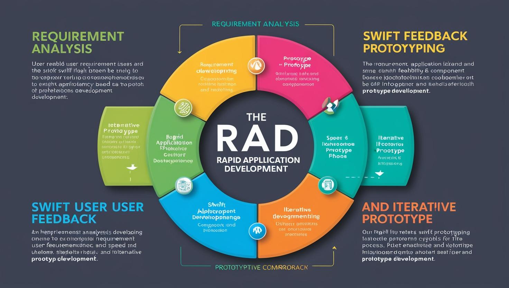
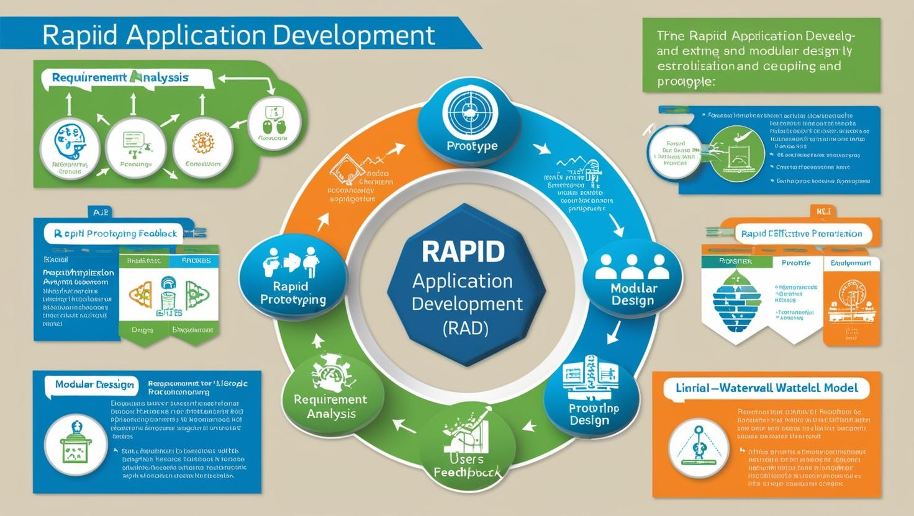

# **Rapily Application Development - RAD Proje Yönetimi**

[Download PDF Version](./rad.pdf)

## **Eğitim Süresi**

- **Format 1**
  - **5 Gün**
  - **Ders Süresi:** 50 dakika
  - **Eğitim Saati:** 10:00 - 17:00

- **Format 2**
  - **12 Gün**
  - **Ders Süresi:** 50 dakika
  - **Eğitim Saati:** 10:00 - 17:00

- > Her iki eğitim formatında eğitimler 50 dakika + 10 dakika moladır. 12:00-13:00 saatleri arasında 1 saat yemek arasındaki verilir. Günde toplam 6 saat eğitim verilir. 5 günlük formatta 30 saat eğitim, 12 günlük formatta toplam 72 saat eğitim verilmektedir. 12 saatlik eğitmde katılımcılar kod yazar ve eğitmenle birlikte sorulan sorulara ve taleplere uygun içerikler ve örnekler çalışılır.

- > Eğitimler uzaktan eğitim formatında tasarlanmıştır. Her eğitim için teams linkleri gönderilir. Katılımcılar bu linklere girerek eğitimlere katılırlar. Ayrıca farklı remote çalışma araçları da eğitmen tarafından tüm katılımlara sunulur. Katılımcılar bu araçları kullanarak eğitimlere katılırlar. 

- > Eğitim içeriğinde github ve codespace kullanılır. Katılımcılar bu platformlar üzerinden örnek projeler oluşturur ve eğitmenle birlikte eğitimlerde sorulan sorulara ve taleplere uygun iceriğe cevap verir. Katılımcılar bu araçlarla eğitimlerde sorulan sorulara ve taleplere uygun iceriğe cevap verir.

- > Eğitim yapay zeka destekli kendi kendine öğrenme formasyonu ile tasarlanmıştır. Katılımcılar eğitim boyunca kendi kendine öğrenme formasyonu ile eğitimlere katılırlar. Bu eğitim formatı sayesinde tüm katılımcılar gelecek tüm yaşamlarında kendilerini güncellemeye devam edebilecekler ve her türlü sorunun karşısında çözüm bulabilecekleri yeteneklere sahip olacaklardır.

## **Hızlı Yazılım Geliştirme ile Tanışın: RAD (Rapid Application Development) Eğitimi**

Yazılım geliştirme süreçleri hızla değişiyor ve modern iş dünyasında hız, esneklik ve müşteri memnuniyeti her zamankinden daha önemli. RAD (Rapid Application Development), yazılım geliştirme sürecini hızlandıran ve müşteri geri bildirimlerine dayalı sürekli iyileştirmeyi teşvik eden bir metodolojidir. Bu eğitim, RAD’ın temel prensiplerini, süreçlerini ve uygulama araçlarını derinlemesine inceleyerek, yazılım geliştirme becerilerinizi bir adım öteye taşıyacak.

- RAD metodolojisinin temel prensiplerini öğrenme
- Prototip oluşturma ve kullanıcı geri bildirimlerini entegre etme
- RAD’ın yazılım geliştirme süreçlerine olan etkisini anlama
- RAD projelerinin yönetimi ve stratejiler geliştirme

Eğitimimiz ile RAD gelitiştirme yetkinliğine sahip olacaksınız.

## **Eğitim Amacı**

Bu eğitim, **Rapid Application Development (RAD)** metodolojisinin yazılım geliştirme süreçlerine entegrasyonunu, sağladığı avantajları, karşılaşılan zorlukları ve uygulama yöntemlerini kapsamlı bir şekilde ele almayı amaçlamaktadır. RAD, geleneksel yazılım geliştirme yöntemlerine kıyasla çok daha hızlı, verimli ve müşteri odaklı bir yaklaşım sunarak yazılım geliştirme sürecini hızlandırır. Eğitim, katılımcılara RAD metodolojisini nasıl etkili bir şekilde uygulayabileceklerini, projelerinde hız ve esneklik sağlamak için kullanabileceklerini öğretirken, aynı zamanda bu metodolojinin potansiyel zorluklarını ve nasıl aşılabileceklerini de detaylı bir şekilde inceleyecektir.

Eğitim boyunca, RAD’ın temel prensiplerinden başlayarak, metodolojinin yazılım geliştirme süreçlerine etkisini, prototip oluşturma aşamalarını, kullanıcı geri bildirimlerini hızlı bir şekilde entegre etme tekniklerini ve sürekli iyileştirme döngüsünü öğreneceksiniz. Ayrıca, bu yaklaşımın, projelerde müşteri memnuniyetini artırma, maliyetleri düşürme ve ürünün pazara hızlı bir şekilde sunulması gibi avantajlarını kavrayacak, ancak RAD’ın kaynak yoğunluğu, kullanıcı katılımı gereksinimi gibi potansiyel zorluklarını da nasıl yöneteceğinizi keşfedeceksiniz.

**Eğitimde Kazanılacak Yetenekler**

- RAD metodolojisinin temellerini ve tarihçesini öğrenme
- Prototipleme, kullanıcı geri bildirimi ve hızlı geliştirme süreçlerine nasıl yön verileceğini anlama
- RAD ile yazılım projelerinde esneklik, hız ve kaliteyi nasıl artırılacağına dair stratejiler geliştirme
- RAD uygulamalarının avantajları ve dezavantajları hakkında derinlemesine bilgi sahibi olma
- RAD’ın yazılım geliştirme süreçlerine etkisini kavrayarak, projelerde daha etkili sonuçlar elde etme
- RAD projelerinde karşılaşılan zorluklarla başa çıkmak için çözüm odaklı yaklaşımlar geliştirme
- Proje yönetimi, prototip oluşturma, test etme ve dağıtım süreçlerini hızlandırma konularında pratik bilgi

**Eğitimin Sonunda Kazanacağınız Yetkinlikler**

- RAD metodolojisini projelere nasıl entegre edeceğinizi ve süreçlerinizi nasıl hızlandıracağınızı öğrenmiş olacaksınız.
- Hızlı prototip oluşturma, kullanıcı geri bildirimi toplama, test etme ve uygulama süreçlerini etkili bir şekilde yönetebileceksiniz.
- RAD’ın sağladığı avantajları (hız, esneklik, müşteri memnuniyeti) ve karşılaştığınız zorlukları (kaynak yoğunluğu, yüksek kullanıcı katılımı gereksinimi) nasıl yöneteceğinize dair kapsamlı bir bakış açısına sahip olacaksınız.
- RAD ile geliştirdiğiniz projelerde daha hızlı teslimatlar yaparak, müşteri beklentilerine daha hızlı ve kaliteli cevap verebileceksiniz.

Bu eğitim, RAD metodolojisini yazılım geliştirme süreçlerinize entegre etmek ve projelerinizde başarıyı garantilemek için ihtiyacınız olan her şeyi sunmaktadır. Eğitim sonunda, RAD’ı kullanarak yazılım geliştirmede hız, verimlilik ve müşteri memnuniyetini nasıl sağlayabileceğinizi öğrenmiş olacaksınız.

## **Eğitimin Hedefleri**

Bu eğitim, katılımcılara **Rapid Application Development (RAD)** metodolojisinin yazılım geliştirme süreçlerinde nasıl uygulanacağını öğretmeyi amaçlamaktadır. Eğitim sonunda katılımcılar aşağıdaki hedeflere ulaşmış olacaktır:

1. **RAD Metodolojisinin Temel Prensiplerini Öğrenmek:** 
   Katılımcılar, RAD'ın temel kavramlarını, tarihçesini ve avantajlarını anlayarak, bu metodolojinin geleneksel yazılım geliştirme yaklaşımlarından farklarını öğreneceklerdir.

2. **Prototip Oluşturma Süreçlerini Uygulamak:** 
   RAD'ın en önemli bileşenlerinden biri olan hızlı prototipleme süreçlerini kavrayacak, prototip oluşturma ve erken kullanıcı geri bildirimleri alma tekniklerini etkin bir şekilde kullanma becerisi kazanacaklardır.

3. **Müşteri Geri Bildirimini Hızla Entegre Etmek:** 
   RAD metodolojisinin hız ve esneklik sağlama kapasitesinden yararlanarak, müşteri geri bildirimlerini yazılım geliştirme sürecine hızlı bir şekilde dahil etme yeteneği kazanacaklardır.

4. **Yazılım Geliştirme Süreçlerinde Hız ve Verimlilik Sağlamak:** 
   Katılımcılar, RAD'ın sunduğu hız ve verimlilik avantajlarını kullanarak, yazılım geliştirme süreçlerini daha hızlı ve etkili hale getirme yöntemlerini öğreneceklerdir.

5. **Potansiyel Zorlukları Anlamak ve Çözüm Yöntemleri Geliştirmek:** 
   RAD metodolojisinin kaynak yoğunluğu, kullanıcı katılımı gereksinimi gibi zorluklarını anlayacak ve bu zorluklarla nasıl başa çıkabileceklerine dair çözüm odaklı yaklaşımlar geliştireceklerdir.

6. **Yazılım Projelerinde Kaliteyi Artırmak:** 
   Eğitim, katılımcılara RAD ile yazılım geliştirmede kaliteyi artırmanın yollarını gösterecek ve bu metodolojinin, müşteri beklentilerini daha hızlı ve doğru bir şekilde karşılamaya nasıl yardımcı olacağını öğretecektir.

7. **Ekip İçi İletişim ve İşbirliği Yöntemlerini İyileştirmek:** 
   RAD, sürekli prototipleme ve müşteri geri bildirimi gerektirdiği için ekip içi iletişimi ve işbirliğini geliştirmeyi teşvik eder. Katılımcılar, bu işbirliği süreçlerinde daha etkin hale geleceklerdir.

8. **Proje Yönetiminde RAD’ı Etkin Kullanmak:** 
   Katılımcılar, RAD metodolojisini projelerine entegre ederek, proje yönetim süreçlerini daha hızlı, daha esnek ve müşteri odaklı bir hale getirmeyi öğreneceklerdir.

9. **Hızlı Dağıtım ve Sürekli İyileştirme Döngüsünü Kurgulamak:** 
   RAD metodolojisi, yazılımın hızlı bir şekilde piyasaya sunulmasını sağlar. Katılımcılar, bu hızlı dağıtım süreçlerini nasıl yönetebileceklerini ve sürekli iyileştirme döngüsünü nasıl kurgulayabileceklerini öğreneceklerdir.

10. **Pratik RAD Deneyimi Kazanmak:** 
    Eğitim boyunca katılımcılar, RAD metodolojisini gerçek dünyadaki projelerde uygulamak için gerekli pratik becerileri kazanacaklardır.

Bu eğitim, katılımcıların yazılım geliştirme süreçlerinde hız, verimlilik ve müşteri memnuniyeti sağlamak için RAD metodolojisini etkin bir şekilde kullanmalarını hedeflemektedir.

## **Eğitim İçeriği**

### **RAD (Rapid Application Development) Nedir?**

- RAD, yazılım geliştirme sürecinde hızlı prototipleme, kullanıcı geri bildirimi ve sürekli iyileştirme yoluyla yazılımın hızlı bir şekilde tamamlanmasını sağlayan bir metodolojidir. RAD, müşteri talepleri ve geri bildirimleri doğrultusunda esnek bir yaklaşım sunar.

- RAD’ın ilk kez nasıl ortaya çıktığı ve yazılım geliştirme metodolojileri içindeki yerini nasıl aldığını inceleme. Şelale Modeli ve Agile gibi diğer yazılım geliştirme modelleriyle karşılaştırması.

- Hızlı Prototipleme  
- Kullanıcı Geri Bildirimi  
- Azami Esneklik  
- Modüler Tasarım ve Bileşenler  
- Kısa Geliştirme Döngüleri  

---

### **RAD’ın Temel Aşamaları ve Süreçleri**

1. **İhtiyaç Analizi ve Prototip Tasarımı**  
   - Kullanıcı gereksinimlerinin hızlıca toplanması  
   - Hedef kitlenin, iş süreçlerinin ve gereksinimlerin belirlenmesi  
   - Prototiplerin hızla oluşturulması ve kullanıcı geri bildirimlerinin alınması  

2. **Prototip Geliştirme**  
   - Modüler tasarım ve bileşen tabanlı yaklaşım  
   - Kullanıcı geri bildirimlerini hızlı bir şekilde entegre etme  
   - Sürekli olarak prototip üzerinde geliştirme yapılması  

3. **Uygulama Tasarımı ve Uygulama Geliştirme**  
   - Tasarım aşamasının prototipleme ile paralel yürütülmesi  
   - Yazılımın hızlı bir şekilde geliştirilmesi ve tamamlanması  
   - Kullanıcı geri bildirimlerinin tasarıma ve işlevselliğe dahil edilmesi  

4. **Test Etme ve İnceleme**  
   - Sürekli entegrasyon ve test süreçlerinin entegrasyonu  
   - Kullanıcı kabul testi (UAT) ve fonksiyonel testler  
   - Hataların hızlıca tespit edilip düzeltilmesi  

5. **Dağıtım ve Uygulama**  
   - Yazılımın hızlı bir şekilde dağıtılması  
   - Prototipin canlı ortamda çalıştırılması  
   - Kullanıcı geri bildirimlerinin sürekli olarak entegrasyonu  

---

### **RAD’ın Avantajları ve Dezavantajları**

- **Avantajlar:**  
  - Hızlı Uygulama Geliştirme  
  - Esneklik  
  - Müşteri Memnuniyeti  
  - Daha Düşük Maliyetler  
  - Hızlı Değişim  

- **Dezavantajlar:**  
  - Yüksek Kullanıcı Katılımı Gereksinimi  
  - Yetersiz Planlama  
  - Zorlayıcı Gereksinimler  
  - Kaynak Yoğunluğu  

---

### **RAD’ın Yazılım Geliştirme Süreçlerine Etkisi**

- Modüler Tasarım ve Bileşen Kullanımı  
- Kullanıcı Geri Bildirimlerinin Yönetimi  
- Agile ve RAD Entegrasyonu  
- Sürekli İyileştirme ve Hızlı Dağıtım  

---

### **RAD İçin Uygulama Araçları ve Teknikler**

- **Prototip Oluşturma Araçları**  
  - PowerApps, OutSystems, Mendix gibi araçlar  

- **Test ve Dağıtım Araçları**  
  - CI/CD araçları, test otomasyon araçları  

- **Veri Entegrasyonu Araçları**  
  - API kullanımı  

- **Proje Yönetim Araçları**  
  - Jira, Trello, Asana vb.  

---

### **RAD ile İlgili İleri Düzey Konular**

- Proje Yönetimi ve RAD’ın Rolü  
- Büyük Ölçekli RAD Projeleri  
- Hibrid Model Kullanımı  
- Endüstri Standartları ve RAD  

---

### **RAD Proje Yönetimi Stratejileri**

- İletişim ve İşbirliği  
- Risk Yönetimi  
- İzleme ve Raporlama  

## **Eğitim Yöntemi**

- **Teorik Bilgi:** Güncel bilgiler ve konseptlerin anlatımı.
- **Uygulamalı Örnekler:** Gerçek senaryolarla pratik uygulamalar.
- **Etkileşimli Tartışmalar:** Katılımcıların aktif katılım sağlayacağı, soru-cevap şeklinde tartışmalar yapılacak oturumlar.
- **Proje Tabanlı Öğrenme:** Eğitimin son günü, katılımcıların öğrendiklerini pratikte uygulayacakları kapsamlı bir proje çalışması yapılacak.

## **Hedef Kitle**

1. **Yazılım Geliştiriciler:**
   RAD metodolojisini öğrenerek, daha hızlı, verimli ve kaliteli yazılımlar geliştirmek isteyen yazılım geliştiricileri hedeflemektedir. Geliştiriciler, RAD’ın sunduğu esneklik ve hızla projelerini yönetmek için gerekli becerileri kazanacaklardır.

2. **Proje Yöneticileri:**
   Proje yöneticileri, RAD metodolojisini öğrenerek yazılım projelerinin sürelerini kısaltabilir ve müşteri memnuniyetini artırabilirler. Bu eğitim, projelerin hızlı bir şekilde teslim edilmesi ve yönetilmesi konusunda stratejik bakış açısı kazandıracaktır.

3. **Teknik Liderler ve Takım Liderleri:**
   Takım liderleri ve teknik liderler, RAD yaklaşımını benimseyerek ekiplerinin hızla prototip geliştirmesini ve müşteri geri bildirimlerini hızlı bir şekilde almasını sağlayacaklardır. Bu eğitim, liderlerin ekiplerini etkili bir şekilde yönlendirmelerine yardımcı olacaktır.

4. **İş Analistleri:**
   İş analistleri, yazılım geliştirme süreçlerinde müşteri ihtiyaçlarını hızlı bir şekilde analiz edip, geri bildirimleri düzenli olarak almak için RAD metodolojisini uygulamak isteyebilirler. Bu eğitim, iş analistlerinin proje süreçlerine nasıl daha etkin bir şekilde katkı sağlayacaklarını göstermektedir.

5. **Ürün Sahipleri:**
   Ürün sahipleri, RAD metodolojisini öğrenerek ürün geliştirme sürecini hızlandırabilir ve kullanıcı geri bildirimlerini daha hızlı bir şekilde uygulayabilirler. Eğitim, ürün yönetiminde daha esnek ve hızlı kararlar almayı sağlayacaktır.

6. **Yazılım Mühendisliği Öğrencileri:**
   Yazılım mühendisliği alanında eğitim gören öğrenciler, RAD metodolojisini öğrenerek, gerçek dünya yazılım geliştirme süreçlerinde kullanılacak modern ve hızlı bir yaklaşımı kavrayacaklardır. Bu eğitim, öğrencilerin profesyonel hayatta karşılaşacakları projelerde daha etkili olmalarını sağlayacaktır.

7. **Start-up Kurucuları ve Girişimciler:**
   Start-up’lar ve girişimciler, RAD metodolojisini uygulayarak minimum zamanda ürünlerini pazara sunabilir ve kullanıcı geri bildirimleri ile hızla geliştirme yapabilirler. Eğitim, girişimcilerin daha hızlı ve esnek bir yazılım geliştirme süreci izlemelerine yardımcı olacaktır.

8. **Teknoloji Danışmanları ve Sistem Entegre Ediciler:**
   RAD metodolojisinin entegrasyonu konusunda danışmanlık yapan veya sistem entegrasyonu yapan profesyoneller, bu eğitim sayesinde daha hızlı yazılım geliştirme süreçlerini uygulamalı bir şekilde öğrenebilirler. Eğitim, danışmanların ve sistem entegratörlerinin projelere daha etkin katkı sağlamalarını sağlayacaktır.

Bu eğitim, yukarıdaki profesyonel gruplar için yazılım geliştirme süreçlerini hızlandırmayı, verimliliği artırmayı ve müşteri memnuniyetini en üst seviyeye çıkarmayı hedefleyen bir program olarak tasarlanmıştır. RAD metodolojisinin temellerini öğrenmek, bu kişilerin projelerini daha hızlı ve etkili bir şekilde yönetmelerine yardımcı olacaktır.

## **Katılımcılardan Beklentilerimiz**

Bu eğitimden maksimum faydayı sağlamak ve **Rapid Application Development (RAD)** metodolojisini etkin bir şekilde öğrenmek için katılımcılardan bazı beklentilerimiz bulunmaktadır:

1. **Temel Yazılım Geliştirme Bilgisi:**
   Katılımcıların yazılım geliştirme süreçlerine dair temel bilgiye sahip olmaları beklenmektedir. RAD, genellikle deneyimli yazılım geliştiriciler ve proje yöneticileri için uygun bir metodoloji olduğundan, katılımcıların yazılım tasarımı, geliştirme ve test konularında bilgi sahibi olmaları faydalı olacaktır.

2. **Açık Fikirli Olma ve Yeniliklere Yatkınlık:**
   RAD, geleneksel yazılım geliştirme yöntemlerinden farklı bir yaklaşım sunduğu için, katılımcıların yenilikçi düşünmeye, esnek olmaya ve yeni yaklaşımlara açık olmaları gerekmektedir.

3. **Aktif Katılım ve Grup Çalışmalarına İlgili Olma:**
   Eğitim süresince grup çalışmaları ve etkileşimli tartışmalar yapılacaktır. Katılımcıların, bu etkinliklere aktif katılım sağlamaları ve fikirlerini paylaşmaları beklenmektedir. Bu, öğrenilen bilgilerin pekişmesine ve pratik uygulamalarda daha etkin olmalarına yardımcı olacaktır.

4. **Gerçek Dünya Deneyimlerini Paylaşma:**
   Katılımcılardan, daha önceki yazılım projelerinde karşılaştıkları zorlukları ve çözüm önerilerini paylaşmaları teşvik edilmektedir. Bu, diğer katılımcılarla öğrenme deneyimini zenginleştirir.

5. **Prototip Oluşturma ve Uygulama:**
   RAD metodolojisinin önemli bir bileşeni olan prototip oluşturma süreçlerini etkin bir şekilde öğrenmek için katılımcıların bu aşamaları uygulamaya istekli olmaları beklenmektedir. Eğitimde pratik deneyim çok önemlidir.

6. **Zorluklara Çözüm Üretme:**
   RAD metodolojisinin bazı zorlukları bulunabilir. Katılımcıların bu zorlukları anlama ve çözüm yolları geliştirme konusunda istekli olmaları, eğitimin faydalı geçmesini sağlayacaktır.

7. **Zaman Yönetimi ve Verimli Çalışma:**
   Eğitim sürecinde zaman yönetimi önemlidir. Katılımcıların verilen süreler içinde soruları ve görevleri yerine getirmeleri beklenmektedir. RAD, hız odaklı bir yaklaşım sunduğu için verimli çalışma anlayışını benimsemek de önemlidir.

8. **Müşteri İletişimine Duyarlı Olma:**
   RAD, müşteri geri bildirimi ve etkileşimine büyük önem verir. Katılımcıların, müşteri geri bildirimlerini alırken profesyonel ve duyarlı bir yaklaşım benimsemeleri beklenmektedir.

9. **Teknolojik Araçlara Hakimiyet:**
   Eğitimde çeşitli yazılım geliştirme araçları kullanılabilir. Katılımcıların, bu araçlara aşina olmaları ve eğitim sırasında etkin bir şekilde kullanabilmeleri beklenmektedir.

10. **Sürekli Öğrenme ve Gelişim İçin İstekli Olma:**
    RAD gibi hızlı ve esnek bir metodoloji, sürekli öğrenmeyi ve gelişimi gerektirir. Katılımcıların, öğrendikleri bilgileri uygulamaya koymaya ve profesyonel gelişimlerini sürekli kılmaya istekli olmaları beklenmektedir.

Eğitimin başarılı bir şekilde tamamlanabilmesi için katılımcıların bu beklentilere uyum göstermeleri, metodolojiyi daha etkili bir şekilde öğrenmelerine ve iş süreçlerine entegre etmelerine yardımcı olacaktır.

[Eğitim Materyalleri (Eğitmenlere Özel)](https://github.com/TuncerKARAARSLAN-VB/training-kit-rad-proje-yonetimi)
