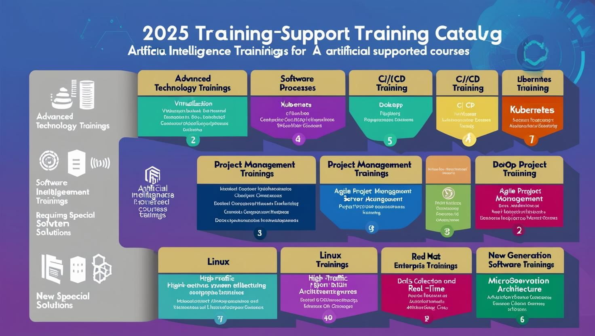
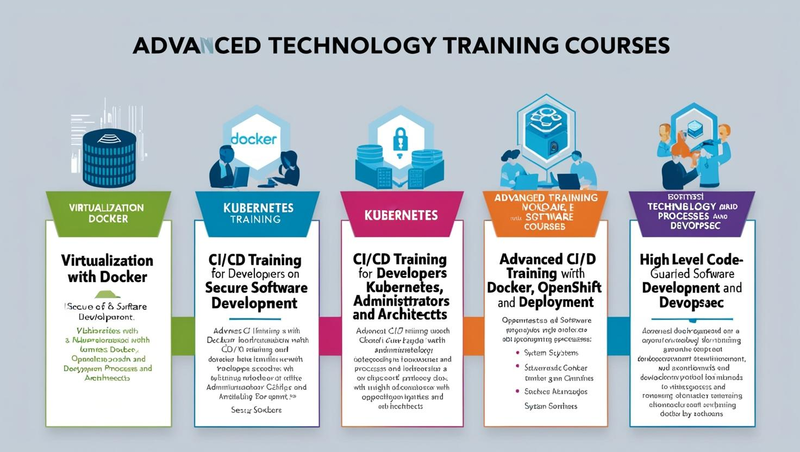
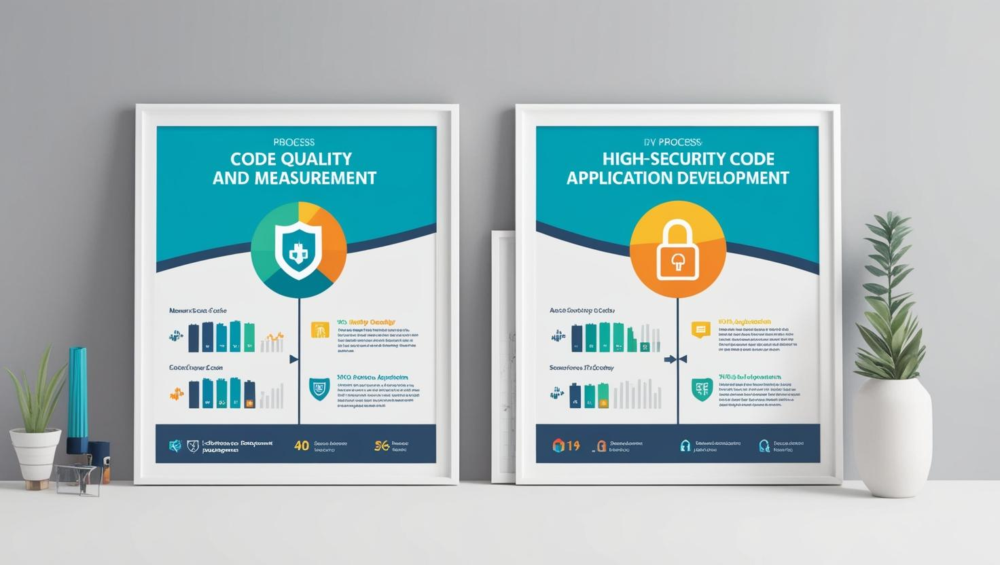
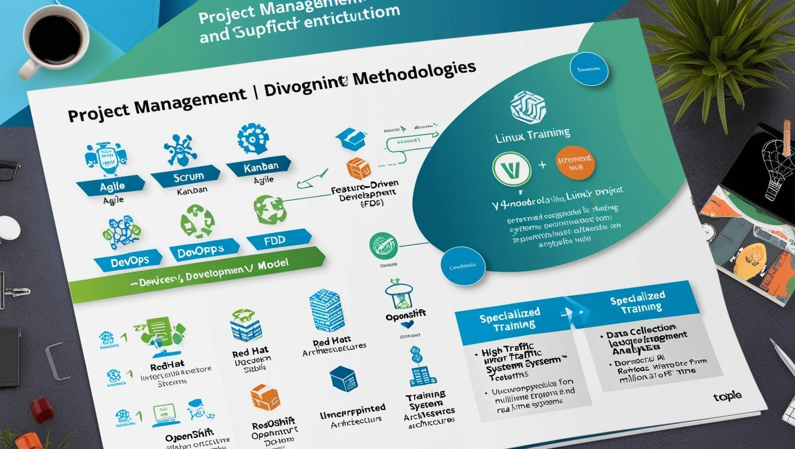
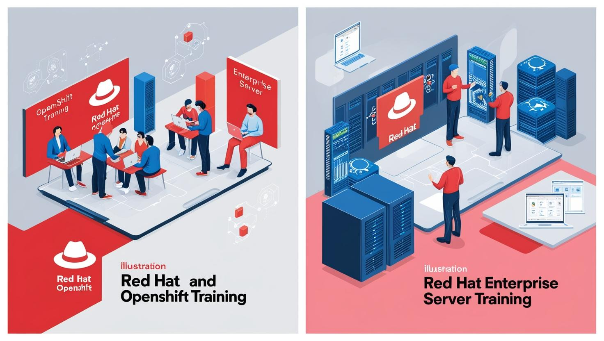
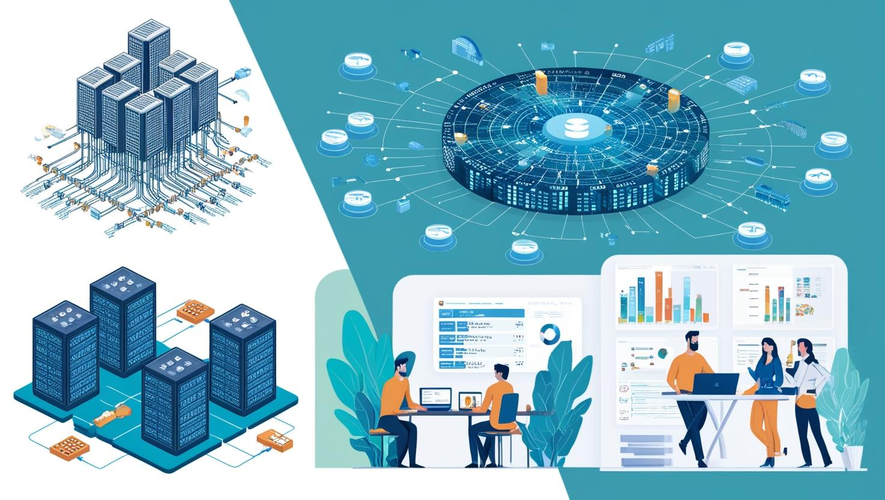
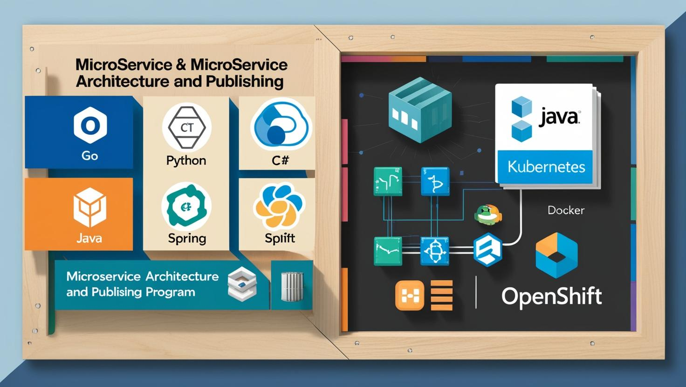
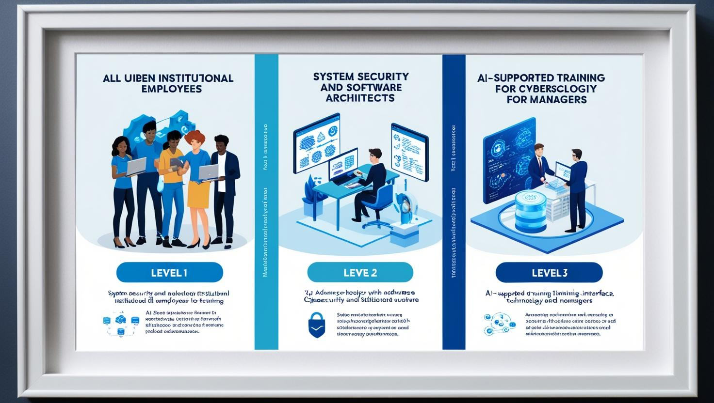
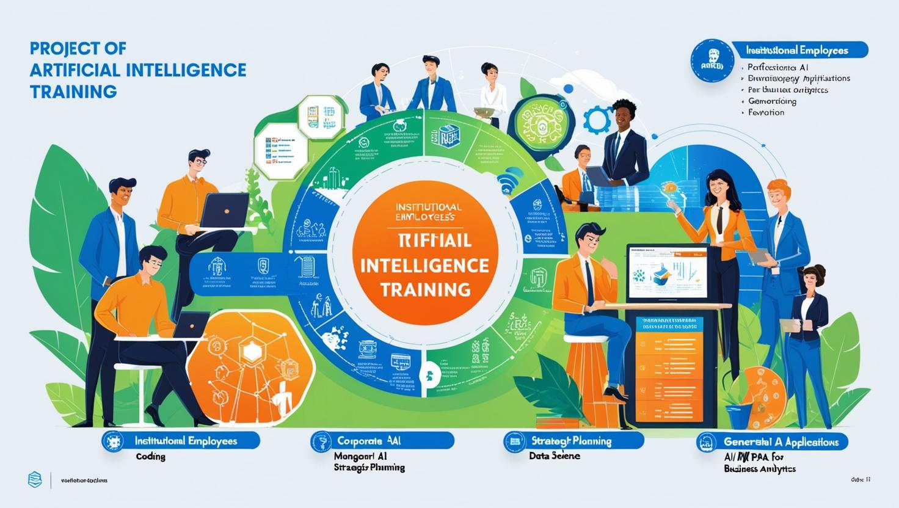
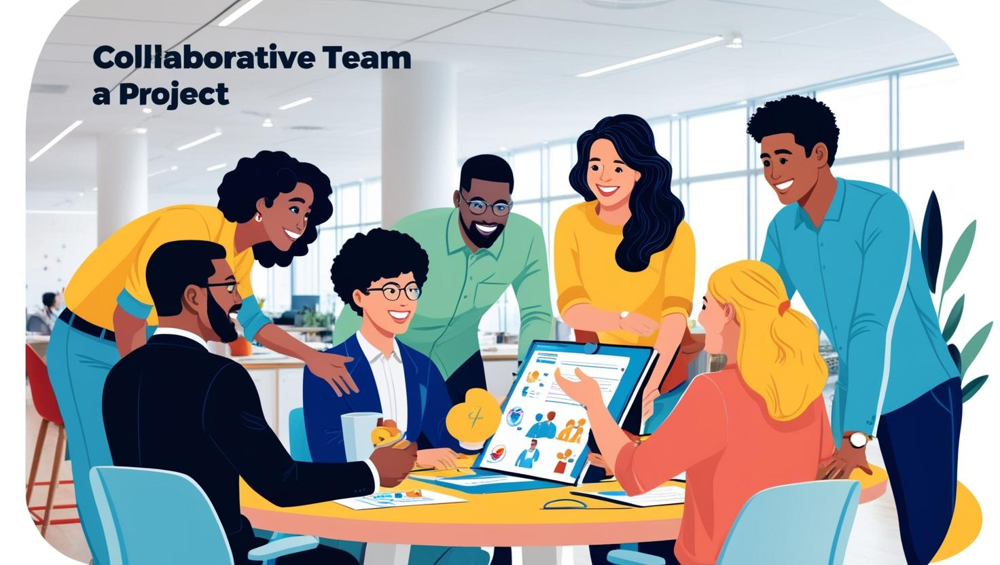

# **Güncel Eğitim Programlarımız**  

> **Neden eğitimlerimizi tercih etmelisiniz**

- Diğer kurumsal eğtimlerin aksine biz sadece tek bir program kullanımını anlatmıyoruz, yaşadığınız sorunları biliyoruz, anlıyoruz ve size sorunlarınızın kurumsal çözümleri için özel çözümler üretiyoruz. 

- **Eğitimlerimizi sizin kurumsal sorunlarınıza odaklanan senaryolarla güncelliyoruz, size özel eğitimler sunuyoruz.**

- Birbirinden kopuk onlarca eğitim almanıza gerek kalmadan, tek bir eğitim programı ile size özel eğitim içeirikleriyle sie özel çözümler üretiyoruz. 

- Bu her eğitmenin verebileceği kolay bir eğitim değil, yetkin ve deneyimli özel eğitmenlerimiz sizin için özel olarak eğitimlere hazırlanıyor. 

- **Her eğitim öncesinde ve hatta eğitim süresince eğitmenlerimiz sizinle birlikte çalışarak eğitimlerini güncellemektedir.**

- Bizimle çalışarak sorunlarınıza kesin çözümler sağlarsınız. Eğitmlerinde bizi tercih eden tüm kurumlara teşekkür ederiz.

> [Lütfen PDF olarak eğitim kataloğumuzu indirin](./trainer-point%20with%20tuncer-erdem.pdf) ***İndirebileceğiniz PDF dokümanındaki tüm linkler github linklerine yönlendirilmektedir. Bu sayede tüm eğitimlerin en güncel eğitim içeriklerine sahip olabileceksiniz. Lütfen PDF dökümanını indirip eğitim almak isteyen birimleriniz ile paylaşın. Kurumlarınıza değer katacak yepyeni eğitimler sayesinde güncel içerikleri sağlayabilirsiniz.***

> Aşağıda tüm eğitimlerin tam listesini göreceksiniz. Linklere tıklayarak eğitimlerim içeriklerine ulaşabilirsiniz. Her link içinde ayrıca pdf linkleri üretilmiştir. Her eğitimin detayları bu PDF'lerde yer alır. İstediğiniz tüm eğitimlerin PDF versiyonlarını indirip birimleriniz ile paylaşabilirsiniz.

Günümüz dünyasında yapay zeka ve güvenlik endişeleri, tüm kurumların ve çalışanlarının korkulu rüyası haline gelmiştir. Hızla değişen dünya, tüm bildiklerimize rağmen iş dünyasında bizi geri plana itmektedir. Teknolojik gelişmelerin ve dijital dönüşümün hızına ayak uydurmak, kurumlar için artık bir zorunluluk halini almıştır. Siber casuslar, yapay zeka kullanarak güvenlik açıklarını saniyeler içinde tespit etmekte ve bulduğu ilk açık kapıdan girerek kritik bilgilere ulaşabilmektedir. Bu tür tehditler, sadece verilerin çalınmasıyla kalmaz, aynı zamanda kurumsal itibarı da hızla yok edebilir.

Bu ortamda kurumlar, çalışanlarının dijital yetkinliklerini artırmak, gelecekteki siber tehditlere karşı donanımlı hale getirmek ve teknolojiyi en verimli şekilde kullanmak zorundadırlar. Bu değişim, en değerli kaynağımız olan insan ile başlar. İnsan kaynağının teknolojiyle donatılması, kurumların güçlü bir dijital altyapı oluşturması ve gelişen tehditlere karşı hazırlıklı olmaları gerekmektedir. Çalışanlar, sadece teknolojiye hakim olmalı, aynı zamanda güvenlik kültürüne sahip, siber tehditlere karşı bilinçli ve hızlı tepki verebilen bireyler olmalıdır.

Yazılım süreçlerinde sürekli kalite kontrol, siber açık kontrolleri ve güvenlik testleri yapmak, bu tehditlere karşı etkin önlemler almak artık hayati değer taşımaktadır. Ayrıca, hızlı deployment (dağıtım) süreçleri, teknolojinin verimli bir şekilde kullanılabilmesi için kritik önem taşır. Kurumsal dijital dönüşüm, sadece altyapı yatırımlarını değil, aynı zamanda çalışanların eğitimini, yetkinliklerini ve adapte olabilme becerilerini geliştirmeyi gerektirir. Değişim, kurum kültürünün bir parçası haline gelmeli ve çalışanlar bu dönüşüme hazır olmalıdır.

Özellikle yazılım geliştirme ve operasyon süreçlerinde yüksek işlem gücü ve trafiği kaldırabilen, hızlı ve güvenli uygulamaların geliştirilmesi artık bir zaruriyet halini almıştır. Tüm hayatımızın internet üzerinde şekillendiği bu dönemde, yüksek trafikli ve yüksek performanslı uygulamalar kurmak, şirketlerin rekabet gücünü ve güvenliğini artırmak için büyük önem taşımaktadır.

Eğitimlerimiz, çalışanlarınızın sadece dijital yetkinliklerini artırmayı değil, aynı zamanda kendini geliştirebilen, çağa ayak uydurabilen ve ekiplerin gelecekteki zorluklara karşı donanımlı olmasını sağlayacak içerik ve formatlarla tasarlandı. Özellikle yapay zeka entegrasyonu, **Kubernetes** ve **Microservices** mimarilerinin avantajlarına, **kodlama kalitesi**, **güvenlik açıkları giderilmiş kodlama** ve **yüksek trafikli mimariler geliştirme** konularına odaklanan programlarımız, kurumların rekabet gücünü artırmayı hedefliyor. Ayrıca, **OWASP** ve diğer güvenlik güncellemeleri ile güvenli mimariler tasarımı ve **kodlama geliştirme sanatı** gibi yaklaşımlarımızla, siber güvenlik tehditlerine karşı etkin çözümlerle teknoloji altyapınızı daha güvenli hale getirmeyi amaçlıyoruz.  

**Bu yılın öne çıkan eğitim içeriklerindeki yaklaşımlarımız:**  

- Yapay Zeka ile Yeni Nesil İşletme Modelleri
- Dijital Dönüşüm ve Teknoloji Yönetimi
- Siber Güvenlik Farkındalığı ve Risk Yönetimi
- Bulut Teknolojileri ve Güvenlik Çözümleri
- Ekip Liderliği ve Çevik Yönetim Yaklaşımları
- Yüksek Trafik Sistemlerinde Hızlı Cevaplar İçin Kubernetes ve Microservices Mimarileri
- Kodlama Kalitesi ve Güvenlik Açıkları Giderilmiş Kodlama
- OWASP ve Diğer Güvenlik Güncellemeleri ile Güvenli Mimariler Tasarımı ve Kodlama Geliştirme Sanatı

Çalışanlarınızın ve ekiplerinizin geleceğe güvenle hazırlanmasını sağlamak ve kurumunuzu dönüşüm yolculuğunda bir adım öne taşımak için sizinle iş birliği yapmayı sabırsızlıkla bekliyoruz.  

## **Eğitimlerimiz**

Lütfen eğitim içeriklerini detaylıca incelemek için eğitimlere tıklayınız.

İsterseniz eğitimleri [özelleştirebilirsiniz](#özelleştirme-fırsatları). [5 ve 12 günlük eğitim formatları](#5-günlük-ve-12-günlük-eğitim-arasındaki-fark) için listenin sonundaki bölümü okuyabilirsiniz. Bazı eğitimlerimiz 20 günlük eğitim olabilir. Lütfen eğitimlerin sürelerine dikkat edin.

### **A - İleri Seviye Teknoloji Eğitimlerimiz**

- **[01 - Sıfırdan Zirveye Docker ile Sanallaştırma With AI](./sifirdan-zirveye-docker-ile-sanallastirma/readme.md)**

    Modern yazılım dünyasının en güçlü araçlarından biri olan Docker'ı öğrenmek ve sanallaştırma dünyasında ustalaşmak ister misiniz? "Sıfırdan Zirveye Docker ile Sanallaştırma" eğitimi, sizi sıfırdan alıp Docker ekosistemine hâkim bir profesyonele dönüştürecek!

    Docker’ın temellerinden başlayarak, konteyner teknolojisinin işleyişini öğreneceksiniz.
    Gerçek dünya senaryolarıyla Docker'ı projelerinize nasıl entegre edeceğinizi keşfedeceksiniz.
    Mikro servis mimarisinden CI/CD süreçlerine, konteyner orkestrasyonuna kadar her adımı deneyimleyeceksiniz.
    Pratik uygulamalar, gerçek örnekler ve uzman rehberliğiyle, yazılım geliştirme ve dağıtım süreçlerinizi devrim niteliğinde bir hız ve verimlilik seviyesine taşıyın!

    **Eğitim Hedefi**

    Bu eğitim, katılımcılara docker temel prensiplerini, mimarisini ve uygulama senaryolarını öğretmeyi amaçlamaktadır. Eğitim sonunda katılımcılar, kendi docker yapılandırmalarını oluşturabilecek, yönetebilecek ve uygulama dağıtımlarını gerçekleştirebilecek düzeye geleceklerdir.

- **[02 - Sıfırdan Zirveye Kubernetes Eğitimi With AI](./sifirdan-zirveye-kubernetes-egitimi/readme.md)**

    Kubernetes, modern yazılım geliştirme ve dağıtım süreçlerinde mikroservisleri yönetmek için kullanılan güçlü bir açık kaynaklı platformdur. Bu eğitimde, Kubernetes’in temellerinden ileri seviye konseptlerine kadar geniş bir yelpazede bilgi edinecek, uygulama yönetimini ve altyapı yönetimini optimize edebileceksiniz.

    Bu eğitim ile Kubernetes’i derinlemesine öğrenerek, uygulama dağıtımı ve yönetimi konusunda uzmanlaşabilir, günümüzün en popüler bulut altyapısı çözümleri ile pratik deneyim kazanabilirsiniz.

    **Eğitim Hedefi**

    Bu eğitim, katılımcılara Kubernetes’in temel prensiplerini, mimarisini ve uygulama senaryolarını öğretmeyi amaçlamaktadır. Eğitim sonunda katılımcılar, kendi Kubernetes küme yapılandırmalarını oluşturabilecek, yönetebilecek ve uygulama dağıtımlarını gerçekleştirebilecek düzeye geleceklerdir.

- **[03 - Yazılımcılar için CI/CD Eğitimi - Tüm Yönleri İle Yüksek Güvenlikli Yazılım Geliştirme Teknikleri With AI](./yazilimcilar-icin-ci-cd-egitimi-tum-yonleri-ile-yuksek-guvenlikli-yazilim-gelistirme-teknikleri/readme.md)**

    Yazılım geliştirme süreçlerinizi hızlandırmak ve güvenliğini artırmak için kapsamlı bir eğitim fırsatı. Bu eğitim, CI/CD (Sürekli Entegrasyon ve Sürekli Dağıtım) süreçlerini etkili bir şekilde yönetebilmek ve güvenliği ön planda tutarak hatasız yazılımlar geliştirebilmek için gerekli becerileri kazandırmayı hedefliyor.

    Eğitimde, yazılım güvenliği, DevSecOps, test otomasyonu, kod inceleme ve altyapı otomasyonu gibi önemli konulara odaklanarak, yazılım geliştirme süreçlerinizi optimize etme ve güvenli hale getirme konusunda derinlemesine bilgi edineceksiniz.

    **Eğitim Hedefi**

    Bu eğitim, yazılımcıların yazılım geliştirme süreçlerini daha verimli, güvenli ve sürdürülebilir hale getirmelerini sağlamayı amaçlamaktadır. Katılımcılar, CI/CD (Sürekli Entegrasyon ve Sürekli Dağıtım) süreçlerini derinlemesine öğrenerek, yazılım geliştirme, test etme, dağıtım ve bakım aşamalarını hızlandıracak, güvenli bir şekilde yönetebilecek ve hata oranlarını minimize edebileceklerdir.

    Eğitim, DevSecOps prensiplerine dayalı olarak, güvenli yazılım geliştirme yöntemlerini ve araçlarını tanıtarak, katılımcıların güvenlik açıklarını tespit etme, kod inceleme süreçlerini optimize etme ve yazılımın güvenliğini arttırma becerisi kazanmalarını hedeflemektedir. Ayrıca, altyapı otomasyonu, test otomasyonu, hata yönetimi ve sürekli geliştirme süreçlerinde en iyi uygulamaları öğrenerek, katılımcıların profesyonel yazılım geliştirme yetkinliklerini bir üst seviyeye taşımaları sağlanacaktır.

    Eğitimi tamamlayan katılımcılar, günümüzün yüksek güvenlikli yazılım geliştirme gereksinimlerine uygun olarak, daha hızlı ve güvenli yazılım projeleri geliştirme yeteneğine sahip olacaklardır.

- **[04 - Sistem Yöneticileri ve Mimarlar için İleri Seviye CI/CD Eğitimi ve Kubernetes, Docker, Openshift Deployment With AI](./ileri-seviye-ci-cd-egitimi-kubernetes-docker-openshift-deployment/readme.md)**

    Yazılım geliştirme süreçlerinde verimliliği artırmak ve güvenliği sağlamak için kritik öneme sahip CI/CD (Sürekli Entegrasyon/Sürekli Dağıtım), günümüzde vazgeçilmez bir araçtır. Bu ileri seviye eğitim, Docker, Kubernetes ve OpenShift gibi container teknolojilerini kullanarak CI/CD süreçlerini daha etkili ve güvenli hale getirmeyi hedefleyen yazılım geliştiriciler, DevOps mühendisleri ve sistem yöneticileri için kapsamlı bir rehber sunmaktadır.

    Katılımcılar, popüler CI/CD araçlarıyla süreçleri optimize ederken, yüksek güvenlikli, ölçeklenebilir ve sürdürülebilir yazılım dağıtım süreçlerini öğrenir. Ayrıca gerçek dünya vaka çalışmalarıyla, teoriyi pratiğe dökme imkanı bulurlar.

    **Eğitim Hedefi**

    Bu ileri seviye eğitim, katılımcılara **CI/CD** süreçlerini daha etkin bir şekilde yönetmek ve otomatikleştirmek için gereken derinlemesine bilgi ve becerileri kazandırmayı hedeflemektedir. Katılımcılar, **Docker**, **Kubernetes** ve **OpenShift** gibi modern container teknolojilerini kullanarak güvenli, ölçeklenebilir ve sürdürülebilir yazılım dağıtım süreçlerini nasıl tasarlayacaklarını öğrenirler.

    1. **CI/CD Süreçlerini Derinlemesine Anlamak:** Katılımcılar, CI/CD süreçlerinin temellerinden ileri düzey uygulamalarına kadar geniş bir bilgi birikimi elde ederler. Popüler CI/CD araçlarını (Jenkins, GitLab CI, CircleCI vb.) etkin bir şekilde kullanarak yazılım geliştirme ve dağıtım süreçlerini optimize ederler.

    2. **Container Teknolojileri ile Verimliliği Artırmak:** Docker, Kubernetes ve OpenShift ile container'ların yönetimini, orkestrasyonunu ve dağıtımını öğrenerek uygulama geliştirme süreçlerini daha güvenli ve verimli hale getirirler.

    3. **Yüksek Güvenlikli ve Ölçeklenebilir Dağıtımlar Tasarlamak:** Güvenlik ve ölçeklenebilirlik odaklı dağıtım süreçleri geliştirerek, büyük ölçekli sistemlerde yüksek erişilebilirlik sağlarlar.

    4. **Gerçek Dünya Uygulamalarını Pratikte Uygulamak:** Katılımcılar, gerçek dünya vaka çalışmalarıyla öğrendikleri teoriyi pratiğe dökme fırsatı bulurlar.

- **[05 - Yüksek Seviyeli Kod Korumalı Yazılım Geliştirme Süreçleri ve DevOpsSec with AI](./devsecops/readme.md)**

    Günümüzün hızla değişen dijital dünyasında, yazılım geliştirme süreçlerinin güvenli, hızlı ve verimli olması her zamankinden daha önemli hale gelmiştir. Bu noktada DevOpsSec devreye giriyor. DevOpsSec, yazılım geliştirme (Dev), operasyon (Ops) ve güvenlik (Sec) alanlarını birleştirerek, güvenliği yazılım geliştirme süreçlerinin her aşamasına entegre eden bir yaklaşım sunar.

    **Neden DevOpsSec?**

    Geleneksel güvenlik yaklaşımları genellikle yazılım geliştirme sürecinin son aşamalarına odaklanır. Ancak DevOpsSec, güvenliği baştan sona dahil ederek, daha güvenli bir yazılım geliştirme ortamı sağlar. Erken aşamalarda yapılan güvenlik taramaları ve testler, zafiyetlerin erken tespit edilmesine ve minimize edilmesine olanak tanır. Bu sayede, güvenlik açıkları daha hızlı kapanır ve yazılım projeleri daha güvenli hale gelir.

    **DevOpsSec'in Faydaları**

    **Erken Güvenlik Testi ve Tarama:** Güvenlik testleri, yazılım geliştirme sürecinin ilk aşamalarında yapılır. Bu, zafiyetlerin erken tespit edilmesini ve daha düşük maliyetlerle çözülmesini sağlar.

    **Otomasyon ve Sürekli İzleme:** DevOpsSec, güvenlik uygulamalarını otomatikleştirerek, sürekli izleme ve anında müdahale sağlar. Olası tehditler daha hızlı algılanır ve yanıt verilir.

    **Hızlı Geliştirme ve Güvenlik Dengelemesi:** Yazılım geliştirme süreci hızlanırken güvenlik riskleri en aza indirilir. DevOpsSec, güvenlik ve hız arasındaki dengeyi mükemmel bir şekilde kurar.

    **Ekipler Arası İşbirliği:** Geliştiriciler, operasyon ekipleri ve güvenlik uzmanları arasında güçlü bir işbirliği sağlar. Güvenlik, yalnızca bir departmanın sorumluluğu değil, tüm ekibin ortak sorumluluğudur.

    **Risk Yönetimi:** DevOpsSec, sürekli risk değerlendirmesi ve yönetimi yaparak yazılımın her aşamasında potansiyel tehditleri en aza indirir.

    **DevOpsSec ile Güvenli Geleceğe Adım Atın**

    DevOpsSec, sadece güvenlikten ödün vermemekle kalmaz, aynı zamanda yazılım geliştirme süreçlerini daha hızlı, verimli ve esnek hale getirir. Herkesin güvenli bir dijital deneyim yaşaması için, yazılım geliştirme süreçlerinin her aşamasında güvenliği sağlamak artık bir zorunluluk. DevOpsSec, işte bu zorunluluğu yerine getiren güçlü bir çözümdür.

    **Eğitimin Hedefi**

    1. **Güvenli Yazılım Geliştirme**: Katılımcılar, güvenliği yazılım geliştirme sürecinin başından itibaren nasıl entegre edeceklerini öğreneceklerdir. Kod yazımında güvenlik önlemleri almayı, güvenlik açıklarını erken tespit etmeyi ve çözmeyi öğreneceklerdir.
    
    2. **Otomasyon ve Sürekli İzleme**: DevOpsSec sürecinde güvenlik testlerinin ve taramalarının otomatikleştirilmesi, sürekli izleme ve erken müdahale yöntemleri üzerine bilgiler edineceklerdir.

    3. **Tehdit Yönetimi**: Yazılım sistemlerinde potansiyel güvenlik tehditlerini hızlı bir şekilde tanıyıp, bu tehditlere nasıl müdahale edileceğini anlayacaklardır.

    4. **Ekip İçi İşbirliği**: Geliştirici, operasyon ve güvenlik ekiplerinin işbirliği yaparak daha güvenli bir yazılım geliştirme süreci oluşturmanın yollarını keşfedeceklerdir.

    5. **Risk Değerlendirmesi ve Yönetimi**: Katılımcılar, güvenlik risklerini nasıl değerlendireceklerini ve yazılım geliştirme sürecinin her aşamasında bu riskleri nasıl yöneteceklerini öğreneceklerdir.

    6. **DevOpsSec Araçları ve Teknikleri**: DevOpsSec ekosisteminde kullanılan araçlar, teknikler ve güvenlik uygulamalarına dair pratik bilgi edinerek, gerçek dünya projelerinde güvenliği etkin bir şekilde uygulayabileceklerdir.

    Bu eğitim, DevOpsSec'in dinamik ve güvenli bir yazılım geliştirme süreci yaratma becerisi kazandırmayı amaçlamaktadır. Katılımcılar, güvenlik ve hız arasında mükemmel bir denge kurarak, güvenli dijital projeler geliştirmeye hazır hale geleceklerdir.

### **B - Yazılım Süreçleri Eğitimlerimiz**

- **[01 - Kod Kalite ve Ölçümleme](./kod-kalite-ve-olcumleme-egitimi/readme.md)**

    Bu eğitim, yazılım geliştirme dünyasında başarıyı yakalamak için kritik öneme sahip olan "Kod Kalitesi" konusuna derinlemesine bir bakış sunuyor. Yazılım projelerinin sürdürülebilirliği, güvenliği, verimliliği ve bakım kolaylığı doğrudan kod kalitesine bağlıdır. Bu eğitimde, kodun sadece çalışması değil, aynı zamanda sürdürülebilir, anlaşılabilir ve güvenli bir şekilde yazılması gerektiği üzerinde durulacaktır.

    Eğitimde katılımcılar, kod kalitesinin temel ölçütleri olan okunabilirlik, bakım kolaylığı, performans, güvenlik, test edilebilirlik ve yeniden kullanılabilirlik gibi unsurları detaylı bir şekilde öğrenecekler. Kodun kalitesini nasıl ölçebileceğinizi, bu ölçütlere göre nasıl iyileştirmeler yapabileceğinizi ve yazılımın her aşamasında kalitenin nasıl sürdürüleceğini keşfedeceksiniz. Bu eğitim, yazılım geliştiricilerinden yazılım yöneticilerine kadar herkes için önemli bir kaynak olacak ve projelerde daha kaliteli, daha güvenli ve daha sürdürülebilir yazılımlar geliştirmeye yönelik derinlemesine bilgiler sunacaktır.

    Katılımcılar, statik kod analizi, kod incelemeleri, kod metrikleri gibi modern araçları kullanarak kod kalitesini nasıl ölçebileceğini ve analiz edebileceğini öğrenecekler. Ayrıca, DevOps ve CI/CD süreçleriyle kod kalitesinin nasıl yönetileceği ve otomatik kalite kontrolünün nasıl entegre edileceği hakkında bilgi sahibi olacaklardır. Kodun performansını iyileştirmek, hatalardan öğrenmek, ve düşük kaliteli kodu optimize etmek için kullanılan teknikler ve metodolojilerle donanmış olarak, yazılım projelerinde daha etkili bir yaklaşım benimseyecekler.

    Kod kalitesi standartları ve en iyi uygulamalar ile yazılımın her aşamasında kaliteli ve sürdürülebilir kod yazmanın temellerini atacak, yazılım geliştirme sürecini daha verimli hale getirecek yöntemler öğrenilecektir. Test-driven development (TDD), behavior-driven development (BDD) gibi metodolojilerle kodun kalitesini nasıl artıracağınızı ve kodu nasıl sürekli iyileştirebileceğinizi keşfedeceksiniz.

    Son olarak, gerçek dünya örnekleri ve başarı hikayeleri ile eğitimde öğrendiklerinizi nasıl uygulayacağınızı göreceksiniz. Bu eğitim, sadece teorik bilgi değil, aynı zamanda pratik beceriler kazandırarak katılımcıların profesyonel yazılım geliştirme becerilerini bir üst seviyeye taşıyacaktır.

    Eğitim, yazılım projelerinin kalitesini artırmak, sürdürülebilirliğini sağlamak ve ekip verimliliğini en üst düzeye çıkarmak isteyen tüm yazılım geliştiriciler, yazılım mühendisleri ve ekip liderleri için mükemmel bir fırsattır. Katılımcılar, eğitim sonunda yazılım projelerinde daha verimli, güvenli ve sürdürülebilir çözümler üretebilecek yetkinliğe sahip olacaklardır.

    **Eğitim Hedefi**

    Eğitim hedefi, katılımcıların yazılım geliştirme süreçlerinde kod kalitesinin önemini anlamalarını sağlamak, kod kalitesini değerlendirmek ve iyileştirmek için gerekli araç ve teknikleri öğrenmelerini sağlamaktır. Katılımcılar, yazılım projelerinin sürdürülebilirliğini artırmak, bakım maliyetlerini düşürmek ve ekip verimliliğini yükseltmek amacıyla kod kalitesini nasıl yönetebileceklerini keşfedeceklerdir. Ayrıca, kod yazma standartlarını benimseme, kod inceleme süreçlerini etkin bir şekilde kullanma ve DevOps entegrasyonu ile otomatik kalite kontrolü uygulama konularında bilgi sahibi olacaklardır. Eğitim, katılımcılara gerçek dünya örnekleri ve başarı hikayeleri ile pratik bir bakış açısı kazandırmayı amaçlamaktadır.

- **[02 - Yüksek Güvenlikli Kod ve Uygulama Geliştirme](./yuksek-guvenlikli-kod-ve-uygulama-gelistirme/readme.md)**

    Teknolojinin hızla gelişmesiyle birlikte yazılım güvenliği, her geçen gün daha kritik bir öneme sahip olmaktadır. Siber saldırıların artan sıklığı, güvenlik açıklarının hızla kötüye kullanılmasına yol açmakta ve hem bireyler hem de kurumlar için büyük riskler yaratmaktadır. Bu bağlamda, yazılım geliştiricilerinin güvenli yazılım geliştirme süreçleri hakkında derinlemesine bilgi sahibi olmaları hayati önem taşır.

    **Eğitim Hedefi**

    Bu eğitimin temel hedefi, katılımcılara yazılım güvenliği konusunda kapsamlı bir bilgi ve beceri kazandırmaktır. Katılımcılar, yazılım geliştirme süreçlerinde karşılaşılan güvenlik açıklarını tanıyıp etkili bir şekilde çözebilecek bilgiye sahip olacaklar. Eğitimin sonunda katılımcılar, güvenli kod yazma tekniklerini uygulayarak, yazılım projelerinde güvenlik önlemlerini entegre edebilecek, siber tehditlere karşı proaktif bir yaklaşım sergileyebilecektir.

    **Yazılım Güvenliği Temellerini Öğrenmek:** Güvenlik açıkları, tehditler ve güvenli yazılım geliştirme kavramlarını anlamak.

    **Yaygın Güvenlik Açıkları ve Çözümleri:** OWASP Top Ten gibi yaygın güvenlik açıklarını tespit etme ve bu açıkları nasıl önleyebileceğini öğrenmek.

    **Güvenli Kod Yazma Teknikleri:** Güvenli yazılım geliştirme metodolojilerini uygulayarak, güvenli kod yazma becerisi kazanmak.
    Güvenlik Testlerini Uygulamak: Penetrasyon testleri ve güvenlik taramaları gibi test yöntemlerini öğrenmek ve uygulamak.

    **Güvenli Yazılım Mimarisi ve Tasarımı:** Güvenli yazılım mimarisi ve tasarım prensiplerini anlamak ve bu bilgileri projelere entegre etmek.

    **Güncel Güvenlik Trendlerini Takip Etmek:** Bulut güvenliği, IoT güvenliği gibi güncel konularda bilgi sahibi olmak ve gelecekteki tehditlere karşı hazırlıklı olmak.

    **Proaktif Güvenlik Yönetimi:** Güvenlik politikaları oluşturmak, güvenlik bilincini artırmak ve yazılım geliştirme süreçlerinde güvenlik önlemleri almak.

### **C - Proje Yönetimi Eğitimlerimiz**

- **[1 - Agile, Scrum, Kanban - Çevik Proje Yönetimi](cevik-proje-yonetimi/readme.md)**

    Agile Yönetimi, geleneksel ve hiyerarşik proje yönetimi yöntemlerinin sınırlamalarını aşarak, projelerin daha hızlı, esnek ve verimli bir şekilde yönetilmesini sağlayan bir yaklaşımı ifade eder. Hızla değişen iş dünyasında, müşteri taleplerine hızla uyum sağlamak ve rekabetçi kalmak için esneklik ve hızlı adaptasyon yeteneği oldukça önemlidir. Agile, bu ihtiyaçları karşılamak amacıyla geliştirilmiş bir yönetim felsefesidir ve projelerin her aşamasında sürekli iyileştirme, şeffaflık ve takım içi işbirliğini ön planda tutar.

    Agile Yönetimi, yazılım geliştirme dünyasında ortaya çıkmış olsa da, günümüzde çok farklı sektörlerde ve organizasyonel yapılarla uygulanmaya başlanmıştır. Bu yaklaşım, projelerin daha dinamik bir şekilde yönetilmesine olanak sağlar ve hedeflere ulaşmak için gerekli olan esnekliği sunar. Temel amacı, projelerin sürekli olarak gözden geçirilmesi, uyarlanması ve geliştirilmesidir. Geleneksel metodolojilerin aksine, Agile proje yönetimi, değişime ve belirsizliğe daha hızlı tepki verebilir.

    **Eğitim Hedefi**

    **Agile Prensiplerini Anlamak ve Uygulamak:** Katılımcılar, Agile metodolojilerinin temel prensiplerini öğrenerek, bu prensipleri projelerinde nasıl uygulayacaklarını ve çevik bir yaklaşım benimsemelerini sağlayacak beceriler kazanacaklardır. Bu, proje ekiplerinin daha hızlı, esnek ve etkili bir şekilde çalışmasını mümkün kılacaktır.

    **Scrum ve Kanban Uygulamalarını Derinlemesine Öğrenmek:** Eğitim, Scrum ve Kanban gibi yaygın Agile yöntemlerini kapsamlı bir şekilde ele alacak ve katılımcıların bu yöntemleri projelerinde nasıl etkin bir şekilde kullanabileceklerini gösterecektir. Katılımcılar, Scrum’ın sprint bazlı çalışma modelini ve Kanban’ın görsel iş akışı yönetimini doğru bir şekilde uygulayabileceklerdir.

    **Çevik Takımlar Oluşturmak ve Yönetmek:** Agile proje yönetimi, takım üyelerinin özelleşmiş görevlerde yetkin olmalarını ve birbirleriyle sürekli iletişim içinde olmalarını gerektirir. Katılımcılar, çevik takımlar oluşturma ve bu takımları verimli bir şekilde yönetme konusunda derinlemesine bilgi edineceklerdir.

    **Agile Dönüşümünü Sağlamak:** Eğitim, organizasyonlarda Agile dönüşümünü nasıl gerçekleştirebileceğine dair stratejiler sunacak ve katılımcılara bu dönüşümü sağlamak için gerekli becerileri kazandıracaktır. Bu, değişim yönetimi, liderlik yaklaşımları ve organizasyonel kültür değişimlerinin nasıl ele alınacağına dair pratik bilgiler içerir.

    **İş Birliği ve İletişimi Güçlendirmek:** Agile, takım içi iş birliği ve etkili iletişimi ön planda tutar. Katılımcılar, proje yönetiminde açık ve etkin iletişimin nasıl kurulacağı ve işbirliğinin nasıl güçlendirileceği konularında beceri kazanacaklardır.

    **Değer Odaklı Proje Yönetimi:** Agile yönetimi, müşteri değeri ve iş sonuçlarına odaklanır. Katılımcılar, projelerde değer yaratmayı ve her adımda müşteri memnuniyetini artırmayı hedefleyen stratejileri nasıl uygulayacaklarını öğreneceklerdir.

    **Çevik Liderlik ve Koçluk Becerilerini Geliştirmek:** Eğitim, katılımcılara çevik liderlik ve koçluk becerilerini kazandırarak, projelerdeki liderlik rollerini nasıl etkili bir şekilde üstleneceklerini ve ekipleri nasıl yönlendireceklerini öğretecektir.

    **Sürekli İyileştirme ve Geri Bildirim Kültürünü Kurmak:** Katılımcılar, projelerde sürekli iyileştirme sağlamak ve geri bildirim kültürünü benimsemek için gerekli araç ve teknikleri öğrenerek, projelerin daha verimli hale getirilmesini sağlayacaklardır.

    **Risk Yönetimi ve Esneklik:** Agile, projelerde esneklik ve hız sağlar. Katılımcılar, riskleri daha hızlı tespit etme ve etkili çözümler üretme becerisi kazanacaklardır.

    **Agile Araçları ve Tekniklerini Kullanabilmek:** Eğitim, Agile projelerde yaygın olarak kullanılan araçları (örneğin, Jira, Trello, Azure DevOps) etkin bir şekilde kullanma becerisi kazandıracaktır. Katılımcılar, bu araçlarla projelerinin planlamasını, izlenmesini ve yönetilmesini kolaylaştırabileceklerdir.

    **Eğitim Hedefi**

    1. **Agile Prensiplerini Anlamak ve Uygulamak**: Katılımcılar, Agile metodolojilerinin temel prensiplerini öğrenerek, bu prensipleri projelerinde nasıl uygulayacaklarını ve çevik bir yaklaşım benimsemelerini sağlayacak beceriler kazanacaklardır. Bu, proje ekiplerinin daha hızlı, esnek ve etkili bir şekilde çalışmasını mümkün kılacaktır.

    2. **Scrum ve Kanban Uygulamalarını Derinlemesine Öğrenmek**: Eğitim, Scrum ve Kanban gibi yaygın Agile yöntemlerini kapsamlı bir şekilde ele alacak ve katılımcıların bu yöntemleri projelerinde nasıl etkin bir şekilde kullanabileceklerini gösterecektir. Katılımcılar, Scrum’ın sprint bazlı çalışma modelini ve Kanban’ın görsel iş akışı yönetimini doğru bir şekilde uygulayabileceklerdir.

    3. **Çevik Takımlar Oluşturmak ve Yönetmek**: Agile proje yönetimi, takım üyelerinin özelleşmiş görevlerde yetkin olmalarını ve birbirleriyle sürekli iletişim içinde olmalarını gerektirir. Katılımcılar, çevik takımlar oluşturma ve bu takımları verimli bir şekilde yönetme konusunda derinlemesine bilgi edineceklerdir.

    4. **Agile Dönüşümünü Sağlamak**: Eğitim, organizasyonlarda Agile dönüşümünü nasıl gerçekleştirebileceğine dair stratejiler sunacak ve katılımcılara bu dönüşümü sağlamak için gerekli becerileri kazandıracaktır. Bu, değişim yönetimi, liderlik yaklaşımları ve organizasyonel kültür değişimlerinin nasıl ele alınacağına dair pratik bilgiler içerir.

    5. **İş Birliği ve İletişimi Güçlendirmek**: Agile, takım içi iş birliği ve etkili iletişimi ön planda tutar. Katılımcılar, proje yönetiminde açık ve etkin iletişimin nasıl kurulacağı ve işbirliğinin nasıl güçlendirileceği konularında beceri kazanacaklardır.

    6. **Değer Odaklı Proje Yönetimi**: Agile yönetimi, müşteri değeri ve iş sonuçlarına odaklanır. Katılımcılar, projelerde değer yaratmayı ve her adımda müşteri memnuniyetini artırmayı hedefleyen stratejileri nasıl uygulayacaklarını öğreneceklerdir.

    7. **Çevik Liderlik ve Koçluk Becerilerini Geliştirmek**: Eğitim, katılımcılara çevik liderlik ve koçluk becerilerini kazandırarak, projelerdeki liderlik rollerini nasıl etkili bir şekilde üstleneceklerini ve ekipleri nasıl yönlendireceklerini öğretecektir.

    8. **Sürekli İyileştirme ve Geri Bildirim Kültürünü Kurmak**: Katılımcılar, projelerde sürekli iyileştirme sağlamak ve geri bildirim kültürünü benimsemek için gerekli araç ve teknikleri öğrenerek, projelerin daha verimli hale getirilmesini sağlayacaklardır.

    9. **Risk Yönetimi ve Esneklik**: Agile, projelerde esneklik ve hız sağlar. Katılımcılar, riskleri daha hızlı tespit etme ve etkili çözümler üretme becerisi kazanacaklardır.

    10. **Agile Araçları ve Tekniklerini Kullanabilmek**: Eğitim, Agile projelerde yaygın olarak kullanılan araçları (örneğin, Jira, Trello, Azure DevOps) etkin bir şekilde kullanma becerisi kazandıracaktır. Katılımcılar, bu araçlarla projelerinin planlamasını, izlenmesini ve yönetilmesini kolaylaştırabileceklerdir.

- **[#2 - DevOps Proje Yönetimi](devops-proje-yonetimi/readme.md)**

    DevOps Proje Yönetimi eğitimimizde, katılımcılara DevOps kültürü, araçları ve uygulamaları hakkında derinlemesine bilgi sunarak, bu bilgilerin projelerde nasıl başarılı bir şekilde yönetileceğini öğretmeyi amaçlamaktadır. Eğitim, DevOps'un temel ilkelerinden başlayarak, yazılım geliştirme ve IT operasyonları arasındaki işbirliğini güçlendirmek için kullanılan modern yöntemleri, araçları ve stratejileri kapsamlı bir şekilde ele alacaktır. Katılımcılar, DevOps süreçlerinin her aşamasını yönetme yetkinliği kazanacak ve bu süreçlerin organizasyonel düzeyde nasıl sürdürülebilir ve verimli hale getirilebileceğini öğreneceklerdir.

    Eğitimde, DevOps kavramı, sadece bir yazılım geliştirme süreci değil, aynı zamanda bir kültür değişikliği olarak ele alınacaktır. DevOps, ekipler arasında güçlü bir işbirliği ve sürekli iletişim gerektiren bir modeldir ve bu eğitimde, katılımcılar, organizasyonel düzeyde DevOps kültürünü nasıl oluşturabileceklerini ve bu kültürün projelerde nasıl etkili bir şekilde yönetileceğini keşfedeceklerdir.

    **Eğitim Hedefi**

    - DevOps'un temellerini öğrenmek ve proje yönetiminde nasıl etkili bir şekilde uygulayabileceğinizi keşfetmek.
    - DevOps süreçlerini (CI/CD, otomasyon, test süreçleri, izleme) yönetme becerisi kazandırmak.
    - DevOps araçları ve uygulamaları hakkında bilgi sahibi olmak (Jenkins, GitLab, Docker, Kubernetes, Terraform vb.).
    - DevOps kültürünü, iletişim süreçlerini ve iş birliğini güçlendirecek projelerde nasıl liderlik yapılacağını öğrenmek.
    - Yazılım geliştirme, operasyonel süreçler ve DevOps süreçleri arasında verimli bir entegrasyon sağlamak.

- **[#3 - Feature Driven Development - FDD Proje Yönetimi](fdd-proje-yonetimi/readme.md)**

    Feature-Driven Development (FDD), yazılım geliştirme süreçlerinde proje yönetimini ve ekip çalışmalarını daha verimli hale getiren bir metodolojidir. Agile prensipleriyle uyumlu olarak, FDD, büyük projeleri küçük, bağımsız ve yönetilebilir parçalara (features) ayırarak, yazılım geliştirmeyi daha düzenli ve sistematik hale getirir. Bu yaklaşım, özellikle büyük ve karmaşık projelerde, işlevsel özelliklerin hızlı bir şekilde geliştirilmesi ve teslim edilmesi için etkili bir yöntem sunar.

    FDD’nin temel amacı, her bir özelliğin tasarımı, geliştirilmesi ve test edilmesi sürecini net bir şekilde tanımlamak ve bu sayede sürekli ilerleme sağlamak, hata oranlarını azaltmak ve proje hedeflerine zamanında ulaşmaktır. Bu metodoloji, özellik odaklı (feature-driven) bir yaklaşım benimseyerek, her özelliği küçük birimler halinde ele alır ve bu birimler üzerinde yoğunlaşarak projeyi yönetir.

    **Eğitimin Hedefi**

    Bu eğitimin temel hedefi, **Feature-Driven Development (FDD)** metodolojisini katılımcılara teorik ve pratik açıdan öğretmek ve uygulama yetkinliklerini kazandırmaktır. Eğitim, FDD’nin temel prensiplerini, yöntemlerini ve yazılım geliştirme süreçlerindeki etkisini derinlemesine inceleyerek katılımcıların büyük ve karmaşık projelerde FDD'yi etkin bir şekilde kullanmalarını sağlamayı amaçlar.  

    1. **FDD’yi Anlama**  
    - Katılımcılara FDD’nin tanımını, prensiplerini ve Agile ile ilişkisini aktarmak.  
    - Özellik odaklı yaklaşımın yazılım geliştirme süreçlerine getirdiği avantajları göstermek.  

    2. **FDD Süreçlerini Uygulama**  
    - FDD’nin temel adımlarını (modelleme, özellik listesi çıkarma, planlama, tasarım ve geliştirme) katılımcılarla uygulamalı olarak göstermek.  

    3. **Ekip Yönetimi ve İletişim**  
    - FDD'deki takım odaklı çalışma prensiplerini ve iletişim stratejilerini açıklamak.  
    - Küçük, bağımsız ekiplerin etkili karar alma ve proje hedeflerine ulaşma süreçlerini öğretmek.  

    4. **Kalite ve Verimlilik Sağlama**  
    - Özellik bazında geliştirme ile kaliteyi artırma, hata oranlarını düşürme ve süreç takibi yapabilme yetkinliklerini kazandırmak.  
    - Proje yönetiminde zaman ve kaynak kullanımını optimize etme becerileri geliştirmek.  

    5. **FDD’nin Gerçek Hayatta Kullanımı**  
    - FDD’nin büyük ve karmaşık yazılım projelerindeki başarı hikayelerinden yola çıkarak katılımcıların pratikte karşılaşabilecekleri durumları çözümleyebilmelerini sağlamak.  

- **[#4 - Validation and Verification - V-Model Proje Yönetimi](vmodel-proje-yonetimi/readme.md)**

    Yazılım projelerinde kaliteyi ve verimliliği artırmak için etkili bir model arayışında mısınız? V-Model, yazılım geliştirme ve test süreçlerini paralel bir şekilde yöneterek projelerinizi daha düzenli ve hatasız hale getirir. Bu eğitim, V-Model metodolojisini derinlemesine anlamanızı ve uygulamalı olarak projelerinizde nasıl kullanabileceğinizi öğretir.

    Eğitimde, V-Model’in aşamalarından doğrulama ve doğrulama süreçlerine, test stratejilerinden araçların entegrasyonuna kadar geniş bir yelpazede bilgi edinirsiniz. Yazılım geliştirme ve test süreçlerinizi nasıl daha uyumlu hale getireceğiniz, testlerinizi nasıl otomatikleştireceğiniz ve sürekli entegrasyon ile hızlandırabileceğiniz gibi kritik konularda bilgi sahibi olacaksınız.

    Gerçek hayattan örneklerle desteklenen uygulamalı senaryolar sayesinde V-Model’i doğrudan projelerinize entegre etme becerisi kazanacak, yazılım geliştirme süreçlerinizi bir adım öteye taşıyacaksınız. Hem yazılım geliştirme hem de test süreçlerini optimize etmek isteyen profesyoneller için bu eğitim, güçlü bir araç seti sunmaktadır.

    Eğitim, proje yöneticileri, yazılım geliştiriciler ve test uzmanları başta olmak üzere yazılım geliştirme süreçlerine dahil olan herkes için idealdir.

    **Eğitim Hedefi**

    Bu eğitimin temel hedefi, katılımcılara V-Model yazılım geliştirme metodolojisinin kapsamını, aşamalarını ve uygulama yöntemlerini öğretmektir. Katılımcılar, yazılım geliştirme ve test süreçlerini paralel olarak nasıl yönetebileceğini öğrenerek, projelerinde daha yüksek kalite, verimlilik ve uyum sağlamak için gerekli becerilere sahip olacaklardır. Ayrıca, doğrulama ve doğrulama süreçlerinin nasıl entegre edileceği, testlerin nasıl otomatikleştirileceği ve sürekli entegrasyon ile süreçlerin nasıl hızlandırılacağı gibi kritik konuları anlamalarını hedeflemektedir. Bu eğitim, yazılım geliştirme ve test süreçlerini optimize ederek, katılımcıların projelerinde daha etkili ve hatasız sonuçlar elde etmelerini amaçlamaktadır.

- **[#5 - Rapily Application Development - RAD Proje Yönetimi](rad-proje-yonetimi/readme.md)**

    Yazılım geliştirme süreçleri hızla değişiyor ve modern iş dünyasında hız, esneklik ve müşteri memnuniyeti her zamankinden daha önemli. RAD (Rapid Application Development), yazılım geliştirme sürecini hızlandıran ve müşteri geri bildirimlerine dayalı sürekli iyileştirmeyi teşvik eden bir metodolojidir. Bu eğitim, RAD’ın temel prensiplerini, süreçlerini ve uygulama araçlarını derinlemesine inceleyerek, yazılım geliştirme becerilerinizi bir adım öteye taşıyacak.

    - RAD metodolojisinin temel prensiplerini öğrenme
    - Prototip oluşturma ve kullanıcı geri bildirimlerini entegre etme
    - RAD’ın yazılım geliştirme süreçlerine olan etkisini anlama
    - RAD projelerinin yönetimi ve stratejiler geliştirme

    Eğitimimiz ile RAD gelitiştirme yetkinliğine sahip olacaksınız.

    **Eğitim Amacı**

    Bu eğitim, **Rapid Application Development (RAD)** metodolojisinin yazılım geliştirme süreçlerine entegrasyonunu, sağladığı avantajları, karşılaşılan zorlukları ve uygulama yöntemlerini kapsamlı bir şekilde ele almayı amaçlamaktadır. RAD, geleneksel yazılım geliştirme yöntemlerine kıyasla çok daha hızlı, verimli ve müşteri odaklı bir yaklaşım sunarak yazılım geliştirme sürecini hızlandırır. Eğitim, katılımcılara RAD metodolojisini nasıl etkili bir şekilde uygulayabileceklerini, projelerinde hız ve esneklik sağlamak için kullanabileceklerini öğretirken, aynı zamanda bu metodolojinin potansiyel zorluklarını ve nasıl aşılabileceklerini de detaylı bir şekilde inceleyecektir.

    Eğitim boyunca, RAD’ın temel prensiplerinden başlayarak, metodolojinin yazılım geliştirme süreçlerine etkisini, prototip oluşturma aşamalarını, kullanıcı geri bildirimlerini hızlı bir şekilde entegre etme tekniklerini ve sürekli iyileştirme döngüsünü öğreneceksiniz. Ayrıca, bu yaklaşımın, projelerde müşteri memnuniyetini artırma, maliyetleri düşürme ve ürünün pazara hızlı bir şekilde sunulması gibi avantajlarını kavrayacak, ancak RAD’ın kaynak yoğunluğu, kullanıcı katılımı gereksinimi gibi potansiyel zorluklarını da nasıl yöneteceğinizi keşfedeceksiniz.

    Bu eğitim, katılımcılara **Rapid Application Development (RAD)** metodolojisinin yazılım geliştirme süreçlerinde nasıl uygulanacağını öğretmeyi amaçlamaktadır. Eğitim sonunda katılımcılar aşağıdaki hedeflere ulaşmış olacaktır:

    1. **RAD Metodolojisinin Temel Prensiplerini Öğrenmek:** 
    Katılımcılar, RAD'ın temel kavramlarını, tarihçesini ve avantajlarını anlayarak, bu metodolojinin geleneksel yazılım geliştirme yaklaşımlarından farklarını öğreneceklerdir.

    2. **Prototip Oluşturma Süreçlerini Uygulamak:** 
    RAD'ın en önemli bileşenlerinden biri olan hızlı prototipleme süreçlerini kavrayacak, prototip oluşturma ve erken kullanıcı geri bildirimleri alma tekniklerini etkin bir şekilde kullanma becerisi kazanacaklardır.

    3. **Müşteri Geri Bildirimini Hızla Entegre Etmek:** 
    RAD metodolojisinin hız ve esneklik sağlama kapasitesinden yararlanarak, müşteri geri bildirimlerini yazılım geliştirme sürecine hızlı bir şekilde dahil etme yeteneği kazanacaklardır.

    4. **Yazılım Geliştirme Süreçlerinde Hız ve Verimlilik Sağlamak:** 
    Katılımcılar, RAD'ın sunduğu hız ve verimlilik avantajlarını kullanarak, yazılım geliştirme süreçlerini daha hızlı ve etkili hale getirme yöntemlerini öğreneceklerdir.

    5. **Potansiyel Zorlukları Anlamak ve Çözüm Yöntemleri Geliştirmek:** 
    RAD metodolojisinin kaynak yoğunluğu, kullanıcı katılımı gereksinimi gibi zorluklarını anlayacak ve bu zorluklarla nasıl başa çıkabileceklerine dair çözüm odaklı yaklaşımlar geliştireceklerdir.

    6. **Yazılım Projelerinde Kaliteyi Artırmak:** 
    Eğitim, katılımcılara RAD ile yazılım geliştirmede kaliteyi artırmanın yollarını gösterecek ve bu metodolojinin, müşteri beklentilerini daha hızlı ve doğru bir şekilde karşılamaya nasıl yardımcı olacağını öğretecektir.

    7. **Ekip İçi İletişim ve İşbirliği Yöntemlerini İyileştirmek:** 
    RAD, sürekli prototipleme ve müşteri geri bildirimi gerektirdiği için ekip içi iletişimi ve işbirliğini geliştirmeyi teşvik eder. Katılımcılar, bu işbirliği süreçlerinde daha etkin hale geleceklerdir.

    8. **Proje Yönetiminde RAD’ı Etkin Kullanmak:** 
    Katılımcılar, RAD metodolojisini projelerine entegre ederek, proje yönetim süreçlerini daha hızlı, daha esnek ve müşteri odaklı bir hale getirmeyi öğreneceklerdir.

    9. **Hızlı Dağıtım ve Sürekli İyileştirme Döngüsünü Kurgulamak:** 
    RAD metodolojisi, yazılımın hızlı bir şekilde piyasaya sunulmasını sağlar. Katılımcılar, bu hızlı dağıtım süreçlerini nasıl yönetebileceklerini ve sürekli iyileştirme döngüsünü nasıl kurgulayabileceklerini öğreneceklerdir.

    10. **Pratik RAD Deneyimi Kazanmak:** 
        Eğitim boyunca katılımcılar, RAD metodolojisini gerçek dünyadaki projelerde uygulamak için gerekli pratik becerileri kazanacaklardır.

### **D - Linux Eğitimlerimiz**

- **[01 - Bilinmeyen Yönleri ile Red Hat ve Openshift Eğitimi](./bilinmeyen-yonleri-ile-red-hat-ve-openshift-egitimi/readme.md)**

    Kurumsal altyapınızın gerçek gücünü ortaya çıkarmaya hazır mısınız? Bu eğitim, Red Hat ve OpenShift teknolojilerinin gizli kalan özelliklerini kullanarak sistemlerinizi daha verimli, güvenli ve ölçeklenebilir hale getirmenizi sağlar. AlmaLinux ve OpenShift’in sunduğu ileri düzey çözümlerle kurumunuzun dijital dönüşümünü hızlandırın. Bu eğitim, sistem yöneticileri, DevOps mühendisleri ve teknoloji liderlerine, kurumsal seviyede konteyner tabanlı uygulamaların yönetimi ve otomasyonu konusunda derinlemesine bilgi kazandırmak için tasarlanmıştır. Kurumunuzun teknolojik gücünü en üst seviyeye çıkarın!

    AlmaLinux Redhat ücretsiz dağıtımıdır. Birebir redhat ile aynı özelliklere sahiptir. OpenShift ise Redhat tarafından geliştirilen bir konteyner yönetim platformudur. OpenShift, konteyner tabanlı uygulamaları oluşturmak için kullanılır. ALmalinux üzerine openshift kurmak uzmanlık gerektirir. Bu eğitim ile openshift kurulumu ve yönetimi hakkında bilgi edineceksiniz.

    **Eğitim Hedefi**

    Bu eğitim, katılımcıların Red Hat ve OpenShift teknolojilerini ileri düzeyde anlamalarını ve kurumsal ortamlarda bu sistemleri etkin bir şekilde kullanabilmelerini hedeflemektedir. Eğitimin sonunda, Red Hat Enterprise Linux (RHEL) işletim sistemi ile güçlü bir altyapı kurma ve OpenShift platformunda konteyner tabanlı uygulamaların yönetimi, dağıtımı ve otomasyonunu gerçekleştirebilir hale gelmeyi amaçlıyoruz. Katılımcılar, Red Hat ve OpenShift'in az bilinen fakat güçlü özelliklerini keşfedecek, bu teknolojilerle sistemlerini daha verimli ve güvenli hale getirmeyi öğreneceklerdir. Redhat lisanslı bir sürüm olduğu için katılımcıların almalinux üzerinden eğitimleri verilecek. Almalinux redhat ekibi tarafından geliştirilen ve redhat ile birebir aynı sürümdür. Özellikle eğitimlerde kullanılmak için tasarlanmıştır.

    **Alma Linux Güncellemesi:** Bu eğitim, katılımcıların AlmaLinux ve OpenShift teknolojilerini ileri düzeyde anlamalarını ve kurumsal ortamlarda bu sistemleri etkin bir şekilde kullanabilmelerini hedeflemektedir. Eğitimin sonunda, AlmaLinux tabanlı bir işletim sistemi üzerinde güçlü bir altyapı kurma ve OpenShift platformunda konteyner tabanlı uygulamaların yönetimi, dağıtımı ve otomasyonunu gerçekleştirebilir hale gelmeyi amaçlıyoruz. Katılımcılar, AlmaLinux ve OpenShift'in az bilinen fakat güçlü özelliklerini keşfedecek, bu teknolojilerle sistemlerini daha verimli ve güvenli hale getirmeyi öğreneceklerdir.

- **[02 - Red Hat Enterprise Server Eğitimi](red-hat-server-ve-sanallastirma/readme.md)**

    Red Hat, açık kaynak yazılım ve teknoloji çözümleri sunan dünya çapında bir liderdir. 1993 yılında kurulan Red Hat, işletmelerin dijital dönüşümünü desteklemek için güvenli, ölçeklenebilir ve esnek yazılım çözümleri sağlar. Şirketin sunduğu ürünler, Linux tabanlı işletim sistemleri, bulut altyapıları, konteyner teknolojileri ve yönetim araçları gibi çeşitli alanlarda işletmelere güç katmaktadır.

    Red Hat'in en bilinen ürünü, Red Hat Enterprise Linux (RHEL), kurumsal düzeyde güvenlik, performans ve yönetim sunan, açık kaynaklı bir işletim sistemidir. RHEL, dünya çapında binlerce kuruluş tarafından veri merkezlerinden bulut ortamlarına kadar her ölçekteki altyapıyı yönetmek için tercih edilmektedir. Ayrıca, Red Hat’in sunduğu Kubernetes, OpenShift gibi konteyner platformları, şirketlerin uygulamalarını daha hızlı ve güvenli bir şekilde geliştirmelerini ve dağıtmalarını sağlar.

    Red Hat, işletmelere aynı zamanda yazılım geliştirme, veri yönetimi, ağ güvenliği ve işletme süreçlerini optimize etmeye yönelik çözümler sunar. Bu çözümler, IT altyapılarının modernizasyonu ve bulut geçişlerini kolaylaştırarak, şirketlerin rekabet avantajı elde etmelerine yardımcı olur.

    Şirket, açık kaynak felsefesine dayalı olarak, topluluklarla iş birliği yaparak teknolojilerini sürekli geliştirir. Red Hat, dünya çapında işletmelere sağladığı destek ve hizmetlerle, sadece yazılım sağlamakla kalmaz, aynı zamanda müşterilerinin dijital dönüşüm süreçlerine de katkı sağlar.

    **Eğitim Hedefi**

    Bu eğitim, katılımcılara Red Hat Enterprise Linux (RHEL) işletim sistemini etkin bir şekilde kullanma ve yönetme becerilerini kazandırmayı amaçlamaktadır. Eğitimde, temel kurulumdan ağ yönetimi, sistem güvenliği, yedekleme ve kurtarma gibi ileri düzey konulara kadar geniş bir yelpazede bilgi sağlanacaktır. Katılımcılar, RHEL ortamlarında günlük yönetim görevlerini yerine getirebilecek, sistem izleme ve performans yönetimi yapabilecek, güvenlik açıklarını giderebilecek ve uygulama dağıtımı gibi önemli işlemleri gerçekleştirebilecek yetkinliklere sahip olacaklardır. Ayrıca, sanal makineler ve konteyner teknolojileri (Docker, Kubernetes gibi) hakkında pratik bilgi edinerek, modern yazılım geliştirme ve altyapı yönetimi alanlarında yetkinlik kazanacaklardır. Eğitim, Linux tabanlı sistem yönetimi konusuna ilgi duyan profesyoneller ve bu alanda uzmanlaşmak isteyen IT yöneticileri, sistem yöneticileri ve geliştiriciler için uygundur.

### **E - Enerji Sektörüne Özel Yazılım  Çözümleri**

- **[01 - Enerji Firmaları İçin Mimari Geliştirme ve Sürekli Kendini Yetiştirebilen Ekipler](enerji-firmalari-icin-mimari-gelistirme-ve-surekli-kendini-yetistirebilen-takimlar/readme.md)**

    Enerji sektörü, hızla dijitalleşen ve veri yoğun bir sektör haline gelmiştir. Bu dijital dönüşümle birlikte, enerji üretiminden tüketimine kadar olan tüm süreçlerde veri işleme, depolama ve analizi giderek daha kritik bir hale gelmektedir. Ancak bu süreçlerin verimli bir şekilde yönetilmesi, birçok teknik ve operasyonel zorluğu beraberinde getirmektedir.

    Enerji sektöründe veri işleme, genellikle farklı kaynaklardan gelen çok büyük miktarda verinin toplanması, işlenmesi ve analiz edilmesini içerir. Bu veriler, sensörler, çeşitli sayaçlar, SCADA sistemleri, IoT cihazları gibi çeşitli kaynaklardan gelir ve genellikle farklı formatlarda olur.

    Bu süreçte karşılaşılan bazı yaygın veri işleme sorunları:

    **Veri Hacmi:** Enerji sektörü büyük miktarda veri üretir. Örneğin, elektrik sayaçlarından, enerji üretim tesislerinden ve dağıtım ağlarından toplanan veriler sürekli olarak akmaktadır. Bu verilerin depolanması, işlenmesi ve analiz edilmesi büyük bir altyapı gerektirir.

    **Veri Çeşitliliği:** Veri, yapılandırılmış, yarı yapılandırılmış ve yapılandırılmamış olabilir. Enerji sektörü, sensör verileri, enerji tüketim verileri, coğrafi veriler ve metin tabanlı veriler gibi farklı türlerde verilerle çalışır. Bu çeşitliliği yönetmek, veri entegrasyonunu zorlaştırır.

    **Veri Kalitesi:** Verinin doğruluğu, güvenilirliği ve tutarlılığı kritik öneme sahiptir. Hatalı veya eksik veriler, enerji sistemlerinin verimliliğini ve güvenliğini tehlikeye atabilir.

    **Gerçek Zamanlı Veri İşleme:** Enerji sektöründeki bazı uygulamalar, özellikle güç dağıtım ve üretim süreçlerinde, gerçek zamanlı veri işlemeyi gerektirir. Bu da yüksek performanslı işlem altyapıları ve hızlı veri akışları gerektirir.

    **Akıllı Sayaçlar ve IoT Cihazları:** Uzaktan elektrik açma ve kapama işlemleri, genellikle akıllı sayaçlar ve IoT (Internet of Things) cihazları ile sağlanır. Bu cihazlar, enerji tüketimini anlık olarak izleyebilir, şebeke yönetimi ve bakım süreçlerini optimize edebilir. Sayaçlar, sadece enerji tüketimini ölçmekle kalmaz, aynı zamanda uzaktan komut alarak elektriği açma veya kapama işlevini yerine getirebilir.

    **Veri Akışı ve Komutlar:** Uzaktan açma/kapama işlemleri, enerji dağıtım şirketlerinin merkezinden doğrudan elektrik hatlarına komut göndererek gerçekleştirilir. Bu komutlar, genellikle güvenli veri protokolleri üzerinden iletilir ve işlem gerçekleştirilmeden önce doğrulama yapılır.

    **Mobil ve Web Tabanlı Uygulamalar:** Enerji sağlayıcıları, kullanıcılara uzaktan açma ve kapama işlemlerini sağlayacak mobil veya web tabanlı uygulamalar sunabilir. Bu uygulamalar, hem kullanıcıların enerji tüketimlerini yönetmelerine hem de acil durumlarda enerjiyi açıp kapatmalarına olanak verir.

    **Hızlı Müdahale ve Daha Az Kesinti:** Enerji dağıtımında meydana gelen arızalar veya kullanıcı talepleri için hızlı bir şekilde müdahale edilebilir. Bu, özellikle ticari ve endüstriyel kullanıcılar için önemlidir. Arıza durumunda, ekiplerin sahada fiziksel müdahale yapmasına gerek kalmadan uzaktan açma veya kapama işlemi yapılabilir.

    **Enerji Verimliliği:** Uzaktan izleme ve kontrol, enerji tüketiminin optimize edilmesini sağlar. Şebeke üzerinde daha fazla kontrol sağlandığı için, enerjinin verimli bir şekilde kullanılması ve sistemin dengede tutulması daha kolay olur.

    **Maliyet Tasarrufu:** Elektrik açma ve kapama işlemleri için saha ekiplerine olan ihtiyaç azalır. Bu da operasyonel maliyetleri düşürür. Ayrıca, kullanıcıların belirli saatlerde enerji tüketimini kontrol etmeleri sağlanarak, enerji israfı önlenebilir.

    **Kullanıcı Odaklı Hizmetler:** Kullanıcılar, kendi ihtiyaçlarına göre enerjiyi açıp kapama yeteneğine sahip olabilir. Örneğin, enerji sağlayıcıları, kullanıcılarının internet üzerinden ya da mobil uygulama aracılığıyla enerji yönetimini daha esnek bir şekilde yapmalarına olanak verir.

    **Veri Güvenliği:** Uzaktan açma ve kapama işlemleri, veri güvenliği açısından büyük bir risk taşıyabilir. Elektrik hatları ve sayaçlar üzerinde yapılan işlemler, güvenli bir kanal üzerinden yapılmalı ve her işlem şifrelenmeli ve kimlik doğrulama ile korunmalıdır.

    **İzleme ve Yönetim Altyapısı:** Uzaktan açma ve kapama işlemlerinin etkin bir şekilde yönetilebilmesi için güçlü bir izleme ve kontrol altyapısına ihtiyaç vardır. Bu altyapı, işlem geçmişini kaydetmeli, her işlemi raporlamalı ve olası hataları hızlıca tespit edebilmelidir.

    **Regülasyon ve Hukuki Düzenlemeler:** Uzaktan kontrol işlemleri, enerji sektörü regülasyonlarına uygun olmalı ve müşteri hakları gözetilerek yapılmalıdır. Enerji sağlayıcıları, hizmetin güvenliğini ve yasal gereksinimleri yerine getirmelidir.

    **Altyapı ve Teknoloji Entegrasyonu:** Uzaktan elektrik açma ve kapama sistemlerinin mevcut altyapıya entegrasyonu teknik olarak karmaşık olabilir. Yeni cihazlar ve yazılımlar mevcut şebeke altyapısına uyumlu olmalı, sistemlerin birbirleriyle sorunsuz iletişim kurmasını sağlamalıdır.

    **Eğitimin Hedefi**

    1. **Enerji Sektöründeki Dijital Dönüşümü Anlamak:**
    - Katılımcılara enerji sektöründeki dijital dönüşümün önemini ve bu dönüşümün sektördeki operasyonel süreçlere etkilerini öğretmek.

    2. **Veri İşleme ve Yönetim Becerileri Kazandırmak:**
    - Katılımcılara enerji sektöründe büyük veri işleme, analiz etme ve raporlama süreçlerini etkili bir şekilde yönetebilmelerini sağlamak.

    3. **Bilişim Altyapısı Tasarımı:**
    - Katılımcılara, enerji sektöründe verimli bir bilişim altyapısı kurma ve yönetme konularında bilgi ve beceri kazandırmak.

    4. **DevOps ve Sürekli Entegrasyon/Dağıtım (CI/CD) Süreçlerini Öğretmek:**
    - Katılımcılara, enerji sektörüne yönelik DevOps süreçlerinin nasıl işlediğini ve sürekli entegrasyon/dağıtım (CI/CD) uygulamalarının nasıl kullanılacağını anlatmak.

    5. **Mikroservis Mimarisi ile Çalışma Yetkinliği Kazandırmak:**
    - Katılımcılara, enerji sektöründeki uygulamalarda mikroservis mimarisinin nasıl tasarlanıp uygulandığını öğretmek.

    6. **Kubernetes ile Uygulama Yönetimi ve Dağıtımı:**
    - Katılımcılara, Kubernetes kullanarak enerji sektörü uygulamalarının nasıl yönetileceğini ve dağıtılacağını öğretmek.

    7. **Uzaktan Elektrik Açma ve Kapama Hizmetlerini Uygulamak:**
    - Katılımcılara, uzaktan elektrik açma ve kapama hizmetlerini entegre etme ve yönetme becerisi kazandırmak.

    8. **Veri Güvenliği ve Yönetimi:**
    - Katılımcılara, enerji sektöründeki veri güvenliği, kimlik doğrulama, şifreleme ve yasal düzenlemelere uyum konularında bilgi vermek.

    9. **Yüksek Performanslı ve Esnek Altyapılar Kurmak:**
    - Katılımcılara, enerji sektörüne uygun, yüksek performanslı ve esnek altyapılar tasarlama yetkinliği kazandırmak.

    10. **Gerçek Dünya Senaryolarıyla Uygulama ve Çözüm Üretme:**
        - Katılımcılara, teorik bilgileri gerçek dünya senaryoları ile pekiştirme fırsatı sunarak, pratik uygulama yeteneklerini geliştirmek.

    11. **Sürekli İyileştirme ve Adaptasyon Yeteneği Kazandırmak:**
        - Katılımcılara, sürekli iyileştirme felsefesini ve değişen ihtiyaçlara hızlı adaptasyon yeteneğini aşılamak.

    12. **İleri Seviye İletişim ve Takım Çalışması Becerileri:**
        - Katılımcılara, proje yönetimi ve DevOps süreçlerinde etkili iletişim ve takım çalışması becerilerini geliştirmelerini sağlamak.

### **F - Yeni Nesil Yazılım Eğitimleri**

- **[01 - Go ile Microservis Mimarisi ve Yayınlama (Kubernetes, Docker, OpenShift)](./go-ile-api-gelistirme-microservis-mimarisi-ve-yayinlama-kubernetes-docker-openshift/readme.md)**

    **"Microservis Mimarisi ve Go’ya Giriş" Eğitimi**, modern yazılım geliştirme süreçlerinin temel taşlarından biri haline gelen **microservis mimarisi**, **Go programlama dili**, **konteynerleştirme**, ve **orkestrasyon** konularında uzmanlaşmak isteyenler için tasarlanmıştır.  

    Bu eğitim, microservislerin sağladığı **ölçeklenebilirlik**, **bağımsız dağıtım** ve **hızlı geliştirme** gibi avantajlarını kavramanızı sağlarken, **Docker**, **Kubernetes**, ve **OpenShift** gibi popüler teknolojilerle bu servislerin nasıl yönetileceğini ve dağıtılacağını öğretecektir.  

    - **Microservis Mimarisi**: Büyük ölçekli sistemlerin tasarımı, servisler arası iletişim ve veri tutarlılığı.  
    - **Go ile Uygulama Geliştirme**: Hızlı, güvenli ve performanslı servislerin geliştirilmesi.  
    - **Konteynerleşme**: Docker ile uygulamaları paketleme ve dağıtım.  
    - **Kubernetes ve OpenShift**: Uygulamaların orkestrasyonu, ölçeklendirilmesi ve otomatik yönetimi.  
    - **Monitoring ve Güvenlik**: Prometheus, Grafana ve Istio gibi araçlarla sistemlerin izlenmesi ve güvenli hale getirilmesi.  

    Eğitim, yalnızca teknik bilgileri aktarmakla kalmayıp, aynı zamanda gerçek dünya projelerinde karşılaşılan zorluklara yönelik **en iyi uygulamaları**, **pratik çözümleri**, ve **DevOps entegrasyon stratejilerini** de kapsamaktadır.  

    İster yazılım geliştirme alanında deneyimli olun ister bu alanda yeni başlayın, **"Microservis Mimarisi ve Go’ya Giriş" Eğitimi** size modern yazılım geliştirme dünyasında rekabetçi bir avantaj sağlayacaktır.  

    **Eğitim Hedefi**

    **Microservis Mimarisi ve Go’ya Giriş Eğitimi**, katılımcılara modern yazılım geliştirme süreçlerinde kullanılan microservis mimarisi, konteynerleştirme, orkestrasyon, güvenlik ve performans yönetimi konularında derinlemesine bilgi ve beceri kazandırmayı hedeflemektedir. Bu eğitimin sonunda katılımcılar:

    1. **Microservis Mimarisini Anlama:**
    - Büyük ölçekli sistemlerde microservislerin avantajlarını ve zorluklarını değerlendirerek uygun mimari kararlar alabileceklerdir.
    - Domain-Driven Design gibi en iyi uygulamaları kullanarak, modüler ve bağımsız bir sistem tasarlayabileceklerdir.

    2. **Go ile Mikro Servis Geliştirme Yetkinliği:**
    - Go dilinin sunduğu performans, eşzamanlılık ve modüler yapılarla etkili microservisler geliştirme becerisi kazanacaklardır.
    - Go tabanlı popüler framework ve araçlarla REST API ve iş süreçlerini yönetebileceklerdir.

    3. **Konteynerleştirme ve Orkestrasyon:**
    - Docker ve Kubernetes gibi teknolojilerle mikroservis uygulamalarını konteynerleştirme, dağıtma ve ölçeklendirme yetkinlikleri edineceklerdir.
    - Kubernetes ve OpenShift gibi platformlarla yüksek erişilebilirlik ve kolay yönetim sağlayabileceklerdir.

    4. **Monitoring ve Güvenlik:**
    - Prometheus, Grafana ve Jaeger gibi araçları kullanarak sistemlerin izlenebilirliğini artıracak ve güvenli iletişim protokolleriyle uygulamaları güvenli hale getirebileceklerdir.
    - OAuth2, JWT ve API Gateway gibi modern güvenlik yaklaşımlarını kullanarak uygulamalarını koruma altına alabileceklerdir.

    5. **DevOps Entegrasyonu ve CI/CD Süreçleri:**
    - Docker Compose, Jenkins ve OpenShift Pipelines gibi araçları kullanarak sürekli entegrasyon ve dağıtım süreçlerini otomatize edebileceklerdir.

    6. **İleri Düzey Yönetim ve Optimizasyon:**
    - Servis mesh kullanarak microservisler arasındaki iletişim ve güvenliği optimize edeceklerdir.
    - Performans testleri, caching ve yük dengeleme stratejileri ile sistemlerin verimliliğini artıracaklardır.

- **[02 - Python ile Microservis Mimarisi ve Yayınlama (Kubernetes, Docker, OpenShift)](./python-ile-api-gelistirme-microservis-mimarisi-ve-yayinlama-kubernetes-docker-openshift/readme.md)**

    Bu eğitim, microservis mimarisi, Docker, Kubernetes, OpenShift ve uygulama güvenliği gibi konuları kapsayarak, katılımcılara Python ile güçlü ve ölçeklenebilir mikro hizmetler geliştirme yeteneği kazandıracaktır. Eğitim, aşağıdaki temel başlıklarda derinlemesine bilgi sunmaktadır:

    1. **Microservis Mimarisi ve Python’a Giriş**: Microservislerin temellerini öğrenip, Python ile hızlı API geliştirme framework'leri (Flask, FastAPI, Django) hakkında bilgi sahibi olacaksınız. Ayrıca, mikro hizmetler için uygun veritabanı tasarımı üzerine de bilgi edinirsiniz.
    
    2. **Docker ve Konteynerleştirme**: Docker ile Python uygulamalarını konteynerleştirmeyi ve çoklu mikro servisi yönetmek için Docker Compose kullanmayı öğreneceksiniz.

    3. **Kubernetes ile Orkestrasyon**: Kubernetes üzerinde Python mikro servislerinin nasıl dağıtılacağını, servis yönlendirmeyi, yük dengeleme ve auto-scaling gibi konuları kapsamlı bir şekilde inceleyeceksiniz.

    4. **OpenShift ile Microservis Yönetimi**: OpenShift platformunda mikro hizmetlerin dağıtımı, CI/CD süreçleri ve güvenlik yönetimi üzerinde durulacak.

    5. **Mikro Servislerin Yönetimi ve İzlenmesi**: Prometheus ve Grafana ile izleme, EFK Stack ile log yönetimi ve Jaeger ile hata yönetimi teknikleriyle mikro servislerinizi optimize edeceksiniz.

    6. **Uygulama Güvenliği ve İleri Düzey Konular**: OAuth2, JWT ve servis mesh gibi güvenlik konuları ile mikro servislerinizin güvenliğini sağlamak için gerekli becerileri kazanacaksınız.

    **Eğitim Hedefi**

    Bu eğitimin amacı, katılımcılara modern yazılım geliştirme süreçlerinde önemli bir yer tutan microservis mimarisini anlamalarını ve Python ile mikro hizmet tabanlı uygulamalar geliştirme becerisi kazandırmaktır. Eğitimi tamamlayan katılımcılar, aşağıdaki hedeflere ulaşmış olacaktır:

    1. **Microservis Mimarisi Temelleri**: Microservis mimarisinin avantajlarını ve zorluklarını, monolitik yapılarla karşılaştırarak kavrayabilecek ve büyük uygulamaları mikro hizmetlere ayırarak nasıl geliştireceklerini öğrenebileceklerdir.

    2. **Python ile Microservis Geliştirme**: Python tabanlı framework'ler (Flask, FastAPI, Django Rest Framework) kullanarak RESTful API'ler geliştirme becerisi kazanacak, ayrıca mikro hizmetler için veritabanı tasarımını uygulamalı olarak öğreneceklerdir.

    3. **Docker ile Konteynerleştirme**: Python uygulamalarını Docker ile konteynerleştirerek taşınabilir, izole ve verimli çalışma ortamları yaratabileceklerdir.

    4. **Kubernetes ile Orkestrasyon**: Kubernetes üzerinde Python mikro servislerini dağıtma, yönetme ve ölçeklendirme konularında deneyim kazanacak, mikro servislerin birbirine bağlanması ve yük dengeleme işlemlerini gerçekleştirebileceklerdir.

    5. **OpenShift ile Yönetim ve Güvenlik**: OpenShift platformu kullanarak mikro hizmetlerin dağıtımını ve güvenliğini sağlama, ayrıca CI/CD süreçlerini entegrasyonlarla otomatikleştirme becerisi kazanacaklardır.

    6. **Mikro Servis İzleme ve Yönetim**: Prometheus, Grafana ve EFK Stack gibi araçlarla mikro servislerin izlenmesi ve log yönetimi hakkında derinlemesine bilgi sahibi olacak, Jaeger ve health check kullanarak hata yönetimini optimize edebileceklerdir.

    7. **Uygulama Güvenliği ve En İyi Uygulamalar**: Mikro servislerin güvenliğini sağlamak için OAuth2, JWT, ve servis mesh gibi ileri düzey güvenlik tekniklerini öğrenerek, uygulamalarını güvenli bir şekilde yöneteceklerdir.

    Bu eğitim, katılımcıların mikro hizmet mimarisi, konteynerleştirme, orkestrasyon ve güvenlik konularında yetkinlik kazanmalarını sağlayarak, modern yazılım geliştirme dünyasında başarılı projelere imza atmalarına yardımcı olacaktır.

- **[03 - C# ile Microservis Mimarisi ve Yayınlama (Kubernetes, Docker, OpenShift)](./csharp-ile-api-gelistirme-microservis-mimarisi-ve-yayinlama-kubernetes-docker-openshift/readme.md)**

    Bu eğitim, yazılım geliştirme dünyasında giderek daha fazla önem kazanan mikroservis mimarisi, konteynerleştirme ve bulut tabanlı dağıtım süreçleri konularında derinlemesine bilgi edinmek isteyen yazılım geliştiricileri, DevOps mühendisleri ve sistem yöneticileri için tasarlanmıştır. Eğitim, C# dilinde mikroservis geliştirme, Docker ile konteynerleştirme ve modern bulut platformları olan Kubernetes ve OpenShift üzerinde dağıtım yapma süreçlerini kapsamlı bir şekilde ele alacaktır.

    Bu 5 günlük eğitim, katılımcıların mikroservis mimarisine dair sağlam bir temel oluşturmalarına ve mikroservislerin nasıl geliştirileceği, yönetileceği, ölçeklendirileceği ve dağıtılacağı konusunda pratik bilgi edinmelerine olanak tanır. Katılımcılar, günümüz yazılım geliştirme ve operasyon süreçlerinde yaygın olarak kullanılan Docker konteyner teknolojileri, Kubernetes orkestrasyon araçları ve OpenShift platformu üzerinde uygulamalarını nasıl yönetebileceklerini öğreneceklerdir.

    **Eğitim Hedefi**

    - Katılımcılar, mikroservis mimarisinin temellerini öğrenip, modern yazılım geliştirme süreçlerinde nasıl etkili bir şekilde uygulayabileceklerini keşfedecekler.
    - C# dilinde mikroservis geliştirme konusunda derinlemesine bilgi sahibi olacaklar.
    - Docker ile mikroservislerin konteynerleştirilmesini ve Docker Compose ile çoklu servisin nasıl yönetileceğini öğrenecekler.
    - Kubernetes ile konteynerleştirilmiş uygulamaların nasıl orkestre edileceği ve yönetileceği hakkında bilgi sahibi olacaklar.
    - OpenShift üzerinde uygulamaların yönetimi, dağıtımı ve ölçeklenmesi konularında uygulamalı bilgiler edinerek bulut tabanlı ortamlarda üretim uygulamaları geliştirme yetkinliği kazanacaklar.

- **[04 - Java Spring ile Microservis Mimarisi ve Yayınlama (Kubernetes, Docker, OpenShift)](./java-spring-ile-api-gelistirme-microservis-mimarisi-ve-yayinlama-kubernetes-docker-openshift/readme.md)**

    Modern yazılım geliştirme dünyasında hızla popülerleşen **microservis mimarisi**, işletmelerin uygulamalarını daha hızlı, esnek ve ölçeklenebilir hale getirmelerine olanak tanıyor. Bu eğitim ile, **microservislerin temellerinden**, **Java Spring** ile nasıl etkili uygulamalar geliştireceğinize kadar her şeyi öğrenecek ve teknolojik becerilerinizi bir üst seviyeye taşıyacaksınız.

    **Geleceğin Yazılım Geliştiricileri İçin Vazgeçilmez Beceriler**
    Microservis mimarisi, monolitik yapıların ötesine geçerek, her bir fonksiyonel alanı bağımsız servisler olarak yapılandırmanıza olanak sağlar. Bu eğitimde, Java Spring ile bu yapıları kurmayı öğrenirken, aynı zamanda **Docker**, **Kubernetes**, **OpenShift** gibi güncel araçları kullanarak uygulamalarınızı nasıl verimli şekilde yönetebileceğinizi keşfedeceksiniz.

    - **Microservis Mimarisi**: Bağımsız servislerin avantajları ve yönetimi
    - **Java Spring**: Spring Boot ile RESTful API’ler ve microservis uygulamaları
    - **Docker & Kubernetes**: Uygulamalarınızı nasıl konteynerleştirip, orkestrasyon yapabileceğinizi
    - **OpenShift & DevOps**: Kurumsal dağıtım süreçlerinde kullanabileceğiniz araçlar ve CI/CD entegrasyonu
    - **Güvenlik ve İzleme**: Prometheus, Grafana, OAuth2 ve JWT ile uygulamanızın güvenliğini sağlama

    **Sizde bu dünyada yerinizi almak için bu fırsatı kaçırmayın!**
    Bu eğitim sayesinde, **microservis mimarisi** ve **DevOps süreçlerine** hakim olacak, daha verimli, güvenli ve ölçeklenebilir uygulamalar geliştirme becerisi kazanacaksınız. Hem bireysel kariyerinizde hem de iş yerinizde fark yaratacak bilgiye sahip olabilirsiniz. Şimdi adım atın ve geleceğe hazırlanın!

### **G - Siber Güvenlik Eğitimlerimiz**

- **[01 - Tüm Kurum Çalışanlarına Siber Güvenlik Eğitimi](./kurum-calisanlari-icin-siber-guvenlik-egitimi/readme.md)**
- **[02 - Sistem Güvenlik ve Yazılım Mimarlarına İleri Seviye Siber Güvenlik  Eğitimi](./ileri-seviye-siber-guvenlik-egitimi/readme.md)**
- **[03 - Yöneticiler için Yapay Zeka Destekli Siber Güvenlik Eğitimi](./yoneticiler-icin-yapay-zeka-ve-kurumlari-yarina-hazirlama/readme.md)**

### **H - Yapay Zeka Eğitimlerimiz**

- **[01 - Yapay Zeka ile Kişiselleştirilmiş Müşteri Deneyimi Geliştirme – AI ile müşteri hizmetleri ve CRM'de inovatif yaklaşımlar](yapay-zeka-ile-kisisellestirilmis-musteri-deneyimi-gelistirme/readme.md)**

    Bu eğitim, yapay zeka teknolojilerinin müşteri deneyiminde nasıl kullanılabileceğini öğretirken, **KVKK uyumu**, **mikroservis mimarileri**, **Kubernetes ve Docker** teknolojilerinin entegrasyonu üzerine yoğunlaşır. Eğitimde, bulut sağlayıcılarının yurtdışı sunucularında barındırılmasının riskleri ve **yerel altyapılarla güvenli sistemler geliştirme yöntemleri** ele alınır.

    **Eğitim Hedefi**  

    Bu eğitimin temel amacı, katılımcılara **yapay zeka** teknolojilerinin müşteri deneyimi ve CRM sistemlerinde nasıl etkili bir şekilde kullanılacağını öğretmek, aynı zamanda **KVKK uyumlu**, **mikroservis mimarileri** ve **Docker-Kubernetes altyapıları** üzerinde güvenli ve ölçeklenebilir çözümler geliştirmelerini sağlamaktır. Eğitim, katılımcıları hem yasal düzenlemelere uygun bir şekilde çalışmaya hem de yerel altyapılarla güçlü ve verimli yapay zeka projeleri inşa etmeye yönlendirecek şekilde yapılandırılmıştır.

    Eğitim sonunda katılımcılar:

    - Yapay zeka tabanlı **kişiselleştirilmiş müşteri deneyimleri** geliştirme becerisine sahip olacaklardır.
    - **KVKK** ve **GDPR** gibi veri koruma yasalarına uygun projeler oluşturma yetkinliği kazanacaklardır.
    - **Mikroservis mimarisi** ile yapay zeka çözümleri geliştirme ve bu çözümleri **Docker ve Kubernetes** ortamlarında yönetme konusunda deneyim kazanacaklardır.
    - **Yerel altyapılarda** güvenli ve sürdürülebilir AI projeleri kurma bilgisine sahip olacaklardır.
    - Bulut tabanlı çözümler yerine **yerel veri merkezlerinde** barındırılan altyapılarla güvenlik risklerini nasıl minimize edebileceklerini öğreneceklerdir.

- **[02 - NLP (Doğal Dil İşleme) Projeleri için Geliştirme ve Uygulama Eğitimi – Sohbet botları ve metin analizleri için NLP temelli uygulamalar](nlp-dogal-dil-isleme-projeleri-icin-gelistirme/readme.md)**

    Bu eğitim, kamu kurumları ve büyük kuruluşlar için **Doğal Dil İşleme (NLP)** projelerinin geliştirilmesi, uygulanması ve yönetilmesi konularında derinlemesine bir eğitim sunmaktadır. Kamu sektöründe NLP teknolojilerinin kullanımı, verimliliği artırma, süreçleri iyileştirme ve vatandaşlara daha hızlı hizmet sunma gibi önemli faydalar sağlar. Katılımcılar, NLP teknolojileri ile kamuya yönelik hizmetlerdeki süreçlerini dijitalleştirerek daha verimli ve etkili projeler geliştirebileceklerdir.

    Ayrıca, eğitime **sesli yönlendirme**, **WhatsApp entegrasyonu**, **mail ile kişiye özel ürün katalogu gönderimi** ve **kişiye özel fiyatlandırma** gibi uygulamalı çözümler de dahil edilecektir.

    **Eğitim Hedefi**

    Bu eğitim, kamu kurumların dijital dönüşüm sürecinde, doğal dil işleme (NLP) teknolojilerini etkin bir şekilde kullanmalarını sağlamak amacıyla tasarlanmıştır. Katılımcılar, NLP’nin temel prensiplerinden başlayarak, kamu hizmetleri, veri güvenliği, ve vatandaş etkileşimi alanlarında uygulamalı çözümler geliştirme konusunda yetkinlik kazanacaklardır.

    - **Kamu Sektöründe NLP Kullanımı**: Katılımcılar, doğal dil işleme teknolojilerinin kamu hizmetlerinde nasıl kullanılabileceğini ve bu teknolojilerin hizmet kalitesini nasıl artırabileceğini öğreneceklerdir.
    - **Veri Güvenliği ve KVKK Uyum**: Katılımcılar, kamuya ait verilerin güvenli bir şekilde işlenmesi ve KVKK ile uyumlu projeler geliştirilmesi için gerekli olan bilgileri edineceklerdir.
    - **Metin İşleme ve Sınıflandırma Yöntemleri**: Katılımcılar, metin temizleme, sınıflandırma, duygu analizi gibi temel NLP uygulamalarıyla kamu verilerini etkin bir şekilde analiz etmeyi öğreneceklerdir.
    - **Sohbet Botları ve Etkileşimli Sistemler**: Katılımcılar, vatandaşlarla etkileşim kuran sohbet botlarını geliştirme ve daha akıllı, kullanıcı dostu sistemler tasarlama yeteneği kazanacaklardır.
    - **Derin Öğrenme ve Gelişmiş NLP Uygulamaları**: Katılımcılar, derin öğrenme ve transfer öğrenme gibi teknikleri kullanarak daha sofistike NLP çözümleri geliştirebileceklerdir.
    - **Proje Yönetimi ve Etik**: Katılımcılar, NLP projelerinin yönetilmesi, etik sorunlar ve kamu verilerinin güvenliği konularında bilgi sahibi olacaklardır.
    - **Gerçek Dünya Uygulamaları**: Eğitim, katılımcıların öğrendikleri teknikleri gerçek dünyada uygulayarak, somut proje örnekleriyle becerilerini pekiştirmelerini sağlayacaktır.

    Bu eğitim, kamu sektörü projelerinde doğal dil işleme teknolojilerinin etkin kullanımını sağlayarak, katılımcıların bu alandaki bilgi ve becerilerini geliştirmeyi hedeflemektedir.

- **[03 - İş Gücü Yönetiminde Yapay Zeka ve İnsan Kaynakları Çözümleri – AI ile işe alım, yetenek yönetimi ve çalışan verimliliği](is-gucu-yonetiminde-yapay-zeka-ve-insan-kaynaklari-cozumleri/readme.md)**

    Günümüz iş dünyası hızla değişirken, İnsan Kaynakları (İK) birimleri için yapay zeka (AI) vazgeçilmez bir araç haline geliyor. **"Yapay Zeka ile İnsan Kaynakları Yönetimi"** eğitim programımız, İK süreçlerinde verimliliği artırmak, doğru işe alım kararları vermek ve çalışanların gelişimini desteklemek için AI’ın gücünü nasıl kullanabileceğinizi anlatılıyor.

    - **Temel Kavramlardan İleri Uygulamalara**  
    Yapay zekanın tarihi, makine öğrenimi ve derin öğrenme gibi alt dallarıyla tanışarak, İK süreçlerindeki rolünü keşfedin.  

    - **İşe Alım Süreçlerinde Dönüşüm**  
    NLP tabanlı CV tarama, pozisyon analizleri, video analitiği ve AI destekli işe alım platformlarıyla doğru yetenekleri bulmanın yollarını öğrenin.  

    - **Çalışan Performansını ve Yetkinliklerini Optimize Edin**  
    Performans analitiği, kişiselleştirilmiş eğitim planları ve görev rotasyonu gibi stratejilerle çalışanlarınızın potansiyelini maksimuma çıkarın.  

    - **Etik ve Veri Güvenliği**  
    Yapay zeka kullanımında şeffaflık, algoritmik önyargılar ve GDPR gibi yasal çerçevelere uygun çözümler geliştirin.  

    - **Uygulamalı Proje ve Simülasyonlar**  
    Gerçek dünya senaryoları üzerinde çalışarak, yapay zekayı işe alım, değerlendirme ve çalışan bağlılığı süreçlerine entegre edin.
    
- **[04 - Yapay Zeka ve Kamu Alanında Uygulamalar - Akıllı Şehir Yönetimi ve Planlamada Yapay Zekanın Gücü ve Verimlilik](yapay-zeka-kamu-alaninda-uygulamalar/readme.md)**

Bu eğitimlerle, ekiplerinizin motivasyonunu artırmayı, iş süreçlerini optimize etmeyi ve sektördeki yeniliklere ayak uydurmayı hedefliyoruz. Sizleri dünya standartlarında yetkin kurumlar haline getirmek için eğitim içeriklerimizi güncelliyor ve yeni eğitimler hazırlıyoruz. Sizlere yazılım eğitimleri hazırlamadık. Ülkemizin eksik olduğu konularda sizlerin yeni dünya hakkında farkındalığınızı arttırmaya çalışıyoruz.

Eğitim programlarımız, güncel bilgilerle dolu, uygulamalı örnekler ve interaktif yaklaşımlar içermektedir. Katılım sağladığınızda, hem bireysel gelişim hem de takım uyumunu artıracak fırsatlar yakalayacaksınız.

## **Özelleştirme Fırsatları**

Eğitimlerimizi kurumunuza özel hale getirmek için isteklerinizi iletebilirsiniz. LinkedIn üzerinden bizimle iletişime geçerek, özelleştirmek istediğiniz bölümleri paylaşabilirsiniz.

Peki neleri talep edebilirsiniz?

- **Yeni Bölümler**: Eğitime özel ilginizi çeken veya eklenmesini istediğiniz bölümler hakkında taleplerinizi iletebilirsiniz.
- **Örnek Setleri**: Eğitim konularına özel, uygulamalı örnek setleri talep edebilirsiniz.
- **Kuruma Özel İçerikler**: Eğitim içeriklerine kurumunuza özel logolar ve senaryolar eklenmesini isteyebilirsiniz.

Bu talepler doğrultusunda, eğitimleri sizin kurumunuza özel hazırlayıp sunmaktan memnuniyet duyarız. Hedefleriniz doğrultusunda özelleştirilmiş eğitimlerle kurumunuzun gelişimine katkı sağlayacak çözümler üretmek için sabırsızlanıyoruz. Gelin birlikte başarılara imza atalım!

## **5 Günlük ve 12 Günlük Eğitim Arasındaki Fark**

Tüm eğitimlerimiz 5 günlük ve 12 günlük formatta verilmektedir. Eğitim içerikleri aynı, ancak 12 günlük eğitimde kurumsal sorunlarında konuşulduğu, örneklerin özelleşebildiği bir çalışma ortamı sağlanmaktadır.

Tüm eğitim içerikleri yapay zeka destekli kendi başına öğrenmek teknikleri ie anlatılmakta ve katılımcıların gelecek iş hayatlarında eğitim aldıkları konularda kendilerini güncelleyebilmeleri ve her türlü sorunun altından kalkmalarına yardımcı olacak bir eğitim içeriği ile eğitilmelerini sağlamaktadır. Özellikle 12 günlük eğitimde eğitmen ile katılımcılar çok yönlü sorun çözme ve sorunların altından kalkabilme yetkinliklerine de sahip olmaktadır.

### **5 Günlük Eğitim**

> Planlanan eğitim içeriği hafta içi 5 günde tamamlanmaktadır. Eğitim öncesinde talep edilen kurumsal eğitim sunum formatında ve istenilen örnek senaryolar ile eğitim anlatılmaktadır. Bu eğitim formatında eğitim içeriği anlatılırken eğitmen bol örnekler ile konuyu pekiştirmektedir.

### **12 Günlük Eğitim**

> Aynı eğitim içeriği haftada 3 gün olacak şekilde 12 günlük eğitim olarak da verilebilmektedir. 5 günlük eğitim formatına ek olarak eğitmen tüm katıcılımlar ile ortak kod yazmakta, hands-on apırlıklı bir eğitim olmaktadır. Aynı konu başlıkları ile ancak ekibin kod yazarak eğitmenle birlikte çalıştığı bir ortamda verilmektedir. Bu sayede eğitime katılan katılımcılar eğitimde en yüksek deneyim seviyesine erişmektedirler. Bu eğitimden sonra katılımcılar,  Docker ile sanallaştırma süreçlerini tam olarak kavrayacak, uygulama geliştirmeye başlayabilecekler. Kurumsal eğitim taleplerinde max 10 kişilik sınıflarda uzaktan etkileşimli içerikleriklerle verilebilmektedir.  Eğitimler 12 gün içinde tamamlanmaktadır.

## **Yerinde Danışmanlık**

Eğer arzu ederseniz, benimle 4-8-16-32 haftalık sözleşme yaparak sizinle birlikte mesai yapma talebinde de bulunabilirsiniz. Sizinle birlikte tam mesai saatlerinde sizin lokasyonunuzda sizin istediğiniz çalışma odasında birlikte çalışabiliriz. Bunun için gerekli gizlilik anlaşmaları imzalanacaktır. Yerinde kod protiği yapabilir, projelerinize destek olabilirim. Ekiplerinize yerinde özel eğitimleri verebilirim. Bu  sayede ekipleriniz daha hızlı gelişebilir, daha hızlı projeleri teslim edebilirsiniz. Hatta yeni mimarilerin kurulması ve devreye alınmasında sizlere yerinde destek sağlayabilirim. 

## **Birlikte Çalışma**

Eğer arzu ederseniz, sizin hayalinizdeki projeyi  birlikte yapabiliriz. Projeleriniz için birlikte çalışabiliriz. Sizin lokasyonunuzda ve gizlilik anlaşması imzalanarak sizinle tam mesai yapabiliriz. 4-8-16-32 haftalık sözleşme yaparak sizin projelerinize sizin lokasyonunuzda destek sağlayabilirim. İsterseniz eğitimleri de sizin lokasyonlarınızda sağlayabiliriz.  Ekiplerinize yerinde özel eğitimleri verebiliriz. İsterseniz proje ortaklığı fikirlerini de açığım. Gizlilik anlaşma çerçevesinde projelerinizi dinleyip, ortak geliştirme fikirlerini de açığım.

**Eğitimlerimizde Farkı Keşfedin: Sizin İçin Özel Olarak Tasarlanmış, Sektör Deneyimiyle Güçlendirilmiş Eğitimler!**

Geçmişteki eğitmenlik ve proje geliştirme tecrübelerimle sektördeki her türlü ihtiyaca yönelik özel eğitim içerikleri hazırladım. Sektördeki pek çok eğitim kurumunun aksine, biz **sizin senaryolarınızla şekillendirilen eğitimler** sunuyoruz. Yani, eğitimlerimiz sizin kurumunuza özel olarak tasarlanır, sizin ihtiyaçlarınıza göre şekillendirilir. 

Her kurumun kendine özgü gereksinimleri vardır ve biz bunu çok iyi biliyoruz. **Eğitimlerimizi sizlere özelleştiriyor, gerçek dünya senaryoları ile sizi buluşturuyoruz.** Böylece, sadece teorik bilgi değil, sektörün zorluklarıyla başa çıkabilecek pratik yetkinlikler kazandırıyoruz.

Sizler için **yüksek başarıyı garanti eden, gerçek dünyaya uygun eğitimler sunuyoruz**. Kolay değil, ciddi sektör deneyimi ve uzmanlık gerektiren bu eğitimlerde, aslında **sadece bir eğitim satın almıyorsunuz**. **Size özel senaryolarla hazırlanmış, yetkin ve deneyimli eğitmenlerimizle kurumsal eğitimler alıyorsunuz.**

---
Eğitimdeki başarınızı artıran, size özel tasarlanmış programlar sayesinde, sizin için **fark yaratan sonuçlar elde ediyorsunuz.** Hedefleriniz doğrultusunda, iş dünyasının taleplerine uygun, gerçekçi ve etkin eğitimlerle ekiplerinizi güçlendirin, farkınızı ortaya koyun!
---

## **Hakkımda**

Merhaba! Ben Tuncer KARAARSLAN, yazılım geliştirme alanında 25 yılı aşkın deneyime sahip bir bilgisayar mühendisiyim. Kariyerime 1991 yılında başladım ve o günden bu yana Microsoft teknolojileri üzerine çeşitli projelerde yer aldım. .NET mimarilerinde geniş bir bilgi birikimim var ve Windows, web, mobil teknolojiler gibi farklı platformlarda yazılımlar geliştirdim. XCode Objective C, Native Java ile Android Studio, NodeJS projeleri, NGINX, Python, PHP, C# ve C sürekli kullandığım teknolojiler. Son yıllarda gömülü yazılım geliştirme alanlarında ve sanallaştırma alanlarında da oldukça geniş deneyimlere sahip oldum. Geçmişte uzun yıllar eğitmenlik tecrübelerimi de profillerimden görebilirsiniz. Sektörel çok fazla deneyimlere sahibim. Kısaca kendimden bahsetmeye devam etmek isterim.

Yazılım mimarisi, teknik liderlik ve proje yönetimi konularında uzmanlaşarak, birçok firmada takım liderliği ve direktörlük görevlerinde bulundum. Özellikle e-ticaret platformları ve ERP sistemleri entegrasyonları konusundaki deneyimimle, işletmelerin dijital dönüşüm süreçlerine katkılar sağladım.

Gelişen teknolojilere ayak uydurarak, Linux, Docker ve siber güvenlik alanlarında kendimi sürekli olarak güncelliyorum. Ayrıca, yapay zeka ve IoT projeleri üzerinde çalışarak bu alanlarda da tecrübelerimi artırmaya devam ediyorum.

Benimle ilgili çok detaylı bilgileri linkedin profilimden edinebilirsiniz. Bağlantı kurmak isterseniz, benimle GitHub ve LinkedIn üzerinden iletişime geçebilirsiniz:

- [LinkedIn Profilim](https://www.linkedin.com/in/tuncerkaraarslan/)
- [GitHub Profilim](https://github.com/TuncerKARAARSLAN-VB)
