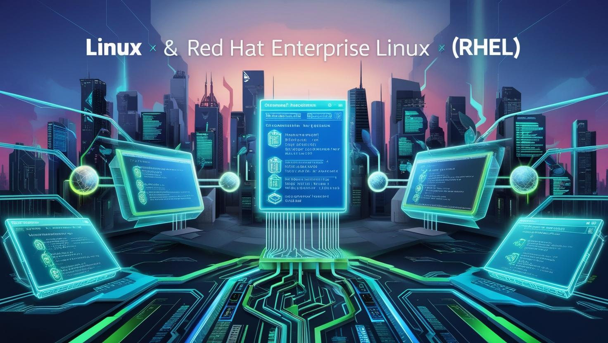
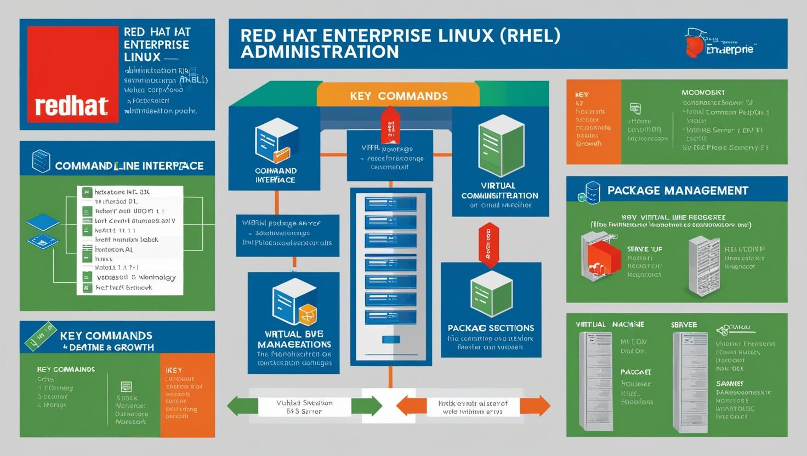

# **Red Hat Linux ve Sanallaştırma Eğitim Paketi**



[Download PDF Version](./redhat.pdf)

## **Eğitim Süresi**

- **Format 1**
  - **5 Gün**
  - **Ders Süresi:** 50 dakika
  - **Eğitim Saati:** 10:00 - 17:00

- **Format 2**
  - **12 Gün**
  - **Ders Süresi:** 50 dakika
  - **Eğitim Saati:** 10:00 - 17:00

- > Her iki eğitim formatında eğitimler 50 dakika + 10 dakika moladır. 12:00-13:00 saatleri arasında 1 saat yemek arasındaki verilir. Günde toplam 6 saat eğitim verilir. 5 günlük formatta 30 saat eğitim, 12 günlük formatta toplam 72 saat eğitim verilmektedir. 12 saatlik eğitmde katılımcılar kod yazar ve eğitmenle birlikte sorulan sorulara ve taleplere uygun içerikler ve örnekler çalışılır.

- > Eğitimler uzaktan eğitim formatında tasarlanmıştır. Her eğitim için teams linkleri gönderilir. Katılımcılar bu linklere girerek eğitimlere katılırlar. Ayrıca farklı remote çalışma araçları da eğitmen tarafından tüm katılımlara sunulur. Katılımcılar bu araçları kullanarak eğitimlere katılırlar. 

- > Eğitim içeriğinde github ve codespace kullanılır. Katılımcılar bu platformlar üzerinden örnek projeler oluşturur ve eğitmenle birlikte eğitimlerde sorulan sorulara ve taleplere uygun iceriğe cevap verir. Katılımcılar bu araçlarla eğitimlerde sorulan sorulara ve taleplere uygun iceriğe cevap verir.

- > Eğitim yapay zeka destekli kendi kendine öğrenme formasyonu ile tasarlanmıştır. Katılımcılar eğitim boyunca kendi kendine öğrenme formasyonu ile eğitimlere katılırlar. Bu eğitim formatı sayesinde tüm katılımcılar gelecek tüm yaşamlarında kendilerini güncellemeye devam edebilecekler ve her türlü sorunun karşısında çözüm bulabilecekleri yeteneklere sahip olacaklardır.

## **Red Hat Enterprise Linux (RHEL)**

Red Hat, açık kaynak yazılım ve teknoloji çözümleri sunan dünya çapında bir liderdir. 1993 yılında kurulan Red Hat, işletmelerin dijital dönüşümünü desteklemek için güvenli, ölçeklenebilir ve esnek yazılım çözümleri sağlar. Şirketin sunduğu ürünler, Linux tabanlı işletim sistemleri, bulut altyapıları, konteyner teknolojileri ve yönetim araçları gibi çeşitli alanlarda işletmelere güç katmaktadır.

Red Hat'in en bilinen ürünü, Red Hat Enterprise Linux (RHEL), kurumsal düzeyde güvenlik, performans ve yönetim sunan, açık kaynaklı bir işletim sistemidir. RHEL, dünya çapında binlerce kuruluş tarafından veri merkezlerinden bulut ortamlarına kadar her ölçekteki altyapıyı yönetmek için tercih edilmektedir. Ayrıca, Red Hat’in sunduğu Kubernetes, OpenShift gibi konteyner platformları, şirketlerin uygulamalarını daha hızlı ve güvenli bir şekilde geliştirmelerini ve dağıtmalarını sağlar.

Red Hat, işletmelere aynı zamanda yazılım geliştirme, veri yönetimi, ağ güvenliği ve işletme süreçlerini optimize etmeye yönelik çözümler sunar. Bu çözümler, IT altyapılarının modernizasyonu ve bulut geçişlerini kolaylaştırarak, şirketlerin rekabet avantajı elde etmelerine yardımcı olur.

Şirket, açık kaynak felsefesine dayalı olarak, topluluklarla iş birliği yaparak teknolojilerini sürekli geliştirir. Red Hat, dünya çapında işletmelere sağladığı destek ve hizmetlerle, sadece yazılım sağlamakla kalmaz, aynı zamanda müşterilerinin dijital dönüşüm süreçlerine de katkı sağlar.

## **Eğitim Hedefi**

Bu eğitim, katılımcılara Red Hat Enterprise Linux (RHEL) işletim sistemini etkin bir şekilde kullanma ve yönetme becerilerini kazandırmayı amaçlamaktadır. Eğitimde, temel kurulumdan ağ yönetimi, sistem güvenliği, yedekleme ve kurtarma gibi ileri düzey konulara kadar geniş bir yelpazede bilgi sağlanacaktır. Katılımcılar, RHEL ortamlarında günlük yönetim görevlerini yerine getirebilecek, sistem izleme ve performans yönetimi yapabilecek, güvenlik açıklarını giderebilecek ve uygulama dağıtımı gibi önemli işlemleri gerçekleştirebilecek yetkinliklere sahip olacaklardır. Ayrıca, sanal makineler ve konteyner teknolojileri (Docker, Kubernetes gibi) hakkında pratik bilgi edinerek, modern yazılım geliştirme ve altyapı yönetimi alanlarında yetkinlik kazanacaklardır. Eğitim, Linux tabanlı sistem yönetimi konusuna ilgi duyan profesyoneller ve bu alanda uzmanlaşmak isteyen IT yöneticileri, sistem yöneticileri ve geliştiriciler için uygundur.

<div style="page-break-after: always;"></div>

## **Eğitim İçeriği**



### 1. Giriş ve Temel Kavramlar

- Linux ve RHEL nedir?
- Linux’un tarihçesi ve dağıtım türleri
- RHEL’in özellikleri ve avantajları
- Komut satırı arayüzüne (CLI) giriş

### 2. Sistem Kurulumu

- Red Hat işletim sisteminin kurulumu
  - Gereksinimler
  - Kurulum medyası oluşturma
  - Kurulum adımları
- Temel yapılandırma
  - Ağ ayarları
  - Zaman ayarları
  - Kullanıcı oluşturma

### 3. Vagrant ile Sanal Makine Kurulumu ve Yönetimi

- Vagrant nedir ve nasıl kullanılır?
- **Vagrant ile RHEL sanal makinesi oluşturma**
  - Vagrantfile oluşturma
  - Sanal makine başlatma
  
  ```bash
  vagrant init centos/7
  vagrant up
  ```

- SSH ile sanal makineye bağlanma

  ```bash
  vagrant ssh
  ```

- Sanal makineleri durdurma ve silme

  ```bash
  vagrant halt
  vagrant destroy
  ```

- Multi-machine Vagrant yapılandırması

### 4. Temel Linux Komutları

- Dosya ve dizin yönetimi
- Dosya izinleri ve sahiplik
- Temel sistem bilgisi komutları (`uname`, `top`, `df`, `free`, vb.)
- Gelişmiş dosya yönetimi komutları (`find`, `grep`, `tar`, `rsync`)

### 5. Paket Yönetimi

- DNF ve YUM paket yöneticileri
- Paket kurma, kaldırma ve güncelleme
- Bağımlılık yönetimi
- Yazılım kaynaklarını yönetme

### 6. Uygulama Kurulumları ve Güncelleme

- Uygulama kurulum yöntemleri
  - Yazılım kaynaklarından uygulama kurulumu
  - RPM paketleri ile kurulum
- Güncellemelerin yönetimi

    ```bash
    dnf update
    ```

  - Belirli bir paketin güncellenmesi

    ```bash
    dnf upgrade paket_adi
    ```

- Uygulama kaldırma işlemleri

  ```bash
  dnf remove paket_adi
  ```

### 7. Ağ Yönetimi

- Temel ağ kavramları (IP, DNS, DHCP)
- Ağ arayüzlerinin yapılandırılması
- Firewall ve güvenlik ayarları
- Ağ izleme ve sorun giderme araçları (`ping`, `traceroute`, `netstat`)

### 8. Kullanıcı ve Grub Yönetimi

- Kullanıcı ekleme, silme ve düzenleme
- Grupların yönetimi
- Kullanıcı ve grup izinleri
- Sudo ve root erişimi

### 9. Sistem Güvenliği

- SELinux hakkında bilgi
- Güvenlik duvarı yapılandırması
- SSH ile güvenli uzaktan erişim
- Güncellemelerin ve yamaların yönetimi

### 10. Yedekleme ve Kurtarma

- Yedekleme stratejileri
- `tar` ve `rsync` kullanarak yedekleme
- Sistem kurtarma yöntemleri
- Boot ortamı ve kurtarma diskleri

### 11. Sistem İzleme ve Performans Yönetimi

- Sistem izleme araçları (top, htop, vmstat)
- Disk kullanımını izleme (df, du)
- Sistem performansını artırma stratejileri
- Log dosyalarının yönetimi

### 12. Uygulama Yönetimi

- Web sunucusu (Apache/Nginx) kurulumu ve yapılandırması
- Veritabanı sunucusu (MySQL/PostgreSQL) kurulumu
- Basit uygulama dağıtım senaryoları

### 13. Git Kurulumu ve Kullanımı

- Git’in temel kavramları (repository, commit, branch, merge)
- Git kurulumu

    ```bash
    dnf install git
    ```

- Yeni bir repository başlatma

    ```bash
    git init
    ```

- Dosya ekleme ve commit yapma

    ```bash
    git add dosya_adi
    git commit -m "İlk commit"
    ```

- Uzak repository ile çalışma

    ```bash
    git remote add origin uzak_repository_url
    ```

    ```bash
    git push origin master
    git pull origin master
    ```

### 14. Docker Kurulumu ve Temel Kullanımı

- Docker nedir ve neden kullanılır?
- Docker mimarisi
- Docker kurulumu ve yapılandırılması
  - Docker Engine kurulumu
  - Docker komutları (run, pull, push, images, ps)
- Dockerfile ile görüntü oluşturma
- Docker Compose kullanarak çoklu konteyner yapılandırması
- Konteynerlerin izlenmesi ve yönetimi
- Docker üzerinde basit uygulama dağıtımı

### 15. Kubernetes Kurulumu ve Yönetimi

- Kubernetes’in tanımı ve mimarisi
- Kubernetes kurulumu (Docker, kubelet, kubeadm, kubectl)
- Kubernetes kümesi oluşturma ve yönetme

    ```bash
    kubectl create deployment my-app --image=my-image
    kubectl expose deployment my-app --type=LoadBalancer --port=80
    ```

- Kubernetes üzerinde uygulama dağıtımı
- Temel sorun giderme ve izleme komutları (`kubectl logs`, `kubectl get pods`)

<div style="page-break-after: always;"></div>

## **Eğitim Yöntemi**

1. **Teorik Sunumlar**: Konular, uzman eğitmenler tarafından katılımcılara anlatılacak, temel kavramlar ve terminoloji açıklanacaktır. Her bir başlık, gerçek dünya senaryolarına dayalı örneklerle desteklenecektir.

2. **Canlı Demo ve Uygulamalı Gösterimler**: Katılımcılara canlı demolar ve uygulamalı gösterimler yapılacaktır. RHEL üzerinde gerçekleştirilen adım adım işlemler, katılımcıların öğrenilen bilgileri pratikte deneyimlemelerini sağlayacaktır.

3. **Lab Çalışmaları**: Her modül sonunda, katılımcıların öğrendiklerini pekiştirmeleri amacıyla laboratuvar çalışmaları yapılacaktır. Katılımcılar, bireysel veya grup halinde çeşitli görevleri tamamlayarak uygulamalı olarak öğrenmelerini sağlayacaklardır.

4. **Vaka Çalışmaları**: Gerçek iş dünyasında karşılaşılan sistem yönetimi ve güvenlik sorunları üzerinde vaka çalışmaları yapılacak, katılımcılar bu problemleri çözmeye yönelik stratejiler geliştireceklerdir.

5. **Soru-Cevap ve Tartışmalar**: Katılımcılar, eğitim boyunca sorularını eğitmene yöneltebilecek ve eğitimdeki konular üzerinde grup tartışmaları yaparak daha derinlemesine bilgi sahibi olacaklardır.

6. **İnteraktif Öğrenme**: Eğitim süresince katılımcılara, grup içi etkileşimi teşvik edecek sorular sorulacak ve küçük grup çalışmalarına yer verilecektir. Bu yöntem, katılımcıların bilgilerini pekiştirmelerine ve farklı bakış açıları geliştirmelerine yardımcı olacaktır.

7. **Değerlendirmeler**: Eğitim sonunda, katılımcıların konuya hakimiyetini ölçmek amacıyla kısa testler ve değerlendirmeler yapılacaktır. Bu, öğrenilen bilgilerin ne derece uygulamaya döküldüğünü değerlendirmeye olanak tanıyacaktır.

Eğitim, teoriyi pratiğe dökme ve katılımcıların öğrendikleri bilgileri günlük iş akışlarında etkili bir şekilde kullanabilmelerini sağlama odaklı bir yöntemle yapılandırılmıştır.

## **Hedef Kitle**

1. **Sistem Yöneticileri**: Linux işletim sistemi ve Red Hat Enterprise Linux (RHEL) üzerinde sistem yönetimi yapmak isteyen, temel veya ileri düzeyde bilgi sahibi olan profesyoneller. 

2. **Ağ Yöneticileri**: Ağ yapılandırmaları ve güvenliği konularında bilgi sahibi olmak isteyen, özellikle Linux tabanlı sistemlerde ağ yönetimini üstlenecek olan ağ yöneticileri.

3. **DevOps Mühendisleri**: DevOps süreçlerinde Linux ve container teknolojilerini (Docker, Kubernetes vb.) kullanarak uygulama geliştirme ve dağıtım süreçlerini iyileştirmeyi hedefleyen mühendisler.

4. **Yazılım Geliştiriciler**: Linux üzerinde uygulama geliştirmek, dağıtmak ve yönetmek isteyen yazılım geliştiriciler, özellikle sistem entegrasyonu ve uygulama yönetimi konularına ilgi duyanlar.

5. **Güvenlik Uzmanları**: Linux tabanlı sistemlerde güvenlik politikalarını yönetmek ve siber güvenlik önlemlerini uygulamak isteyen, güvenlik konusunda temel bilgilere sahip profesyoneller.

6. **Teknik Destek Personeli**: Linux ve Red Hat sistemleri üzerinde çalışan destek ekiplerinin, sistem sorunlarına çözüm üretme ve günlük yönetim görevlerini yerine getirebilmesi için gerekli bilgiye sahip olmak isteyenler.

7. **IT Yöneticileri**: Organizasyonlarında Linux tabanlı sunucuları yöneten ve sistem altyapısını geliştirmeyi amaçlayan IT yöneticileri.

Bu eğitim, katılımcıların Red Hat Enterprise Linux (RHEL) üzerinde güçlü bir sistem yönetimi yetkinliği kazanmalarını sağlamak ve sistem yönetimini modern yazılım geliştirme ve uygulama dağıtımı ile entegre edebilmelerine olanak tanımak amacıyla tasarlanmıştır.

## **Katılımcılardan Beklentilerimiz**

1. **Temel Bilgi ve İlgi**: Katılımcıların Linux ve Red Hat Enterprise Linux (RHEL) hakkında temel bilgiye sahip olmaları veya bu konularda öğrenmeye hevesli olmaları beklenmektedir.

2. **Aktif Katılım**: Eğitim sürecinde katılımcıların aktif bir şekilde katılım göstermeleri, ders içeriği üzerinde düşünmeleri ve tartışmalara katılmaları beklenmektedir. Bu, eğitimin daha verimli ve etkileşimli olmasını sağlayacaktır.

3. **Pratik Yetenek**: Katılımcıların, teorik bilgiyi pratikte uygulayabilecekleri becerileri kazanmaya istekli olmaları ve sanal makinelerde veya canlı sistemlerde gerçekleştirecekleri uygulamalara odaklanmaları beklenmektedir.

4. **Çözüm Odaklı Düşünme**: Katılımcıların, sistem yönetimi, ağ yapılandırması ve güvenlik gibi konularda karşılaşabilecekleri problemlere çözüm arayışında olmaları ve soruları çözme konusunda hevesli olmaları beklenir.

5. **Özdisiplin ve Zaman Yönetimi**: Eğitim sırasında katılımcıların verilen görevleri zamanında tamamlamaları, ilerleyen konuları anlamaya ve öğrenmeye istekli olmaları gerekmektedir.

6. **Öğrenmeye Açıklık**: Katılımcıların yeni teknolojiler ve araçlar hakkında bilgi edinmeye açık olmaları ve değişen teknolojiye ayak uydurma konusunda istekli olmaları beklenmektedir.

7. **Özelleştirilmiş Uygulama**: Katılımcıların eğitimde öğrendikleri bilgileri kendi iş ortamlarına veya projelerine uygulamaya istekli olmaları, öğrenilen kavramları gerçek dünyadaki senaryolarla ilişkilendirmeleri beklenmektedir.

[Eğitim ana materyalleri, sadece eğitmenler için](https://github.com/TuncerKARAARSLAN-VB/training-kit-red-hat-server-ve-sanallastirma)
