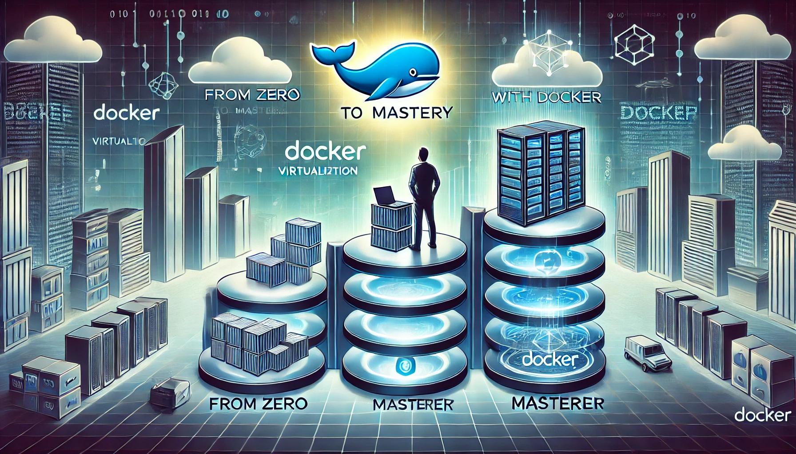

# **Sıfırdan Zirveye Docker ile Sanallaştırma**

## Eğitim Süresi:

- **Format 1**
  - **5 Gün**
  - **Ders Süresi:** 50 dakika
  - **Eğitim Saati:** 10:00 - 17:00

- **Format 2**
  - **12 Gün**
  - **Ders Süresi:** 50 dakika
  - **Eğitim Saati:** 10:00 - 17:00

- > Her iki eğitim formatında eğitimler 50 dakika + 10 dakika moladır. 12:00-13:00 saatleri arasında 1 saat yemek arasındaki verilir. Günde toplam 6 saat eğitim verilir. 5 günlük formatta 30 saat eğitim, 12 günlük formatta toplam 72 saat eğitim verilmektedir. 12 saatlik eğitmde katılımcılar kod yazar ve eğitmenle birlikte sorulan sorulara ve taleplere uygun içerikler ve örnekler çalışılır.

- > Eğitimler uzaktan eğitim formatında tasarlanmıştır. Her eğitim için teams linkleri gönderilir. Katılımcılar bu linklere girerek eğitimlere katılırlar. Ayrıca farklı remote çalışma araçları da eğitmen tarafından tüm katılımlara sunulur. Katılımcılar bu araçları kullanarak eğitimlere katılırlar. 

- > Eğitim içeriğinde github ve codespace kullanılır. Katılımcılar bu platformlar üzerinden örnek projeler oluşturur ve eğitmenle birlikte eğitimlerde sorulan sorulara ve taleplere uygun iceriğe cevap verir. Katılımcılar bu araçlarla eğitimlerde sorulan sorulara ve taleplere uygun iceriğe cevap verir.

- > Eğitim yapay zeka destekli kendi kendine öğrenme formasyonu ile tasarlanmıştır. Katılımcılar eğitim boyunca kendi kendine öğrenme formasyonu ile eğitimlere katılırlar. Bu eğitim formatı sayesinde tüm katılımcılar gelecek tüm yaşamlarında kendilerini güncellemeye devam edebilecekler ve her türlü sorunun karşısında çözüm bulabilecekleri yeteneklere sahip olacaklardır.

## **Sıfırdan Zirveye Docker ile Sanallaştırma Eğitimi**  

Modern yazılım dünyasının en güçlü araçlarından biri olan Docker'ı öğrenmek ve sanallaştırma dünyasında ustalaşmak ister misiniz? *"Sıfırdan Zirveye Docker ile Sanallaştırma"* eğitimi, sizi sıfırdan alıp Docker ekosistemine hâkim bir profesyonele dönüştürecek!  

- Docker’ın temellerinden başlayarak, konteyner teknolojisinin işleyişini öğreneceksiniz.  
- Gerçek dünya senaryolarıyla Docker'ı projelerinize nasıl entegre edeceğinizi keşfedeceksiniz.  
- Mikro servis mimarisinden CI/CD süreçlerine, konteyner orkestrasyonuna kadar her adımı deneyimleyeceksiniz.  

Pratik uygulamalar, gerçek örnekler ve uzman rehberliğiyle, yazılım geliştirme ve dağıtım süreçlerinizi devrim niteliğinde bir hız ve verimlilik seviyesine taşıyın!  

Docker ile sınırları aşmaya hazır mısınız? 🚀

## **Eğitim Hedefi**

Bu eğitim, katılımcılara docker temel prensiplerini, mimarisini ve uygulama senaryolarını öğretmeyi amaçlamaktadır. Eğitim sonunda katılımcılar, kendi docker  yapılandırmalarını oluşturabilecek, yönetebilecek ve uygulama dağıtımlarını gerçekleştirebilecek düzeye geleceklerdir.

## **Eğitim İçeriği**

### **Docker ve Konteyner Teknolojilerine Giriş**  

- Docker’ın modern yazılım dünyasındaki yeri ve önemi.  
- Konteyner teknolojilerinin devrimi: Sanallaştırmaya karşı konteynerleşme.  
- Docker mimarisi: Daemon, CLI ve Docker Engine.  
- Docker’ın kullanım senaryoları ve iş dünyasındaki etkisi.  
- İlk konteynerinizi oluşturma: "Hello, World!" uygulaması.  

---

### **Docker Kurulumu ve Altyapı Hazırlığı**  

- Docker’ın Windows, macOS ve Linux üzerinde kurulumu.  
- Docker Desktop ve Docker CLI kullanımı.  
- Sistem kaynaklarının Docker için optimize edilmesi.  
- Docker Toolbox ve WSL 2 ile entegrasyon.  
- Güvenli Docker kurulumu ve temel ağ yapılandırması.  

---

### **Docker CLI ve İmaj Yönetimi: Temel ve İleri Teknikler**  

- Docker CLI komutlarının derinlemesine analizi.  
- Docker imajları oluşturma, düzenleme ve paylaşma.  
- Çok katmanlı imajlar ve Dockerfile ile özelleştirme.  
- Docker Hub ve özel imaj depolarının kullanımı.  
- İmaj optimizasyonu: Boyut küçültme ve performans artırma teknikleri.  

---

### **Konteyner Yönetimi: Temel Kavramlardan İleri Seviyeye**  

- Konteynerlerin yaşam döngüsü: Çalıştırma, durdurma, yeniden başlatma.  
- Hata yönetimi ve konteyner performans izleme.  
- Birden fazla konteyner ile çalışma: Ağ bağlantıları ve veri paylaşımı.  
- Stateful ve stateless konteynerler arasındaki farklar.  
- Volume yönetimi ile veri kalıcılığı sağlama.  

---

### **Docker Compose: Çoklu Servis Uygulamaları ve Orkestrasyon**  

- Docker Compose temelleri ve YAML dosya yapısı.  
- Mikro servis uygulamalarının Compose ile yönetimi.  
- Compose ile ağlar, servisler ve hacimler tanımlama.  
- Uygulama sürümlerini yönetme ve servis güncellemeleri.  
- CI/CD süreçlerinde Docker Compose’un rolü.  

---

### **Docker Ağ Yapılandırmaları: Teoriden Uygulamaya**  

- Docker’ın ağ türleri: Bridge, Host, Overlay, Macvlan.  
- Konteynerler arası güvenli iletişim.  
- Özel ağlar oluşturma ve IP yapılandırmaları.  
- Multi-host ağlarda Docker Swarm ile entegrasyon.  
- Gerçek dünyadan örneklerle ağ optimizasyonu.  

---

### **Docker Swarm: Orkestrasyon ve Ölçeklendirme**  

- Docker Swarm mimarisi ve özellikleri.  
- Swarm cluster oluşturma ve yönetimi.  
- Servis ölçeklendirme, yük dengeleme ve güncelleme stratejileri.  
- Swarm ile dağıtık sistemlerde uygulama yönetimi.  
- Güvenlik: TLS sertifikaları ve Swarm node yetkilendirmeleri.  

---

### **Kubernetes ile Docker: Güçlü Orkestrasyon**  

- Kubernetes ve Docker iş birliği: Temel farklar ve avantajlar.  
- Kubernetes Pod, Node, Deployment ve Service kavramları.  
- Helm ile uygulama dağıtımı ve yönetimi.  
- Kubernetes dashboard kurulumu ve yönetimi.  
- Docker Compose ile Kubernetes manifest dönüşümleri.  

---

### **Monitoring ve Log Yönetimi**  

- Prometheus ve Grafana ile Docker konteynerleri izleme.  
- Docker log mekanizması ve ileri düzey konfigürasyon.  
- Elasticsearch ve Fluentd ile merkezi log yönetimi.  
- Gerçek zamanlı görselleştirme ve uyarı sistemleri.  

---

### **Performans ve Güvenlik Optimizasyonu**  

- Docker konteynerlerinin performans analiz araçları.  
- Kaynak kısıtlamaları: CPU, bellek ve disk optimizasyonu.  
- Docker’da en iyi güvenlik uygulamaları.  
- Docker Content Trust (DCT) ve imaj doğrulama.  
- Docker konteynerlerindeki güvenlik açıklarını tarama ve düzeltme.  

---

### **Pratik Projeler ve Gerçek Hayat Senaryoları**  

- Çoklu hizmet sunan bir web uygulamasının Dockerize edilmesi.  
- Mikro servis mimarisiyle bir e-ticaret sisteminin geliştirilmesi.  
- Üretim ortamında Docker kullanımı: Süreçler ve iyileştirmeler.  
- Docker altyapısının Kubernetes’e taşınması: Adım adım rehber.  
- Katılımcılara özel projeler ve uygulamalı çalışmalar.  

## **Eğitim Yöntemi**

- **Teorik Bilgiler**: Her günün başlangıcında teorik bilgilerin aktarılması.
- **Pratik Uygulamalar**: Katılımcıların kendi bilgisayarlarında uygulamalı çalışmaları.
- **Soru-Cevap**: Her günün sonunda katılımcıların sorularının cevaplanması.
- **Geribildirim**: Katılımcıların eğitim süresince aldıkları geribildirimler.

### **Hedef Kitle**

- Yazılım geliştiriciler
- Sistem yöneticileri
- DevOps mühendisleri
- IT profesyonelleri.

### **Katılımcılardan Beklentilerimiz**

Bu eğitimden en iyi şekilde faydalanabilmek için katılımcılardan beklenenler

1. **Temel Bilgisayar ve Yazılım Bilgisi:**  
   - Temel işletim sistemi (Windows, macOS veya Linux) kullanımı.  
   - Komut satırı (CLI) ile çalışmaya aşinalık.  

2. **Yazılım ve Altyapı Deneyimi (Tercihen):**  
   - Yazılım geliştirme veya sistem yönetimi alanında temel bilgiye sahip olunması faydalı olacaktır.  
   - Geliştirici, DevOps mühendisi veya sistem yöneticisi olarak çalışan katılımcılar için içerik daha hızlı ilerleyebilir.  

3. **Motivasyon ve Öğrenme İsteği:**  
   - Yeni teknolojileri öğrenmeye açık ve Docker ile gerçek dünyadaki senaryolar üzerinde çalışmaya istekli olmak.  

4. **Donanım Gereksinimleri:**  
   - Eğitim sırasında Docker kurulum ve uygulamaları için bir bilgisayar kullanılacaktır. Sistem gereksinimleri:  
     - **İşletim sistemi:** Windows 10/11 Pro, macOS (güncel sürüm), ya da Linux (Ubuntu, CentOS vb.)  
     - **RAM:** En az 8 GB (16 GB önerilir).  
     - **Depolama:** Minimum 50 GB boş disk alanı.  
     - **CPU:** Modern bir işlemci (64-bit, çok çekirdek önerilir).  

5. **Hazırlık:**  
   - Eğitim öncesinde Docker Desktop veya Docker Engine’in uygun versiyonunu cihazlarına kurmaları. (Kılavuz sağlanabilir).  
   - Eğitim sırasında gerekli olacak araçlar ve eklentiler (ör. Docker Compose, Git) için hazırlıklı olunması.  

6. **İnternet Bağlantısı (Çevrimiçi Eğitim için):**  
   - Çevrimiçi katılımlar için stabil ve hızlı bir internet bağlantısı gereklidir.  
   - Çevrimdışı çalışmayı tercih eden katılımcılar, eğitmenlerin sağlayacağı kaynakları önceden indirip kurulum yapmalıdır.  

Bu gereksinimler, eğitimin hızlı ve verimli bir şekilde ilerlemesini sağlamak amacıyla belirlenmiştir. Katılımcılar, ihtiyaç duydukları her noktada eğitmenlerden destek alabilir. 😊

[Eğitim ana materyalleri, sadece eğitmenler için](https://github.com/TuncerKARAARSLAN-VB/training-kit-ileri-seviye-docker-egitimi)
