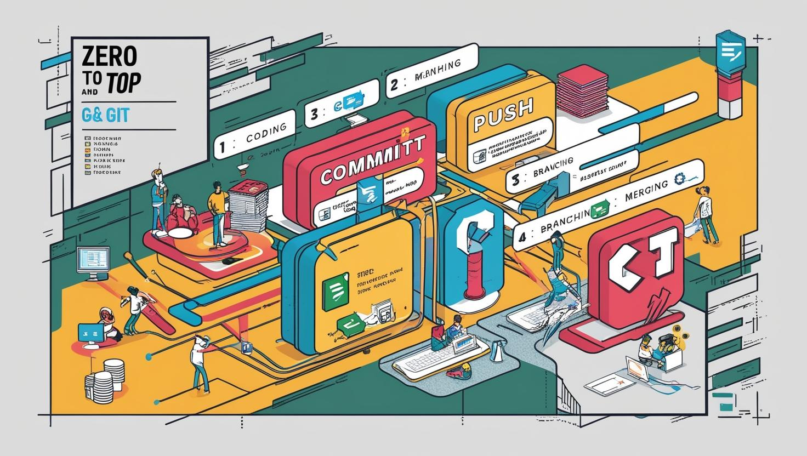
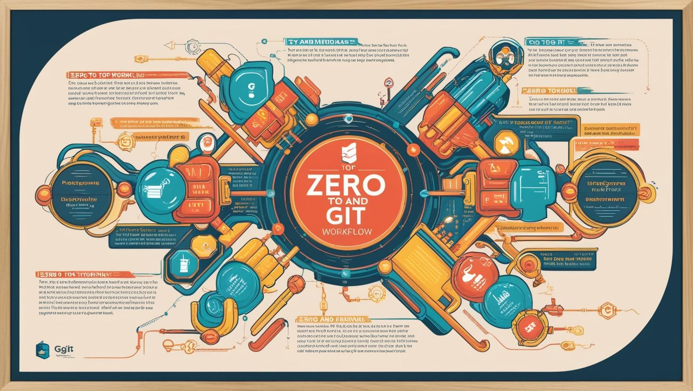

# Sıfırdan Zirveye Git ve Git Workflow

- [Güncel PDF'i İndir](https://www.vebende.com.tr/pdfs/git.pdf)
- [En güncel eğitimlerimiz için www.vebende.com.tr ziyaret edin](https://www.vebende.com.tr/sifirdan-zirveye-git-github-workflow)

## **Eğitim Süresi**

  - **5 Gün**
  - **Ders Süresi:** 50 dakika
  - **Eğitim Saati:** 10:00 - 17:00

- > Eğitim formatında eğitimler 50 dakika + 10 dakika moladır. 12:00-13:00 saatleri arasında 1 saat yemek arasındaki verilir. Günde toplam 6 saat eğitim verilir. 5 günlük formatta 60 saat eğitim 

- > Eğitimler uzaktan eğitim formatında tasarlanmıştır. Her eğitim için teams linkleri gönderilir. Katılımcılar bu linklere girerek eğitimlere katılırlar. Ayrıca farklı remote çalışma araçları da eğitmen tarafından tüm katılımlara sunulur. Katılımcılar bu araçları kullanarak eğitimlere katılırlar. 

- > Eğitim içeriğinde github ve codespace kullanılır. Katılımcılar bu platformlar üzerinden örnek projeler oluşturur ve eğitmenle birlikte eğitimlerde sorulan sorulara ve taleplere uygun iceriğe cevap verir. Katılımcılar bu araçlarla eğitimlerde sorulan sorulara ve taleplere uygun iceriğe cevap verir.

- > Eğitim yapay zeka destekli kendi kendine öğrenme formasyonu ile tasarlanmıştır. Katılımcılar eğitim boyunca kendi kendine öğrenme formasyonu ile eğitimlere katılırlar. Bu eğitim formatı sayesinde tüm katılımcılar gelecek tüm yaşamlarında kendilerini güncellemeye devam edebilecekler ve her türlü sorunun karşısında çözüm bulabilecekleri yeteneklere sahip olacaklardır.

## **Modern Yazılım Geliştirme Dünyasına Git ile Adım Atın!**

Günümüzün hızla değişen teknoloji dünyasında, yazılım geliştirme süreçleri de dönüşüm geçiriyor. Git, bu dönüşümün en önemli araçlarından biri olarak, yazılım geliştirme süreçlerini hızlandırıyor ve daha verimli hale getiriyor.

Şirketlerin **Git** ve **Git workflow** tercih etmesi, modern yazılım geliştirme süreçlerinde verimlilik, iş birliği ve kaliteyi artırmaya yardımcı olur. Git ve Git workflow kullanmanın avantajları:

- **Versiyon Kontrolü:** Git, her geliştiricinin bağımsız olarak kendi kopyasında çalışmasını sağlar, ancak bu değişiklikler merkezi bir depo ile senkronize edilir. Bu, tüm yazılım geliştirme sürecinin daha güvenli ve yönetilebilir olmasını sağlar.
  
- **Dağıtık Yapı:** Git’in dağıtık yapısı sayesinde her geliştirici, kendi bilgisayarında tüm proje geçmişine erişebilir. Bu, merkezi bir sunucuya bağımlılığı ortadan kaldırır ve internet bağlantısı kesilse bile çalışmalar devam edebilir.
  
- **Branching ve Merging:** Git, birden fazla dalda (branch) paralel olarak çalışmayı ve bu dalları kolayca birleştirmeyi mümkün kılar. Bu özellik, büyük projelerdeki iş birliğini kolaylaştırır ve geliştiricilerin aynı anda farklı özellikler üzerinde çalışmalarını sağlar.
  
- **İş Birliği ve Takım Çalışması:** Git, birden fazla geliştiricinin aynı projede eş zamanlı olarak çalışmasına olanak tanır. Pull request’ler ve code review işlemleri sayesinde kod kalitesi artırılır ve hatalar minimize edilir.
  
- **Hata Takibi ve İyileştirmeler:** Git, her değişikliğin kaydını tutarak, yazılımın geçmiş sürümlerine kolayca dönmeyi ve hataları geri almayı sağlar. Bu, yazılım geliştirme sürecinde güvenliği artırır ve riskleri minimize eder.

Git ve Git workflow kullanımı, yalnızca küçük projelerde değil, büyük ölçekli yazılım projelerinde de başarıyı garantileyen bir yöntemdir. Bu nedenle, Git, günümüz yazılım geliştirme dünyasında her profesyonelin ve her şirketin vazgeçilmez bir aracı haline gelmiştir.

## **Neden Şirketler Git ve Git Workflow Tercih Etmeli**

- **1. Sürüm Kontrolü ve Tarihçe Yönetimi**  
  - **Kodun geçmişini izleme**: Git, projedeki tüm değişikliklerin kaydını tutarak, herhangi bir zamanda önceki bir sürüme dönme imkanı sağlar.  
  - **Sürümleme kolaylığı**: Yazılım sürümleri arasında geçiş yapmayı basit hale getirir.  

- **2. İş Birliğini Geliştirme**  
  - **Paralel çalışma**: Birden fazla geliştirici, aynı proje üzerinde dallar (branches) kullanarak bağımsız çalışabilir.  
  - **Merge işlemleri**: Çakışmalar kolayca çözülerek ekip üyeleri arasında uyum sağlanır.  
  - **Pull request süreçleri**: Kod incelemesi (code review) ve onay süreçleri, kaliteyi artırır ve ekip içinde bilgi paylaşımını teşvik eder.  

- **3. Dağıtık Mimari**  
  - **Bağımsız çalışma imkanı**: Git’in dağıtık yapısı sayesinde ekip üyeleri internet bağlantısı olmadan bile çalışabilir.  
  - **Merkezi olmayan yapı**: Tüm geliştiriciler yerel bir kopya üzerinde çalıştığı için sunucu kaynaklı sorunlardan etkilenme riski azalır.  

- **4. Güçlü İş Akışları (Git Workflow)**  
  - **Esnek süreçler**: Git Flow, GitHub Flow, Feature Branch gibi iş akışları, projeye uygun şekilde özelleştirilebilir.  
  - **Daha iyi sürümleme**: Özellikle sürekli entegrasyon ve dağıtım (CI/CD) süreçlerine kolayca entegre olur.  
- **5. Açık Kaynak Ekosistemi ile Uyum**  
  - **Geniş ekosistem desteği**: Git, GitHub, GitLab, Bitbucket gibi birçok platformla uyumlu çalışır.  
  - **Topluluk desteği**: Dünya genelindeki geniş geliştirici topluluğu sayesinde problem çözme ve gelişim kolaydır.  

- **6. Ölçeklenebilirlik**  
  - **Küçükten büyüğe projelere uygun**: Git, küçük bir ekiple başlayan projelerden büyük kurumsal projelere kadar ölçeklenebilir bir altyapı sunar.  
  - **Büyük kod tabanlarını yönetme**: Kodun parçalara ayrılarak dallar üzerinde yönetilmesi büyük projeleri kolaylaştırır.  

- **7. Güvenlik ve Kontrol**  
  - **Erişim kontrolleri**: Kullanıcı rolleri ve erişim seviyeleri belirlenerek, güvenli bir ortam sağlanır.  
  - **Değişikliklerin izlenebilirliği**: Kimin, ne zaman, hangi değişikliği yaptığını görmek kolaydır.  

- **8. CI/CD ile Entegrasyon Kolaylığı**  
  - **Otomatik süreçler**: GitHub Actions, GitLab CI/CD gibi araçlarla entegrasyon sayesinde kod testleri ve dağıtımı otomatik hale gelir.  
  - **Hızlı teslimat**: Kod değişiklikleri, hızlı bir şekilde üretim ortamına alınabilir.  

Git ve Git workflow, özellikle **ekip iş birliği gerektiren projeler**, **uzaktan çalışma düzenleri** ve **hızlı ürün geliştirme** süreçleri için idealdir. Hem bireysel geliştiriciler hem de büyük organizasyonlar için esnek, güvenli ve ölçeklenebilir bir çözüm sunar.  

Eğer firmanızda Git workflow kurulumu yapmayı düşünüyorsanız, **ekip üyelerine eğitim verilmesi** ve **iş akışı süreçlerinin doğru tanımlanması** başarı için kritik öneme sahiptir.

## Eğitim İçeriği

Eğitimimiz, Docker’ın temellerinden başlayarak ileri düzey uygulamalara kadar geniş bir yelpazede konuları kapsıyor. 

### **Modül 1: Git ve GitHub'a Giriş**

- **Git Nedir?**  
  - Git’in tarihçesi ve amacı
  - Versiyon kontrol sistemlerinin temel özellikleri
- **GitHub Nedir?**  
  - Yazılım geliştirmedeki rolü
  - Git ve GitHub arasındaki farklar

---

### **Modül 2: Depo (Repository) Oluşturma**

- **Depoları Anlamak**  
  - Yerel (local) ve uzak (remote) depoların farkı
- **Depo Nasıl Oluşturulur?**  
  - Git deposu başlatma
  - Depoyu klonlama
  - Uzak depo ayarları

---

### **Modül 3: Pull Request (Değişiklik Talebi)**

- **Pull Request Nedir?**  
  - Ortak çalışmalardaki rolü
- **Pull Request Oluşturma**  
  - Süreç ve en iyi uygulamalar
- **Pull Request ve Fork Modeli**  
  - Açık kaynak projelerde fork kullanımı

---

### **Modül 4: GitHub ile Sosyal Ağ Kullanımı**

- **GitHub’ı Sosyal Ağ Olarak Kullanmak**  
  - Takipçiler, yıldızlar ve katkılar
- **Ekip Çalışması**  
  - Takım iş birliği için en iyi uygulamalar

---

### **Modül 5: Depo Forklama**

- **Forklama Nedir ve Nasıl Yapılır?**  
  - Depoyu fork’lama ve klonlama adımları
- **Fork’u Güncel Tutma**  
  - Orijinal depo ile senkronizasyon

---

### **Modül 6: Gelişmiş Git Dallandırma Araçları**  

- **Dal (Branch) ve Birleştirme (Merge) Temelleri**  
  - Dallandırmanın kullanım senaryoları
  - Birleştirme yöntemleri: fast-forward, 3-yönlü birleştirme, rebasing
- **İleri Seviye Araçlar ve Teknikler**  
  - Depo arşivleme
  - Son dalların görüntülenmesi
  - Daha açıklayıcı dal açıklamaları oluşturma
  - Yama setleri (patch sets) oluşturma
  - Commit’leri bölme
  - Commit’leri birleştirme (squashing)
  - Commit mesajı etiketleri (örn. "fix", "feat", "chore")
  - Commit’lerin sıralı olarak test edilmesi

---

### **Modül 7: Değişiklik Günlüklerini (Changelog) Anlamak**

- **Değişiklik Günlükleri Nedir?**
  - Projelerdeki rolleri
- **Değişiklik Günlüğü Yazma Yöntemleri**
  - Manuel ve otomatik yaklaşımlar
- **Değişiklik Günlüğü Oluşturma Komutları**
  - Etkili günlükler için araçlar ve şablonlar

---

### **Modül 8: GitHub’da Dosya Yönetimi**

- **Dosya Ekleme ve Yönetme**  
  - Depoya dosya ekleme
  - GitHub arayüzünde dosya düzenleme
- **Değişikliklerin İzlenmesi ve Dosya Silme**  
  - `git log` ve `git diff` kullanımı
  - Dosyaların silinmesi ve büyük dosya değişikliklerinin yönetimi

---

### **Modül 9: GitHub Güvenliği**  

- **Kullanıcı Rolleri ve Erişim Seviyeleri**  
  - İzinler ve depo ayarları
- **Organizasyonlar ve Takımlar**
  - Takımların kurulumu ve izinlerin yönetimi
- **Kimlik Doğrulama ve Şifreleme**
  - SSH anahtarları ve 2FA kullanımı
- **Denetim ve Erişim Günlükleri**
  -Depo aktivitelerinin izlenmesi
- **Uygulama Güvenliği**
  - Dependabot ve güvenlik açıkları taraması

---

### **Modül 10: GitHub Otomasyonu**  

- **GitHub Actions’a Giriş**  
  - İş akışlarının otomasyonu
- **Otomatik İş Akışları Oluşturma**  
  - `.yml` dosyaları yazma
  - CI/CD pipeline örnekleri

---

## **Git Eğitim Yöntemi**

- **Teorik Bilgiler**: Her günün başlangıcında, Git’in temel ilkeleri, komutlar ve iş akışları hakkında teorik bilgiler verilir. Katılımcılar, Git’in çalışma prensipleri, versiyon kontrolü, branching, commit işlemleri ve GitHub gibi platformlar üzerinde çalışmanın temelleri hakkında bilgilendirilir.
  
- **Pratik Uygulamalar**: Katılımcılar, teorik bilgileri kendi bilgisayarlarında uygulamalı olarak gerçekleştirir. Bu aşama, Git depoları oluşturma, dosya ekleme ve silme, commit yapma, branching (dal oluşturma ve birleştirme) gibi günlük iş akışlarına dayalı görevlerden oluşur. Her katılımcı, uygulamalı çalışmaları gerçek zamanlı olarak yapar ve kodlarını Git ile yönetir.

- **Soru-Cevap**: Her günün sonunda, katılımcılar teorik ve pratik konularla ilgili sorularını eğitmene yönlendirir. Bu seans, katılımcıların anlamadıkları noktaları çözmeleri ve gelişimlerini hızlandırmaları için önemlidir. Ayrıca, katılımcılar günlük öğrenmelerini pekiştirir ve kafalarındaki belirsizlikleri gidermeye çalışırlar.

- **Geribildirim**: Eğitim süresi boyunca, eğitmen katılımcıların yaptığı uygulamaları gözden geçirir ve onlara geri bildirimde bulunur. Bu geribildirim, katılımcıların öğrenme sürecindeki gelişimlerini izlemelerine ve hangi alanlarda iyileştirme yapmaları gerektiğini görmelerine yardımcı olur.

### **Hedef Kitle**

- **Yazılım Geliştiriciler**: Git ve GitHub gibi araçları kullanarak yazılım geliştirme sürecini daha verimli hale getirmek isteyen yazılım mühendisleri.
  
- **Sistem Yöneticileri**: Yazılım projelerindeki değişiklikleri izlemek ve sürüm kontrolü sağlamak için Git’i kullanmayı öğrenmek isteyen sistem yöneticileri.
  
- **DevOps Mühendisleri**: Git ve GitHub kullanarak sürekli entegrasyon, dağıtım ve otomasyon süreçlerini yönetmek isteyen DevOps mühendisleri.

- **IT Profesyonelleri**: Git ve versiyon kontrol sistemlerini kullanarak yazılım projelerindeki değişiklikleri izleme, yönetme ve optimize etme isteyen IT profesyonelleri.

### **Katılımcılardan Beklentilerimiz**

Bu eğitimden en iyi şekilde faydalanabilmek için katılımcılardan beklenenler:

1. **Temel Bilgisayar ve Yazılım Bilgisi:**
   - Temel işletim sistemi (Windows, macOS veya Linux) kullanımı.
   - Komut satırı (CLI) ile çalışmaya aşinalık.

2. **Yazılım Geliştirme ve Versiyon Kontrolü Deneyimi (Tercihen):**
   - Git ve GitHub gibi versiyon kontrol sistemleri hakkında temel bilgiye sahip olunması faydalı olacaktır.
   - Yazılım geliştirme veya sistem yönetimi alanında çalışan katılımcılar için içerik daha hızlı ilerleyebilir.

3. **Motivasyon ve Öğrenme İsteği:**
   - Git, GitHub ve sürüm kontrol sistemleri üzerine bilgi edinmeye istekli olmak.
   - Yeni teknolojileri öğrenmeye açık olmak ve projelerde versiyon kontrolünün önemini kavrayarak bu bilgiyi uygulamak.

4. **Donanım Gereksinimleri:**
   - Eğitim sırasında Git ve GitHub kullanımı için bir bilgisayar kullanılacaktır. Sistem gereksinimleri:
     - **İşletim Sistemi:** Windows 10/11, macOS (güncel sürüm) veya Linux (Ubuntu, CentOS vb.)
     - **RAM:** En az 8 GB (16 GB önerilir).
     - **Depolama:** Minimum 50 GB boş disk alanı.
     - **CPU:** Modern bir işlemci (64-bit, çok çekirdek önerilir).

5. **Hazırlık:**
   - Eğitim öncesinde Git ve GitHub’ın uygun versiyonlarının bilgisayarlarında kurulu olması.
   - Eğitim sırasında gerekli olacak araçlar ve eklentiler (ör. Git, GitHub Desktop) için hazırlıklı olunması.

6. **İnternet Bağlantısı (Çevrimiçi Eğitim için):**
   - Çevrimiçi katılımlar için stabil ve hızlı bir internet bağlantısı gereklidir.
   - Çevrimdışı çalışmayı tercih eden katılımcılar, eğitmenlerin sağlayacağı kaynakları önceden indirip kurulum yapmalıdır.

Bu gereksinimler, eğitimin hızlı ve verimli bir şekilde ilerlemesini sağlamak amacıyla belirlenmiştir. Katılımcılar, ihtiyaç duydukları her noktada eğitmenlerden destek alabilir. 😊

[Eğitim ana materyalleri, sadece eğitmenler için](https://github.com/TuncerKARAARSLAN-VB/training-kit-git-git-workflow-sifirdan-zirveye)
