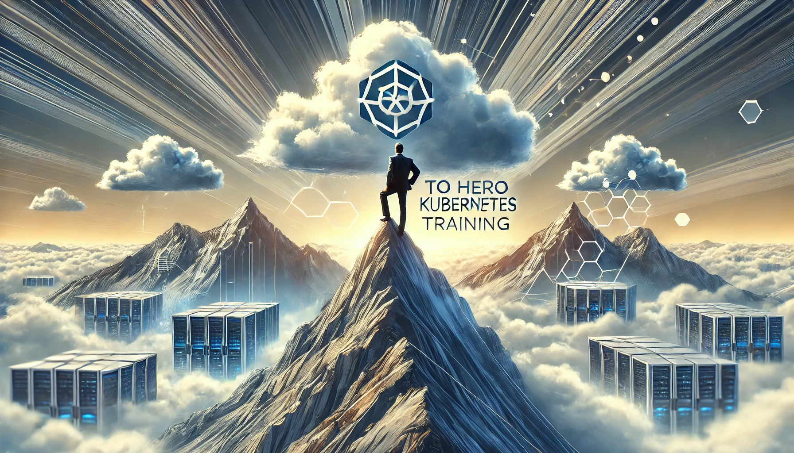

# Sıfırdan Zirveye Kubernetes Eğitimi

[Download PDF Version](./kubernetes.pdf)

## **Kubernetes Eğitimleri ve Danışmanlık Hizmetlerimizin Kurumlarınıza Katacağı Değer**

Günümüzde dijital dönüşüm ve teknoloji odaklı inovasyon, her alanda işletmelerin rekabetçi kalabilmesi için önemli bir faktör haline gelmiştir. Bu bağlamda, bulut tabanlı çözümler ve mikroservis mimarisi, modern yazılım geliştirme süreçlerinin temelini oluşturuyor. Kubernetes, bu süreçlerin yönetimini ve ölçeklendirilmesini kolaylaştırarak, firmaların verimliliğini artırır. Eğitimlerimiz, kurumların Kubernetes’i etkin bir şekilde kullanabilmesini sağlayarak operasyonel verimliliklerini en üst düzeye çıkarır.

**Eğitim Programımızın Kurumunuza Sağlayacağı Yararlar**

1. **Kubernetes’e Derinlemesine Hakimiyet**: Eğitimimiz, Kubernetes’in temel kavramlarından ileri düzey yönetim süreçlerine kadar geniş bir yelpazeyi kapsar. Bu, kurumların mevcut altyapılarında daha verimli ve sürdürülebilir çözümler üretmesine olanak sağlar. Kubernetes’in Pod, ReplicaSet, Deployment, Service gibi temel bileşenlerinin nasıl yönetileceğini öğrenen ekipler, daha hızlı ve etkili uygulama dağıtımları gerçekleştirebilir.

2. **Uygulama Yönetiminde Etkinlik**: Kubernetes, mikroservislerin yönetimi konusunda önemli avantajlar sunar. Eğitimimizde, StatefulSet ve DaemonSet gibi ileri düzey yönetim araçlarını öğrenerek, uygulamaların yönetimini daha esnek ve ölçeklenebilir hale getirebilirsiniz. Pod yaşam döngüsü, restart politikaları ve hizmet türleri gibi detaylı konularla uygulama yönetiminde uzmanlaşacaksınız.

3. **Yüksek Güvenlik ve İzleme**: Kubernetes güvenliği, firmalar için kritik öneme sahiptir. RBAC ve güvenlik politikalarıyla, Kubernetes altyapınızın güvenliğini en yüksek seviyeye taşıyabilirsiniz. Eğitimimizde ayrıca, Prometheus ve Grafana ile izleme yaparak, sistem sağlığını proaktif şekilde kontrol etme yeteneği kazanırsınız. Bunun yanı sıra, ELK Stack ve alternatif günlükleme çözümleriyle uygulama ve altyapı izlemeyi daha etkin hale getirebilirsiniz.

4. **Kubernetes En İyi Uygulamalarına Yönelik Stratejiler**: Eğitim programımız, CI/CD entegrasyonu ve GitOps gibi modern yazılım geliştirme süreçlerini Kubernetes ile nasıl optimize edebileceğinizi öğretir. Ayrıca, Helm kullanarak uygulama yönetiminde kolaylık sağlarken, Kubernetes’in kaynak yönetimi ve otomasyonu ile verimliliği artırabilirsiniz.

5. **Yedekleme, Geri Yükleme ve Yükseltme Stratejileri**: Eğitimde ayrıca, Kubernetes cluster’ınızın yedeklenmesi ve güncellenmesi konusunda kapsamlı bilgiler edineceksiniz. Velero ile yedekleme ve geri yükleme işlemleri, sistem kesintilerinin önüne geçmek için kritik bir yöntemdir.

## **Danışmanlık Hizmetlerimizle Destek**

Eğitimlerinizi aldığınızda, uygulamalı danışmanlık desteğimizle, öğrendiklerinizi kurumsal projelerinize entegre edebilirsiniz. **Kubernetes danışmanlık hizmetlerimiz**, şu alanlarda kapsamlı destek sağlar:

- **Altyapı Kurulumu ve Yapılandırması**: Kubernetes’in kurulumunu ve altyapınızı kurma sürecinde en verimli çözümü sunarak, ihtiyacınıza uygun yapılandırmalar sağlarız. Ayrıca, multi-node cluster kurulumları ve managed Kubernetes hizmetlerini (GKE, EKS, AKS) sağlama konusunda rehberlik ederiz.
  
- **Kapsamlı İzleme ve Güvenlik**: Kubernetes altyapınızın izlenmesi, güvenlik denetimlerinin yapılması ve en iyi güvenlik uygulamalarının uygulanması için size özel çözümler sunarız.

- **Yüksek Verimlilik İçin Optimizasyon**: Kaynak yönetimi, autoscaling stratejileri ve uygulama senaryolarını optimize ederek, verimliliği arttırır, maliyetleri düşürür ve performans artırıcı çözümler sunarız.

- **Çoklu Cluster Yönetimi**: Kubernetes’de çoklu cluster yönetimi ve KubeFed entegrasyonu konusunda size destek vererek, büyük ölçekli projelerde de başarı sağlarsınız.

Kubernetes konusunda kapsamlı eğitim ve profesyonel danışmanlık hizmetlerimizle, dijital dönüşüm yolculuğunuzda sizi bir adım öne taşıyoruz. Kurumunuzun potansiyelini en üst seviyeye çıkarmak için Kubernetes’i etkin kullanmaya bugün başlayın!

## Danışmanlık Formatlarımız

Bu paketleri tümüyle yeni teknolojiye geçiş aşamasındaki kurumlara tavsiye ediyoruz. BU paketin en büyük özelliği, sizinle birlikte hareket ediyoruz ve sizin ekibinizin bir parçası gibi sizin için sürekli arge yaparak olası tüm sorunları aşmanızı ve yol almanızı sağlıyoruz. Projenizin fail etmesi riskini ortadan kaldırıyoruz. Çünkü bu paketlerde sizin için çalışan arka plandaki dev bir ekibe sahip oluyorsunuz. Sorunlarınız bizim sorunlarımız oluyor.  Bu paketlerin en büyük özelliği, sizin için sürekli arge yapan ve tüm sorunları aşmanızı sağlayan bir ekiple birlikte çalışma konforunu kurumunuza sağlıyoruz.

- **8 Haftalık Paket**
- **16 Haftalık Paket**
- **24 Haftalık Paket**
- 4 haftadan kısa olamamak üzere sizin lokasyonunuzda sizin mesai saatlerinde sizlerle çalışma yapıyoruz.
- İsterseniz 1 günden kısa olmamak üzere, uzaktan destek olarak da paket sürelerinizi değerlendirebiliyorsunuz
- Paket sürelerinizi isterseniz çok çeşitli eğitim içeriklerimiz ile kurum içi eğitimler olarak kullanabilirsiniz.

## **Eğitim Hedefi**

Bu eğitim, katılımcılara Kubernetes’in temel prensiplerini, mimarisini ve uygulama senaryolarını öğretmeyi amaçlamaktadır. Eğitim sonunda katılımcılar, kendi Kubernetes küme yapılandırmalarını oluşturabilecek, yönetebilecek ve uygulama dağıtımlarını gerçekleştirebilecek düzeye geleceklerdir.

## **Eğitim İçeriği**

- **Format 1**
  - **5 Gün**
  - **Ders Süresi:** 50 dakika
  - **Eğitim Saati:** 10:00 - 17:00

- **Format 2**
  - **12 Gün**
  - **Ders Süresi:** 50 dakika
  - **Eğitim Saati:** 10:00 - 17:00

- > Her iki eğitim formatında eğitimler 50 dakika + 10 dakika moladır. 12:00-13:00 saatleri arasında 1 saat yemek arasındaki verilir. Günde toplam 6 saat eğitim verilir. 5 günlük formatta 30 saat eğitim, 12 günlük formatta toplam 72 saat eğitim verilmektedir. 12 saatlik eğitmde katılımcılar kod yazar ve eğitmenle birlikte sorulan sorulara ve taleplere uygun içerikler ve örnekler çalışılır.

- > Eğitimler uzaktan eğitim formatında tasarlanmıştır. Her eğitim için teams linkleri gönderilir. Katılımcılar bu linklere girerek eğitimlere katılırlar. Ayrıca farklı remote çalışma araçları da eğitmen tarafından tüm katılımlara sunulur. Katılımcılar bu araçları kullanarak eğitimlere katılırlar.

- > Eğitim içeriğinde github ve codespace kullanılır. Katılımcılar bu platformlar üzerinden örnek projeler oluşturur ve eğitmenle birlikte eğitimlerde sorulan sorulara ve taleplere uygun iceriğe cevap verir. Katılımcılar bu araçlarla eğitimlerde sorulan sorulara ve taleplere uygun iceriğe cevap verir.

- > Eğitim yapay zeka destekli kendi kendine öğrenme formasyonu ile tasarlanmıştır. Katılımcılar eğitim boyunca kendi kendine öğrenme formasyonu ile eğitimlere katılırlar. Bu eğitim formatı sayesinde tüm katılımcılar gelecek tüm yaşamlarında kendilerini güncellemeye devam edebilecekler ve her türlü sorunun karşısında çözüm bulabilecekleri yeteneklere sahip olacaklardır.

### **Kubernetes’e Giriş ve Kurulum**  

**Kubernetes Nedir?**  

- Tanım ve Tarihçe  
- Kubernetes’in Avantajları: Mikroservislerin yönetiminde Kubernetes'in rolü  

**Kubernetes Mimarisi**  

- Pod, ReplicaSet, Deployment, Service kavramları  
- Kubernetes bileşenleri (Master Node, Worker Node)  

**Kubernetes Kurulumu**  

- Minikube ile Kubernetes kurulumu  
- kubeadm ile Multi-node Cluster Kurulumu  
- Managed Kubernetes Hizmetleri (GKE, EKS, AKS)  

**Kubernetes CLI Kullanımı**  

- Kubectl CLI komutları ve temel işlemler  
- Codespace ortamında Kubernetes ile çalışma  

---  

### **Pod ve Uygulama Yönetimi**  

**Pod Kavramı ve Yönetimi**  

- Pod içindeki konteynerlerin yönetimi  
- Pod Lifecycle ve Restart Policy  
- Pod Disruption Budget  

**Deployment Yönetimi**  

- Deployment oluşturma, güncelleme ve rollback  
- Versiyon kontrol stratejileri  

**Service Türleri ve İletişim**  

- ClusterIP, NodePort, LoadBalancer  
- Service ile Pod’lar arası iletişim  

**Stateful ve DaemonSet Uygulamaları**  

- StatefulSets ile Stateful uygulamalar  
- DaemonSets kullanımı  

---  

### **İleri Seviye Kubernetes Konseptleri**  

**ConfigMap ve Secret Yönetimi**  

- Uygulama yapılandırmaları ve gizli bilgilerin yönetimi  

**Depolama Yönetimi**  

- Kalıcı depolama birimleri (Persistent Volume, Persistent Volume Claim)  
- Farklı depolama çözümleri  

**Ağ ve Ingress Yönetimi**  

- Kubernetes ağ politikaları ve yönetimi  
- Ingress Controller yapılandırması  

**Scheduler ve Node Yönetimi**  

- Kubernetes Scheduler ve Node Affinity  
- Pod yerleştirme stratejileri (affinities, taints/tolerations)  

**Ağ Güvenliği**  

- Network Policies ile uygulamalar arası güvenlik  

---  

### **Kubernetes Güvenliği ve İzleme**  

**RBAC ve Güvenlik Prensipleri**  

- Role-Based Access Control (RBAC) yapılandırması  
- Güvenlik politikalarının belirlenmesi  

**İzleme ve Günlükleme**  

- Prometheus ile izleme  
- Grafana ile görselleştirme  
- ELK Stack ve alternatif günlükleme çözümleri (Loki, Fluentd)  

**Yedekleme ve Geri Yükleme**  

- Velero ile yedekleme ve geri yükleme işlemleri  

**Cluster Upgrade Stratejileri**  

- Kubernetes versiyon yükseltme yolları  

---  

#### **Uygulama Dağıtımı ve En İyi Uygulamalar**  

**Uygulama Dağıtımı**  

- CI/CD süreçleri ve Kubernetes entegrasyonu  
- GitOps ile Kubernetes yönetimi (ArgoCD, FluxCD)  

**Helm ile Uygulama Yönetimi**  

- Helm kullanarak paket yönetimi  

**Kubernetes En İyi Uygulamaları**  

- Kaynak yönetimi ve otomasyon  
- Horizontal ve Vertical Pod Autoscaling  
- Cluster Autoscaler ile node yönetimi  

**Uygulama Senaryoları ve Çoklu Cluster Yönetimi**  

- Gerçek dünyadan örneklerle uygulama dağıtımı  
- Çoklu cluster yönetimi (KubeFed)  
- Sorun çözme yolları ve pratik çözümler  

## **Eğitim Yöntemi**

- **Teorik Bilgi:** Güncel bilgiler ve konseptlerin anlatımı.
- **Uygulamalı Örnekler:** Gerçek senaryolarla pratik uygulamalar.
- **Etkileşimli Tartışmalar:** Katılımcıların fikirlerini paylaşabileceği oturumlar.

## **Hedef Kitle**

- Yazılım Geliştiriciler
- Sistem Yöneticileri
- DevOps Mühendisleri
- IT Profesyonelleri

## **Katılımcılardan Beklentilerimiz**

1. **Temel Bilgi Seviyesi**  
   - Linux işletim sistemine temel düzeyde hâkimiyet.  
   - Container teknolojileri (örneğin Docker) hakkında temel bilgi sahibi olmak.  

2. **Teknik Hazırlık**  
   - Eğitim boyunca kullanılacak araçların kurulumunu tamamlamış olmak:  
     - Docker ve Kubernetes kurulu bir sistem (Minikube veya alternatif bir çözüm).  
     - Kubectl gibi temel CLI araçlarının hazır olması.  
   - Gerektiğinde bulut tabanlı Kubernetes servislerini (GKE, AKS, EKS) kullanmak için bulut hesaplarına sahip olmak.  

3. **Donanım Gereksinimleri**  
   - Eğitim sırasında kullanılacak bilgisayarda minimum gereksinimler:  
     - 8 GB RAM (tercihen 16 GB veya daha fazlası).  
     - Çok çekirdekli işlemci (tercihen 4 çekirdek ve üzeri).  
     - SSD depolama alanı (Docker ve Kubernetes işlemleri için hızlı okuma/yazma gereklidir).  

4. **Pratik Yapma Kararlılığı**  
   - Teorik bilgileri uygulamalı örneklerle pekiştirmek için aktif katılım.  
   - Eğitim sonrası kendi projelerinde Kubernetes’i denemeye açık olmak.  

5. **Problem Çözme Yeteneği ve Takım Çalışması**  
   - Eğitim sırasında karşılaşılan sorunları çözme sürecine dâhil olma istekliliği.  
   - Ekip çalışmasına uygun ve paylaşımcı bir yaklaşım benimsemek.  

[Eğitim Materyalleri (Eğitmenlere Özel)](https://github.com/TuncerKARAARSLAN-VB/training-kit-ileri-seviye-kubernetes-egitimi)
