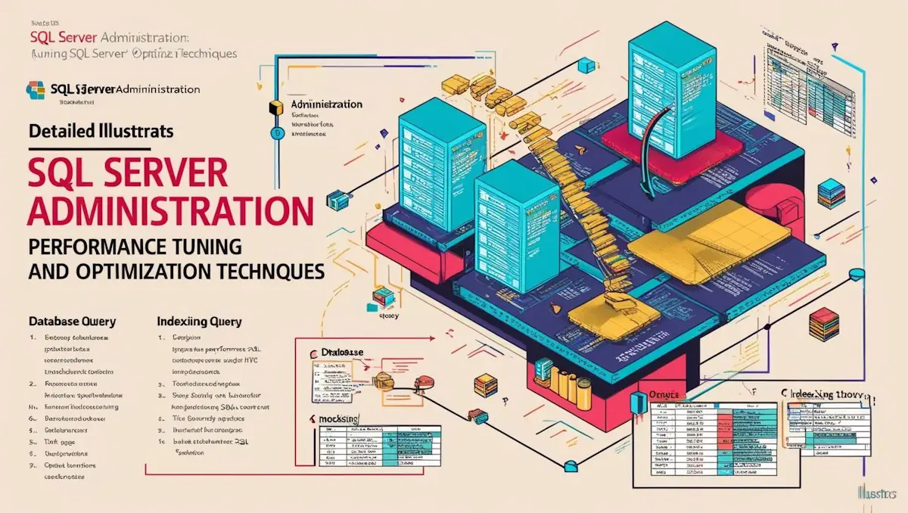

# **ASP.NET Core MVC**

- [Güncel PDF'i İndir](https://www.vebende.com.tr/pdfs/sqlserver.pdf)
- [En güncel eğitimlerimiz için www.vebende.com.tr ziyaret edin](https://www.vebende.com.tr/sqlserver)
  
## **Eğitim Süresi**

- **Süre:** 15 gün
- **Ders Süresi:** 50 dakika
- **Eğitim Saati:** 10:00 - 17:00

- > Eğitim formatında eğitimler 50 dakika + 10 dakika moladır. 12:00-13:00 saatleri arasında 1 saat yemek arasındaki verilir. Günde toplam 6 saat eğitim verilir. 15 günlük formatta 90 saat eğitim verilmektedir.

- > Eğitimler uzaktan eğitim formatında tasarlanmıştır. Her eğitim için teams linkleri gönderilir. Katılımcılar bu linklere girerek eğitimlere katılırlar. Ayrıca farklı remote çalışma araçları da eğitmen tarafından tüm katılımlara sunulur. Katılımcılar bu araçları kullanarak eğitimlere katılırlar.

- > Eğitim içeriğinde github ve codespace kullanılır. Katılımcılar bu platformlar üzerinden örnek projeler oluşturur ve eğitmenle birlikte eğitimlerde sorulan sorulara ve taleplere uygun iceriğe cevap verir. Katılımcılar bu araçlarla eğitimlerde sorulan sorulara ve taleplere uygun iceriğe cevap verir.

- > Eğitim yapay zeka destekli kendi kendine öğrenme formasyonu ile tasarlanmıştır. Katılımcılar eğitim boyunca kendi kendine öğrenme formasyonu ile eğitimlere katılırlar. Bu eğitim formatı sayesinde tüm katılımcılar gelecek tüm yaşamlarında kendilerini güncellemeye devam edebilecekler ve her türlü sorunun karşısında çözüm bulabilecekleri yeteneklere sahip olacaklardır.  

## **SQL Server Yönetimi ve Performans İyileştirme Eğitimi**  

SQL Server, günümüz işletmelerinin veri yönetimi ihtiyaçlarını karşılamak için güçlü ve yüksek performanslı bir veritabanı yönetim sistemidir. Büyük veri analizi ve günlük veri işlemleri için optimize edilmiş çözümler sunan SQL Server, güvenilirlik ve verimlilik sağlar. Bu eğitim, SQL Server yönetimi, performans iyileştirme, sorgu optimizasyonu ve sistem yönetimini geliştirmek için katılımcılara kapsamlı bir yaklaşım sunmayı amaçlamaktadır.

**SQL Server: Yüksek Performanslı Veri Yönetimi Çözümü**  
SQL Server, modern işletmelerin kritik veri yönetimi ihtiyaçlarını karşılamak için çok çeşitli özellikler sunar. Veritabanı performansını artırmak, sistem yönetimini geliştirmek ve veri işleme süreçlerini optimize etmek için kullanılan en iyi uygulamaları öğrenmek, bu eğitimde ön planda olacaktır. Katılımcılar, veritabanı yönetimi ve performans iyileştirme konusunda derinlemesine bilgi sahibi olacaklardır.

**Eğitim Konuları:**  

- **SQL Server Yönetimi ve Temelleri:** SQL Server kurulumu, konfigürasyonu ve veri yönetimi  
- **Veritabanı Performans Yönetimi:** SQL Server'da performans iyileştirme teknikleri, kaynak yönetimi  
- **Sorgu Optimizasyonu:** Karmaşık SQL sorgularının performansını artırma, indeks kullanımı  
- **İndeksleme ve Veri Yapıları:** SQL Server’da doğru indeksleme, veri yapıları ve sorgu hızlandırma  
- **SQL Server Güvenliği:** Veritabanı güvenliği, kullanıcı yönetimi ve erişim kontrolü  
- **Veritabanı İzleme ve Sorun Giderme:** Performans izleme araçları, hataların tespiti ve çözülmesi  
- **Veritabanı Yedekleme ve Kurtarma:** Yedekleme stratejileri, veritabanı kurtarma planları  
- **SQL Server’ın Yeni Özellikleri:** Son sürümler ile gelen yenilikler ve gelişmiş özellikler  
- **Sistem Kaynakları ve İyileştirme:** SQL Server’ın kaynak kullanımı, bellek yönetimi ve sistem ayarları

**Performans İyileştirme ve Optimizasyon:**  
SQL Server performansını artırmak için kullanılan yöntemler ve en iyi uygulamalar eğitimde ayrıntılı olarak ele alınacaktır. Katılımcılar, veritabanı işlemlerinin hızını artırmak, sistem yükünü azaltmak ve verimliliği yükseltmek için gerekli becerileri kazanacaklardır.

**SQL Server ile Verimli Veri Yönetimi:**  
SQL Server yönetimi ve performans iyileştirmeye yönelik kapsamlı bilgiler sağlayarak, katılımcılar, veritabanı yönetimindeki uzmanlıklarını artıracak ve modern işletmelerin ihtiyaç duyduğu yüksek performansı sağlayacaklardır. Eğitim sonunda, SQL Server’ı daha verimli kullanarak, veri yönetimi süreçlerini optimize edebilecekler.

## **Eğitim Hedefi**  

Bu eğitim, **SQL Server Yönetimi ve Performans İyileştirme** konularında katılımcılara kapsamlı bir anlayış kazandırmayı amaçlamaktadır. Katılımcılar, **SQL Server’ın temel yönetim araçları**, **performans izleme**, **sorgu optimizasyonu**, **veri yapıları ve indeksleme** gibi konuları derinlemesine öğrenecek ve uygulamalı olarak deneyim kazanacaklardır. Eğitim, katılımcıların SQL Server ile yüksek performanslı ve verimli veri yönetimi çözümleri geliştirebilmelerini sağlamak amacıyla tasarlanmıştır.

Eğitim sonunda katılımcılar:

- **SQL Server yönetimi ve temel yapı taşlarını anlayacak**,  
- **Veritabanı performansını izleyip analiz edebilecek**,  
- **Sorgu optimizasyonu ve indeksleme tekniklerini uygulayarak performansı artırabilecek**,  
- **SQL Server güvenliği ve erişim kontrolü üzerine bilgi sahibi olacak**,  
- **Veri yedekleme ve kurtarma stratejilerini uygulayabilecek**,  
- **SQL Server’ın performansını optimize etmek için en iyi uygulamaları öğrenip projelerinde kullanabileceklerdir.**  

Bu eğitim, **SQL Server'a yeni başlayanlar** veya **mevcut bilgilerini geliştirmek ve güncellemek isteyen veritabanı yöneticileri** için uygundur.

## **Eğitim İçeriği**  

### **ASP.NET Core MVC ile Modern Web Uygulamaları Geliştirme**  

#### **1. Giriş ve Kurulum**  

- **ASP.NET Core Nedir?**  
- **ASP.NET Core'un Avantajları**  
- **Gerekli Yazılımlar:** Visual Studio, .NET SDK Kurulumu  
- **İlk ASP.NET Core Projesinin Oluşturulması**  
- **Proje Yapısı ve Dosya Açıklamaları**  

#### **2. C# Temelleri ve ASP.NET Core ile İlişkisi**  

- **C# Dilinde Temel Kavramlar**  
- **Değişkenler, Veri Tipleri, Döngüler, Koşul İfadeleri**  
- **Nesne Tabanlı Programlamaya Giriş (OOP)**  
- **C# Sınıflarının ASP.NET Core Projelerindeki Rolü**  ## **Eğitim İçeriği**

### **SQL Server Yönetimi ve Performans Optimizasyonu Eğitimi**

#### **1. SQL Server Mimarisi ve Performans Optimizasyonu Temelleri**

- **SQL Server’ın Bileşenleri ve SQL OS’unun Tanıtımı**
- **Windows Planlama ve SQL Planlama Arasındaki Farklar**
- **Veri Yönetimi İçin İleri Seviye Planlama Stratejileri**
- **Waits ve Kuyrukların Veritabanı Performansına Etkisi**
- **Yüksek Performans İçin Kuyruk ve Bekleme Yönetimi**

#### **2. Yüksek Performanslı Veri Yazma ve Okuma**

- **Temel I/O Konseptleri ve Yüksek Hacimli Veri Yönetimi**
- **SQL Server I/O Optimizasyonu Yöntemleri**
- **Büyük Veri Yazma ve Okuma Stratejileri**
- **Batch Yazma ve Asenkron Okuma Teknikleri**
- **Veri Sıkıştırma ile Depolama Alanı Kazanımı**
- **Veritabanı Yapılarının (İndeksler, Tablolama) Performansa Etkisi**

#### **3. Dosyalama Sistemleri ve Multi-File Index Yapıları**

- **Dosyalama Sistemlerinin Veri Depolama Stratejileri**
- **Filgroup Multi-File Index Yapısının Tanımı ve İşleyişi**
- **Veri Dilimleme (Sharding) Kavramı**
- **Veri Parçalama ve Yönetimi Yöntemleri**
- **Veri Yedekleme ve Hızlı Erişim İçin Dosyalama Sistemleri**

#### **4. SQL Server Bellek Yönetimi ve In-Memory OLTP**

- **Windows ve SQL Server Bellek Yönetimi Yöntemleri**
- **Veritabanı Bellek Kullanımının Optimizasyonu**
- **In-Memory OLTP (Online Transaction Processing) Konsepti**
- **Bellek Yönetiminin Veri Performansına Etkileri**

#### **5. İleri Seviye İndeksleme ve İstatistik Yönetimi**

- **İstatistiklerin Veritabanı Performansındaki Rolü**
- **Cardinality Estimation ve Doğru Tahmin Yöntemleri**
- **İndeks İç Yapıları ve İleri Seviye İndeksleme Teknikleri (Columnstore İndeksleri)**
- **Filgroup ve Multi-File Indexing Kullanımı**
- **İndekslerin Veri Yazma ve Okuma Performansına Etkisi**

#### **6. Sorgu Çalıştırma ve Sorgu Planı Analizi**

- **SQL Server Sorgu Yürütme Planlarının Analizi**
- **Sorgu Performansını İyileştirme Yöntemleri**
- **Veri Okuma/Yazma Performansını Etkileyen Sorgular**
- **İleri Seviye Sorgu Planı Optimizasyon Teknikleri**

#### **7. Plan Önbellekleri ve Yeniden Derleme**

- **Plan Önbelleği İç Yapılarının Yönetimi**
- **Yeniden Derleme ve Plan Tazeleme Teknikleri**
- **Sorgu Mağazası (Query Store) ve Plan Saklama Yöntemleri**

#### **8. Uzatılmış Olaylar ve Performans İzleme**

- **Uzatılmış Olayların Temel Konseptleri**
- **Performans İzleme Stratejileri**
- **Gerçek Zamanlı Veri İzleme ve Performans Analizi**

#### **9. Veri Raporlama ve Analiz**

- **Büyük Veri Raporlama Teknikleri**
- **Gerçek Zamanlı Analitik ve Veri Görselleştirme Araçları**
- **SQL Server’da Raporlama Stratejileri**
- **Veri İzleme ve Raporlama Araçlarının Kullanımı**

#### **10. İzleme, Hata Ayıklama ve Performans Ölçümü**

- **Veri Yazma ve Okuma İzleme Teknikleri**
- **Disk I/O, CPU Kullanımı ve Bellek Yönetimi**
- **Baselining ve Benchmarking Kavramları**
- **Yüksek Performans İçin İzleme Araçları ve Raporlama**

## **Eğitim Yöntemi** (SQL Server Yönetimi ve Performans Optimizasyonu)

- **Teorik Bilgi:** SQL Server’ın mimarisi, performans optimizasyonu teknikleri ve yönetim stratejileri detaylı bir şekilde ele alınacaktır.
- **Uygulamalı Örnekler:** Gerçek dünya veritabanı senaryoları üzerinden performans iyileştirme teknikleri uygulanacaktır.
- **Etkileşimli Tartışmalar:** Katılımcılar, veritabanı yönetimi ve performans iyileştirme süreçleri hakkında soru-cevap şeklinde tartışmalara katılacaktır.
- **Proje Tabanlı Öğrenme:** Eğitim sonunda, katılımcılar SQL Server veritabanları üzerinde optimizasyon projeleri geliştirecek ve gerçek dünyadaki sorunları çözme pratiği yapacaklardır.

## **Hedef Kitle**

1. **Veritabanı Yöneticileri:** SQL Server veritabanlarını yönetmek ve performansını optimize etmek isteyen yöneticiler.
2. **Veritabanı Geliştiricileri:** SQL Server üzerinde veritabanı tasarımı, sorgu yazımı ve optimizasyon yapmak isteyen geliştiriciler.
3. **Sistem Yöneticileri:** SQL Server altyapısını yöneten ve performans iyileştirme üzerine çalışmak isteyen profesyoneller.
4. **Yazılım Geliştiriciler:** SQL Server ile backend veri yönetimi ve performans optimizasyonu yapmayı öğrenmek isteyen yazılımcılar.
5. **İş Analistleri:** SQL Server veritabanı performansını analiz etmek ve raporlama stratejileri geliştirmek isteyen analistler.
6. **Proje Yöneticileri:** Veritabanı yönetim projelerini daha verimli yönetmek ve optimizasyon süreçlerini anlayarak liderlik yapmak isteyen yöneticiler.
7. **İleri Seviye Kullanıcılar:** SQL Server konusunda derinlemesine bilgi sahibi olup veritabanı performansı konusunda daha ileri seviyede bilgi edinmek isteyen uzmanlar.

## **Katılımcılardan Beklentilerimiz** (SQL Server Yönetimi ve Performans Optimizasyonu)

- Katılımcıların temel seviyede SQL ve veritabanı yönetimi hakkında bilgi sahibi olmaları.
- Veritabanı performansını iyileştirme tekniklerine ilgi duymaları.
- İleri seviye SQL komutları ve optimizasyon süreçleri üzerinde çalışmaya istekli olmaları.
- Katılımcıların aktif katılım göstermeleri, soru sormaları ve öğrenmeye açık olmaları.

[Eğitim Materyalleri (Eğitmenlere Özel)](https://github.com/TuncerKARAARSLAN-VB/training-kit-sqlserver)
