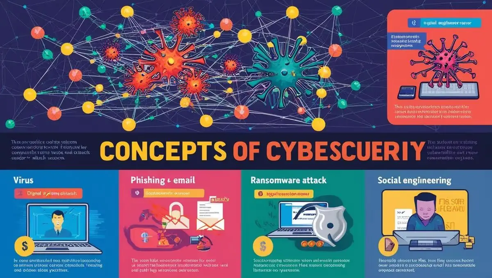
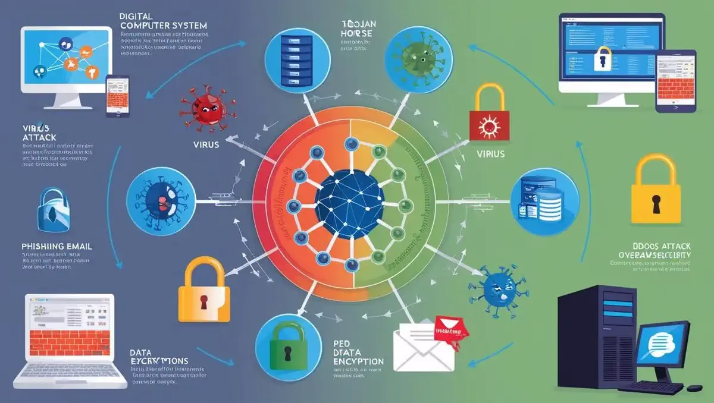

# **ASP.NET Core MVC**

- [Güncel PDF'i İndir](https://www.vebende.com.tr/pdfs/tum-kurum-calisanlarina-siber-guvenlik-egitimi.pdf)
- [En güncel eğitimlerimiz için www.vebende.com.tr ziyaret edin](https://www.vebende.com.tr/tum-kurum-calisanlarina-siber-guvenlik-egitimi)
  
## **Eğitim Süresi**

- **Süre:** 1 gün
- **Ders Süresi:** 50 dakika
- **Eğitim Saati:** 10:00 - 17:00

- > Eğitim formatında eğitimler 50 dakika + 10 dakika moladır. 12:00-13:00 saatleri arasında 1 saat yemek arasındaki verilir. Günde toplam 6 saat eğitim verilir. 1 günlük formatta 6 saat eğitim verilmektedir.

- > Eğitimler uzaktan eğitim formatında tasarlanmıştır. Her eğitim için teams linkleri gönderilir. Katılımcılar bu linklere girerek eğitimlere katılırlar. Ayrıca farklı remote çalışma araçları da eğitmen tarafından tüm katılımlara sunulur. Katılımcılar bu araçları kullanarak eğitimlere katılırlar.

- > Eğitim içeriğinde github ve codespace kullanılır. Katılımcılar bu platformlar üzerinden örnek projeler oluşturur ve eğitmenle birlikte eğitimlerde sorulan sorulara ve taleplere uygun iceriğe cevap verir. Katılımcılar bu araçlarla eğitimlerde sorulan sorulara ve taleplere uygun iceriğe cevap verir.

- > Eğitim yapay zeka destekli kendi kendine öğrenme formasyonu ile tasarlanmıştır. Katılımcılar eğitim boyunca kendi kendine öğrenme formasyonu ile eğitimlere katılırlar. Bu eğitim formatı sayesinde tüm katılımcılar gelecek tüm yaşamlarında kendilerini güncellemeye devam edebilecekler ve her türlü sorunun karşısında çözüm bulabilecekleri yeteneklere sahip olacaklardır.  

## **KURUM ÇALIŞANLARINA ÖZEL SİBER GÜVENLİK EĞİTİMİ**

Şirket çalışanlarınızın siber güvenlik konusundaki farkındalığını artırmak için kapsamlı bir eğitim programı sunuyoruz. Bu eğitim, **temel siber güvenlik kavramlarından ağ ve cihaz güvenliğine, veri koruma stratejilerinden kriz yönetimi ve siber saldırılara müdahale yöntemlerine** kadar geniş bir yelpazede bilgi sunmaktadır. Çalışanlarınızın dijital dünyadaki tehditlere karşı bilinçli olmasını sağlamak, güvenlik protokollerine uyumlarını artırmak ve kurumsal verilerinizi korumak için özel olarak tasarlanan bu eğitim, şirketinizin güvenliğini güçlendirmek için güçlü bir adım olacaktır.

## **EĞİTİM HEDEFİ**  

Bu eğitim, **kurum çalışanlarının temel siber güvenlik farkındalığını artırmayı**, dijital güvenlik risklerini tanımayı ve bu risklere karşı doğru adımlar atmayı hedeflemektedir. Katılımcılar, **siber tehditleri tanımlamayı, güvenli bilgi işlem pratiklerini uygulamayı ve olası güvenlik açıklarına karşı nasıl davranmaları gerektiğini öğreneceklerdir**.  

Eğitim sonunda katılımcılar:  

- **Siber güvenlik politikalarının önemini kavrayacak**,  
- **Olası tehditleri tanıyıp önlem alabilecek**,  
- **Güvenli bilgi işlem süreçlerini uygulayarak veri güvenliğini sağlayabilecek**,  
- **Siber saldırılara karşı bilinçli bir şekilde hareket edebileceklerdir.**  

## **Eğitim İçeriği**  

### **Siber Güvenlik Temelleri Eğitim İçeriği**

#### **1. Giriş ve Tanım**

- **Siber Güvenlik Nedir?**  
  Tanım: Siber güvenlik, dijital sistemlerin, ağların, cihazların, verilerin ve uygulamaların korunması sürecidir.  
  Önem: Artan dijitalleşme ile siber tehditler de çoğalmaktadır. Şirketlerin siber güvenlik önlemleri, iş sürekliliği ve itibarlarını korumak için hayati öneme sahiptir.

- **Siber Güvenliğin Önemi**  
  Dijitalleşme ile birlikte artan siber tehditler, kurumların güvenliğini tehdit ederken, güvenlik önlemleri iş sürekliliği ve itibarın korunması için kritik hale gelmektedir.  

#### **2. Temel Kavramlar**

- **Siber Saldırılar:** Bilgisayar sistemlerine, ağlara veya cihazlara yapılan zararlı müdahaleler.  
- **Güvenlik Açıkları:** Sistemlerin savunmasız olduğu noktalar, bu açıklar siber saldırganlar tarafından kullanılır.  
- **Veri İhlalleri:** Yetkisiz kişilerin hassas bilgilere erişimi.  

#### **3. Siber Tehdit Türleri**

- **Virüsler:** Sistemleri yavaşlatabilir veya dosyaları silebilir.  
- **Trojanlar:** Kullanıcıları kandırarak zararlı yazılımı sisteme sızdırır.  
- **Fidye Yazılımları (Ransomware):** Dosyaları şifreler ve para talep eder.  
- **Oltalama (Phishing):** Kişisel verileri çalmaya yönelik saldırılar.  
- **DDoS Saldırıları:** Web sitelerini veya servisleri aşırı trafikle felç etme.  

#### **4. Sosyal Mühendislik Saldırıları**

- **Tanım:** İnsan psikolojisini manipüle ederek güvenlik ihlali yapma yöntemleri.  
- **Korunma Yöntemleri:**  
  - Şüpheli iletişimlere dikkat etme.  
  - Güvenli uygulama protokollerine sadık kalma.  

#### **5. Güvenli Parola Yönetimi**

- **Parola Oluşturma:** Karmaşık ve uzun parolalar kullanma.  
- **Parola Yöneticileri:** Güvenli parola saklama ve yönetme yazılımları.  
- **İki Faktörlü Kimlik Doğrulama (2FA):** Ekstra bir güvenlik katmanı ekler.

#### **6. Ağ Güvenliği**

- **Ağ Güvenliğine Giriş:**  
  - Kurum içi ağlar: Verilerin ve iletişimin güvenliği.  
  - Ağ Saldırıları ve Önlemleri: Ağ tıkanıklığı ve veri ele geçirme risklerine karşı koruma.  
  - Firewall ve Ağ Segmentasyonu: Ağları izole ederek güvenliği artırma.

- **Wi-Fi Güvenliği:**  
  - Güçlü şifreleme protokolleri kullanımı (WPA2, WPA3).  
  - Açık Wi-Fi ağlarının riskleri.

- **VPN Kullanımı:**  
  - Sanal Özel Ağ (VPN): Kimlik ve verilerin şifrelenmesi.

- **E-posta Güvenliği:**  
  - Zararlı e-posta eklerine karşı dikkatli olunması.  
  - E-posta şifreleme yöntemleri.

#### **7. Bilgi Güvenliği ve Veri Koruma**

- **Bilgi Güvenliği Politikaları:**  
  - Kurumsal politikalara uyumluluk: Güvenlik protokollerine sadık kalma.  
  - Bilgi sınıflandırma: Verilerin gizlilik seviyelerine göre sınıflandırılması.

- **Veri Şifreleme:**  
  - Şifreleme türleri: Simetrik ve asimetrik şifreleme yöntemleri.

- **Kişisel Verilerin Korunması (KVKK ve GDPR):**  
  - Verilerin toplanması, işlenmesi ve saklanmasıyla ilgili düzenlemeler.

- **Veri Yedekleme ve Kurtarma:**  
  - Yedekleme stratejileri ve kurtarma planları.

#### **8. Uygulama ve Cihaz Güvenliği**

- **Mobil Cihaz Güvenliği:**  
  - BYOD (Bring Your Own Device) politikaları ve cihaz yönetimi.

- **İşletim Sistemi Güvenliği:**  
  - Windows, macOS ve Linux güvenliği.

- **Güvenli Uygulama Kullanımı:**  
  - Kurumsal yazılımların güvenli kullanımı.

- **Zararlı Yazılımlardan Korunma:**  
  - Antivirüs yazılımları ve zararlı yazılım tespit yöntemleri.

#### **9. Kriz Yönetimi ve Siber Olaylara Müdahale**

- **Siber Güvenlik Olaylarına Müdahale:**  
  - Olay yönetimi süreçleri ve kriz yönetimi adımları.

- **Güvenlik İhlallerinin Bildirilmesi:**  
  - Yetkililere bilgi verilmesi ve olay sonrası analiz.

- **Siber Güvenlik Farkındalığının Artırılması:**  
  - Kurumsal farkındalık eğitimleri ve sonuçların değerlendirilmesi.

## **Eğitim Yöntemi** (Siber Güvenlik Temelleri)

- **Teorik Bilgi:** Katılımcılara, siber güvenliğin temel kavramları, saldırı türleri, ağ güvenliği, bilgi güvenliği ve veri koruma stratejileri hakkında detaylı teorik bilgi verilecektir.
- **Etkileşimli Tartışmalar:** Katılımcılar, farklı siber tehditler ve korunma yöntemleri üzerinde etkileşimli tartışmalar yapacak, gerçek dünyadan örnekler üzerinden değerlendirmeler yapacaklardır.
- **Simülasyonlar ve Olay Çalışmaları:** Gerçek dünyadaki siber güvenlik olaylarına yönelik vaka çalışmaları ve simülasyonlar yapılarak, katılımcıların olaylara müdahale yetkinlikleri artırılacaktır.
- **Proje Tabanlı Öğrenme:** Katılımcılar, eğitim sonunda, öğrendikleri bilgileri kullanarak kendi siber güvenlik önlemleri uygulayacakları bir proje gerçekleştireceklerdir.

## **Hedef Kitle** (Siber Güvenlik Temelleri)

1. **IT Profesyonelleri:** Siber güvenlik konularında bilgi sahibi olmak ve kurumlarını güvence altına almak isteyen profesyoneller.
2. **Sistem Yöneticileri:** Kurum içi ağları ve sistemleri güvence altına almak isteyen yöneticiler.
3. **Yazılım Geliştiriciler:** Yazılım uygulamalarını güvenli bir şekilde geliştirmek ve siber güvenlik tehditlerini önlemek isteyen yazılımcılar.
4. **Ağ Yöneticileri:** Ağ güvenliği ve saldırılara karşı önlemler almak isteyen ağ uzmanları.
5. **Güvenlik Analistleri:** Bilgi güvenliği yönetimi ve siber tehdit analizi konusunda derinlemesine bilgi sahibi olmak isteyen analistler.
6. **Yeni Mezunlar ve Stajyerler:** Siber güvenlik alanında kariyer yapmak isteyen ve temel güvenlik bilgisi edinmek isteyen yeni mezunlar.
7. **Proje Yöneticileri:** Siber güvenlik projelerinin yönetimi ve güvenlik protokollerinin uygulanması konusunda bilgi sahibi olmak isteyen yöneticiler.
8. **İş Analistleri ve Danışmanlar:** Kurumsal güvenlik gereksinimlerini anlamak ve danışmanlık yapabilmek için siber güvenlik bilgisi edinmek isteyen profesyoneller.

## **Katılımcılardan Beklentilerimiz** (Siber Güvenlik Temelleri)

- Katılımcıların temel seviyede bilgi teknolojileri, ağ yapıları ve internet protokolleri hakkında bilgi sahibi olmaları beklenir.
- Ağ güvenliği ve siber tehditlerle ilgili temel kavramlara ilgi duymaları önerilir, ancak zorunlu değildir.
- Güvenli yazılım geliştirme süreçlerine ve veri koruma yöntemlerine karşı ilgi göstermeleri beklenir.
- Aktif katılım, soru sorma ve pratik örneklerle öğrenmeye açık bir yaklaşım sergilemeleri teşvik edilir.
- 
[Eğitim Materyalleri (Eğitmenlere Özel)](https://github.com/TuncerKARAARSLAN-VB/training-kit-tum-kurum-calisanlarina-siber-guvenlik-egitimi)
