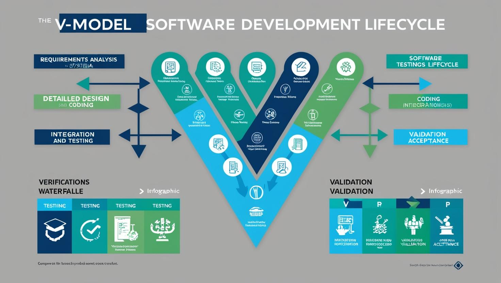
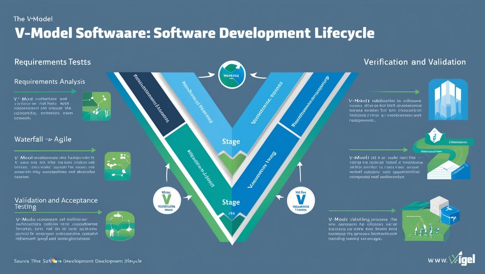

# **V-Model Proje Yönetimi**

- [Güncel PDF'i İndir](https://www.vebende.com.tr/pdfs/vmodel.pdf)
- [En güncel eğitimlerimiz için www.vebende.com.tr ziyaret edin](https://www.vebende.com.tr/v-model-proje-yonetimi)

## **Eğitim Süresi**

- **Süre:** 2 Gün
- **Ders Süresi:** 50 dakika
- **Eğitim Saati:** 10:00 - 17:00

- > Her iki eğitim formatında eğitimler 50 dakika + 10 dakika moladır. 12:00-13:00 saatleri arasında 1 saat yemek arasındaki verilir. Günde toplam 6 saat eğitim verilir. 2 günlük formatta 12 saat eğitim verilmektedir.

- > Eğitimler uzaktan eğitim formatında tasarlanmıştır. Her eğitim için teams linkleri gönderilir. Katılımcılar bu linklere girerek eğitimlere katılırlar. Ayrıca farklı remote çalışma araçları da eğitmen tarafından tüm katılımlara sunulur. Katılımcılar bu araçları kullanarak eğitimlere katılırlar. 

- > Eğitim içeriğinde github ve codespace kullanılır. Katılımcılar bu platformlar üzerinden örnek projeler oluşturur ve eğitmenle birlikte eğitimlerde sorulan sorulara ve taleplere uygun iceriğe cevap verir. Katılımcılar bu araçlarla eğitimlerde sorulan sorulara ve taleplere uygun iceriğe cevap verir.

- > Eğitim yapay zeka destekli kendi kendine öğrenme formasyonu ile tasarlanmıştır. Katılımcılar eğitim boyunca kendi kendine öğrenme formasyonu ile eğitimlere katılırlar. Bu eğitim formatı sayesinde tüm katılımcılar gelecek tüm yaşamlarında kendilerini güncellemeye devam edebilecekler ve her türlü sorunun karşısında çözüm bulabilecekleri yeteneklere sahip olacaklardır.

## **V-Model Yazılım Geliştirme Eğitimi**

Yazılım projelerinde kaliteyi ve verimliliği artırmak için etkili bir model arayışında mısınız? V-Model, yazılım geliştirme ve test süreçlerini paralel bir şekilde yöneterek projelerinizi daha düzenli ve hatasız hale getirir. Bu eğitim, V-Model metodolojisini derinlemesine anlamanızı ve uygulamalı olarak projelerinizde nasıl kullanabileceğinizi öğretir.

Eğitimde, V-Model’in aşamalarından doğrulama ve doğrulama süreçlerine, test stratejilerinden araçların entegrasyonuna kadar geniş bir yelpazede bilgi edinirsiniz. Yazılım geliştirme ve test süreçlerinizi nasıl daha uyumlu hale getireceğiniz, testlerinizi nasıl otomatikleştireceğiniz ve sürekli entegrasyon ile hızlandırabileceğiniz gibi kritik konularda bilgi sahibi olacaksınız.

Gerçek hayattan örneklerle desteklenen uygulamalı senaryolar sayesinde V-Model’i doğrudan projelerinize entegre etme becerisi kazanacak, yazılım geliştirme süreçlerinizi bir adım öteye taşıyacaksınız. Hem yazılım geliştirme hem de test süreçlerini optimize etmek isteyen profesyoneller için bu eğitim, güçlü bir araç seti sunmaktadır.

Eğitim, proje yöneticileri, yazılım geliştiriciler ve test uzmanları başta olmak üzere yazılım geliştirme süreçlerine dahil olan herkes için idealdir.

## **Eğitim Hedefi**

Bu eğitimin temel hedefi, katılımcılara V-Model yazılım geliştirme metodolojisinin kapsamını, aşamalarını ve uygulama yöntemlerini öğretmektir. Katılımcılar, yazılım geliştirme ve test süreçlerini paralel olarak nasıl yönetebileceğini öğrenerek, projelerinde daha yüksek kalite, verimlilik ve uyum sağlamak için gerekli becerilere sahip olacaklardır. Ayrıca, doğrulama ve doğrulama süreçlerinin nasıl entegre edileceği, testlerin nasıl otomatikleştirileceği ve sürekli entegrasyon ile süreçlerin nasıl hızlandırılacağı gibi kritik konuları anlamalarını hedeflemektedir. Bu eğitim, yazılım geliştirme ve test süreçlerini optimize ederek, katılımcıların projelerinde daha etkili ve hatasız sonuçlar elde etmelerini amaçlamaktadır.

## **Eğitim İçeriği**

### **V-Model Nedir?**

- **V-Model Tanımı**  
  V-Model, yazılım geliştirme ve sistem mühendisliği projelerinde, geliştirme süreci ile test sürecini paralel bir şekilde yöneten bir proje yönetim metodolojisidir. Yazılım mühendisliğinin her aşaması için bir test aşaması vardır. Geliştirme ve test süreçleri, şekilsel bir "V" eğrisinde paralel olarak birbirini takip eder.

- **V-Model’in Aşamaları**  
  1. **İhtiyaçlar Analizi (Requirements Analysis)**
  2. **Sistem Tasarımı (System Design)**
  3. **Alt Sistem Tasarımı (Detailed Design)**
  4. **Kodlama (Coding)**
  5. **Birleştirme ve Test (Integration and Testing)**
  6. **Doğrulama ve Kabul (Validation and Acceptance)**

- **V-Model’in Geliştirme Sürecine Etkisi**
  V-Model’in yazılım geliştirme sürecindeki önemini anlamak ve uygulamak.

- **V-Model vs. Diğer Yazılım Geliştirme Modelleri**
  V-Model’in diğer yazılım geliştirme modelleriyle (örneğin, Şelale Modeli, Agile, Scrum) karşılaştırılması.

---

### **Doğrulama (Verification) ve Doğrulama (Validation) Nedir?**

- **Doğrulama (Verification):**  
  Doğrulama, "Yapılan şey doğru mu?" sorusuna cevap arar. Sistem veya yazılımın tasarım ve geliştirme aşamalarındaki gereksinimlere uygun olup olmadığını kontrol eder.
  
  - **Doğrulama Süreçleri:**  
    - Kod incelemeleri
    - Birim testleri
    - Entegrasyon testleri
    - Sistem testi
    - Performans testi
  - **Doğrulama Araçları ve Teknikleri**
  
- **Doğrulama (Validation):**  
  Doğrulama, "Doğru şeyi mi yapıyoruz?" sorusuna cevap arar. Sistem veya yazılımın kullanıcı gereksinimlerini karşılayıp karşılamadığını test eder.
  
  - **Doğrulama Süreçleri:**  
    - Kabul testi
    - Kullanıcı testi
    - Sistem kabul testi
    - Çevresel testler (örneğin, yazılımın gerçek ortamda nasıl çalıştığına dair testler)
  - **Doğrulama Araçları ve Teknikleri**
  
- **Doğrulama ve Doğrulama Arasındaki Farklar**
  - Doğrulama ve doğrulama arasındaki farkları açıklamak ve bunların projedeki yerlerini anlamak.
  - V-Model’in her aşamasında doğrulama ve doğrulama süreçlerinin nasıl paralel işlediğini göstermek.

---

### **V-Model Aşamaları ve Uygulama Detayları**

- **İhtiyaçlar ve Gereksinimler:**  
  Gereksinimlerin doğru tanımlanması ve doğrulama testleriyle nasıl desteklenebileceği.
  - **Doğrulama Teknikleri:** Gereksinim doğrulama, prototip geliştirme, kullanıcı gereksinimlerinin analizi.
  
- **Sistem Tasarımı ve Test Planlaması:**  
  Sistemin genel yapısının tasarlanması ve bu tasarımın doğrulama testlerine nasıl dönüştürüleceği.
  - **Test Araçları ve Yöntemleri:** Test senaryolarının yazılması, otomatik test araçları kullanımı.
  
- **Alt Sistem Tasarımı ve Detaylı Testler:**  
  Alt sistemlerin ayrıntılı tasarımı ve bu tasarımların doğrulama aşamasında test edilmesi.
  - **Birim Testi:** Alt sistemlerin test edilmesi, hata tespiti ve giderilmesi.
  
- **Kodlama ve İlgili Testler:**  
  Yazılım geliştirme süreci ve kodun doğrulama aşamalarında nasıl test edileceği.
  - **Kod İncelemeleri ve Birim Testi Entegrasyonu**
  
- **Test Süreci ve Hata Yönetimi:**  
  Testlerin nasıl yönetileceği, hataların raporlanması ve çözülmesi.
  - **Hata Takibi ve Yönetimi**  
  - **Test Sonuçlarının Değerlendirilmesi ve Raporlanması**

---

### **V-Model’in Gerçek Hayatta Uygulaması**

- **V-Model’in Kurumsal Yazılım Geliştirme Süreçlerine Entegre Edilmesi:**  
  V-Model’in bir yazılım geliştirme şirketinde nasıl kullanılabileceği ve mevcut projelere entegrasyonunun nasıl yapılacağı.
  
- **Proje Yöneticilerinin Rolü:**  
  Proje yöneticilerinin V-Model yaklaşımını nasıl etkili bir şekilde yöneteceği, doğrulama ve doğrulama süreçlerinin takibi.
  
- **Uygulamalı Senaryolar:**  
  Gerçek dünyadan örneklerle doğrulama ve doğrulama süreçlerinin nasıl işlediğini gösteren uygulamalı senaryolar.
  
- **Risk Yönetimi ve Kalite Güvencesi:**  
  V-Model’in risk yönetimi ve kalite güvencesi süreçlerine nasıl katkı sağladığı.

---

### **V-Model’de Kullanılabilecek Araçlar ve Yöntemler**

- **Test Otomasyonu:**  
  Testlerin otomatikleştirilmesi ve bu süreçlerin V-Model’in her aşamasında nasıl uygulanacağı.
  
- **Yazılım Geliştirme Araçları:**  
  Git, Jenkins, Jira, TestRail gibi araçlar ve bu araçların doğrulama ve doğrulama süreçlerinde nasıl entegre kullanılacağı.
  
- **Sürekli Entegrasyon ve Dağıtım (CI/CD):**  
  Yazılım geliştirme ve test süreçlerinin sürekli entegrasyon ve sürekli dağıtım ile nasıl hızlandırılacağı.

---

### **V-Model İle İlgili İleri Düzey Konular**

- **Agile ve V-Model Karşılaştırması:**  
  Agile yazılım geliştirme metodolojisi ile V-Model’in nasıl birleştirilebileceği ve bu iki yaklaşımın projelere etkisi.
  
- **Hibrit Modellerin Uygulaması:**  
  V-Model’i diğer yazılım geliştirme modelleriyle (Scrum, Kanban vb.) hibrit olarak kullanmak ve en iyi sonuçları elde etmek için yöntemler.
  
- **Endüstri Standartları ve V-Model:**  
  Endüstri standartları (örneğin ISO, CMMI) ile V-Model’in uyumu ve bu standartlara uygun test süreçlerinin nasıl yönetileceği.

## **Eğitim Yöntemi**

- **Teorik Bilgi:** Güncel bilgiler ve konseptlerin anlatımı.
- **Uygulamalı Örnekler:** Gerçek senaryolarla pratik uygulamalar.
- **Etkileşimli Tartışmalar:** Katılımcıların aktif katılım sağlayacağı, soru-cevap şeklinde tartışmalar yapılacak oturumlar.
- **Proje Tabanlı Öğrenme:** Eğitimin son günü, katılımcıların öğrendiklerini pratikte uygulayacakları kapsamlı bir proje çalışması yapılacak.

## **Hedef Kitle**

### 1. **Çalışanlar**

Eğitim yönetiminin temel hedef kitlesi, organizasyonda çalışan bireylerdir. Bu grup, çeşitli seviyelerde olabilir:

- **Yeni Başlayanlar:** Organizasyona yeni katılan çalışanlar, genellikle oryantasyon eğitimi alır. Bu eğitimler, şirket kültürünü tanıma, iş süreçlerini öğrenme ve genel becerileri geliştirmeye yönelik olabilir.
- **Orta Düzey Çalışanlar:** İşinde deneyim kazanan çalışanlar için daha ileri seviyede eğitimler, liderlik, proje yönetimi, teknik beceriler gibi konularda verilebilir.
- **Üst Düzey Yöneticiler:** Yöneticiler ve liderler için stratejik düşünme, karar alma, değişim yönetimi gibi konularda gelişim programları düzenlenir.

### 2. **Yöneticiler ve Liderler**

Yöneticiler ve liderler, organizasyonun başarıyla yönetilmesi için kritik bir role sahiptir. Eğitim yönetimi, yöneticilerin liderlik becerilerini, stratejik düşünme yeteneklerini ve ekip yönetimi becerilerini geliştirmeye yönelik olmalıdır. Ayrıca, bu grup için yönetimsel beceriler, performans değerlendirme, etkili iletişim ve değişim yönetimi gibi eğitimler önemlidir.

### 3. **İnsan Kaynakları (İK) ve Eğitim Yöneticileri**

İK profesyonelleri ve eğitim yöneticileri, eğitim süreçlerinin tasarlanmasından ve uygulanmasından sorumludur. Bu kitle için liderlik, eğitim metodolojileri, eğitim planlaması ve eğitim materyali hazırlığı gibi konularda eğitimler gereklidir. Ayrıca, çalışan gelişim programlarının etkinliğini ölçme ve raporlama konularında da eğitim alabilirler.

### 4. **İş Ortakları ve Tedarikçiler**

Şirket dışındaki iş ortakları ve tedarikçiler de eğitim yönetiminin bir parçası olabilir. Bu grup, şirketin ürün ve hizmetlerini doğru şekilde sunabilmesi için ürün bilgisi, satış teknikleri veya hizmet prosedürleri gibi eğitimler alabilir.

### 5. **Müşteriler**

Eğitim yönetimi bazen müşterilerle de ilgilenir. Örneğin, bir yazılım firması, ürünlerini kullanan müşterilere yönelik eğitimler düzenleyebilir. Bu eğitimler, yazılımın nasıl kullanılacağı, sorun çözme teknikleri ve yeni özelliklerin tanıtılması gibi konularda olabilir.

### 6. **Yeni Yetenekler (Genç Adaylar)**

Yeni mezunlar ya da kariyerine yeni başlamış olan adaylar, organizasyonlara katıldığında genellikle temel becerilerle ilgili eğitimlere ihtiyaç duyarlar. Eğitim yönetimi bu grup için kariyer gelişim planları, teknik beceri geliştirme ve mesleki eğitimler sağlayabilir.

### 7. **Freelancerlar ve Dış Kaynak Kullanıcıları**

Eğitim yönetimi, freelancerlar veya dış kaynak sağlayıcıları ile de etkileşime girebilir. Bu gruba yönelik eğitimler, dış kaynak kullanım süreçlerini, yazılım ya da proje yönetim araçlarını içerebilir.

### 8. **Eğitim Katılımcıları**

Bir başka hedef kitle, bağımsız olarak eğitim almayı tercih eden bireylerdir. Bu grup için online kurslar, sertifika programları ve workshoplar gibi eğitim fırsatları sunulabilir. Bu tür eğitimler genellikle kendi gelişimine yatırım yapmak isteyen bireyler için uygundur.

### Hedef Kitlenin Eğitim İhtiyaçları ve Özellikleri

Hedef kitlenin eğitim ihtiyaçları, kişisel ve profesyonel gelişimlerine, iş gereksinimlerine ve iş ortamına bağlı olarak farklılık gösterir. Bu nedenle, eğitim yönetimi stratejisi belirlenirken şu unsurlar göz önünde bulundurulmalıdır:

- **İhtiyaç Analizi:** Hedef kitlenin becerilerini, mevcut seviyelerini ve gelişim alanlarını belirlemek için analiz yapılmalıdır.
- **Eğitim Türleri:** Hedef kitlenin özelliklerine uygun eğitim türleri (online, yüz yüze, atölye çalışması, seminer, vb.) belirlenmelidir.
- **Eğitim Yöntemleri:** Hedef kitlenin öğrenme stillerine göre (örneğin, görsel, işitsel ya da kinestetik öğrenme) uygun eğitim yöntemleri seçilmelidir.
- **Eğitim Süresi ve Zamanı:** Eğitim süresi, hedef kitlenin iş temposuna ve zamanına göre planlanmalıdır.

Sonuç olarak, eğitim yönetimi hedef kitlenin ihtiyaçlarına göre özelleştirilmiş stratejiler geliştirmeyi gerektirir. Eğitim süreçlerinin başarıyla uygulanabilmesi için hedef kitlenin doğru belirlenmesi, uygun eğitim içeriği ve metodolojilerinin seçilmesi oldukça önemlidir.

## **Katılımcılardan Beklentilerimiz**

- Katılımcıların temel Linux bilgisine sahip olmaları.
- Temel seviyede konteyner ve Kubernetes bilgisi önerilir, ancak zorunlu değildir.
- Aktif katılım ve öğrenme isteği.

[Eğitim Materyalleri (Eğitmenlere Özel)](https://github.com/TuncerKARAARSLAN-VB/training-kit-vmodel-proje-yonetimi)
