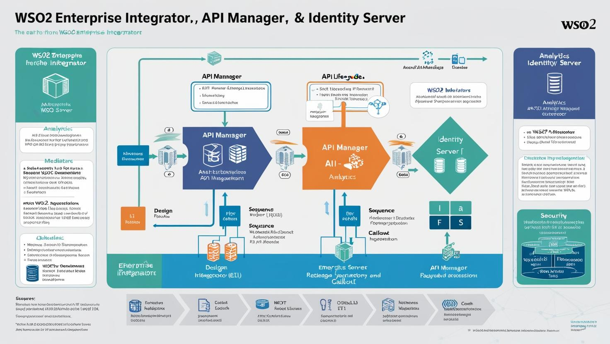
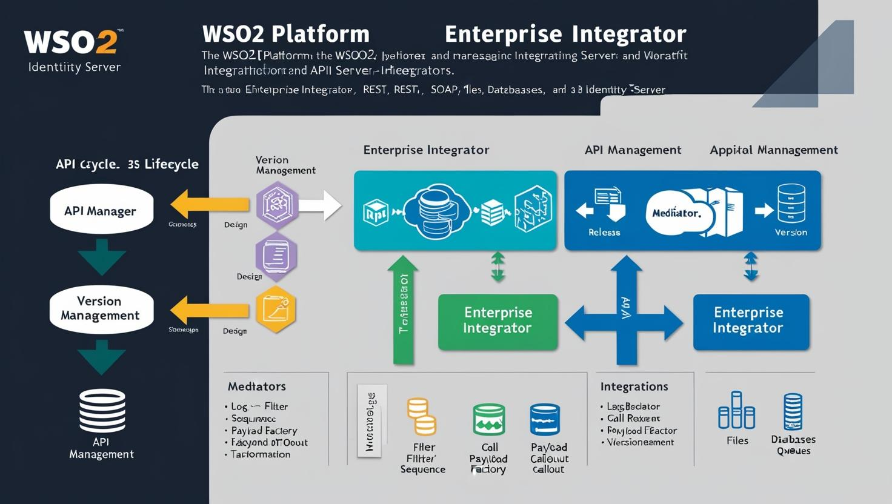

# **WSO2 Eğitimi**

[Download PDF Version](./wso2.pdf)

## **Eğitim Süresi**

- **Format 1**
  - **5 Gün**
  - **Ders Süresi:** 50 dakika
  - **Eğitim Saati:** 10:00 - 17:00

- **Format 2**
  - **12 Gün**
  - **Ders Süresi:** 50 dakika
  - **Eğitim Saati:** 10:00 - 17:00

- > Her iki eğitim formatında eğitimler 50 dakika + 10 dakika moladır. 12:00-13:00 saatleri arasında 1 saat yemek arasındaki verilir. Günde toplam 6 saat eğitim verilir. 5 günlük formatta 30 saat eğitim, 12 günlük formatta toplam 72 saat eğitim verilmektedir. 12 saatlik eğitmde katılımcılar kod yazar ve eğitmenle birlikte sorulan sorulara ve taleplere uygun içerikler ve örnekler çalışılır.

- > Eğitimler uzaktan eğitim formatında tasarlanmıştır. Her eğitim için teams linkleri gönderilir. Katılımcılar bu linklere girerek eğitimlere katılırlar. Ayrıca farklı remote çalışma araçları da eğitmen tarafından tüm katılımlara sunulur. Katılımcılar bu araçları kullanarak eğitimlere katılırlar.

- > Eğitim yapay zeka destekli kendi kendine öğrenme formasyonu ile tasarlanmıştır. Katılımcılar eğitim boyunca kendi kendine öğrenme formasyonu ile eğitimlere katılırlar. Bu eğitim formatı sayesinde tüm katılımcılar gelecek tüm yaşamlarında kendilerini güncellemeye devam edebilecekler ve her türlü sorunun karşısında çözüm bulabilecekleri yeteneklere sahip olacaklardır.

## **WSO2 ile Dijital Dönüşümünüzü Hızlandırın: Modern API Yönetimi, Entegrasyon ve Güvenlik Çözümleri**

Dijital dünyada hızla değişen iş ihtiyaçlarını karşılamak, modern yazılım geliştirme süreçlerinin temel bir parçasıdır. WSO2, kurumların dijital dönüşüm yolculuklarında ihtiyaç duyduğu güçlü, ölçeklenebilir ve güvenli çözümleri sunar. WSO2'nin açık kaynaklı yazılım ürünleri, API yönetiminden entegrasyona, kimlik doğrulamadan güvenli verilere kadar geniş bir yelpazede işletmelerin karşılaştığı zorlukları çözmeyi amaçlar. Her biri, güçlü özellikleri ve yüksek esneklikleriyle, işletmelerin hızla değişen pazar taleplerine uyum sağlamalarını sağlar.

**Neden WSO2?**

WSO2, modern yazılım geliştirme süreçlerinde güvenliği, entegrasyonu ve yönetimi kolaylaştıran kapsamlı bir platform sunar. Her biri belirli işlevsellikleriyle lider olan WSO2 ürünleri, özellikle API yönetimi, entegrasyon ve güvenlik gibi kritik alanlarda işletmelerin operasyonel verimliliğini artırır.

- **Açık Kaynak Çözümleri**: WSO2’nin sunduğu çözümler açık kaynaklı olup, yüksek düzeyde özelleştirilebilir. Bu, kuruluşların kendi ihtiyaçlarına göre yazılımı şekillendirebilmesini sağlar.
  
- **Gelişmiş Güvenlik**: WSO2, gelişmiş kimlik yönetimi, API güvenliği ve veri güvenliği özellikleri ile şirketlerin güvenlik standartlarını en üst seviyeye çıkarmalarına yardımcı olur.

- **Esneklik ve Ölçeklenebilirlik**: WSO2, küçük işletmelerden büyük kurumsal organizasyonlara kadar her ölçekten şirketin ihtiyaçlarına uyum sağlayacak çözümler sunar. Yüksek trafikli uygulamalarda bile verimli çalışacak şekilde tasarlanmıştır.

### **WSO2 Ürünleri ile İş Süreçlerinizi Güçlendirin**

#### **1. WSO2 API Manager (APIM)** – API Yönetimi ve Entegrasyonu Kolaylaştırın

WSO2 API Manager (APIM), organizasyonların API’lerini güvenli bir şekilde oluşturmasını, yönetmesini ve entegre etmesini sağlar. Gelişmiş API güvenliği, izleme, analitik ve ölçeklenebilir dağıtım özellikleri ile API’lerinizi etkin bir şekilde yönetebilirsiniz.

- **API Güvenliği**: API’lerinizin güvenliğini sağlamak için OAuth 2.0, JWT, SAML gibi standart güvenlik protokollerini destekler.
- **API Analitik**: API kullanımını izlemek, performansı değerlendirmek ve optimize etmek için güçlü analiz araçları sunar.
- **Hızlı Entegrasyon**: Bulut tabanlı, yerel ya da hibrit ortamlarda çalışabilen esnek API entegrasyonları sunar.

#### **2. WSO2 Enterprise Integrator (EI)** – Entegre ve Otomatikleştirilmiş İşlemler

WSO2 Enterprise Integrator, uygulamalar, veritabanları ve sistemler arasında hızlı ve güvenli entegrasyon sağlar. Karmaşık iş süreçlerini otomatikleştirerek iş verimliliğini artırır ve zaman tasarrufu sağlar.

- **Entegre Envanter**: İş süreçlerinizi, veri aktarımını ve sistem entegrasyonlarını kolayca yönetin.
- **Veri Yönlendirme ve Dönüştürme**: XML, JSON, CSV gibi veri formatları arasında hızlıca dönüşüm yapın.
- **Web Servis Yönetimi**: SOAP, REST gibi web servislerini kolayca yönetebilir, izleyebilir ve entegre edebilirsiniz.

#### **3. WSO2 Identity Server (IS)** – Güvenli Kimlik ve Erişim Yönetimi

WSO2 Identity Server, kimlik doğrulama, yetkilendirme ve tek oturum açma (SSO) gibi kritik güvenlik işlemleri için kapsamlı bir çözümdür. Kullanıcı ve uygulama güvenliğini sağlarken, bulut tabanlı hizmetlerle entegrasyonu kolaylaştırır.

- **Tek Oturum Açma (SSO)**: Kullanıcıların birden fazla uygulama için sadece bir kimlik doğrulama ile erişim sağlamasını mümkün kılar.
- **Multi-Factor Authentication (MFA)**: Kullanıcıların kimliklerini doğrulamak için ek güvenlik katmanları ekler.
- **Kapsayıcı Kimlik Yönetimi**: Her türlü uygulama ve cihaz için merkezi bir kimlik yönetimi çözümü sunar.

#### **4. WSO2 Stream Processor (WSP)** – Gerçek Zamanlı Veri İşleme

WSO2 Stream Processor, gerçek zamanlı veri akışlarını yönetmek için kullanılan güçlü bir araçtır. Verileri hızla analiz eder ve iş süreçlerinizi anında iyileştirir.

- **Gerçek Zamanlı Veri Akışı**: IoT cihazları ve diğer veri kaynaklarından gelen büyük veri akışlarını hızla işleyin.
- **Veri Entegrasyonu**: Farklı kaynaklardan gelen verileri anında entegre ederek anlık karar alımını mümkün kılın.
- **Hızlı Tepki ve Analiz**: Anlık veri işleme sayesinde iş süreçlerinize hızlı bir şekilde yanıt verin.

#### **5. WSO2 Identity & Access Management (IAM)** – Güvenli ve Esnek Erişim Yönetimi

WSO2 IAM, kullanıcılarınızın kimliklerini yönetmenizi ve erişim haklarını düzenlemenizi sağlar. Güçlü güvenlik özellikleriyle, tüm kullanıcı ve uygulama erişimlerini güvenli bir şekilde yönetir.

- **Kapsayıcı Erişim Yönetimi**: Kullanıcıların farklı sistemlere erişimini güvenli bir şekilde yönetir.
- **Farklı Protokollerle Entegrasyon**: OAuth, OpenID Connect gibi modern kimlik doğrulama protokollerini destekler.
- **Teknolojik Esneklik**: Hibrid, bulut ve on-premise çözümleriyle uyumludur.

### **WSO2 ile Hızla Büyüyen ve Değişen İş Dünyasında Öne Çıkın**

Dijital dönüşüm, işletmelerin yalnızca teknolojiyi değil, aynı zamanda iş süreçlerini de dönüştürmelerini gerektirir. WSO2, işletmenizin dijital yolculuğunda güçlü bir partner olarak, ihtiyaç duyduğunuz esneklik, güvenlik ve verimliliği sunar. İster API yönetimi, ister entegrasyon, isterse kimlik ve erişim yönetimi olsun, WSO2’nin sunduğu güçlü platformlar sayesinde iş süreçlerinizi dönüştürebilir, rekabet avantajı elde edebilirsiniz.

WSO2 ürünleri, yüksek güvenlik standartları, esneklik ve ölçeklenebilirlik sunarken, kurumların geleceğe dönük daha hızlı, daha güvenli ve daha verimli operasyonlar yürütmelerini sağlar. 

**WSO2 ile güçlenen dijital altyapınızla işinizi bir adım öne taşıyın.**

**Eğitim Hedefi**

Bu eğitim, katılımcılara **WSO2 platformu** ile modern yazılım geliştirme süreçlerinde API yönetimi, entegrasyon, kimlik doğrulama ve güvenliği nasıl etkili bir şekilde yönetebileceklerini öğretmeyi hedefler. Katılımcılar, WSO2’nun sunduğu güçlü araçları kullanarak, yüksek ölçeklenebilirlik, güvenlik ve verimlilik sağlayan çözümleri nasıl uygulayacaklarını öğrenirler.

Eğitim boyunca katılımcılar:

1. **WSO2 API Management (APIM)** ile API’leri güvenli ve verimli bir şekilde nasıl yöneteceklerini, analiz ve izleme araçlarını nasıl kullanacaklarını öğrenirler.

2. **WSO2 Enterprise Integrator (EI)** ile farklı uygulama ve sistemleri nasıl entegre edebileceklerini, veri dönüşümleri ve otomatikleştirilmiş iş süreçleri oluşturmayı keşfederler.

3. **WSO2 Identity Server (IS)** ile güvenli kimlik doğrulama, kullanıcı yönetimi ve tek oturum açma (SSO) çözümleri nasıl uygulanacağını öğrenirler.

4. **WSO2 Stream Processor (WSP)** ile gerçek zamanlı veri akışlarını nasıl işleyeceklerini, veri entegrasyonu yaparak hızlı analizler gerçekleştirmeyi keşfederler.

5. **WSO2 Identity & Access Management (IAM)** ile güvenli erişim yönetimi yaparak uygulama ve kullanıcı erişimlerini nasıl yönetebileceklerini kavrayacaklardır.

Katılımcılar, eğitimin sonunda WSO2’nin sunduğu çözümler ile dijital altyapılarını güvenli, ölçeklenebilir ve yüksek performanslı bir hale getirebilecek bilgi ve beceriye sahip olacaklardır.

## **Eğitim İçeriği**

### **1. Giriş ve Temel Kavramlar**

1. **WSO2 Nedir?**
   - Tarihçesi ve gelişimi: WSO2'nun evrimi, ilk çıkış noktaları, zaman içinde gelişimi
   - Kullanım alanları ve faydaları: API yönetimi, kimlik doğrulama, entegrasyon, veri analitiği
   - WSO2’nun sektördeki rolü ve katkıları

2. **WSO2 Ürünleri**
   - **API Manager**: API yönetimi, API lifecycle yönetimi, API güvenliği, analiz
   - **Enterprise Integrator (EI)**: Entegrasyon çözümleri, ESB kullanımı, mikroservis entegrasyonu
   - **Identity Server (IS)**: Kimlik doğrulama, SSO, OAuth2.0, OpenID Connect, federasyon
   - **Analytics**: API analitiği, izleme, performans raporlama

3. **WSO2’nin Rakiplerinden Farkları**
   - API yönetimi, güvenlik ve entegrasyon alanındaki avantajları
   - WSO2'yu rakiplerinden ayıran teknolojiler ve özellikler

4. **Mimarisi ve Bileşenleri**
   - WSO2’nun bileşen mimarisi: API Manager, Identity Server, Enterprise Integrator ve Analytics
   - API Gateway, API Publisher, API Store, Microgateway
   - Dağıtık sistemlerde WSO2 platformu

### **2. Kurulum ve Altyapı Hazırlığı**

1. **Sistem Gereksinimleri**
   - Yazılım ve donanım gereksinimleri
   - Desteklenen işletim sistemleri ve platformlar

2. **WSO2 Ürünlerinin Kurulumu**
   - **Docker ve Kubernetes ile Kurulum**: WSO2'nun konteyner tabanlı kurulumu, Dockerfile yapıları
   - **On-premise ve Cloud Ortamları**: AWS, Azure, Google Cloud üzerinde WSO2 kurulumu
   - **Kurulum Adımları**: WSO2 API Manager, Identity Server ve EI kurulumu

3. **İlk Yapılandırma Adımları**
   - Temel yapılandırmalar: Yönetim konsoluna giriş, ilk ayarlar
   - **Güvenlik Ayarları**: SSL sertifikaları, HTTP güvenlik politikaları, kullanıcı rolleri

### **3. WSO2 API Manager**

1. **API Yaşam Döngüsü**
   - API tasarımı, API yayınlama, sürüm yönetimi, geri çekme işlemleri
   - **API Gateway ile Bağlantı**: Gateway üzerinden API erişimi, proxy yapılandırması

2. **Gateway ve Proxies**
   - API Gateway’in temel işlevi, Proxy kullanımı
   - **C# ile API Gateway Entegrasyonu**: C# uygulamaları üzerinden API Gateway'e erişim

3. **Uygulamalar ve Subscriptions**
   - Uygulama yönetimi, abonelik işlemleri
   - **C# ile Subscription Yönetimi**: C# kullanarak API aboneliği ve kullanıcı yönetimi

4. **API Güvenliği**
   - OAuth2.0, JWT, Basic Auth ile kimlik doğrulama
   - **Rate Limiting ve Throttling**: API güvenliği sağlamak için kullanım sınırlamaları

5. **API Analytics ve Monitoring**
   - API kullanım verilerinin toplanması ve raporlama
   - **Prometheus, Grafana ile İzleme**: API performansı izleme, uyarılar

6. **WSO2 API Manager ile Entegrasyonlar**
   - WSO2 API Manager’ın diğer sistemler ile entegrasyonu (Veritabanları, Mikroservisler, vb.)

### **4. WSO2 Enterprise Integrator (EI)**

1. **Enterprise Service Bus (ESB) Nedir?**
   - SOA ve Mikroservis Mimarisi ile ilişkisi, ESB’nin temel işlevi
   - WSO2 EI ile hizmet yönlendirme, veri dönüştürme, protokol dönüştürme

2. **Mediator’lar**
   - Mediator’ların detaylı açıklamaları (Log, Filter, Sequence, Enrich, Switch, vb.)
   - **Özel Mediator Oluşturma**: Kendi ihtiyaçlarınıza göre mediator yazma
   - **C# ile Mediator Kullanımı**: C# uygulamalarına özel mediator yapılandırması
   - Log, Filter, Sequence, Payload Factory, Call, Callout, Property, Enrich, Switch, Validate, Aggregate, Script, Clone, Router, Respond, Mediation, Send, Throttle, Inject, Fail, Sort, Java, Flow, Exception, Timeout, LogMessage, Retry, Callback, Redirect, Convert, SetProperty, Store, MessageStore, XMLToJSON, JSONToXML, Unzip, Zip, Delay, Group, Publish, Custom, XSLT, JDBCCall, RM, SequenceCall

3. **Message Transformation ve Enrichment**
   - Mesaj formatları arası dönüşüm, veri zenginleştirme işlemleri

4. **REST ve SOAP Entegrasyonları**
   - RESTful API ve SOAP servis entegrasyonu
   - **C# ile REST API Entegrasyonu**: C# üzerinden REST API çağrıları yapma

5. **File, Database ve Queue İşlemleri**
   - Dosya, veritabanı ve mesaj kuyruğu işlemleri, WSO2 EI ile veritabanı yönetimi

6. **İş Süreçleri (Business Processes) ve BPMN**
   - BPMN ile iş süreçlerinin modellenmesi, Workflow yönetimi

7. **Transaction Management**
   - WSO2 EI ile dağıtık işlemler ve transaction yönetimi

### **5. WSO2 Identity Server (IS)**

1. **Kullanıcı Yönetimi ve Role Tabanlı Yetkilendirme**
   - Kullanıcı ve grup yönetimi, rol bazlı erişim kontrolleri
   - **C# ile Kimlik Doğrulama ve Yetkilendirme**: C# uygulamalarında kullanıcı yönetimi

2. **Single Sign-On (SSO) ve Çok Faktörlü Kimlik Doğrulama**
   - SSO'nun avantajları, MFA uygulamaları

3. **Federasyon Kimlik Yönetimi**
   - SAML, OpenID Connect, WS-Federation gibi federasyon protokolleri
   - **C# ile Federasyon Kimlik Yönetimi**: C# ile federasyon yapısı oluşturma

4. **Kimlik Doğrulama Akışları**
   - OAuth2.0, OpenID Connect akışları, token tabanlı doğrulama

5. **API Güvenlik Protokolleri**
   - OAuth2.0 ile API güvenliği sağlama, JWT kullanımı

6. **OAuth2.0 ile Token Yönetimi**
   - OAuth2.0 protokolü ile erişim token’larının yönetimi

7. **Entegrasyon Senaryoları**
   - Kimlik yönetimi, API güvenliği ve SSO entegrasyonu
   - **C# ile SSO Entegrasyonu**: C# uygulamalarında SSO yapılandırma

### **6. İleri Düzey Konular**

1. **WSO2 ile CI/CD Süreçleri**
   - Jenkins, GitHub Actions, GitLab ile otomatikleştirilmiş pipeline
   - **C# ve WSO2 Entegrasyonu**: CI/CD süreçlerine C# uygulamalarının entegrasyonu

2. **Performans Optimizasyonu**
   - WSO2 platformunda cache yönetimi, thread pooling, iş yükü optimizasyonu

3. **Monitoring ve Alerting**
   - Prometheus, Grafana ile WSO2 ürünlerinin izlenmesi, uyarı sistemleri

4. **Özel Plugin ve Genişletilebilirlik**
   - WSO2 ürünlerini genişletmek için özelleştirilmiş plugin'ler yazma

5. **Debugging ve Hata Yönetimi**
   - WSO2 ürünlerinde hata ayıklama, log yönetimi

6. **Yük Dengeleme ve High Availability**
   - WSO2 platformunda yük dengeleme ve yüksek erişilebilirlik sağlama

### **7. Gerçek Hayat Senaryoları**

1. **Senaryo: API Gateway Kullanımı**
   - API Gateway ile dışa açık API’lerin yönetimi, güvenliği ve izlenmesi

2. **Senaryo: Mikroservis Tabanlı Entegrasyon**
   - API Gateway ve WSO2 EI ile mikroservislerin entegrasyonu

3. **Senaryo: Kimlik Doğrulama ile API Güvenliği**
   - OAuth2.0, SSO ile güvenli API çağrıları

4. **Senaryo: SOAP'tan REST'e Dönüşüm**
   - SOAP hizmetlerini RESTful servislere dönüştürme, WSO2 EI ile dönüşüm

5. **Senaryo: İş Süreçlerinin Otomasyonu**
   - BPMN ile iş süreçlerinin otomatikleştirilmesi, API ve veri entegrasyonları

### **8. Proje ve Pratik Uygulamalar**

1. **Katılımcıların Kendi API’lerini Geliştirmesi**
   - API tasarımı, güvenliği ve yayınlanması

2. **Gerçek Hayattaki Entegrasyon Senaryolarının Simülasyonu**
   - Gerçek dünya projeleri için API ve SSO entegrasyonu simülasyonu

3. **Sorun Çözme ve Hata Giderme Çalışmaları**
   - Uygulamalı olarak sık karşılaşılan sorunlar ve çözüm yolları

4. **Mini Proje Teslimi ve Değerlendirme**
   - Katılımcılardan mini projelerin teslimi, değerlendirilmeleri

## **Eğitim Yöntemi**

- **Teorik Bilgi:** Güncel bilgiler ve konseptlerin anlatımı.
- **Uygulamalı Örnekler:** Gerçek senaryolarla pratik uygulamalar.
- **Etkileşimli Tartışmalar:** Katılımcıların aktif katılım sağlayacağı, soru-cevap şeklinde tartışmalar yapılacak oturumlar.
- **Proje Tabanlı Öğrenme:** Eğitimin boyunca katılımcıların katılımcıların öğrendiklerini pratikte uygulayacakları eğitim formasyonu uygulanacaktır.

## **Hedef Kitle**

- **Yazılım Geliştiriciler**: Modern yazılım geliştirme süreçlerinde API yönetimi, entegrasyon ve güvenlik uygulamaları hakkında derinlemesine bilgi sahibi olmak isteyen yazılım geliştiriciler. WSO2 platformunu kullanarak güvenli ve verimli uygulamalar geliştirmek isteyen profesyoneller.

- **DevOps Mühendisleri**: CI/CD süreçlerini optimize etmek ve WSO2 ile DevOps uygulamalarını entegre etmek isteyen mühendisler. API yönetimi ve güvenlik süreçlerini DevOps pipeline’larına dahil etmek isteyen profesyoneller.

- **Sistem ve Altyapı Yöneticileri**: Altyapıların entegrasyonu, güvenliği ve yönetimini sağlayan profesyoneller. WSO2 platformunun sunduğu API yönetimi ve kimlik doğrulama çözümleri ile sistem ve altyapı güvenliğini sağlamak isteyen kişiler.

- **Güvenlik Uzmanları**: API güvenliği, kimlik yönetimi ve sistem entegrasyonu alanlarında derinlemesine bilgi edinmek isteyen güvenlik profesyonelleri. Yazılım ve altyapı güvenliğini yönetmek isteyen ve WSO2 çözümleriyle güvenlik açıklarını tespit etmek isteyen uzmanlar.

- **Test Mühendisleri**: Yazılım test süreçlerinde API yönetimi, entegrasyon testleri ve güvenlik testlerinin nasıl yapılacağını öğrenmek isteyen test mühendisleri. WSO2 platformu üzerinden test otomasyonunu geliştirmek isteyen profesyoneller.

- **DevSecOps ve Agile Ekip Liderleri**: DevSecOps ve Agile metodolojilerini benimsemek ve güvenlik odaklı bir geliştirme süreci oluşturmak isteyen ekip liderleri. WSO2 çözümleri ile güvenlik kültürünü geliştirmek isteyen liderler.

- **Bulut Mühendisleri**: AWS, Azure ve Google Cloud gibi bulut platformlarında API yönetimi, güvenlik ve entegrasyon çözümleriyle ilgili bilgi sahibi olmak isteyen bulut mühendisleri. Bulut tabanlı uygulamalarda WSO2’nin sunduğu güvenlik ve entegrasyon çözümlerini kullanmak isteyen profesyoneller.

- **IT Yöneticileri ve CIO'lar**: Şirketlerde dijital dönüşümü yönetmek ve güvenlik kültürünü güçlendirmek isteyen üst düzey yöneticiler. WSO2 platformunun API yönetimi ve güvenlik çözümlerini stratejik bir araç olarak kullanarak organizasyonlarında verimliliği artırmak isteyen IT liderleri.

## **Katılımcılardan Beklentilerimiz**

- **Temel Yazılım Geliştirme Bilgisi**: Katılımcıların yazılım geliştirme süreçlerine dair temel bilgiye sahip olmaları, özellikle yazılım geliştirme yaşam döngüsüne (SDLC) hakim olmaları beklenir. WSO2 platformu üzerinde uygulama geliştirme ve entegrasyon süreçlerinde etkin bir şekilde yer alabilmek için yazılım geliştirme konularında temel bilgi gereklidir.

- **Temel API Yönetimi Bilgisi**: Katılımcıların, API yönetimi konusunda temel bir anlayışa sahip olmaları, API’lerin oluşturulması, yönetilmesi ve güvenliğinin sağlanması konularında önceden bilgi sahibi olmaları beklenir. WSO2 API Management (APIM) ve WSO2 Identity Server (IS) gibi araçları verimli bir şekilde kullanabilmek için bu bilgi temel bir gerekliliktir.

- **Temel DevOps Bilgisi**: Katılımcıların DevOps süreçlerini anlamaları, CI/CD (Sürekli Entegrasyon/Sürekli Dağıtım) uygulamaları hakkında bilgi sahibi olmaları beklenir. WSO2 çözümlerinin DevOps süreçlerine entegrasyonunu daha verimli bir şekilde kullanabilmek için temel DevOps bilgisi gereklidir.

- **Güvenlik Bilinci**: Katılımcıların yazılım güvenliği ve API güvenliği konularında temel bir farkındalığa sahip olmaları, güvenlik açıkları ve savunma mekanizmaları hakkında bilgi sahibi olmaları gereklidir. Özellikle WSO2 platformu üzerindeki kimlik yönetimi ve erişim kontrolü gibi güvenlik özelliklerinin nasıl kullanılacağını anlamak için güvenlik bilgisi önemlidir.

- **Aktif Katılım**: Eğitim boyunca katılımcıların interaktif bir şekilde aktif katılım göstermeleri, sorular sorarak ve tartışmalara dahil olarak öğrenme süreçlerini pekiştirmeleri beklenir. Katılımcıların eğitimi aktif bir öğrenme deneyimine dönüştürmeleri, öğrendiklerini uygulama fırsatı elde etmeleri açısından önemlidir.

- **Pratik Uygulama ve Deneyim**: Katılımcılardan, eğitimin sonunda öğrendikleri API yönetimi, entegrasyon, kimlik doğrulama ve güvenlik araçlarını ve uygulamalarını kendi projelerine entegre edebilme becerisine sahip olmaları beklenir. Gerçek dünyadaki senaryolar üzerinden yapılan pratikler sayesinde katılımcıların teoriyi pratiğe dönüştürmeleri sağlanacaktır.

- **Problem Çözme Yetenekleri**: Katılımcıların yazılım geliştirme, API yönetimi, entegrasyon ve güvenlik süreçlerinde karşılaşacakları potansiyel sorunları çözmek için yaratıcı ve analitik düşünme becerisi sergilemeleri beklenir. WSO2 platformu üzerinde karşılaşılan sorunlara çözüm bulabilmek için güçlü problem çözme becerilerine sahip olmaları gereklidir.

- **Ekip Çalışması**: Katılımcıların, organizasyonlarında veya projelerinde WSO2 tabanlı API yönetimi, entegrasyon ve güvenlik uygulamaları için işbirliği ve takım çalışması yapabilecek düzeyde olmaları gereklidir. Eğitimde grup çalışmaları ve senaryo tabanlı uygulamalar yapılacaksa, işbirliğine açık olmaları önemlidir.

- **Teknoloji ve Araçlar Hakkında İleri Seviye Bilgi**: Katılımcıların, WSO2 platformundaki araçlar (WSO2 API Manager, WSO2 Identity Server, WSO2 Enterprise Integrator vb.) hakkında daha fazla bilgi edinmeye istekli olmaları ve bu araçları etkin bir şekilde kullanmaya hazırlıklı olmaları beklenir. WSO2’nun sunduğu çözümler ile dijital dönüşümü sağlamak adına bu araçları doğru bir şekilde kullanabilmeleri gereklidir.

- **Kapsamlı Düşünme**: Katılımcıların DevSecOps kültürünü ve WSO2 platformunun sağladığı güvenlik ve entegrasyon çözümlerini sadece teknik seviyede değil, organizasyonel düzeyde de nasıl entegre edebileceklerini düşünmeleri ve uygulamaları beklenir. Bu eğitimde, WSO2 teknolojileri ile organizasyonel güvenlik ve verimlilik hedeflerini nasıl destekleyecekleri konusunda derinlemesine bir anlayış kazanacaklardır.

[Eğitim Materyalleri (Eğitmenlere Özel)](https://github.com/TuncerKARAARSLAN-VB/training-kit-wso2)
