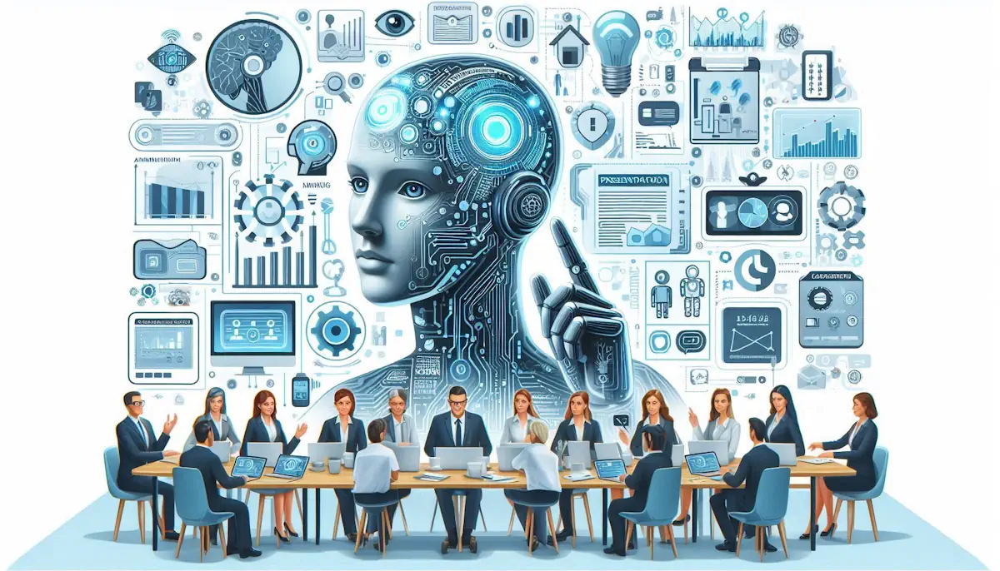
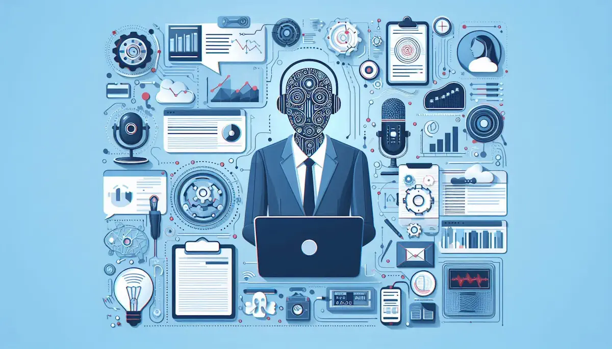

# **YAPAY ZEKA DESTEKLİ GELİŞMİŞ SUNUM HAZIRLAMA**

- [Güncel PDF'i İndir](https://www.vebende.com.tr/pdfs/yapay-zeka-destekli-sunum-hazirlama.pdf)
- [En güncel eğitimlerimiz için www.vebende.com.tr ziyaret edin](https://www.vebende.com.tr/yapay-zeka-destekli-sunum-hazirlama)
  
## **Eğitim Süresi**

- **Süre:** 2 gün
- **Ders Süresi:** 50 dakika
- **Eğitim Saati:** 10:00 - 17:00

- > Eğitim formatında eğitimler 50 dakika + 10 dakika moladır. 12:00-13:00 saatleri arasında 1 saat yemek arasındaki verilir. Günde toplam 6 saat eğitim verilir. 2 günlük formatta 12 saat eğitim verilmektedir.

- > Eğitimler uzaktan eğitim formatında tasarlanmıştır. Her eğitim için teams linkleri gönderilir. Katılımcılar bu linklere girerek eğitimlere katılırlar. Ayrıca farklı remote çalışma araçları da eğitmen tarafından tüm katılımlara sunulur. Katılımcılar bu araçları kullanarak eğitimlere katılırlar.

- > Eğitim içeriğinde github ve codespace kullanılır. Katılımcılar bu platformlar üzerinden örnek projeler oluşturur ve eğitmenle birlikte eğitimlerde sorulan sorulara ve taleplere uygun iceriğe cevap verir. Katılımcılar bu araçlarla eğitimlerde sorulan sorulara ve taleplere uygun iceriğe cevap verir.

- > Eğitim yapay zeka destekli kendi kendine öğrenme formasyonu ile tasarlanmıştır. Katılımcılar eğitim boyunca kendi kendine öğrenme formasyonu ile eğitimlere katılırlar. Bu eğitim formatı sayesinde tüm katılımcılar gelecek tüm yaşamlarında kendilerini güncellemeye devam edebilecekler ve her türlü sorunun karşısında çözüm bulabilecekleri yeteneklere sahip olacaklardır.  

## **Yapay Zeka Destekli Gelişmiş Sunum Hazırlama Teknikleri**  

Günümüz dijital dünyasında etkili sunumlar hazırlamak, yalnızca içerik üretmekten öte, görsel ve işitsel etkileşimi en üst düzeye çıkarmayı gerektirir. Bu eğitim programı, yapay zeka destekli araçlarla sunum sürecini hızlandırmayı, sunumları daha profesyonel hale getirmeyi ve izleyiciyi daha fazla etkileyen içerikler oluşturmayı hedeflemektedir.  

Katılımcılar, **Canva, ChatGPT ve diğer AI tabanlı araçları** kullanarak içerik oluşturma, görsel tasarım yapma ve video içerikler geliştirme becerisi kazanacaktır.  

### **Eğitim İçeriği**  

- **Yapay Zeka ile Sunum Hazırlamanın Temelleri**  
  Yapay zekanın sunum sürecindeki rolü ve AI destekli araçların verimli kullanımı.  

- **ChatGPT Kullanarak İçerik Üretimi**  
  Sunum metinleri, başlıklar ve etkileyici anlatım teknikleri için yapay zeka kullanımı.  

- **Canva ile Görsel ve Slayt Tasarımı**  
  Yapay zeka destekli tasarım araçlarıyla çarpıcı görseller oluşturma yöntemleri.  

- **Yapay Zeka ile Video ve Animasyonlu İçerik Üretimi**  
  Sunumlara hareket kazandırmak için AI tabanlı video üretim teknikleri.  

- **Grafik, İnfografik ve Veri Görselleştirme Araçları**  
  Bilgiyi görselleştirme teknikleriyle sunumları daha anlaşılır hale getirme yöntemleri.  

- **Etkileşimli ve Dinamik Sunumlar**  
  Sunumları daha etkileşimli hale getirmek için AI tabanlı çözümler.  

- **Sesli Sunum ve Yapay Zeka Seslendirme Teknolojileri**  
  Sunumlara yapay zeka ile profesyonel seslendirme ekleme yöntemleri.  

- **YouTube Videolarında Transkript Üretimi ve Özet Çıkartma Teknikleri**  
  Video içeriklerinden hızlı ve etkili özetler oluşturma.  

### **Eğitim Hedefi**  

Bu eğitim, **katılımcıların AI destekli içerik üretim süreçlerini öğrenerek** daha hızlı, etkili ve görsel olarak çarpıcı sunumlar hazırlamalarını sağlamayı amaçlamaktadır.  

Katılımcılar, **sunumlarını dijital ortamda daha güçlü bir anlatımla sunabilmek**, **görsel ve metinsel içeriği profesyonelce oluşturabilmek** ve **yapay zeka destekli veri görselleştirme tekniklerini uygulayabilmek** için gerekli yetkinlikleri kazanacaklardır.  

### **Eğitim Sonunda Kazanımlar**  

Eğitim sonunda katılımcılar şunları başaracaktır:  

- **Yapay zeka destekli içerik üretim tekniklerini öğrenerek** hızlı ve profesyonel sunum metinleri oluşturabileceklerdir.  
- **Görsel ve grafik tasarım becerilerini geliştirerek** sunumlarını daha çarpıcı ve etkileyici hale getirebileceklerdir.  
- **Animasyon ve AI destekli video içeriklerini sunumlarına entegre ederek** izleyicinin ilgisini daha fazla çekebileceklerdir.  
- **İnfografik ve veri görselleştirme araçlarını kullanarak** karmaşık bilgileri sade ve anlaşılır bir şekilde sunabileceklerdir.  
- **Sesli sunumlar ve AI seslendirme teknolojilerini kullanarak** sunumlarına profesyonel bir anlatım kazandırabileceklerdir.  

Bu eğitim, **yapay zeka destekli sunum tekniklerini öğrenmek isteyen herkes için kapsamlı bir rehber olacak ve profesyonel sunumlar hazırlama sürecini kolaylaştıracaktır.**

## **Eğitim İçeriği**  

  

### **Yapay Zeka Destekli Sunum Hazırlama Teknikleri**  

#### **1. Yapay Zeka ile Sunum Hazırlamanın Temelleri**

- Yapay zeka destekli araçlara giriş.  
- Etkili bir sunumun bileşenleri.  
- Yapay zeka ile içerik üretiminin avantajları.  

#### **2. ChatGPT Kullanarak İçerik Üretimi**  

- Sunum metinlerini ChatGPT ile oluşturma.  
- Konu başlıkları, açıklamalar ve hikayeleştirme teknikleri.  
- Yapay zeka ile etkili anlatım dili oluşturma.  

#### **3. Canva ile Görsel ve Slayt Tasarımı**  

- Canva arayüzü ve temel kullanımı.  
- Yapay zeka ile otomatik tasarım ve şablon önerileri.  
- Görsel hiyerarşi ve renk uyumu.  

#### **4. Yapay Zeka ile Video ve Animasyonlu İçerik Üretimi**  

- Yapay zeka destekli video oluşturma araçları (Lumen5, Synthesia).  
- Otomatik altyazı, seslendirme ve animasyon ekleme.  
- Video ve sunumlarda akıcılığı sağlama.  

#### **5. Grafik, İnfografik ve Veri Görselleştirme Araçları**  

- Yapay zeka destekli infografik oluşturma (Canva, Visme, Piktochart).  
- Dinamik veri görselleştirme için araçlar (Tableau, Flourish, Datawrapper).  
- AI destekli grafik önerileri ve tasarım ipuçları (DALL-E, ChartGPT, Infogram).  

#### **6. Etkileşimli ve Dinamik Sunumlar**  

- AI ile etkileşimli içerik: Tome.app ve Gamma.app ile dinamik sunumlar hazırlama.  
- Veri görselleştirme: Karmaşık verileri AI destekli araçlarla grafiklere dönüştürme.  
- Ses ve video entegrasyonu: AI ile seslendirme (Murf.ai) ve video oluşturma (Synthesia.io).  

#### **7. Sesli Sunum ve Yapay Zeka Seslendirme Teknolojileri**  

- Yapay zeka ile seslendirme araçları (Murf AI, ElevenLabs).  
- Descript ile video ve ses düzenleme, otomatik transkript oluşturma.  

#### **8. YouTube Videolarında Transkript Üretimi ve Özet Çıkartma Teknikleri**  

- **Transkript Üretimi:** Videoların içeriklerinin etkili bir şekilde yazılı hale getirilmesi.  
- **Özet Çıkartma:** Ana fikirleri ve önemli noktaları belirleyerek etkili özetlerin oluşturulması.  
- **Türkçeye Çeviri ve Anlam Bütünlüğü:** Transkripte olan içeriklerin doğru ve anlaşılır bir şekilde Türkçeye çevrimi.  
- **Kaynak Elde Etme Teknikleri:** İnternet üzerinden güvenilir kaynakları elde etme, makaleleri inceleme ve güncel bilgilere ulaşma yöntemleri.  

## **Eğitim Yöntemi**  

- **Teorik Sunumlar ve Kavramsal Anlatım:** Katılımcılar, yapay zeka destekli araçların temel kavramları, yöntemleri ve sunum hazırlama süreçlerinde nasıl kullanılacağına dair kapsamlı bilgi edinecektir.  
- **Uygulamalı Çalışmalar ve Canlı Demonstrasyonlar:** Yapay zeka araçları ile metin oluşturma, grafik tasarımı ve sunum düzenleme gibi görevler adım adım gösterilecek ve katılımcılar bu süreçleri kendi bilgisayarlarında uygulayacaktır.  
- **Vaka Çalışmaları ve Gerçek Dünya Projeleri:** Gerçek dünya projeleri incelenerek, yapay zeka destekli sunumlarda karşılaşılan zorluklar ve çözüm önerileri tartışılacaktır.  
- **Grup Çalışmaları ve Proje Geliştirme:** Katılımcılar küçük gruplara ayrılarak belirlenen yapay zeka ile sunum hazırlama projeleri üzerinde çalışacak, ekip çalışması ve problem çözme becerilerini geliştirecektir.  
- **Bireysel Proje ve Değerlendirme:** Her katılımcı, eğitimin sonunda yapay zeka destekli bir sunum hazırlayarak eğitmenlerden bireysel geri bildirim alacaktır.  
- **Soru-Cevap ve Tartışma Oturumları:** Katılımcılar, eğitim süresince aktif olarak sorular sorabilecek ve tartışma oturumlarıyla konuları daha derinlemesine öğrenebilecektir.  

## **Hedef Kitle**  

Bu eğitim, kamu sektöründe teknoloji ve yapay zeka destekli araçları kullanmayı hedefleyen kurumlar için tasarlanmıştır:  

1. **Kamu Sektörü Çalışanları ve Yöneticileri:** Dijital hizmetleri iyileştirmeyi hedefleyen uzmanlar ve yöneticiler.  
2. **Veri Bilimcileri ve Analistler:** Kamu verilerini analiz ederek anlamlı içgörüler çıkarmak isteyen profesyoneller.  
3. **Yazılım Geliştiriciler ve Mühendisler:** Kamu projelerinde yapay zeka teknolojilerini entegre etmek isteyen teknik ekipler.  
4. **IT ve Teknoloji Departmanları:** Dijital dönüşüm sürecinde yapay zeka araçlarını etkin kullanmayı amaçlayan profesyoneller.  
5. **Hukuk ve Kamu Politika Uzmanları:** Kamu belgelerini analiz etmek için yapay zeka çözümlerini kullanmak isteyen hukuk ve politika uzmanları.  
6. **Araştırmacılar ve Akademisyenler:** Yapay zeka teknolojilerinin kamu hizmetlerinde nasıl uygulanabileceğini araştıran akademisyenler.  
7. **Proje Yöneticileri ve Danışmanlar:** Kamu sektöründe yapay zeka projelerini yönetmek ve optimize etmek isteyen profesyoneller.  

## **Katılımcılardan Beklentilerimiz**  

- Temel düzeyde bilgisayar ve yazılım bilgisine sahip olmaları beklenmektedir.  
- Python ve veri işleme konularında temel bilgiye sahip olmaları avantaj sağlayacaktır.  
- Eğitim süresince aktif katılım göstermeleri ve uygulamalı çalışmalara dahil olmaları beklenmektedir.  
- Yapay zeka teknolojileriyle ilgili ileri düzey sorular sormaktan çekinmemeleri teşvik edilmektedir.  
- Grup çalışmalarında işbirliği içinde çalışmaları ve yaratıcı çözümler geliştirmeleri beklenmektedir.  
- Eğitim sonrasında edindikleri bilgileri kendi alanlarında uygulayarak kamu sektöründe yapay zeka kullanımını artırmaları hedeflenmektedir.  
- Geri bildirim sağlayarak eğitim sürecinin geliştirilmesine katkıda bulunmaları önemlidir.  
- Zamanında katılım sağlayarak eğitimin etkinliğini artırmaları beklenmektedir.

[Eğitim Materyalleri (Eğitmenlere Özel)](https://github.com/TuncerKARAARSLAN-VB/training-kit-yapay-zeka-destekli-sunum-hazirlama)
