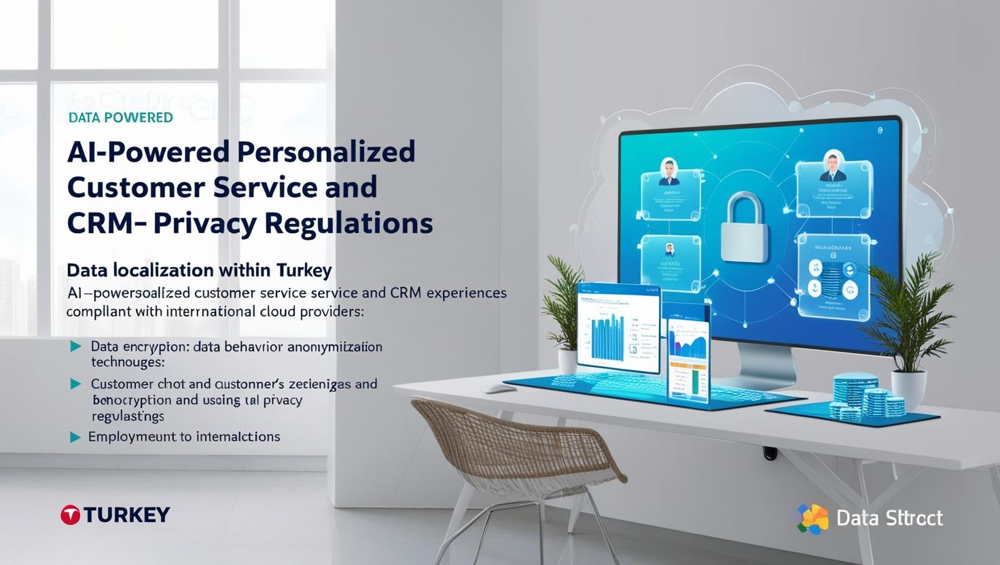
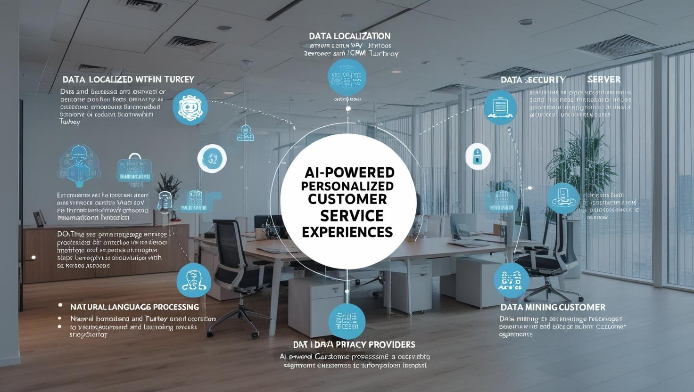

# **Yapay Zeka Destekli Kişiselleştirilmiş AI ile Müşteri Hizmetleri ve CRM Deneyimi**

[Download PDF Version](./crm.pdf)

## **Eğitim Süresi**

- **Format 1**
  - **5 Gün**
  - **Ders Süresi:** 50 dakika
  - **Eğitim Saati:** 10:00 - 17:00

- **Format 2**
  - **12 Gün**
  - **Ders Süresi:** 50 dakika
  - **Eğitim Saati:** 10:00 - 17:00

- > Her iki eğitim formatında eğitimler 50 dakika + 10 dakika moladır. 12:00-13:00 saatleri arasında 1 saat yemek arasındaki verilir. Günde toplam 6 saat eğitim verilir. 5 günlük formatta 30 saat eğitim, 12 günlük formatta toplam 72 saat eğitim verilmektedir. 12 saatlik eğitmde katılımcılar kod yazar ve eğitmenle birlikte sorulan sorulara ve taleplere uygun içerikler ve örnekler çalışılır.

- > Eğitimler uzaktan eğitim formatında tasarlanmıştır. Her eğitim için teams linkleri gönderilir. Katılımcılar bu linklere girerek eğitimlere katılırlar. Ayrıca farklı remote çalışma araçları da eğitmen tarafından tüm katılımlara sunulur. Katılımcılar bu araçları kullanarak eğitimlere katılırlar. 

- > Eğitim içeriğinde github ve codespace kullanılır. Katılımcılar bu platformlar üzerinden örnek projeler oluşturur ve eğitmenle birlikte eğitimlerde sorulan sorulara ve taleplere uygun iceriğe cevap verir. Katılımcılar bu araçlarla eğitimlerde sorulan sorulara ve taleplere uygun iceriğe cevap verir.

- > Eğitim yapay zeka destekli kendi kendine öğrenme formasyonu ile tasarlanmıştır. Katılımcılar eğitim boyunca kendi kendine öğrenme formasyonu ile eğitimlere katılırlar. Bu eğitim formatı sayesinde tüm katılımcılar gelecek tüm yaşamlarında kendilerini güncellemeye devam edebilecekler ve her türlü sorunun karşısında çözüm bulabilecekleri yeteneklere sahip olacaklardır.

## **Yapay Zeka ile Kişiselleştirilmiş Müşteri Deneyimi Geliştirme**  

Bu eğitim, yapay zeka teknolojilerinin müşteri deneyiminde nasıl kullanılabileceğini öğretirken, **KVKK uyumu**, **mikroservis mimarileri**, **Kubernetes ve Docker** teknolojilerinin entegrasyonu üzerine yoğunlaşır. Eğitimde, bulut sağlayıcılarının yurtdışı sunucularında barındırılmasının riskleri ve **yerel altyapılarla güvenli sistemler geliştirme yöntemleri** ele alınır.

## **Eğitim Hedefi**  

Bu eğitimin temel amacı, katılımcılara **yapay zeka** teknolojilerinin müşteri deneyimi ve CRM sistemlerinde nasıl etkili bir şekilde kullanılacağını öğretmek, aynı zamanda **KVKK uyumlu**, **mikroservis mimarileri** ve **Docker-Kubernetes altyapıları** üzerinde güvenli ve ölçeklenebilir çözümler geliştirmelerini sağlamaktır. Eğitim, katılımcıları hem yasal düzenlemelere uygun bir şekilde çalışmaya hem de yerel altyapılarla güçlü ve verimli yapay zeka projeleri inşa etmeye yönlendirecek şekilde yapılandırılmıştır.

Eğitim sonunda katılımcılar:

- Yapay zeka tabanlı **kişiselleştirilmiş müşteri deneyimleri** geliştirme becerisine sahip olacaklardır.
- **KVKK** ve **GDPR** gibi veri koruma yasalarına uygun projeler oluşturma yetkinliği kazanacaklardır.
- **Mikroservis mimarisi** ile yapay zeka çözümleri geliştirme ve bu çözümleri **Docker ve Kubernetes** ortamlarında yönetme konusunda deneyim kazanacaklardır.
- **Yerel altyapılarda** güvenli ve sürdürülebilir AI projeleri kurma bilgisine sahip olacaklardır.
- Bulut tabanlı çözümler yerine **yerel veri merkezlerinde** barındırılan altyapılarla güvenlik risklerini nasıl minimize edebileceklerini öğreneceklerdir.

## **Eğitim İçeriği**

### **1. Giriş: Yapay Zeka ve Kişiselleştirilmiş Müşteri Deneyimi**  

- **Yapay Zeka ve Müşteri Etkileşimi**: Yapay zeka uygulamalarının müşteri ilişkileri yönetimindeki rolü, müşteri etkileşimlerini nasıl kişiselleştireceği ve buna nasıl adapte olabileceğimiz.  
- **Kişiselleştirilmiş Deneyimler**: Müşteri davranışlarını anlamak, tercihlerine göre öneriler sunmak ve müşteri taleplerine hızlı tepki vermek.  
- **Veri Güvenliği ve Yasal Çerçeve**: KVKK'nın müşteri verisi ve yapay zeka uygulamaları üzerindeki etkisi ve nasıl uyum sağlanacağı.  

---

### **2. KVKK Uyumluluğu ve Yasal Çerçeve**  

- **KVKK ve GDPR İlkeleri**: Müşteri verilerinin toplanması ve kullanımı hakkında yasal gereklilikler.  
- **Veri Yerelleştirme**: Türkiye’deki veri merkezlerinde müşteri verilerinin saklanmasının önemi.  
- **Veri Güvenliği**: Müşteri verilerinin güvenliğini sağlamak için şifreleme ve anonimleştirme yöntemlerinin uygulanması.

---

### **3. Yapay Zeka ve Müşteri İletişimi**  

- **Yapay Zeka Destekli Chatbotlar**: WhatsApp ve diğer mesajlaşma platformları üzerinden müşteri taleplerine yanıt veren chatbotların tasarımı.  
- **Öneri Sistemleri ve Kişisel Ürün Tavsiyeleri**: Müşterinin tercihlerine dayalı ürün öneri motorları geliştirmek ve WhatsApp üzerinden uygun fiyatlar ile ürünlerin tanıtımı.  
- **Sesli Yanıt Sistemleri (IVR)**: Yapay zeka destekli IVR sistemleri ile telefonla yapılan müşteri etkileşimlerini yönetmek.  

---

### **4. Mikroservis Mimarileri ve Yapay Zeka Çözümleri**  

- **Mikroservis Mimarisi ile Yapay Zeka Uygulamaları**: Müşteri siparişleri, stok yönetimi ve kişisel ürün önerileri gibi işlemler için mikroservis tabanlı yapay zeka çözümleri.  
- **Veri Yönetimi ve Orkestrasyon**: Kubernetes ile uygulamaların yönetimi ve veri entegrasyonu.

---

### **5. WhatsApp Üzerinden Kişiselleştirilmiş Ürün Tanıtımı**  

- **WhatsApp API Entegrasyonu**: Müşterilere WhatsApp üzerinden otomatik mesajlar göndermek ve ürünleri tanıtmak için WhatsApp API kullanımı.  
- **Ürün Tanıtım ve Fiyatlandırma**: Müşteriye ürün önerileri ve güncel fiyatlar hakkında bilgi gönderme.  
- **Kişiselleştirilmiş İletişim Stratejileri**: Müşteriye özel promosyonlar ve kampanyalar tasarlamak.

---

### **6. Docker ve Kubernetes ile Yapay Zeka Uygulama Dağıtımı**  

- **Konteynerleştirilmiş Yapay Zeka Uygulamaları**: WhatsApp entegrasyonu gibi mikroservis tabanlı çözümleri Docker ile paketleme.  
- **Kubernetes ile Ölçeklenebilir Yapılar**: Yapay zeka ve chatbot uygulamalarının yüksek verimli çalışabilmesi için Kubernetes kullanımı.

---

### **7. Performans ve Güvenlik Ölçümleme**  

- **Uygulama Performansının İzlenmesi**: Müşteri etkileşimlerinin etkinliğini ölçmek ve yapay zeka modellerinin performansını izlemek.  
- **Güvenlik ve Uyumluluk**: KVKK uyumlu müşteri verisi izleme ve güvenlik önlemleri.

---

### **8. Uygulamalı Atölye Çalışmaları**  

- **WhatsApp Üzerinden Chatbot ve Ürün Tanıtım Uygulaması Geliştirme**:  
  - WhatsApp API ile chatbot uygulaması geliştirmek.  
  - Ürün öneri algoritması ve fiyat bilgilerini WhatsApp üzerinden müşterilere iletmek.  
- **Mikroservisler ile Müşteri Etkileşim Sistemleri Tasarımı**:  
  - Müşteri verilerini analiz ederek kişiselleştirilmiş ürün önerileri ve stok durumu hakkında bilgi veren sistemlerin tasarlanması.

---

### **9. Yerel Çözümler ve Bulut Alternatifleri**  

- **Yerel Çözümler**: Türkiye'deki veri merkezlerinde güvenli ve KVKK uyumlu çözümler geliştirmek.  
- **Bulut ve Yerel Sistemler Arasındaki Geçiş**: AWS, Azure ve Google Cloud gibi bulut sağlayıcılarından yerel altyapılara geçiş için stratejiler.

---

### **10. Sesli Yanıt Sistemleri ile İleri Seviye Yapay Zeka Entegrasyonu**  

- **Yapay Zeka Destekli Sesli Yanıt Sistemleri (IVR)**:  
  - Müşterilere telefon üzerinden ürün tanıtımları yapmak.  
  - Sesli geri bildirim ve ürün siparişi sistemleri kurmak.  

---

### **11. WhatsApp Entegrasyonu ve Müşteri İletişim Sistemi Projesi**  

- **Proje Geliştirme**:  
  - WhatsApp üzerinden müşteri sipariş bilgisi sağlama, ürün önerileri ve fiyat bilgileri göndermek.  
  - Kişisel verilerin güvenliğini sağlamak ve KVKK uyumlu çözümler sunmak.  

> Bu eğitim, müşterilere daha etkili hizmet verecek bir yapay zeka destekli sistem geliştirmek için gerekli tüm teknik bilgileri içeriyor. Eğitim sürecinde, müşterilerin ihtiyaçlarını daha iyi anlayıp onlara özel çözümler sunabilecek güçlü araçlar ve entegrasyonlar üzerinde yoğunlaşılacaktır.

> Bu eğitim, **mikroservis mimarileri**, **yerel altyapılar**, ve **KVKK uyumlu veri yönetimi** üzerine odaklanarak, yapay zeka tabanlı müşteri deneyimi çözümlerini tasarlamak ve güvenli bir şekilde yönetmek isteyen profesyoneller için ideal bir çözüm sunar. **Eğitim, gerçek dünya uygulamaları ve en iyi yerel teknolojilerle pratik kazandırmayı hedefler.**

## **Eğitim Yöntemi**  

Bu eğitim, **katılımcıların teorik bilgi edinmelerinin yanı sıra uygulamalı deneyimler kazanmalarını** hedefleyen bir **karışık eğitim yöntemi** ile sunulacaktır. Eğitim boyunca katılımcılar, **konu anlatımı**, **uygulamalı çalışmalara** ve **grup tartışmalarına** dahil olacaklar, ayrıca **canlı demo ve vaka analizleri** üzerinden öğrendiklerini pekiştireceklerdir.

1. **Teorik Bilgiler ve Kavramsal Çerçeve:**
   - Eğitim, **yapay zeka** ve **CRM entegrasyonu** ile ilgili temel kavramların, **KVKK uyumluluğu** ve **yerel altyapılar** üzerine gerekli yasal bilgilerle başlanacaktır.
   - Katılımcılar, **veri güvenliği**, **mikroservis mimarisi**, **Docker-Kubernetes altyapısı** gibi konularla ilgili teorik bilgilere sahip olacaklardır.

2. **Canlı Demonstrasyon ve Uygulamalı Çalışmalar:**
   - **Docker** ve **Kubernetes** üzerinde **AI projelerinin uygulamalı olarak kurulması** sağlanacak, katılımcılar bu süreçleri birebir deneyimleyecektir.
   - **Yapay zeka araçlarının** kullanımı, **makine öğrenmesi modelleri**, **doğal dil işleme (NLP)** ve **chatbot** geliştirme örnekleri yapılacaktır.

3. **Grup Çalışmaları ve Vaka Analizleri:**
   - Katılımcılar küçük gruplara ayrılacak ve **yerel altyapılarda yapay zeka çözümleri** geliştirme üzerine **vaka çalışmaları** yapacaklardır.
   - Her grup, **KVKK uyumlu yapay zeka projeleri** tasarlayacak ve sunumlarını yapacaklardır.

4. **Kapsamlı Çalışma ve Geri Bildirim:**
   - Her katılımcı, eğitim sırasında edindiği bilgileri kendi projelerinde uygulayabilecek şekilde **kişisel çalışmalar** yapacaktır.
   - Eğitmenler, katılımcılara birebir geri bildirim vererek, uygulamalı çalışmalardaki sorunları çözmelerine yardımcı olacaklardır.

5. **İleri Düzey Tartışmalar ve Sorular:**
   - Eğitim sonunda, katılımcılara **yapay zeka**, **mikroservis mimarisi**, ve **yerel altyapılar** ile ilgili daha derinlemesine tartışma fırsatları sunulacaktır.
   - Katılımcılar, eğitmenlere **sorular sorarak** konuları daha iyi pekiştireceklerdir.

Bu yöntemle, katılımcılar hem **teorik bilgiyi** öğrenip hem de **uygulamalı deneyim** kazanarak, yapay zeka projelerini **yerel ve KVKK uyumlu altyapılarda** başarıyla geliştirme yetkinliği kazanacaklardır.

## **Hedef Kitle**

1. **Yazılım Geliştiriciler ve Mühendisler**:
   - Yapay zeka, makine öğrenmesi ve doğal dil işleme (NLP) teknolojilerini kullanarak **CRM sistemleri geliştirmek** isteyen yazılım mühendisleri.
   - **Docker** ve **Kubernetes** üzerinde uygulama geliştirme ve yönetme konusunda bilgi sahibi olmak isteyen yazılım geliştiriciler.

2. **Sistem Yöneticileri ve DevOps Uzmanları**:
   - **Yerel altyapılar**, **Docker ve Kubernetes** üzerinde çalışan yapay zeka projelerini yönetecek, uygulama dağıtım süreçlerini optimize etmek isteyen profesyoneller.
   - **CI/CD** süreçlerini geliştirmek ve **DevOps** uygulamalarını hayata geçirmek isteyen sistem yöneticileri.

3. **Veri Bilimcileri ve AI Uzmanları**:
   - **Makine öğrenmesi** ve **yapay zeka algoritmalarını** CRM uygulamalarında kullanarak müşteri verilerini analiz etmek ve kişiselleştirilmiş hizmetler sunmak isteyen veri bilimcileri.
   - **Büyük veri** ve **veri madenciliği** teknikleri ile müşteri segmentasyonu yapmak isteyen AI uzmanları.

4. **Veri Güvenliği ve KVKK Uzmanları**:
   - **Veri güvenliği**, **KVKK** uyumluluğu ve **yerel veri yönetimi** konusunda derinlemesine bilgi edinmek isteyen profesyoneller.
   - **Yapay zeka projelerinin** KVKK ve GDPR gibi düzenlemelere uygun şekilde nasıl geliştirileceğini öğrenmek isteyen güvenlik uzmanları.

5. **İş Analistleri ve CRM Yöneticileri**:
   - Müşteri ilişkilerini iyileştirmek ve CRM sistemlerine **yapay zeka çözümleri** entegre etmek isteyen iş analistleri ve CRM yöneticileri.
   - **Veri güvenliği** ve **KVKK uyumu** ile ilgili süreçleri yöneten profesyoneller.

Bu eğitim, **yenilikçi teknoloji çözümleri** ile **yasal uyumluluğu** birleştirerek, katılımcıların **yapay zeka altyapıları** ve **mikroservis mimarileri** konusunda yetkinlik kazanmalarını sağlamak amacıyla tasarlanmıştır.

## **Katılımcılardan Beklentilerimiz**

Bu eğitimde, katılımcıların başarılı bir şekilde ilerleyebilmesi için bazı temel beklentilerimiz bulunmaktadır:

1. **Temel Yazılım Geliştirme Bilgisi**:
   - Katılımcıların, yazılım geliştirme temelleri hakkında bilgi sahibi olmaları beklenmektedir. Özellikle **Docker**, **Kubernetes**, **Python** ve **JavaScript** gibi temel teknolojiler hakkında önceki deneyimlere sahip olmaları eğitim sürecini hızlandıracaktır.

2. **Yapay Zeka ve Makine Öğrenmesi Temellerine İlgili Bilgi**:
   - **Makine öğrenmesi** ve **yapay zeka** kavramlarına dair temel bilgi, katılımcıların bu eğitimden maksimum faydayı sağlamasına yardımcı olacaktır. Eğitimde derinlemesine yapay zeka konuları ele alınacaktır, ancak temel AI ve ML bilgisi önceden edinilmiş olmalıdır.

3. **Aktif Katılım ve Uygulamalı Çalışmalara Katılım**:
   - Katılımcıların eğitim süresince verilen **uygulamalı çalışmalar** ve **örnek projelere** aktif katılım göstermeleri beklenmektedir. Eğitimdeki teorik bilgiler, pratiğe dökülerek pekiştirilecektir.

4. **Veri Güvenliği ve Yasal Uyumluluk Konularına Duyarlılık**:
   - **KVKK**, **GDPR** ve **veri güvenliği** gibi konularda **duyarlılık** ve **yasal uyum** bilgisine sahip olmaları katılımcılardan beklenen bir diğer önemli noktadır. Eğitimde yerel çözümler ve veri güvenliği üzerine önemli bilgiler verilecektir.

5. **İnisiyatif ve Problem Çözme Becerisi**:
   - Katılımcılardan, eğitimde karşılaşılan teknik ve teorik sorunları çözme noktasında **inişiyatif** almaları ve **problem çözme** becerilerini kullanarak kendi projelerine entegre etme yeteneği beklenmektedir.

6. **İletişim ve Takım Çalışması**:
   - Eğitimin içeriği, takım çalışmasını teşvik edici bir yapıya sahiptir. Katılımcılardan, grup çalışmaları ve ortak projelerde etkili iletişim ve işbirliği göstermeleri beklenmektedir.

7. **Açık Fikirli Olma ve Yeniliklere Açıklık**:
   - Eğitimde yer alan yerel çözümler, açık kaynak araçları ve yapay zeka teknolojilerinin uygulanabilirliği üzerine **açık fikirli** bir yaklaşım benimsemeleri önemlidir. Katılımcıların, yeni teknolojilere ve farklı çalışma yöntemlerine karşı **açık olmaları** teşvik edilir.

8. **Katılımcıların Eğitim Sonunda Gerçekleştireceği Uygulamalar**:
   - Eğitim sonunda katılımcıların, öğrendikleri bilgileri **kendi iş süreçlerine entegre etme** veya küçük projelerde uygulama yapma niyetinde olmaları beklenmektedir. Eğitim sonunda elde edilen teorik bilgilerin pratiğe dökülmesi, katılımcıların uygulamalı deneyim kazanmalarını sağlayacaktır.

Bu beklentiler, katılımcıların eğitimden en verimli şekilde faydalanabilmesi ve konuyla ilgili yetkinlik kazanmaları için büyük önem taşımaktadır.

[Eğitim Materyalleri (Eğitmenlere Özel)](https://github.com/TuncerKARAARSLAN-VB/training-kit-yapay-zeka-ile-kisisellestirilmis-musteri-deneyimi-gelistirme)
