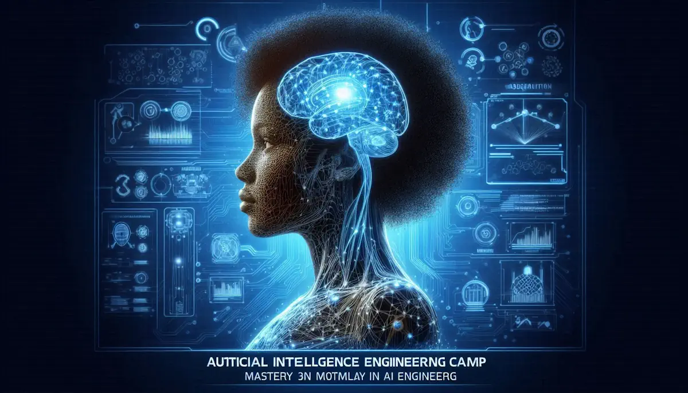
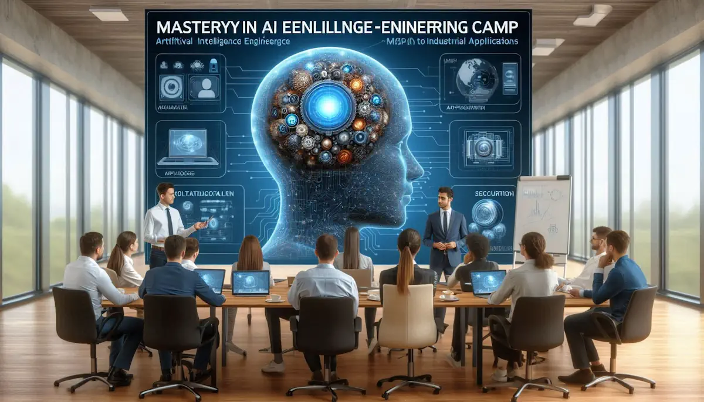

# **YAPAY ZEKA MÜHENDİSLİĞİ KAMPI - AI MÜHENDİSLİĞİNDE USTALIK**

- [Güncel PDF'i İndir](https://www.vebende.com.tr/pdfs/yapay-zeka-kampi-seviye-3.pdf)
- [En güncel eğitimlerimiz için www.vebende.com.tr ziyaret edin](https://www.vebende.com.tr/yapay-zeka-kampi-seviye-3)
  
## **Eğitim Süresi**

- **Süre:** 5 gün
- **Ders Süresi:** 50 dakika
- **Eğitim Saati:** 10:00 - 17:00

- > Eğitim formatında eğitimler 50 dakika + 10 dakika moladır. 12:00-13:00 saatleri arasında 1 saat yemek arasındaki verilir. Günde toplam 6 saat eğitim verilir. 5 günlük formatta 30 saat eğitim verilmektedir.

- > Eğitimler uzaktan eğitim formatında tasarlanmıştır. Her eğitim için teams linkleri gönderilir. Katılımcılar bu linklere girerek eğitimlere katılırlar. Ayrıca farklı remote çalışma araçları da eğitmen tarafından tüm katılımlara sunulur. Katılımcılar bu araçları kullanarak eğitimlere katılırlar.

- > Eğitim içeriğinde github ve codespace kullanılır. Katılımcılar bu platformlar üzerinden örnek projeler oluşturur ve eğitmenle birlikte eğitimlerde sorulan sorulara ve taleplere uygun iceriğe cevap verir. Katılımcılar bu araçlarla eğitimlerde sorulan sorulara ve taleplere uygun iceriğe cevap verir.

- > Eğitim yapay zeka destekli kendi kendine öğrenme formasyonu ile tasarlanmıştır. Katılımcılar eğitim boyunca kendi kendine öğrenme formasyonu ile eğitimlere katılırlar. Bu eğitim formatı sayesinde tüm katılımcılar gelecek tüm yaşamlarında kendilerini güncellemeye devam edebilecekler ve her türlü sorunun karşısında çözüm bulabilecekleri yeteneklere sahip olacaklardır.  

## **Yapay Zeka Mühendisliği Kampı**  

### **Yapay Zeka: Akıllı, Esnek ve Geleceği Şekillendiren Teknoloji**  

Dijital çağda problem çözmeyi hızlandırmak ve yenilikçi çözümler sunmak modern dünyanın temel ihtiyaçlarındandır. **Yapay Zeka (AI)**, veri odaklı yaklaşımı ve öğrenme kapasitesiyle en güçlü teknolojilerden biridir. **Açık kaynaklı araçlar, geniş kütüphane desteği ve Python gibi programlama dilleriyle uyumu**, AI mühendislerine esneklik ve yaratıcılık sunar.  

AI’nın **“Bir kez öğren, her alanda uygula”** prensibi, geliştirilen modellerin farklı problemleri çözmesini mümkün kılar. Güçlü algoritmaları ve büyük topluluk desteği sayesinde AI, **otomasyondan doğal dil işlemeye kadar geniş bir yelpazede** yenilikçi çözümler üretir.  

### **Neden Yapay Zeka?**  

#### 🚀 **Gelişen Teknoloji**  

Yapay zeka, teknoloji dünyasında hızla gelişen bir alan olup, endüstrileri dönüştürmektedir. **Otomasyon, veri analizi ve karar destek sistemleri**, AI’nin devrim yarattığı başlıca alanlardır.  

#### 📊 **Veri Analizi ve Yorumlama Yeteneği**  

AI, büyük veri setlerini analiz ederek **anlamlı içgörüler üretme**, modelleme ve sonuçları yorumlama yeteneğiyle karmaşık verileri işleyebilir.  

#### 💼 **Artan Talep ve Kariyer Fırsatları**  

Yapay zeka alanında uzmanlaşmış profesyoneller **(AI mühendisleri, veri bilimcileri, makine öğrenimi uzmanları)** giderek daha fazla talep görmektedir.  

#### 🌍 **İnovasyon ve Rekabet Avantajı**  

AI, işletmelere müşteri deneyimini iyileştirme, kişiselleştirme ve verimlilik artırma konusunda güçlü araçlar sunar. **Öneri sistemleri, sohbet botları ve otonom sistemler** gibi inovatif çözümler üretir.  

#### 🌱 **Sosyal Etki ve Çözümleme**  

Yapay zeka, **sağlık, eğitim, tarım** gibi birçok alanda toplumsal sorunları çözme potansiyeline sahiptir. **Hastalık teşhisi, öğrenci başarısının artırılması ve kaynak yönetimi** gibi konular AI’nin etkili olduğu alanlardandır.  

### **Yapay Zeka ile Modern Uygulamalar Geliştirin**  

#### **Veri Analizi ve Tahmin**  

Yapay zeka, **büyük veri setlerini analiz ederek geleceğe yönelik tahminler sunma yeteneği** ile stratejik kararları destekler.  

#### **Otomasyon ve Verimlilik**  

AI, **tekrarlayan görevleri otomatikleştirerek** iş süreçlerini hızlandırır, hata oranlarını azaltır ve kaynak tasarrufu sağlar.  

#### **Kullanıcı Deneyimini İyileştirme**  

**Personalizasyon ve öneri sistemleri** ile kullanıcı deneyimini geliştirerek hedef kitlenize daha uygun çözümler sunabilirsiniz.  

#### **Gelişmiş Makine Öğrenimi Algoritmaları**  

**TensorFlow, PyTorch** gibi güçlü kütüphaneler ile **derin öğrenme tekniklerini uygulayabilir ve karmaşık problemleri çözebilirsiniz**.  

#### **Geniş Topluluk ve Kaynak Desteği**  

AI topluluğu büyüktür ve birçok **ücretsiz kaynak ve destek forumları** bulunmaktadır. Öğrenme sürecinde karşılaşılan zorlukların üstesinden gelmek daha kolaydır.  

### **Yapay Zeka Mühendisliği Kampı ile Neler Öğreneceksiniz?**  

🔹 **Yapay zekanın temel prensipleri ve uygulama alanları**  
🔹 **Makine öğrenimi ve derin öğrenme teknikleri**  
🔹 **Veri analizi, model geliştirme ve optimizasyon süreçleri**  
🔹 **Python ve AI kütüphaneleriyle uygulamalı projeler**  
🔹 **Doğal Dil İşleme (NLP) ve Bilgisayarla Görü (Computer Vision) çalışmaları**  
🔹 **Endüstride AI uygulamaları ve gerçek dünya projeleri**  

Bu kamp, **AI mühendisliği alanında uzmanlaşmak isteyen profesyoneller ve teknoloji meraklıları için kapsamlı bir rehber** olacaktır. AI ile geleceğin teknolojilerini keşfetmeye hazır mısınız? 🚀

## **Eğitim İçeriği**  

  

**Gün 1: Transformer ve Bilgisayarlı Görü**

- **Dikkat Mekanizması ve Transformer Mimarisi:** Attention mekanizması ve Transformer modelleri (GPT, BERT) öğretilir. Katılımcılar, modern NLP’nin temelini öğrenir.
- **Transformers ve BERT Modeli ile NLP:** BERT ile metin sınıflandırma ve anlam çıkarma öğretilir. Katılımcılar, ileri NLP modellerini keşfeder.
- **OpenCV ile Görüntü İşleme Teknikleri:** OpenCV ile temel görüntü işleme (kenar algılama, filtreleme) öğretilir. Katılımcılar, bilgisayarlı görüye giriş yapar.

**Gün 2: LangChain ve Uygulama Geliştirme**

- **LangChain ile Uygulama Geliştirme:** LangChain ile chatbot ve karmaşık AI sistemleri geliştirme öğretilir. Katılımcılar, uygulamalı bir proje yapar.
- **Model Deployment: Flask, FastAPI ile AI Servisleri:** Flask ve FastAPI ile AI modellerini API olarak dağıtma öğretilir. Katılımcılar, modellerini canlı sistemlere entegre eder.
- **Chatbot ve Sesli Asistan Geliştirme:** Dialogflow, Rasa, DeepAI GPT-4 gibi araçlarla chatbot geliştirme öğretilir. Katılımcılar, konuşma tabanlı AI sistemleri oluşturur.

**Gün 3: Vektör Veritabanları ve İleri Teknikler**

- **Vektör Veritabanlarını Anlama:** Vektör veritabanlarının (Pinecone) çalışma prensipleri öğretilir. Katılımcılar, hızlı veri aramanın önemini anlar.
- **E-ticaret için AI: Öneri Sistemleri ve Müşteri Analitiği:** Öneri sistemleri ve müşteri davranış analizi öğretilir. Katılımcılar, e-ticaret uygulamalarını keşfeder.
- **Finans Sektöründe Yapay Zeka: Fraud Detection, Algo Trading:** Sahtecilik tespiti ve algoritmik trading örnekleri tartışılır. Katılımcılar, finansal AI çözümlerini öğrenir.

**Gün 4: Konuşma Tanıma ve Güvenlik**

- **Konuşma Tanıma Temelleri:** Ses sinyallerinin işlenmesi ve AI ile metne çevrilmesi (speech-to-text) öğretilir. Katılımcılar, ses verisinin analizini ve modellemesini öğrenir.
- **Son Kullanıcı için Ses Tanıma Uygulamaları:** Ses asistanları (Siri vb.), transkripsiyon araçları gibi uygulamalar tartışılır. Katılımcılar, bu teknolojilerin kullanıcı deneyimini nasıl iyileştirdiğini anlar.
- **AI Güvenliği ve Robustness:** Adversarial saldırılar, model savunması ve veri gizliliği konuları ele alınır. Katılımcılar, güvenli ve sağlam AI sistemleri tasarlamayı öğrenir.
- **Yüz Tanıma ve Nesne Algılama:** YOLO, Faster R-CNN gibi ileri bilgisayarlı görü algoritmaları öğretilir. Katılımcılar, pratik projeler geliştirir.
- **Doğal Dil İşlemede Gelişmiş Modeller:** GPT-4, Claude, Gemini AI gibi modellerle NLP uygulamaları öğretilir. Katılımcılar, son teknolojiyi keşfeder.

**Gün 5: Gelecek, Etik ve MLOps**

- **Yapay Zeka Etiği:** AI’nın önyargı, gizlilik ve toplumsal etkiler gibi etik boyutları tartışılır. Katılımcılar, sorumlu AI geliştirme prensiplerini kavrar.
- **Yapay Zekanın Geleceği ve Copilot/ChatGPT:** AI trendleri, Copilot ve ChatGPT gibi araçların gelecekteki evrimi ve endüstriye etkisi ele alınır. Katılımcılar, yenilikçi olasılıkları keşfeder.
- **MLOps Temelleri:** Model izleme, yeniden eğitim ve CI/CD süreçleri öğretilir. Katılımcılar, AI projelerini sürdürülebilir şekilde yönetmeyi öğrenir.
- **AI Proje Yönetimi ve Endüstriyel Uygulamalar:** Proje döngüsü (gereksinim analizi, geliştirme, dağıtım) ve vaka çalışmalarıyla endüstriyel uygulamalar tartışılır. Katılımcılar, gerçek dünya projelerine hazır hale gelir.

## **Eğitim Yöntemi**

- **Teorik Bilgi ve Kavramsal Anlatım:** Katılımcılar, yapay zeka temelleri, makine öğrenimi algoritmaları, doğal dil işleme ve bilgisayarlı görü gibi konularda kapsamlı bilgi edineceklerdir. Eğitim, temel kavramları ve algoritmaların nasıl çalıştığını detaylı bir şekilde ele alacaktır.
  
- **Uygulamalı Örnekler ve Canlı Demonstrasyonlar:** Gerçek dünya senaryoları üzerinden yapay zeka projeleri geliştirilecektir. Katılımcılar, model oluşturma, veri analizi, hata ayıklama ve performans optimizasyonu gibi süreçleri kendi bilgisayarlarında deneyimleyeceklerdir.
  
- **Etkileşimli Tartışmalar ve Problem Çözme:** Katılımcılar, eğitim süresince aktif olarak sorular soracak ve canlı tartışmalara katılarak, problemleri birlikte çözme fırsatı bulacaklardır.
  
- **Proje Tabanlı Öğrenme:** Katılımcılar, öğrendikleri bilgileri uygulamalı bir yapay zeka projesinde kullanarak deneyim kazanacaklardır. Grup projeleri ile işbirliği yaparak çözümler geliştireceklerdir.
  
- **Bireysel Projeler ve Değerlendirme:** Eğitim sonunda her katılımcı, öğrendiklerini bireysel bir yapay zeka projesi üzerinde uygulayarak eğitmenlerden geri bildirim alacaktır.
  
- **Soru-Cevap ve Tartışma Oturumları:** Katılımcılar, eğitim süresi boyunca sorularını eğitmenlere yöneltebilecek ve konuları derinlemesine tartışabileceklerdir.

## **Hedef Kitle**

Bu eğitim, yapay zeka teknolojilerini profesyonel olarak kullanmayı amaçlayan bireyler için tasarlanmıştır:

1. **Veri Bilimcileri ve Analistler:** Yapay zeka ile veri analizlerini güçlendirmek isteyen profesyoneller.
2. **Yazılım Geliştiriciler ve Mühendisler:** Uygulamalarına yapay zeka teknolojilerini entegre etmek isteyen teknik ekipler.
3. **IT ve Teknoloji Departmanları:** Dijital dönüşüm sürecinde yapay zeka araçlarını etkin kullanmayı amaçlayan profesyoneller.
4. **Akademisyenler ve Araştırmacılar:** Yapay zeka teknolojileri üzerine araştırmalar yapan akademisyenler.
5. **Proje Yöneticileri ve Danışmanlar:** Yapay zeka projelerini yönetmek ve optimize etmek isteyen profesyoneller.
6. **Girişimciler ve İşletme Sahipleri:** Yapay zeka çözümlerini iş süreçlerine entegre etmek isteyen girişimciler.

## **Katılımcılardan Beklentilerimiz**

- **Temel Veri Bilimi Bilgisi:** İstatistik, olasılık ve temel veri analizi konularında bilgi sahibi olmak.
- **Programlama Bilgisi:** Python veya R gibi dillerde temel programlama yetkinliğine sahip olmak.
- **Makine Öğrenimi Temellerine Hakimiyet:** Eğitim, modelleme, test ve validasyon süreçleri hakkında bilgi sahibi olmak.
- **Veri Yönetimi ve Veritabanları Bilgisi:** SQL ve NoSQL veritabanları ile veri saklama ve yönetme konularında deneyim sahibi olmak.
- **Geliştirme Araçları ve Kütüphanelere Aşinalık:** Pandas, NumPy ve scikit-learn gibi kütüphanelerde temel seviyede deneyim sahibi olmak.
- **Aktif Katılım:** Soru sormaya, tartışmalara katılmaya ve deneyimlerini paylaşmaya istekli olmak.
- **Pratik Uygulama ve Deneyim:** Gerçek yapay zeka projelerinde teorik bilgiyi pratiğe dönüştürme yetkinliği göstermek.
- **Problem Çözme Yetenekleri:** Karmaşık veri analiz problemlerine analitik ve yaratıcı çözümler üretebilmek.
- **Ekip Çalışması:** İş birliği yaparak yapay zeka tabanlı çözümler geliştirme ve optimize etme becerisi göstermek.
- **Performans ve Model Kalitesi Bilinci:** Geliştirilen modellerin performansını ve kalitesini ön planda tutma yeteneğine sahip olmak.

[Eğitim Materyalleri (Eğitmenlere Özel)](https://github.com/TuncerKARAARSLAN-VB/training-kit-yapay-zeka-kampi-seviye-3)
