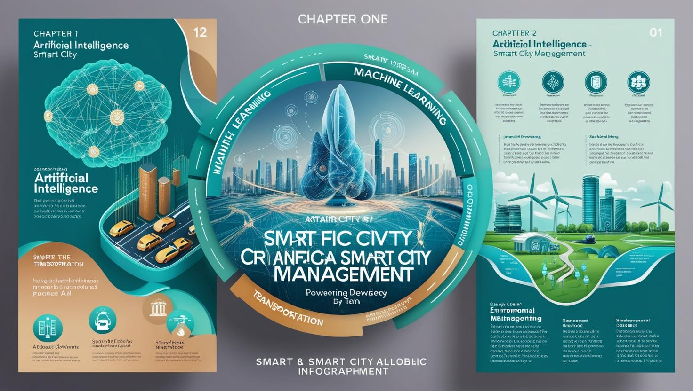
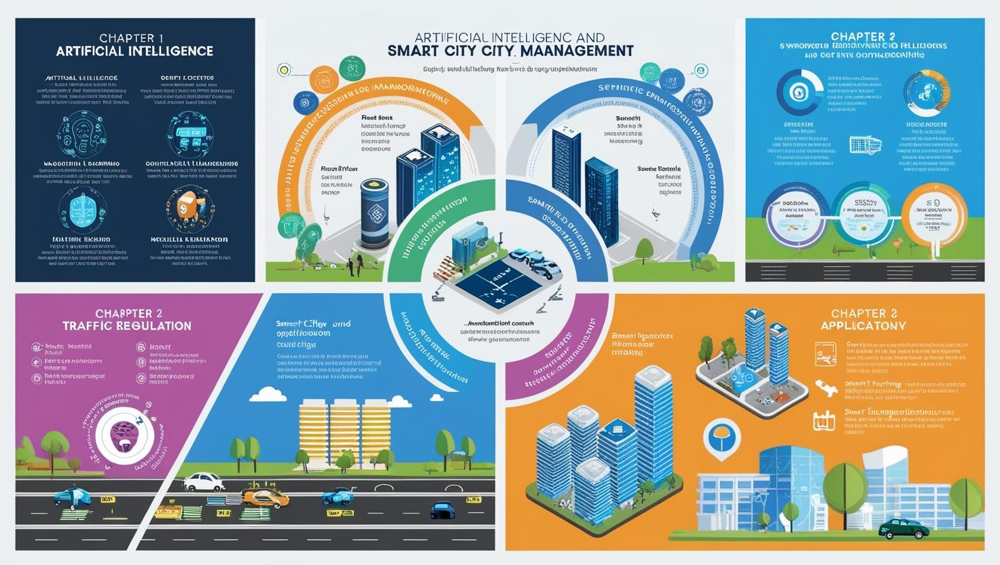

# **Yapay Zeka ve Kamu Alanında Uygulamalar - Akıllı Şehir Yönetimi ve Planlamada Yapay Zeka**

[Download PDF Version](./kamuda-yapayzeka.pdf)

## **Eğitim Süresi**

- **Format 1**
  - **5 Gün**
  - **Ders Süresi:** 50 dakika
  - **Eğitim Saati:** 10:00 - 17:00

- **Format 2**
  - **12 Gün**
  - **Ders Süresi:** 50 dakika
  - **Eğitim Saati:** 10:00 - 17:00

- > Her iki eğitim formatında eğitimler 50 dakika + 10 dakika moladır. 12:00-13:00 saatleri arasında 1 saat yemek arasındaki verilir. Günde toplam 6 saat eğitim verilir. 5 günlük formatta 30 saat eğitim, 12 günlük formatta toplam 72 saat eğitim verilmektedir. 12 saatlik eğitmde katılımcılar kod yazar ve eğitmenle birlikte sorulan sorulara ve taleplere uygun içerikler ve örnekler çalışılır.

- > Eğitimler uzaktan eğitim formatında tasarlanmıştır. Her eğitim için teams linkleri gönderilir. Katılımcılar bu linklere girerek eğitimlere katılırlar. Ayrıca farklı remote çalışma araçları da eğitmen tarafından tüm katılımlara sunulur. Katılımcılar bu araçları kullanarak eğitimlere katılırlar. 

- > Eğitim içeriğinde github ve codespace kullanılır. Katılımcılar bu platformlar üzerinden örnek projeler oluşturur ve eğitmenle birlikte eğitimlerde sorulan sorulara ve taleplere uygun iceriğe cevap verir. Katılımcılar bu araçlarla eğitimlerde sorulan sorulara ve taleplere uygun iceriğe cevap verir.

- > Eğitim yapay zeka destekli kendi kendine öğrenme formasyonu ile tasarlanmıştır. Katılımcılar eğitim boyunca kendi kendine öğrenme formasyonu ile eğitimlere katılırlar. Bu eğitim formatı sayesinde tüm katılımcılar gelecek tüm yaşamlarında kendilerini güncellemeye devam edebilecekler ve her türlü sorunun karşısında çözüm bulabilecekleri yeteneklere sahip olacaklardır.

## **Yapay Zeka ve Kamu Alanında Uygulamalar  Akıllı Şehir Yönetimi ve Planlamada Yapay Zekanın Gücü ve Verimlilik**

## **Eğitim Amacı**

Bu eğitim, yapay zeka ve akıllı şehir konseptlerini anlamaya, bu iki kavramın kamu yönetimi ve toplum hizmetlerinde nasıl entegre edilebileceğini öğrenmeye odaklanmıştır. Eğitim, katılımcılara akıllı şehirlerin planlanması ve yönetimi süreçlerinde yapay zeka teknolojilerinin kullanımını teorik ve uygulamalı olarak öğretmeyi hedeflemektedir.  

Ayrıca, şehirlerin dijitalleşmesiyle ortaya çıkan veri toplama, analiz ve raporlama süreçlerinde yapay zekanın etkisini kavrayarak, kamu hizmetlerini daha etkin, verimli ve sürdürülebilir hale getirebilecek stratejiler geliştirme becerisi kazandırılacaktır.  

1. **Yapay zekanın temel prensiplerini ve akıllı şehir uygulamalarındaki rolünü öğrenir.**  
2. **Ulaşım, enerji, çevre, sağlık ve toplum odaklı hizmetler gibi alanlarda yapay zekayı nasıl kullanabileceklerini keşfeder.**  
3. **Toplum geri bildirimlerini ve büyük veri analitiğini yapay zeka ile optimize ederek kamu hizmetlerini iyileştirme becerisi kazanır.**  
4. **Veri güvenliği, etik ve sürdürülebilirlik gibi kritik konularda farkındalık geliştirir.**  

Sonuç olarak, eğitim, şehir yönetiminde yenilikçi yaklaşımlarla yapay zeka tabanlı çözümler geliştirmek isteyen kamu yöneticileri, şehir planlamacıları ve teknoloji uzmanlarına rehberlik etmeyi amaçlamaktadır.

## **Eğitim İçeriği:**

### **Bölüm 1: Yapay Zeka ve Akıllı Şehir Konseptine Giriş**

- **Yapay Zeka (AI) Nedir?**
  - Yapay zekanın tanımı, temel bileşenleri ve uygulama alanları
  - Makine öğrenimi, derin öğrenme, doğal dil işleme (NLP) ve yapay zeka türleri
  - Kamu sektöründe yapay zekanın rolü ve etkileri

- **Akıllı Şehir Nedir?**
  - Akıllı şehir kavramının tanımı ve temel bileşenleri
  - Akıllı şehirlerin önemi ve hedefleri
  - Akıllı şehirler ve dijital dönüşüm ilişkisi

- **Yapay Zeka ve Akıllı Şehirlerin Birleşimi**
  - Yapay zekanın akıllı şehirlerde nasıl devreye girdiği
  - Şehirlerin dijitalleşmesi ve verilerin toplanması
  - Veriye dayalı karar verme ve optimizasyon

---

### **Bölüm 2: Yapay Zeka ile Akıllı Şehir Yönetimi ve Planlaması**

- **Ulaşım ve Trafik Yönetimi**
  - Yapay zeka destekli trafik akışını düzenleme
  - Akıllı trafik ışıkları ve önceliklendirme
  - Otonom araçların şehir trafiğine entegrasyonu
  - Akıllı park yerleri yönetimi ve trafik yoğunluğu tahminleri

- **Enerji Verimliliği ve Yönetimi**
  - Yapay zeka ile enerji tüketim analizleri
  - Akıllı elektrik şebekeleri (smart grids) ve enerji depolama sistemleri
  - Akıllı aydınlatma ve enerji tasarrufu stratejileri
  - Yapay zekanın sürdürülebilir enerji politikalarına etkisi

- **Çevre İzleme ve Kirlilik Kontrolü**
  - Akıllı sensörler ile hava kalitesi ve çevre kirliliği izleme
  - Yapay zeka tabanlı çevre tahminleri ve erken uyarı sistemleri
  - Doğal kaynakların korunması ve kaynak yönetimi
  - Atık yönetimi ve geri dönüşüm süreçlerinde yapay zeka uygulamaları

- **Su Yönetimi ve Altyapı İzleme**
  - Akıllı su yönetimi ve su tasarrufu çözümleri
  - Yapay zeka ile su borusu ağlarının izlenmesi ve sızıntı tespiti
  - Akıllı altyapı yönetimi ve bakım süreçleri
  - Veriye dayalı altyapı planlaması

---

### **Bölüm 3: Kamu Hizmetlerinin İyileştirilmesi ve Toplum Odaklı Uygulamalar**

- **Sağlık Hizmetlerinde Yapay Zeka**
  - Akıllı sağlık izleme sistemleri
  - Yapay zeka ile sağlık hizmetlerinin iyileştirilmesi
  - Kişisel sağlık verisi analizi ve bireysel sağlık tahminleri
  - Sağlık krizlerinde yapay zekanın rolü (örneğin pandemiler)

- **Eğitim ve Toplumsal Hizmetlerde AI**
  - Akıllı eğitim sistemleri ve kişiye özel eğitim çözümleri
  - Toplumsal hizmetlerin AI ile optimize edilmesi
  - Eğitimde veriye dayalı karar destek sistemleri
  - Eğitimde yapay zeka ve öğretici robotlar

- **Toplum ve Vatandaş Etkileşimi**
  - Akıllı şehirlerde vatandaşların katılımı
  - Yapay zeka ile kamu hizmetlerine erişimin kolaylaştırılması
  - Dijital vatandaşlık ve toplumsal bilinç artırma
  - **AI Destekli Kamu Anketleri ve Görüşler Toplama**
    - Anketler ve geri bildirimler aracılığıyla halkın projelere katılımı
    - Halkın önceliklerinin tespiti ve bu verilerin yönetime raporlanması
    - Yapay zeka ile anket analizlerinin hızlandırılması
    - Yapılan anketlerin, projelerin öncelik sıralaması için kullanılması
    - **Örnek Senaryo: Anket Kioskları ve Sesli Geri Bildirim Sistemleri**  
      - Şehirdeki farklı lokasyonlara yerleştirilen anket kioskları ile vatandaşlardan sürekli geri bildirim toplama  
      - Kiosklar aracılığıyla vatandaşların sesli olarak şikayet, öneri ve sorunlarını iletmesi  
      - Yapay zeka destekli analizlerle, toplanan verilerin hızla işlenmesi ve toplumsal eğilimlerin belirlenmesi  
      - Kioskların halka yönelik duyurular yaparak, şehirdeki önemli güncellemeleri ve etkinlikleri duyurması  
      - Kiosklar ile toplumsal sorunların hızlıca tespit edilmesi ve ilgili birimlere iletilmesi  
      - Anket ve sesli geri bildirimlerle toplanan verilerin, kamu hizmetleri iyileştirme süreçlerine nasıl dahil edileceği  

Tabii, şehrin farklı lokasyonlarına yerleştirilecek anket kioskları ile sürekli bilgi analizi yapmak, sorunları sesli olarak almak ve halkla etkili iletişim kurmak gibi unsurları eğitim içeriğine eklemek oldukça faydalı olacaktır. Bu sayede, katılımcılara hem uygulamalı hem de gerçek hayatta karşılaşabilecekleri senaryolarla daha somut bir eğitim sunulmuş olur. İşte eğitim içeriğine eklediğiniz bu konuyu nasıl entegre edebileceğimize dair bir öneri:

---

### **Bölüm 4: Akıllı Şehirler İçin Verinin Rolü ve Yönetimi**

- **Veri Toplama ve Yönetimi**
  - Sensörler ve IoT cihazları ile veri toplama yöntemleri
  - Büyük veri analitiği ve yapay zeka algoritmaları
  - Akıllı şehirlerde veri yönetiminin önemi

- **Veri Güvenliği ve Gizliliği**
  - Şehir verisinin güvenliği ve kişisel verilerin korunması
  - Yapay zekanın veri güvenliği üzerindeki etkisi
  - Akıllı şehirlerde dijital güvenlik stratejileri

- **Yapay Zeka ile Veri Analizi**
  - Veriye dayalı karar verme ve öngörü analitiği
  - Akıllı şehirlerin geleceği için veri tabanlı planlama
  - Veriye dayalı kamu politikası geliştirme

---

### **Bölüm 5: Yapay Zeka ile Akıllı Şehir Planlamasında Gelecek Perspektifleri**

- **Yapay Zeka ve Kamu Politikaları**
  - Yapay zeka destekli şehir planlaması
  - Geleceğin şehirleri için yapay zeka çözümleri
  - Yapay zeka ile şehir stratejilerinin uzun vadeli planlanması
  - Akıllı şehirlerde sürdürülebilir kalkınma hedefleri

- **Yapay Zeka ve Toplumsal Etkiler**
  - Teknolojik eşitsizlikler ve toplumda dijital uçurum
  - Yapay zekanın toplumsal etkileri ve etik sorunlar
  - Kamu hizmetlerinde AI çözümleri ile toplumsal katılım

- **Geçiş Süreci ve İnovasyon**
  - Yapay zeka teknolojileri ile şehirlerin dönüşümü
  - AI tabanlı dönüşüm süreçlerinin yönetimi
  - İnovasyon süreçlerinde belediyelerin rolü

---

### **Bölüm 6: Verilerin Toplanması, İşlenmesi ve Raporlanması**

- **Hayvan Barınakları ve Şikayet Hatlarının Analizi**
  - Yapay zeka ile hayvan barınaklarındaki verilerin toplanması ve analiz edilmesi
  - Şikayet mail hatlarının verimli bir şekilde işlenmesi ve analizi
  - Halktan toplanan şikayet ve bilgilerin sisteme aktarılması, analiz edilmesi ve raporlanması
  - Yapay zeka destekli şikayet yönetim sistemleri

- **Halktan Gelen Verilerin Kullanımı**
  - Sosyal medya ve diğer platformlardan alınan verilerin taranması
  - Kamu şikayetlerini ve geri bildirimlerini analiz etme
  - Yapay zeka ile halkın önceliklerinin belirlenmesi ve bu verilerin yönetime raporlanması

---

### **Bölüm 7: Yapay Zeka ile Kamu Hizmetlerinin İyileştirilmesi ve Etkileşim**

- **Veriye Dayalı Toplum Odaklı Uygulamalar**
  - Anketler ve halkın katılımını sağlayacak yapay zeka destekli sistemler
  - Kamu hizmetleri için önceliklerin belirlenmesi ve bu verilerin karar destek sistemlerine entegrasyonu
  - Yapay zeka ile halkın geri bildirimlerinin hızla analiz edilmesi ve çözüm üretme süreçleri

- **Kamu Hizmetlerinde Verimlilik ve Hızlı Karar Alımı**
  - Verilerin doğru bir şekilde analiz edilmesi ile kamu hizmetlerinde hız kazandırma
  - Yapay zeka ile karar destek sistemlerinin entegrasyonu ve otomasyonu

## **Eğitim Yöntemi**

- **Veri Tabanlı Çalışmalar:** Katılımcılar, şehirden toplanan verilerin analizi ve bu verilerin raporlanması süreçlerinde yapay zekanın nasıl kullanılacağını öğrenir.
- **Simülasyonlar ve Uygulamalı Eğitim:** Akıllı şehir yönetimi için geliştirilmiş yazılımlar ve araçlar ile pratik eğitimler yapılır.
- **Örnek Olay Çalışmaları:** Kamu hizmetlerinin verimliliğini artırmaya yönelik yapay zeka çözümleri ile ilgili vaka çalışmaları incelenir.

## **Hedef Kitle**

1. **Kamu Sektöründe Çalışan Profesyoneller:**
   - Belediye çalışanları, şehir planlamacıları, kamu hizmetleri yöneticileri ve strateji geliştiren kişiler.
   - Akıllı şehir projeleriyle ilgilenen devlet daireleri ve kurumlar.

2. **Teknoloji ve Yazılım Geliştiricileri:**
   - Yapay zeka, veri analitiği, makine öğrenimi ve IoT teknolojilerine ilgi duyan yazılım mühendisleri, veri bilimcileri ve sistem analistleri.
   - Akıllı şehirler için yeni çözümler geliştirmeyi amaçlayan yazılım geliştirme ekipleri.

3. **Mühendisler ve Şehir Planlamacıları:**
   - Altyapı, ulaşım, enerji verimliliği, çevre izleme ve su yönetimi gibi alanlarda çalışan mühendisler.
   - Akıllı şehir projelerinde yer alan mühendislik ekipleri ve şehir planlamacıları.

4. **Sosyal Hizmetler ve Eğitim Alanında Çalışan Profesyoneller:**
   - Eğitim teknolojileri, sağlık hizmetleri ve toplumsal hizmetlerde çalışanlar.
   - Akıllı eğitim sistemleri, sağlık yönetimi ve toplumsal etkileşimde AI çözümleri arayan profesyoneller.

5. **İnovasyon ve Dijital Dönüşüm Uzmanları:**
   - Dijital dönüşüm süreçlerine yön veren ve akıllı şehirlerin geleceği için strateji geliştiren iş liderleri, inovasyon yöneticileri ve dijital dönüşüm uzmanları.

6. **Yönetim ve Strateji Danışmanları:**
   - Akıllı şehir ve yapay zeka uygulamalarının ekonomik ve stratejik etkilerini analiz etmek isteyen danışmanlar ve yönetim profesyonelleri.

Bu eğitim, katılımcıların akıllı şehirler ve yapay zeka entegrasyonunu anlamalarını ve bu teknolojilerin uygulama alanlarında verimli bir şekilde nasıl kullanılacağını keşfetmelerini sağlayacaktır.

## **Katılımcılardan Beklentilerimiz**

1. **Temel Teknoloji ve Yapay Zeka Bilgisi:**  
   Katılımcıların yapay zeka, veri analitiği ve dijital teknolojilere ilgi duyması ve temel düzeyde bilgiye sahip olması beklenmektedir.  

2. **Katılım ve İletişim:**  
   - Eğitim sırasında aktif katılım göstermeleri, grup tartışmalarına dahil olmaları ve fikirlerini paylaşmaları beklenir.  
   - Eğitimde işlenen teorik bilgileri uygulamalı çalışmalarla ilişkilendirebilmeleri önemlidir.  

3. **Problem Çözme ve Analitik Yaklaşım:**  
   Eğitim boyunca verilen vaka çalışmaları ve senaryolara çözüm üretirken analitik düşünme becerilerini kullanmaları beklenmektedir.  

4. **Uygulama ve Geri Bildirim:**  
   - Uygulama aşamalarında yapay zeka ve akıllı şehir çözümlerini analiz ederek, yenilikçi öneriler geliştirmeleri beklenir.  
   - Eğitim sürecine yönelik geri bildirim vererek, içeriğin iyileştirilmesine katkı sağlamaları da teşvik edilir.  

5. **Disiplinler Arası İş Birliği:**  
   Farklı mesleklerden gelen katılımcılarla birlikte çalışarak, ekip çalışmalarına uyum sağlama ve disiplinler arası bir perspektif geliştirme becerisi göstermeleri beklenmektedir.  

6. **Etik ve Sürdürülebilirlik Farkındalığı:**  
   - Yapay zeka ve akıllı şehir uygulamalarında etik, veri güvenliği ve sürdürülebilirlik konularına duyarlılık göstermeleri önemlidir.  
   - Eğitim boyunca tartışılan projelerde toplum yararını önceliklendirmeleri beklenir.  

[Eğitim Materyalleri (Eğitmenlere Özel)](https://github.com/TuncerKARAARSLAN-VB/training-kit-yapay-zeka-kamu-alaninda-uygulamalar)
