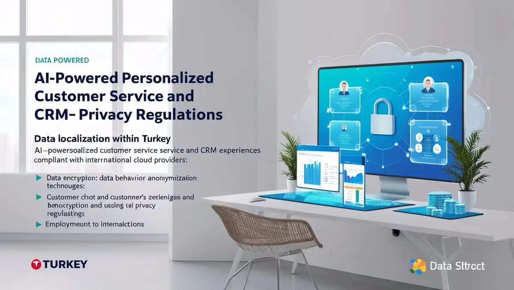
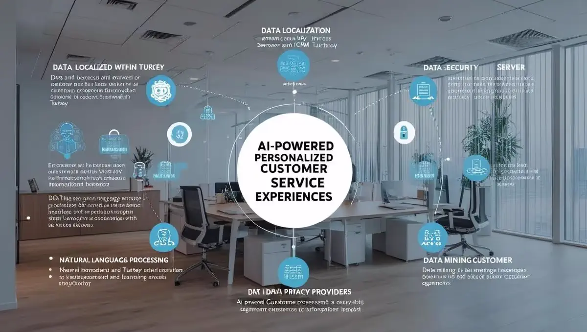

# **KURUMSAL EĞİTİM, YAPAY ZEKAYLA KİŞİSELLEŞTİRİLMİŞ MÜŞTERİ DENEYİMİ**

- [Güncel PDF'i İndir](https://www.vebende.com.tr/pdfs/yapay-zekayla-kisillestirilmis-musteri-deneyimi-gelistirme.pdf)
- [En güncel eğitimlerimiz için www.vebende.com.tr ziyaret edin](https://www.vebende.com.tr/yapay-zekayla-kisillestirilmis-musteri-deneyimi-gelistirme)
  
## **Eğitim Süresi**

- **Süre:** 12 gün
- **Ders Süresi:** 50 dakika
- **Eğitim Saati:** 10:00 - 17:00

- > Eğitim formatında eğitimler 50 dakika + 10 dakika moladır. 12:00-13:00 saatleri arasında 1 saat yemek arasındaki verilir. Günde toplam 6 saat eğitim verilir. 12 günlük formatta 72 saat eğitim verilmektedir.

- > Eğitimler uzaktan eğitim formatında tasarlanmıştır. Her eğitim için teams linkleri gönderilir. Katılımcılar bu linklere girerek eğitimlere katılırlar. Ayrıca farklı remote çalışma araçları da eğitmen tarafından tüm katılımlara sunulur. Katılımcılar bu araçları kullanarak eğitimlere katılırlar.

- > Eğitim içeriğinde github ve codespace kullanılır. Katılımcılar bu platformlar üzerinden örnek projeler oluşturur ve eğitmenle birlikte eğitimlerde sorulan sorulara ve taleplere uygun iceriğe cevap verir. Katılımcılar bu araçlarla eğitimlerde sorulan sorulara ve taleplere uygun iceriğe cevap verir.

- > Eğitim yapay zeka destekli kendi kendine öğrenme formasyonu ile tasarlanmıştır. Katılımcılar eğitim boyunca kendi kendine öğrenme formasyonu ile eğitimlere katılırlar. Bu eğitim formatı sayesinde tüm katılımcılar gelecek tüm yaşamlarında kendilerini güncellemeye devam edebilecekler ve her türlü sorunun karşısında çözüm bulabilecekleri yeteneklere sahip olacaklardır.  

## **Yapay Zeka ile Kişiselleştirilmiş Müşteri Deneyimi Geliştirme**  

### **Yapay Zeka Destekli Müşteri Deneyimi: Akıllı, Güvenli ve Etkileşimli**  

Dijital çağda müşteri deneyimini kişiselleştirmek, markaların rekabet avantajı elde etmesi için kritik bir faktördür. **Yapay Zeka (AI)**, müşteri davranışlarını analiz ederek kişiye özel deneyimler sunmayı mümkün kılar. **Makine öğrenimi, doğal dil işleme (NLP) ve veri analitiği** gibi AI teknolojileri, işletmelerin müşteri memnuniyetini artırmasına yardımcı olur. Ancak, bu süreçte **KVKK ve GDPR** gibi yasal düzenlemelere uyum sağlamak da büyük önem taşır.  

Bu eğitim, **KVKK uyumu, mikroservis mimarileri, Kubernetes ve Docker teknolojilerinin entegrasyonu** gibi konulara odaklanarak AI destekli müşteri deneyimi sistemleri geliştirmeyi öğretecektir. Aynı zamanda, bulut sağlayıcılarının **yurtdışı sunucularında barındırılmasının riskleri** ele alınacak ve **yerel altyapılarla güvenli çözümler** oluşturma yöntemleri anlatılacaktır.  

## **Eğitimin Hedefleri**  

Bu eğitimin temel amacı, katılımcılara **yapay zeka teknolojilerinin müşteri deneyimi ve CRM sistemlerinde nasıl etkili bir şekilde kullanılacağını öğretmektir**. Eğitim, katılımcıları **yasal düzenlemelere uygun, güvenli ve ölçeklenebilir AI projeleri geliştirmeye yönlendirecek** şekilde yapılandırılmıştır.

### **Katılımcılar Eğitimin Sonunda:**  

✅ Yapay zeka tabanlı **kişiselleştirilmiş müşteri deneyimleri geliştirme becerisine** sahip olacaklardır.  
✅ **KVKK ve GDPR** gibi veri koruma yasalarına uygun **projeler oluşturma yetkinliği** kazanacaklardır.  
✅ **Mikroservis mimarisi** ile AI çözümleri geliştirip, **Docker ve Kubernetes** ortamlarında yönetme konusunda deneyim kazanacaklardır.  
✅ **Yerel altyapılarda güvenli ve sürdürülebilir AI projeleri kurma** bilgisine sahip olacaklardır.  
✅ **Bulut tabanlı çözümler yerine yerel veri merkezlerinde barındırılan altyapılar** ile güvenlik risklerini nasıl minimize edebileceklerini öğreneceklerdir.  

## **Eğitim İçeriği**  

  

### **Gün 1: Yapay Zeka ve Kişiselleştirilmiş Müşteri Deneyimi**  

- **Yapay Zeka ve Müşteri Etkileşimi:** Yapay zeka uygulamalarının müşteri ilişkileri yönetimindeki rolü, müşteri etkileşimlerini nasıl kişiselleştireceği ve buna nasıl adapte olunabileceği.
- **Kişiselleştirilmiş Deneyimler:** Müşteri davranışlarını anlamak, tercihlerine göre öneriler sunmak ve müşteri taleplerine hızlı tepki vermek.
- **Veri Güvenliği ve Yasal Çerçeve:** KVKK'nın müşteri verisi ve yapay zeka uygulamaları üzerindeki etkisi ve nasıl uyum sağlanacağı.

### **Gün 2: KVKK Uyumluluğu ve Yasal Çerçeve**  

- **KVKK ve GDPR İlkeleri:** Müşteri verilerinin toplanması ve kullanımı hakkında yasal gereklilikler.
- **Veri Yerelleştirme:** Türkiye’deki veri merkezlerinde müşteri verilerinin saklanmasının önemi.
- **Veri Güvenliği:** Müşteri verilerinin güvenliğini sağlamak için şifreleme ve anonimleştirme yöntemlerinin uygulanması.

### **Gün 3: Yapay Zeka ve Müşteri İletişimi**  

- **Yapay Zeka Destekli Chatbotlar:** WhatsApp ve diğer mesajlaşma platformları üzerinden müşteri taleplerine yanıt veren chatbotların tasarımı.
- **Öneri Sistemleri ve Kişisel Ürün Tavsiyeleri:** Müşterinin tercihlerine dayalı ürün öneri motorları geliştirmek ve WhatsApp üzerinden uygun fiyatlar ile ürünleri tanıtmak.
- **Sesli Yanıt Sistemleri (IVR):** Yapay zeka destekli IVR sistemleri ile telefonla yapılan müşteri etkileşimlerini yönetmek.

### **Gün 4: Mikroservis Mimarileri ve Yapay Zeka Çözümleri**  

- **Mikroservis Mimarisi ile Yapay Zeka Uygulamaları:** Müşteri siparişleri, stok yönetimi ve kişisel ürün önerileri gibi işlemler için mikroservis tabanlı yapay zeka çözümleri.
- **Veri Yönetimi ve Orkestrasyon:** Kubernetes ile uygulamaların yönetimi ve veri entegrasyonu.

### **Gün 5: WhatsApp Üzerinden Kişiselleştirilmiş Ürün Tanıtımı**  

- **WhatsApp API Entegrasyonu:** Müşterilere WhatsApp üzerinden otomatik mesajlar göndermek ve ürünleri tanıtmak için WhatsApp API kullanımı.
- **Ürün Tanıtım ve Fiyatlandırma:** Müşteriye ürün önerileri ve güncel fiyatlar hakkında bilgi gönderme.
- **Kişiselleştirilmiş İletişim Stratejileri:** Müşteriye özel promosyonlar ve kampanyalar tasarlamak.

### **Gün 6: Docker ve Kubernetes ile Yapay Zeka Uygulama Dağıtımı**  

- **Konteynerleştirilmiş Yapay Zeka Uygulamaları:** WhatsApp entegrasyonu gibi mikroservis tabanlı çözümleri Docker ile paketleme.
- **Kubernetes ile Ölçeklenebilir Yapılar:** Yapay zeka ve chatbot uygulamalarının yüksek verimli çalışabilmesi için Kubernetes kullanımı.

### **Gün 7: Performans ve Güvenlik Ölçümleme**  

- **Uygulama Performansının İzlenmesi:** Müşteri etkileşimlerinin etkinliğini ölçmek ve yapay zeka modellerinin performansını izlemek.
- **Güvenlik ve Uyumluluk:** KVKK uyumlu müşteri verisi izleme ve güvenlik önlemleri.

### **Gün 8: Uygulamalı Atölye Çalışmaları**  

- **WhatsApp Üzerinden Chatbot ve Ürün Tanıtım Uygulaması Geliştirme:**
  - WhatsApp API ile chatbot uygulaması geliştirmek.
  - Ürün öneri algoritması ve fiyat bilgilerini WhatsApp üzerinden müşterilere iletmek.
- **Mikroservisler ile Müşteri Etkileşim Sistemleri Tasarımı:**
  - Müşteri verilerini analiz ederek kişiselleştirilmiş ürün önerileri ve stok durumu hakkında bilgi veren sistemlerin tasarlanması.

### **Gün 9: Yerel Çözümler ve Bulut Alternatifleri**  

- **Yerel Çözümler:** Türkiye'deki veri merkezlerinde güvenli ve KVKK uyumlu çözümler geliştirmek.
- **Bulut ve Yerel Sistemler Arasındaki Geçiş:** AWS, Azure ve Google Cloud gibi bulut sağlayıcılarından yerel altyapılara geçiş için stratejiler.

### **Gün 10: Sesli Yanıt Sistemleri ile İleri Seviye Yapay Zeka Entegrasyonu**  

- **Yapay Zeka Destekli Sesli Yanıt Sistemleri (IVR):**
  - Müşterilere telefon üzerinden ürün tanıtımları yapmak.
  - Sesli geri bildirim ve ürün siparişi sistemleri kurmak.

### **Gün 11-12: WhatsApp Entegrasyonu ve Müşteri İletişim Sistemi Projesi**  

- **Proje Geliştirme:**
  - WhatsApp üzerinden müşteri sipariş bilgisi sağlama, ürün önerileri ve fiyat bilgileri göndermek.
  - Kişisel verilerin güvenliğini sağlamak ve KVKK uyumlu çözümler sunmak.

## **Eğitim Yöntemi**

- **Teorik Bilgi ve Kavramsal Anlatım:** Katılımcılar, yapay zeka ve CRM entegrasyonu konularında temel kavramları, KVKK uyumluluğu, veri güvenliği, mikroservis mimarisi gibi konuları öğreneceklerdir. Eğitim, teorik bilgilere dayalı olarak yerel altyapılarda yapay zeka projelerinin nasıl geliştirileceği üzerine odaklanacaktır.
  
- **Canlı Demonstrasyonlar ve Uygulamalı Çalışmalar:** Docker ve Kubernetes üzerinde AI projelerinin kurulumu ve yönetimi gibi gerçek dünya senaryoları üzerinden katılımcılar aktif bir şekilde eğitim alacaklardır. Yapay zeka araçları kullanılarak makine öğrenmesi ve doğal dil işleme (NLP) örnek projeleri yapılacaktır.

- **Etkileşimli Tartışmalar ve Grup Çalışmaları:** Katılımcılar, küçük gruplara ayrılarak KVKK uyumlu projeler üzerinde çalışacaklar ve projelerini sunacaklardır. Ayrıca, eğitim süresince aktif olarak sorular soracak ve problemleri grup halinde çözme fırsatı bulacaklardır.

- **Proje Tabanlı Öğrenme:** Katılımcılar, öğrendikleri teorik bilgileri, yerel altyapılarda uygulamalı yapay zeka projelerinde deneyimleyeceklerdir. Her grup, vaka analizleri yaparak çözümler geliştirecek ve uygulamalı deneyim kazanacaktır.

- **Bireysel Çalışmalar ve Geri Bildirim:** Her katılımcı, eğitim sırasında edindiği bilgileri kendi projelerinde uygulayabilecek şekilde kişisel çalışmalar yapacak ve eğitmenlerden birebir geri bildirim alacaktır.

- **Soru-Cevap ve Tartışma Oturumları:** Eğitim sonunda katılımcılar, konu hakkında derinlemesine tartışmalara katılarak sorularını eğitmenlere sorabileceklerdir. Bu oturumlar, katılımcıların daha iyi kavrayış ve pekiştirme yapmalarına olanak tanıyacaktır.

## **Hedef Kitle**

Bu eğitim, yapay zeka ve CRM entegrasyonu konularına ilgi duyan profesyonellere yönelik olarak tasarlanmıştır:

1. **Yazılım Geliştiriciler ve Mühendisler:** Yapay zeka ve makine öğrenmesi teknolojilerini kullanarak CRM sistemleri geliştirmek isteyen yazılım mühendisleri ve geliştiriciler.
2. **Sistem Yöneticileri ve DevOps Uzmanları:** Docker, Kubernetes üzerinde uygulama geliştirme ve yönetme konusunda bilgi edinmek isteyen profesyoneller.
3. **Veri Bilimcileri ve AI Uzmanları:** Makine öğrenmesi ve yapay zeka algoritmalarını CRM uygulamalarına entegre etmek isteyen veri bilimcileri ve AI uzmanları.
4. **Veri Güvenliği ve KVKK Uzmanları:** Veri güvenliği, KVKK uyumluluğu ve yasal düzenlemelere uyumlu projeler geliştirmek isteyen güvenlik uzmanları.
5. **İş Analistleri ve CRM Yöneticileri:** CRM sistemlerini optimize etmek ve yapay zeka çözümleri entegre etmek isteyen iş analistleri ve CRM yöneticileri.

## **Katılımcılardan Beklentilerimiz**

- **Temel Yazılım Geliştirme Bilgisi:** Katılımcıların yazılım geliştirme temelleri hakkında bilgi sahibi olmaları ve Docker, Kubernetes, Python gibi teknolojilere aşina olmaları gerekmektedir.
- **Yapay Zeka ve Makine Öğrenmesi Temellerine İlgili Bilgi:** Eğitimde, temel AI ve ML bilgisi edinmiş katılımcılar daha verimli bir şekilde eğitimden faydalanacaktır.
- **Aktif Katılım:** Katılımcıların uygulamalı çalışmalara aktif katılım göstermeleri ve grup projelerinde yer almaları beklenmektedir.
- **Veri Güvenliği ve Yasal Uyumluluk Konularına Duyarlılık:** KVKK ve GDPR gibi yasal düzenlemeler hakkında bilgi sahibi olmaları önemlidir.
- **İnisiyatif ve Problem Çözme Becerisi:** Katılımcıların eğitim süresince karşılaşılan sorunları çözme yeteneği göstermeleri beklenmektedir.
- **Ekip Çalışması:** Katılımcıların grup çalışmalarında etkin bir şekilde iletişim kurarak işbirliği yapmaları teşvik edilmektedir.
- **Açık Fikirli Olma ve Yeniliklere Açıklık:** Katılımcılardan, yeni teknolojilere ve açık kaynaklı çözümlere karşı açık fikirli bir yaklaşım benimsemeleri istenmektedir.

Eğitim sonunda katılımcılar, yapay zeka ve CRM entegrasyonu alanında teorik bilgilerini pratiğe dökerek gerçek dünya projelerinde kullanma yetkinliği kazanacaklardır.

[Eğitim Materyalleri (Eğitmenlere Özel)](https://github.com/TuncerKARAARSLAN-VB/training-kit-yapay-zeka-kampi-seviye-3)
