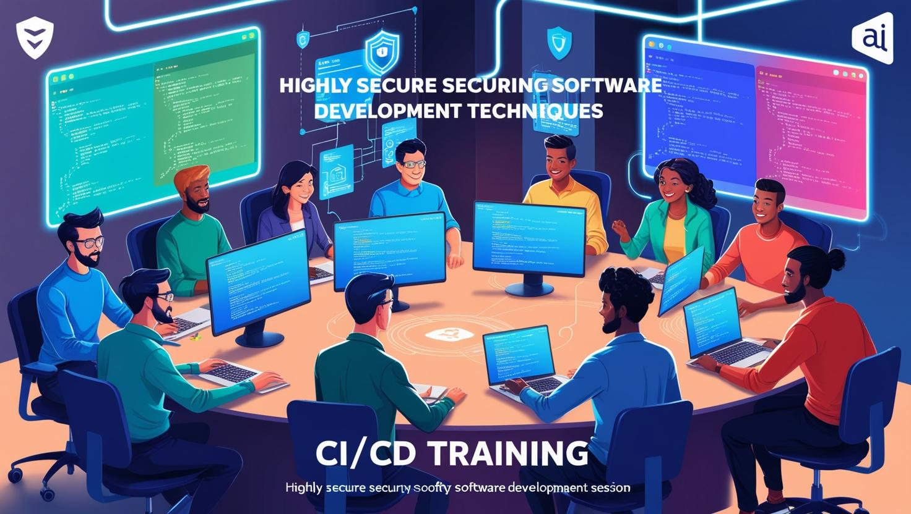

# Yazılımcılar için CI/CD Eğitimi - Tüm Yönleri ile Yüksek Güvenlikli Yazılım Geliştirme Teknikleri

[Download PDF Version](./yazilimcilar-icin-ci-cd.pdf)

## **Eğitim Süresi**

- **Format 1**
  - **5 Gün**
  - **Ders Süresi:** 50 dakika
  - **Eğitim Saati:** 10:00 - 17:00

- **Format 2**
  - **12 Gün**
  - **Ders Süresi:** 50 dakika
  - **Eğitim Saati:** 10:00 - 17:00

- > Her iki eğitim formatında eğitimler 50 dakika + 10 dakika moladır. 12:00-13:00 saatleri arasında 1 saat yemek arasındaki verilir. Günde toplam 6 saat eğitim verilir. 5 günlük formatta 30 saat eğitim, 12 günlük formatta toplam 72 saat eğitim verilmektedir. 12 saatlik eğitmde katılımcılar kod yazar ve eğitmenle birlikte sorulan sorulara ve taleplere uygun içerikler ve örnekler çalışılır.

- > Eğitimler uzaktan eğitim formatında tasarlanmıştır. Her eğitim için teams linkleri gönderilir. Katılımcılar bu linklere girerek eğitimlere katılırlar. Ayrıca farklı remote çalışma araçları da eğitmen tarafından tüm katılımlara sunulur. Katılımcılar bu araçları kullanarak eğitimlere katılırlar. 

- > Eğitim içeriğinde github ve codespace kullanılır. Katılımcılar bu platformlar üzerinden örnek projeler oluşturur ve eğitmenle birlikte eğitimlerde sorulan sorulara ve taleplere uygun iceriğe cevap verir. Katılımcılar bu araçlarla eğitimlerde sorulan sorulara ve taleplere uygun iceriğe cevap verir.

- > Eğitim yapay zeka destekli kendi kendine öğrenme formasyonu ile tasarlanmıştır. Katılımcılar eğitim boyunca kendi kendine öğrenme formasyonu ile eğitimlere katılırlar. Bu eğitim formatı sayesinde tüm katılımcılar gelecek tüm yaşamlarında kendilerini güncellemeye devam edebilecekler ve her türlü sorunun karşısında çözüm bulabilecekleri yeteneklere sahip olacaklardır.  

## **Yazılımcılar için CI/CD**

Yazılım geliştirme süreçlerinizi hızlandırmak ve güvenliğini artırmak için kapsamlı bir eğitim fırsatı sunuyoruz. Bu eğitim, CI/CD (Sürekli Entegrasyon ve Sürekli Dağıtım) süreçlerini etkili bir şekilde yönetebilmek ve güvenliği ön planda tutarak hatasız yazılımlar geliştirebilmek için gerekli becerileri kazandırmayı hedefliyor.

Eğitimde, yazılım güvenliği, DevSecOps, test otomasyonu, kod inceleme ve altyapı otomasyonu gibi önemli konulara odaklanarak, yazılım geliştirme süreçlerinizi optimize etme ve güvenli hale getirme konusunda derinlemesine bilgi edineceksiniz.

**Hedefiniz, daha hızlı, güvenli ve sürdürülebilir yazılım geliştirme süreçlerine sahip olmaksa, bu eğitim tam size göre!**

## **Eğitim Hedefi**

Bu eğitim, yazılımcıların yazılım geliştirme süreçlerini daha verimli, güvenli ve sürdürülebilir hale getirmelerini sağlamayı amaçlamaktadır. Katılımcılar, CI/CD (Sürekli Entegrasyon ve Sürekli Dağıtım) süreçlerini derinlemesine öğrenerek, yazılım geliştirme, test etme, dağıtım ve bakım aşamalarını hızlandıracak, güvenli bir şekilde yönetebilecek ve hata oranlarını minimize edebileceklerdir.

Eğitim, DevSecOps prensiplerine dayalı olarak, güvenli yazılım geliştirme yöntemlerini ve araçlarını tanıtarak, katılımcıların güvenlik açıklarını tespit etme, kod inceleme süreçlerini optimize etme ve yazılımın güvenliğini arttırma becerisi kazanmalarını hedeflemektedir. Ayrıca, altyapı otomasyonu, test otomasyonu, hata yönetimi ve sürekli geliştirme süreçlerinde en iyi uygulamaları öğrenerek, katılımcıların profesyonel yazılım geliştirme yetkinliklerini bir üst seviyeye taşımaları sağlanacaktır.

Eğitimi tamamlayan katılımcılar, günümüzün yüksek güvenlikli yazılım geliştirme gereksinimlerine uygun olarak, daha hızlı ve güvenli yazılım projeleri geliştirme yeteneğine sahip olacaklardır.

## **Eğitim İçeriği**

- **CI/CD’ye Giriş**  
  - CI/CD nedir? Temel kavramlar ve önemi  
  - Yazılım geliştirme yaşam döngüsü ve DevOps felsefesi  
  - CI/CD süreçlerinin avantajları ve zorlukları  

---

- **Sürekli Entegrasyon (CI)**  
  - CI araçlarının tanıtımı (Jenkins, GitLab CI, CircleCI vb.)  
  - Test otomasyonu ve birim testleri  
    - Test otomasyon araçları ve framework’leri (Selenium, JUnit, TestNG vb.)  
    - Otomatik testlerin CI süreçlerine entegrasyonu  
  - Fonksiyonel Testler  
    - Fonksiyonel testlerin önemi ve CI sürecine entegrasyonu  
    - Code Coverage (Kod Kapsamı): Testlerin kod üzerindeki kapsama oranı  
      - Code coverage araçları (Jacoco, Istanbul, Cobertura vb.)  
      - Code coverage'ın CI süreçlerine entegrasyonu  
  - Kullanıcı Arayüzü (UI) Testleri  
    - UI testleri ve otomasyon araçları (Selenium, Cypress vb.)  
    - Web Uygulamaları: Web uygulamaları için test senaryoları ve entegrasyonu  
    - Mobil Uygulamalar: Mobil test araçları (Appium, Espresso vb.) ve entegrasyonu  
    - Windows Uygulamaları: Windows uygulamaları için test stratejileri (WinAppDriver vb.)  
  - API Testleri  
    - API test araçları ve framework'leri (Postman, RestAssured vb.)  
    - API testlerinin CI süreçlerine entegrasyonu  
  - Microservis Testleri  
    - Microservislerin test edilmesi (Contract testing, Integration testing vb.)  
    - Microservislerde izolasyon ve bağımsız test stratejileri  
  - Kod kalitesi ve statik analiz araçları  
    - SonarQube ile kod kalitesi analizi  
    - Kod incelemesi ve raporlama  
  - CI süreçlerinin yapılandırılması ve yönetimi  
  - **Kod Review ve Merge Süreçleri**  
    - Git push sonrası kod inceleme süreçleri  
    - Kod review araçları ve en iyi uygulamalar (GitLab, GitHub Pull Requests vb.)  
    - Kod onayları ve merge izni verilmesi  
    - Review sonrası merge süreçlerinin otomasyonu ve yönetimi  

---

- **Sürekli Dağıtım (CD)**  
  - CD araçları ve teknikleri  
  - Dağıtım stratejileri: Blue-Green, Canary ve Rolling  
  - Uygulama izleme ve geri dönüş stratejileri  
  - Dağıtım süreçlerinin otomasyonu  
  - Yük (Load) Testleri  
    - Load testlerin önemi, araçları (JMeter, Gatling vb.) ve CI/CD entegrasyonu  
    - Web, mobil, Windows uygulamaları ve microservisler için yük testlerinin özelleştirilmesi  

---

- **Güvenli Yazılım Geliştirme Teknikleri**  
  - Yazılım güvenliği kavramları ve tehdit modelleme  
  - OWASP Top 10 Güvenlik Zafiyetleri  
    - En yaygın güvenlik açıkları (SQL Injection, XSS vb.)  
    - OWASP test araçlarının kullanımı (OWASP ZAP, Burp Suite vb.)  
    - OWASP standartlarının CI/CD süreçlerine entegrasyonu  
  - Güvenlik açığı tarama araçları ve entegrasyonu  
  - Kod Güvenlik Testleri  
    - Statik ve dinamik güvenlik test araçları (SAST, DAST)  
    - Kod güvenlik analizi (SonarQube, Checkmarx vb.)  
  - Güvenli Kodlama Teknikleri  
    - Güvenli Kodlama İlkeleri: Kod yazarken güvenlik zafiyetlerini önlemenin yolları  
    - Girdi doğrulama, çıktı filtreleme ve yetkilendirme mekanizmaları  
    - Güvenli Kodlama Standartları: OWASP, SANS, CERT gibi güvenlik çerçeveleri  
    - Veri Şifreleme Teknikleri: Verilerin güvenli bir şekilde işlenmesi ve saklanması  
    - Güvenli Parola Yönetimi: Hashing ve saklama yöntemleri  
    - Güvenli hata yönetimi ve logging uygulamaları  
    - Tersine mühendisliğe karşı koruma yöntemleri  
  - CI/CD süreçlerinde güvenliğin entegrasyonu  

## **Eğitim Yöntemi**

- **Teorik Bilgi:** Güncel bilgiler ve konseptlerin anlatımı.
- **Uygulamalı Örnekler:** Gerçek senaryolarla pratik uygulamalar.
- **Etkileşimli Tartışmalar:** Katılımcıların fikirlerini paylaşabileceği oturumlar.
- **Vaka Çalışmaları:** Katılımcıların kendi projelerine uygulayabilecekleri gerçek dünya örnekleri.

## **Hedef Kitle**

- Yazılımcılar ve geliştiriciler
- DevOps mühendisleri
- Yazılım mimarları
- Teknoloji yöneticileri
- Yazılım test uzmanları

## **Katılımcılardan Beklentilerimiz**

- Katılımcıların temel yazılım geliştirme bilgisine sahip olmaları.
- Versiyon kontrol sistemlerine (özellikle Git) aşina olmaları.
- CI/CD süreçlerine ve yazılım güvenliğine ilgi duymaları.
- Takım çalışmasına yatkın olmaları ve grup çalışmasına katılım göstermeye istekli olmaları.

[Eğitim Materyalleri (Eğitmenlere Özel)](https://github.com/TuncerKARAARSLAN-VB/training-kit-yazilimcilar-icin-ileri-seviye-ci-cd-egitimi)
