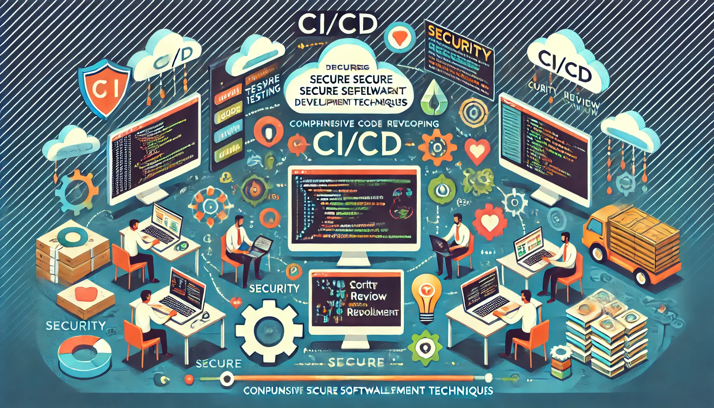

# Yazılımcılar için CI/CD Eğitimi - Tüm Yönleri ile Yüksek Güvenlikli Yazılım Geliştirme Teknikleri

## Eğitim Süresi:

**Format 1**

- **5 Gün**
- **Ders Süresi:** 50 dakika
- **Eğitim Saati:** 10:00 - 17:00

**Format 2**

- **12 Gün**
- **Ders Süresi:** 50 dakika
- **Eğitim Saati:** 10:00 - 17:00

## Eğitim Hedefi:
Bu eğitim, yazılımcılara sürekli entegrasyon (CI) ve sürekli dağıtım (CD) süreçlerini yüksek güvenlik standartları ile entegre bir şekilde kullanmalarını sağlamayı amaçlamaktadır. Eğitim sonunda katılımcılar, modern yazılım geliştirme süreçlerinde CI/CD uygulamalarını etkin bir şekilde kullanabilecek, güvenli yazılım geliştirme teknikleri hakkında bilgi sahibi olacak ve yazılımlarını güvenli bir şekilde dağıtma becerisi kazanacaklardır.

## Eğitim İçeriği:

- **Gün 1: CI/CD’ye Giriş**
  - CI/CD nedir? Temel kavramlar ve önemi
  - Yazılım geliştirme yaşam döngüsü ve DevOps felsefesi
  - CI/CD süreçlerinin avantajları ve zorlukları

- **Gün 2: Sürekli Entegrasyon (CI)**
  - CI araçlarının tanıtımı (Jenkins, GitLab CI, CircleCI vb.)
  - Test otomasyonu ve birim testleri
    - Test otomasyon araçları ve framework’leri (Selenium, JUnit, TestNG vb.)
    - Otomatik testlerin CI süreçlerine entegrasyonu
  - **Fonksiyonel (Function) Testler**
    - Fonksiyonel testlerin önemi ve CI sürecine entegrasyonu
    - **Code Coverage (Kod Kapsamı)**: Testlerin kod üzerindeki kapsama oranı
      - Code coverage araçları (Jacoco, Istanbul, Cobertura vb.)
      - Code coverage'ın CI süreçlerine entegrasyonu
  - **Kullanıcı Arayüzü (UI) Testleri**
    - UI testleri ve otomasyon araçları (Selenium, Cypress vb.)
    - **Web Uygulamaları**: Web uygulamaları için test senaryoları ve entegrasyonu
    - **Mobil Uygulamalar**: Mobil test araçları (Appium, Espresso vb.) ve entegrasyonu
    - **Windows Uygulamaları**: Windows uygulamaları için test stratejileri (WinAppDriver vb.)
  - **API Testleri**
    - API test araçları ve framework'leri (Postman, RestAssured vb.)
    - API testlerinin CI süreçlerine entegrasyonu
  - **Microservis Testleri**
    - Microservislerin test edilmesi (Contract testing, Integration testing vb.)
    - Microservislerde izolasyon ve bağımsız test stratejileri
  - Kod kalitesi ve statik analiz araçları
    - SonarQube ile kod kalitesi analizi
    - Kod incelemesi ve raporlama
  - CI süreçlerinin yapılandırılması ve yönetimi

- **Gün 3: Sürekli Dağıtım (CD)**
  - CD araçları ve teknikleri
  - Dağıtım stratejileri: Blue-Green, Canary ve Rolling
  - Uygulama izleme ve geri dönüş stratejileri
  - Dağıtım süreçlerinin otomasyonu
  - **Yük (Load) Testleri**
    - Load testlerin önemi, araçları (JMeter, Gatling vb.) ve CI/CD entegrasyonu
    - Web, mobil, Windows uygulamaları ve microservisler için yük testlerinin özelleştirilmesi

- **Gün 4: Güvenli Yazılım Geliştirme Teknikleri**
  - Yazılım güvenliği kavramları ve tehdit modelleme
  - **OWASP Top 10 Güvenlik Zafiyetleri**
    - En yaygın güvenlik açıkları (SQL Injection, XSS vb.)
    - OWASP test araçlarının kullanımı (OWASP ZAP, Burp Suite vb.)
    - OWASP standartlarının CI/CD süreçlerine entegrasyonu
  - Güvenlik açığı tarama araçları ve entegrasyonu
  - **Kod Güvenlik Testleri**
    - Statik ve dinamik güvenlik test araçları (SAST, DAST)
    - Kod güvenlik analizi (SonarQube, Checkmarx vb.)
  - **Güvenli Kodlama Teknikleri**
    - **Güvenli Kodlama İlkeleri**: Kod yazarken güvenlik zafiyetlerini önlemenin yolları
    - Girdi doğrulama, çıktı filtreleme ve yetkilendirme mekanizmaları
    - **Güvenli Kodlama Standartları**: OWASP, SANS, CERT gibi güvenlik çerçeveleri
    - **Veri Şifreleme Teknikleri**: Verilerin güvenli bir şekilde işlenmesi ve saklanması
    - **Güvenli Parola Yönetimi**: Hashing ve saklama yöntemleri
    - Güvenli hata yönetimi ve logging uygulamaları
    - Tersine mühendisliğe karşı koruma yöntemleri
  - CI/CD süreçlerinde güvenliğin entegrasyonu

- **Gün 5: Pratik Uygulamalar ve Vaka Çalışmaları**
  - Gerçek dünyadan vaka çalışmaları
  - CI/CD süreçlerinin güvenli bir şekilde nasıl uygulanacağına dair örnekler
  - Katılımcıların projelerinde CI/CD uygulamaları tasarlamaları
  - Eğitim değerlendirmesi ve geribildirim oturumu

## Eğitim Yöntemi:

- **Teorik Bilgi:** Güncel bilgiler ve konseptlerin anlatımı.
- **Uygulamalı Örnekler:** Gerçek senaryolarla pratik uygulamalar.
- **Etkileşimli Tartışmalar:** Katılımcıların fikirlerini paylaşabileceği oturumlar.
- **Vaka Çalışmaları:** Katılımcıların kendi projelerine uygulayabilecekleri gerçek dünya örnekleri.

## Hedef Kitle:

- Yazılımcılar ve geliştiriciler
- DevOps mühendisleri
- Yazılım mimarları
- Teknoloji yöneticileri
- Yazılım test uzmanları

### Beklentilerimiz:

- Katılımcıların temel yazılım geliştirme bilgisine sahip olmaları.
- Versiyon kontrol sistemlerine (özellikle Git) aşina olmaları.
- CI/CD süreçlerine ve yazılım güvenliğine ilgi duymaları.
- Takım çalışmasına yatkın olmaları ve grup çalışmasına katılım göstermeye istekli olmaları.

[Eğitim ana materyalleri, sadece eğitmenler için](https://github.com/TuncerKARAARSLAN-VB/training-kit-yazilimcilar-icin-ileri-seviye-ci-cd-egitimi)
