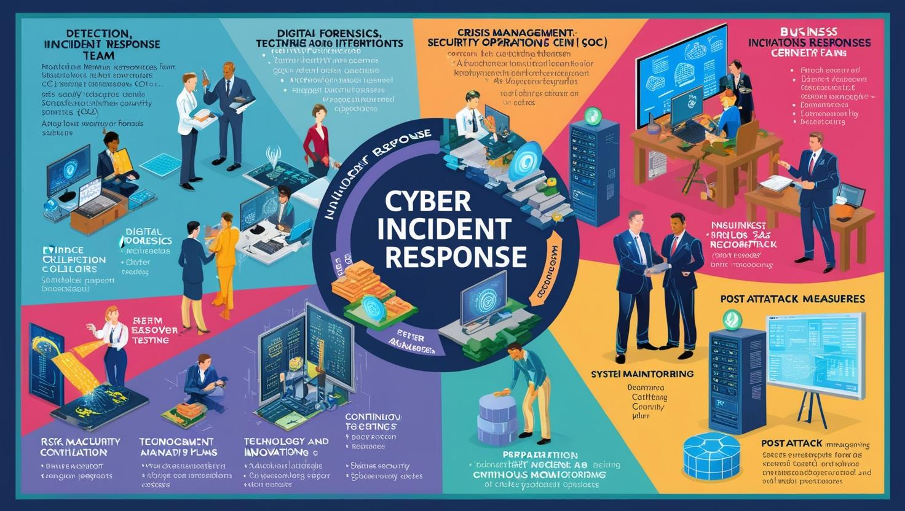
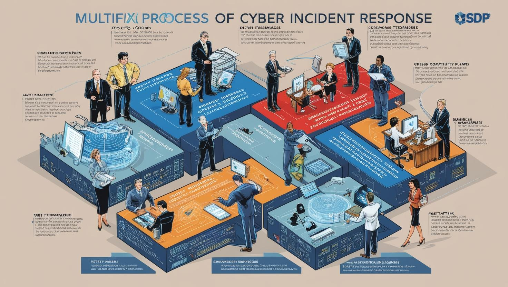

# **Yöneticiler için Yapay Zeka ve Kurumları Yarına Hazırlama**

[Download PDF Version](./cyber-security-for-managers.pdf)

## **Eğitim Süresi**

- **Format 1**
  - **5 Gün**
  - **Ders Süresi:** 50 dakika
  - **Eğitim Saati:** 10:00 - 17:00

- **Format 2**
  - **12 Gün**
  - **Ders Süresi:** 50 dakika
  - **Eğitim Saati:** 10:00 - 17:00

- > Her iki eğitim formatında eğitimler 50 dakika + 10 dakika moladır. 12:00-13:00 saatleri arasında 1 saat yemek arasındaki verilir. Günde toplam 6 saat eğitim verilir. 5 günlük formatta 30 saat eğitim, 12 günlük formatta toplam 72 saat eğitim verilmektedir. 12 saatlik eğitmde katılımcılar kod yazar ve eğitmenle birlikte sorulan sorulara ve taleplere uygun içerikler ve örnekler çalışılır.

- > Eğitimler uzaktan eğitim formatında tasarlanmıştır. Her eğitim için teams linkleri gönderilir. Katılımcılar bu linklere girerek eğitimlere katılırlar. Ayrıca farklı remote çalışma araçları da eğitmen tarafından tüm katılımlara sunulur. Katılımcılar bu araçları kullanarak eğitimlere katılırlar. 

- > Eğitim içeriğinde github ve codespace kullanılır. Katılımcılar bu platformlar üzerinden örnek projeler oluşturur ve eğitmenle birlikte eğitimlerde sorulan sorulara ve taleplere uygun iceriğe cevap verir. Katılımcılar bu araçlarla eğitimlerde sorulan sorulara ve taleplere uygun iceriğe cevap verir.

- > Eğitim yapay zeka destekli kendi kendine öğrenme formasyonu ile tasarlanmıştır. Katılımcılar eğitim boyunca kendi kendine öğrenme formasyonu ile eğitimlere katılırlar. Bu eğitim formatı sayesinde tüm katılımcılar gelecek tüm yaşamlarında kendilerini güncellemeye devam edebilecekler ve her türlü sorunun karşısında çözüm bulabilecekleri yeteneklere sahip olacaklardır.

## **Siber Güvenlik Stratejileri - Yöneticiler İçin Karar Destek**

Dijital dünyada işletmelerin karşı karşıya kaldığı siber tehditler giderek daha karmaşık hale geliyor. Bu tehditlerle başa çıkabilmek ve organizasyonel güvenliği sağlam bir temele oturtabilmek için üst düzey yöneticilerin ve birim yöneticilerinin siber güvenlik konusunda derinlemesine bilgiye sahip olmaları kritik bir öneme sahiptir. Bu eğitim, katılımcıların iş dünyasındaki siber güvenlik stratejileri hakkında bilgi edinmelerini, güvenlik risklerini yönetmelerini ve bu tehditlere karşı güçlü savunma sistemleri kurmalarını sağlamayı hedefliyor.

- **Siber Güvenlik Yönetimi:** Tepe yöneticilerinin organizasyonel güvenliği nasıl güçlendirebileceği ve risk yönetimi süreçlerini nasıl optimize edebileceği konusunda derinlemesine bilgi.
- **Risk ve Tehdit Yönetimi:** Siber tehditleri öngörme, riskleri analiz etme ve etkili bir risk yönetimi planı oluşturma becerileri.
- **Kurumsal Güvenlik Stratejisi Geliştirme:** Yöneticilerin, iş süreçleriyle uyumlu, sürdürülebilir bir güvenlik stratejisi oluşturma yolları.
- **Etik ve Yasal Düzenlemeler:** Siber güvenlik ve veri gizliliği konusunda en son yasal düzenlemeler ve etik kurallar hakkında bilgi.

## **Eğitim Hedefi**

Bu eğitim, üst düzey yöneticilere ve karar vericilere, siber güvenliğin iş stratejileri ile entegrasyonunu sağlamaları için gerekli bilgileri sunmayı amaçlamaktadır. Katılımcılar, organizasyonlarında güvenlik kültürünü benimsemek, risk yönetimi süreçlerini iyileştirmek ve siber tehditlere karşı proaktif stratejiler geliştirmek için gerekli becerileri kazanacaklardır. Eğitim, siber güvenlikteki en son trendler ve teknolojiler hakkında derinlemesine bilgi sağlayarak, yöneticilerin güvenlik politikalarını etkin bir şekilde oluşturmasına ve liderlik etmesine olanak tanıyacaktır. Ayrıca, organizasyonel güvenliği güçlendirecek ve risklere karşı etkili bir savunma stratejisi oluşturulmasına yardımcı olacak pratik yöntemler sunulacaktır.

## **Eğitim İçeriği**

### **Siber Güvenlik ve Kurumsal Hazırlık**

- **Siber Tehditlerin Tanımlanması ve İş Dünyasına Etkisi:** Günümüzde hızla gelişen siber tehditlerin iş dünyasında yaratabileceği tehlikeler, saldırı türleri ve bunların potansiyel etkileri. Örneğin, veritabanı saldırıları veya fidye yazılımları gibi tehditler, şirketlerin itibarını ve finansal durumunu ciddi şekilde etkileyebilir.
- **Siber Güvenlik Stratejileri ve Kurumsal Uyum:** Kurumların güvenlik stratejileri geliştirme ve bu stratejileri kurum kültürüne entegre etme süreci. Ayrıca, bu stratejilerin yasal düzenlemelere uyumlu olmasının önemi vurgulanır.
- **Yönetici Perspektifinden Risk Değerlendirmesi:** Kurumların siber güvenlik tehditlerine karşı riskleri nasıl değerlendirebileceği ve bu süreçte yöneticilerin alması gereken kararlar. Yöneticilerin bilgi kaybı veya itibar kaybı gibi potansiyel tazminatlarla karşılaşmamak için alacağı önlemler.
- **Veri Güvenliği ve Gizliliği:** Kurumların KVKK'ya uyumlu veri güvenliği politikaları oluşturması, gizliliğin sağlanması ve verilerin korunması için alınacak önlemler.

### **İleri Seviye Güvenlik Teknolojileri ve Altyapı**

- **İleri Seviye Güvenlik Duvarları ve Saldırı Tespit Sistemleri:** Gelişmiş ağ güvenlik sistemleri ve saldırı tespit/önleme sistemleri, kurumların altyapı güvenliğini sağlamada kritik öneme sahiptir. Ayrıca, bu sistemler, şirketlerin dış saldırılara karşı etkili korunmasına yardımcı olur.
- **DDoS Saldırıları ve Önleme Stratejileri:** Dağıtılmış hizmet dışı bırakma saldırıları (DDoS) gibi siber saldırılar, ağın çalışmasını engelleyebilir ve şirketin hizmetlerini kesintiye uğratabilir. Bu tür saldırılara karşı alacağı önlemler, itibar kaybını ve finansal zararı önleyebilir.
- **Zararlı Yazılım Tespiti ve Yanıt Stratejileri:** Zararlı yazılımların tespiti ve bu yazılımlara karşı geliştirilen hızlı müdahale stratejileri. Bu, potansiyel veri kayıplarını ve bilgi sızıntılarını engellemek için kritik öneme sahiptir.
- **Güvenli Altyapı ve Bulut Bilişim:** Bulut altyapıları, kurumların veri güvenliğini sağlamada önemli bir rol oynar. Ancak, KVKK'ya uygunluk ve verilerin bulut ortamlarında güvenli bir şekilde saklanması, şirketlerin hukuki sorumluluklarını yerine getirmeleri için gereklidir.

### **Siber Güvenlikte Liderlik ve Değişim Yönetimi**

- **Siber Güvenlik Liderliği:** Yöneticilerin siber güvenlik stratejileri oluşturma ve uygulama konusunda liderlik yapabilme becerileri. Bu liderlik, organizasyonun güvenliğini sağlamak ve itibar kaybının önüne geçmek için kritik öneme sahiptir.
- **Kurumsal Kültür ve Siber Güvenlik Uyumu:** Kurum kültürünün siber güvenlik stratejileriyle uyumlu hale getirilmesi. Çalışanların güvenlik bilincinin artırılması ve bu kültürün şirketin her katmanında benimsenmesi, büyük çaplı veri sızıntıları ve güvenlik ihlallerinin önüne geçebilir.
- **Risk Yönetimi ve Olay Müdahale Protokolleri:** Bir siber güvenlik olayı sonrası alınacak acil önlemler, kriz yönetimi ve olay müdahale süreçleri. Etkin olay müdahalesi, itibar kaybı ve yasal tazminatların önüne geçilmesini sağlayabilir.
- **Etik ve Hukuki Perspektif:** Yasal sorumluluklar ve etik kuralların siber güvenlik süreçlerine entegrasyonu. KVKK gibi yasal düzenlemelere uyumsuzluk, firmaların ciddi tazminatlarla karşılaşmasına yol açabilir.

### **Stratejik Karar Verme ve YZ Uygulamaları ile Güvenlik İnovasyonu**

- **Yapay Zeka ve Güvenlik İnovasyonu:** Yapay zeka temelli güvenlik çözümleri, proaktif tehdit tespiti ve önleme stratejileri. Yapay zeka, siber saldırıları hızlı bir şekilde tanıma ve buna karşılık verme yeteneği sunarak büyük çaplı veri kayıplarının ve itibar zararlarının önüne geçebilir.
- **Siber Güvenlik Projelerinde KPI ve ROI Yönetimi:** Siber güvenlik projelerinin başarısını ölçmek için KPI’lar ve ROI hesaplamaları. Bu, şirketlerin güvenlik yatırımlarının etkinliğini değerlendirmelerine ve uzun vadede güvenlik risklerini minimize etmelerine yardımcı olur.
- **Sektörel Uygulamalar ve Gelecek Trendleri:** Farklı sektörlerdeki siber güvenlik trendleri ve bu sektöre özgü tehditlere karşı alınması gereken önlemler. Bu, sektörel düzeyde güvenlik stratejilerinin nasıl şekillendirileceğini ve organizasyonların gelecekteki tehditlere nasıl adaptasyon sağlayacağını gösterir.
- **Siber Güvenlik Geleceği:** Gelecekteki siber tehditler, yenilikçi güvenlik çözümleri ve stratejik kararlar üzerine yapılan derinlemesine tartışmalar. Firmaların gelecekteki güvenlik risklerine karşı hazırlıklı olmaları, itibar kaybını ve yüksek tazminatları önleyebilir.

**Eğitim Sürecinden Beklenen Çıktılar:**
Bu eğitim, katılımcılara siber güvenlik tehditlerini tanıma, etkili stratejiler geliştirme ve bu stratejileri kurumsal yapılarla uyumlu hale getirme becerisi kazandıracaktır. Ayrıca, veri güvenliği ve gizlilik konusunda alınacak önlemler, şirketlerin KVKK'ya uyum sağlama süreçlerine yardımcı olacak ve firmaların yüksek tazminatlarla karşılaşma riskini azaltacaktır. Etkili siber güvenlik yönetimi sayesinde, kurumlar hem hukuki sorumluluklardan hem de itibar kaybı gibi ciddi finansal kayıplardan korunabilir.

## **Eğitim Yöntemi**

Eğitim, katılımcıların mevcut bilgi ve deneyimlerini kullanarak etkileşimli tartışmalar, vaka analizleri ve uygulamalı simülasyonlarla zenginleştirilmiştir. Katılımcılar, gerçek dünyadaki siber güvenlik problemlerine çözüm geliştirme konusunda beceri kazanacak, güvenlik risklerini minimize etmek için stratejik kararlar almayı öğreneceklerdir.

Siber güvenlikte liderlik ve karar destek konusunda derinlemesine bilgi sahibi olmak isteyen tüm yöneticileri, bu eğitimde buluşmaya davet ediyoruz!

- **Teorik Bilgi Paylaşımı:** Yöneticilere siber güvenlik kavramları, stratejileri ve uygulamaları hakkında derinlemesine bilgi aktarımı.
- **Vaka Çalışmaları ve Gerçek Dünya Senaryoları:** Sektörel vaka analizleri, başarılı ve başarısız siber güvenlik projeleri örnekleri üzerinden stratejik çıkarımlar.
- **Grup Tartışmaları ve Etkileşimli Oturumlar:** Katılımcıların kendi sektörel deneyimlerini paylaşarak, siber güvenlik stratejilerini kurumsal seviyeye nasıl entegre edebileceği üzerine fikir alışverişi.
- **Simülasyonlar ve Pratik Çalışmalar:** Katılımcıların teorik bilgileri uygulamalı simülasyonlar ile pekiştirmeleri.

## **Hedef Kitle**

- **Tepe Yöneticiler (CEO, CTO, CIO):** Şirketlerinin siber güvenlik stratejilerini belirleyip uygulamak isteyen üst düzey yöneticiler.
- **Birim Yöneticileri ve Departman Liderleri:** Siber güvenlik konularında detaylı bilgi sahibi olup, kendi departmanlarında stratejik kararlar alması gereken yöneticiler.
- **Teknoloji Liderleri ve İnovasyon Yöneticileri:** Kurumlarının dijital dönüşüm süreçlerinde siber güvenliği etkin bir şekilde entegre etmek isteyen teknoloji liderleri.
- **Risk Yönetimi ve Güvenlik Uzmanları:** Siber güvenlik stratejilerinin geliştirilmesinde ve uygulanmasında önemli rol oynayan profesyoneller.

Bu eğitim, üst düzey yöneticilerin ve birim yöneticilerinin siber güvenlikte bilinçli kararlar almasına yardımcı olacak, organizasyonel güvenliği güçlendirecek stratejiler ve araçlar hakkında derinlemesine bilgi sağlayacaktır.

## **Katılımcılardan Beklentilerimiz**

- Katılımcıların iş dünyasında stratejik karar alma süreçlerinde yer alıyor olmaları.
- Yapay zeka teknolojileri hakkında temel bilgiye sahip olmaları ve kendi sektörlerinde inovasyonu teşvik etmek için isteklilik göstermeleri.

[Eğitim Materyalleri (Eğitmenlere Özel)](https://github.com/TuncerKARAARSLAN-VB/training-kit-yoneticiler-icin-yapay-zeka-kurumlari-yarinlara-hazirlama)
