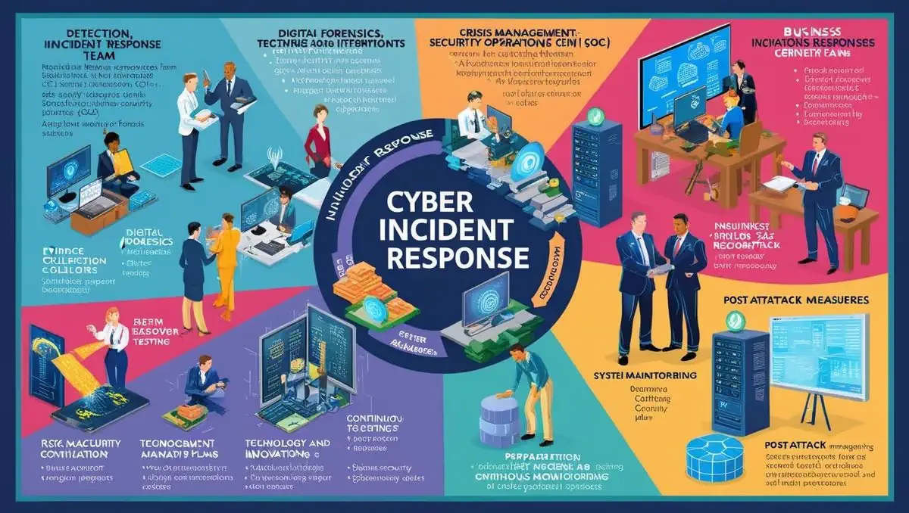
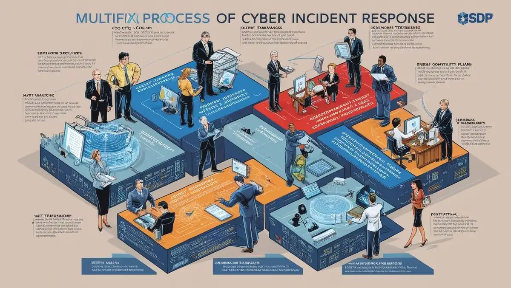

# **KURUMSAL EĞİTİM, SİBER GÜVENLİK VE AĞ GÜVENLİĞİ**

- [Güncel PDF'i İndir](https://www.vebende.com.tr/pdfs/yoneticilere-siber-guvenlik-egitimi.pdf)
- [En güncel eğitimlerimiz için www.vebende.com.tr ziyaret edin](https://www.vebende.com.tr/yoneticilere-siber-guvenlik-egitimi)
  
## **Eğitim Süresi**

- **Süre:** 1 gün
- **Ders Süresi:** 50 dakika
- **Eğitim Saati:** 10:00 - 17:00

- > Eğitim formatında eğitimler 50 dakika + 10 dakika moladır. 12:00-13:00 saatleri arasında 1 saat yemek arasındaki verilir. Günde toplam 6 saat eğitim verilir. 1 günlük formatta 6 saat eğitim verilmektedir.

- > Eğitimler uzaktan eğitim formatında tasarlanmıştır. Her eğitim için teams linkleri gönderilir. Katılımcılar bu linklere girerek eğitimlere katılırlar. Ayrıca farklı remote çalışma araçları da eğitmen tarafından tüm katılımlara sunulur. Katılımcılar bu araçları kullanarak eğitimlere katılırlar.

- > Eğitim içeriğinde github ve codespace kullanılır. Katılımcılar bu platformlar üzerinden örnek projeler oluşturur ve eğitmenle birlikte eğitimlerde sorulan sorulara ve taleplere uygun iceriğe cevap verir. Katılımcılar bu araçlarla eğitimlerde sorulan sorulara ve taleplere uygun iceriğe cevap verir.

- > Eğitim yapay zeka destekli kendi kendine öğrenme formasyonu ile tasarlanmıştır. Katılımcılar eğitim boyunca kendi kendine öğrenme formasyonu ile eğitimlere katılırlar. Bu eğitim formatı sayesinde tüm katılımcılar gelecek tüm yaşamlarında kendilerini güncellemeye devam edebilecekler ve her türlü sorunun karşısında çözüm bulabilecekleri yeteneklere sahip olacaklardır.  

## **Siber Güvenlik Stratejileri – Yöneticiler İçin Karar Destek**  

Dijital dünyada işletmelerin karşılaştığı siber tehditler giderek daha karmaşık hale gelmektedir. Bu tehditlere karşı etkin bir mücadele yürütebilmek ve organizasyonel güvenliği sağlam temellere oturtabilmek için yöneticilerin siber güvenlik konusunda derinlemesine bilgi sahibi olmaları kritik önem taşımaktadır.  

Bu eğitim, yöneticilere siber güvenlik stratejileri hakkında bilgi kazandırmayı, güvenlik risklerini yönetme yetkinliklerini geliştirmeyi ve organizasyonları için güçlü savunma sistemleri kurmalarına yardımcı olmayı hedeflemektedir.  

### **Eğitim İçeriği**  

- **Siber Güvenlik Yönetimi**  
  Üst düzey yöneticilerin organizasyonel güvenliği nasıl güçlendirebileceği ve risk yönetimi süreçlerini nasıl optimize edebileceği konusunda derinlemesine bilgi.  

- **Risk ve Tehdit Yönetimi**  
  Siber tehditleri öngörme, riskleri analiz etme ve etkili bir risk yönetimi planı oluşturma becerileri.  

- **Kurumsal Güvenlik Stratejisi Geliştirme**  
  İş süreçleriyle uyumlu, sürdürülebilir ve proaktif güvenlik stratejileri oluşturma yöntemleri.  

- **Etik ve Yasal Düzenlemeler**  
  Siber güvenlik ve veri gizliliği ile ilgili en güncel yasal düzenlemeler ve etik kurallar hakkında bilgi.  

### **Eğitim Hedefi**  

Bu eğitim, üst düzey yöneticilere ve karar vericilere, siber güvenliği iş stratejileri ile entegre edebilme yetkinliği kazandırmayı amaçlamaktadır. Katılımcılar, organizasyonlarında güvenlik kültürünü benimsemek, risk yönetimi süreçlerini iyileştirmek ve siber tehditlere karşı proaktif savunma mekanizmaları geliştirmek için gerekli becerileri edineceklerdir.  

Ayrıca, siber güvenlikteki en son trendler ve teknolojiler hakkında bilgi sahibi olarak, güvenlik politikalarını etkin bir şekilde oluşturma ve yönetme konusunda liderlik yapabileceklerdir. Eğitim, organizasyonel güvenliği güçlendirecek ve risklere karşı etkili bir savunma stratejisi geliştirmeye yardımcı olacak pratik yöntemler sunacaktır.  

### **Eğitim Sonunda Kazanımlar**  

Eğitim sonunda katılımcılar şunları başaracaklardır:  

- **Siber tehdit istihbaratı ve tehdit analizi tekniklerini öğrenerek:**  
  Siber tehditlerin kaynağını ve hedeflerini analiz etme becerisi kazanacaklardır.  

- **Ağ güvenliği ve güvenlik duvarı yapılandırmalarını yönetme yetkinliği elde ederek:**  
  Kurum içi ağları güvence altına alma yeteneği kazanacaklardır.  

- **Penetrasyon testi ve sızma testleri gibi yöntemlerle:**  
  Güvenlik açıklarını tespit etme ve bunlara karşı önlemler geliştirme konusunda deneyim sahibi olacaklardır.  

- **Uygulama güvenliği ve güvenli yazılım geliştirme metodolojilerini benimseyerek:**  
  Yazılım ve uygulamalardaki potansiyel güvenlik açıklarını analiz etme ve düzeltme yeteneği kazanacaklardır.  

- **Siber olay müdahale ve kriz yönetimi süreçlerini etkin bir şekilde yönetebilme yeteneği ile:**  
  Siber saldırı anında hızlı ve doğru müdahalelerde bulunabileceklerdir.  

Eğitim sonunda katılımcılar, siber güvenlik tehditlerine karşı etkin savunma yapabilen, güvenlik zafiyetlerini tespit edebilen, güvenlik olaylarını yöneten ve siber krizlere karşı hazırlıklı profesyoneller olarak görev alabileceklerdir.

## **Eğitim İçeriği**  

### **Siber Güvenlik ve Kurumsal Hazırlık**

#### **1. Siber Tehditlerin Tanımlanması ve İş Dünyasına Etkisi**

- Siber tehdit türleri ve şirketler üzerindeki etkileri.
- Fidye yazılımları, veri sızıntıları ve DDoS saldırıları gibi tehditlerin finansal ve itibari sonuçları.

#### **2. Siber Güvenlik Stratejileri ve Kurumsal Uyum**

- Kurumların güvenlik stratejileri oluşturma ve uygulama süreçleri.
- Yasal düzenlemelere uyum ve KVKK gibi regülasyonlara uygunluk.

#### **3. Yönetici Perspektifinden Risk Değerlendirmesi**

- Risk yönetimi süreci ve yöneticilerin alması gereken kritik kararlar.
- Finansal ve itibar kaybını önlemek için stratejik adımlar.

#### **4. Veri Güvenliği ve Gizliliği**

- KVKK uyumluluğu ve veri güvenliği politikaları oluşturma.
- Veri şifreleme ve erişim kontrolü mekanizmaları.

### **İleri Seviye Güvenlik Teknolojileri ve Altyapı**

#### **1. İleri Seviye Güvenlik Duvarları ve Saldırı Tespit Sistemleri**

- Gelişmiş ağ güvenlik sistemleri ve saldırı önleme teknikleri.
- Yeni nesil güvenlik duvarları ve IDS/IPS sistemleri.

#### **2. DDoS Saldırıları ve Önleme Stratejileri**

- Dağıtılmış hizmet dışı bırakma saldırılarının tespiti ve savunma yöntemleri.
- Trafik analizi ve otomatik koruma sistemleri.

#### **3. Zararlı Yazılım Tespiti ve Yanıt Stratejileri**

- Zararlı yazılımların yayılma yöntemleri ve korunma stratejileri.
- Anomali tespiti ve otomatik tepki sistemleri.

#### **4. Güvenli Altyapı ve Bulut Bilişim**

- Bulut bilişim güvenliği ve veri saklama stratejileri.
- KVKK ile uyumlu güvenli bulut kullanım politikaları.

### **Siber Güvenlikte Liderlik ve Değişim Yönetimi**

#### **1. Siber Güvenlik Liderliği**

- Yöneticilerin siber güvenlik stratejileri geliştirme ve uygulama süreçleri.
- Liderlerin organizasyon içinde güvenlik kültürü oluşturması.

#### **2. Kurumsal Kültür ve Siber Güvenlik Uyumu**

- Çalışanların siber güvenlik farkındalığını artırma yöntemleri.
- Kurum içi güvenlik politikalarının benimsenmesi ve uygulanması.

#### **3. Risk Yönetimi ve Olay Müdahale Protokolleri**

- Siber olay müdahale planları ve kriz yönetimi süreçleri.
- İtibar kaybını önlemek için etkin olay yönetimi stratejileri.

#### **4. Etik ve Hukuki Perspektif**

- Siber güvenlik alanındaki etik kurallar ve yasal düzenlemeler.
- KVKK ve diğer veri güvenliği yasalarına uyum.

### **Stratejik Karar Verme ve YZ Uygulamaları ile Güvenlik İnovasyonu**

#### **1. Yapay Zeka ve Güvenlik İnovasyonu**

- Yapay zeka destekli güvenlik çözümleri ve proaktif tehdit tespiti.
- Siber saldırı tespiti için makine öğrenimi algoritmalarının kullanımı.

#### **2. Siber Güvenlik Projelerinde KPI ve ROI Yönetimi**

- Güvenlik projelerinin başarısını ölçmek için KPI belirleme yöntemleri.
- Siber güvenlik yatırımlarının finansal getirisi ve uzun vadeli etkileri.

#### **3. Sektörel Uygulamalar ve Gelecek Trendleri**

- Farklı sektörlerdeki siber güvenlik tehditleri ve koruma stratejileri.
- Gelecekte öne çıkması beklenen güvenlik çözümleri ve trendler.

#### **4. Siber Güvenlik Geleceği**

- Yeni nesil tehditler ve organizasyonların adaptasyon süreçleri.
- Geleceğe yönelik güvenlik stratejileri ve inovasyonlar.

## **Eğitim Yöntemi**  

- **Teorik Bilgi:** Katılımcılar, siber güvenlik tehditleri, güvenlik açıkları, veri gizliliği, ağ güvenliği ve KVKK uyumu gibi konular hakkında kapsamlı bilgi edinecektir.  
- **Vaka Analizleri:** Gerçek dünyadan alınan başarılı ve başarısız siber güvenlik projeleri incelenerek, kritik stratejik çıkarımlar yapılacaktır.  
- **Etkileşimli Tartışmalar:** Katılımcılar, kendi deneyimlerini paylaşarak siber güvenlik stratejilerinin kurumsal yapıya nasıl entegre edileceği üzerine fikir alışverişinde bulunacaktır.  
- **Simülasyonlar ve Uygulamalı Çalışmalar:** Gerçek siber saldırı senaryoları üzerinden tehditlere karşı etkili müdahale yöntemleri pratik olarak uygulanacaktır.  
- **Stratejik Karar Alma Egzersizleri:** Katılımcılar, siber güvenlik yönetimi konusunda bilinçli kararlar almayı öğrenerek, riskleri minimize etmeye yönelik stratejiler geliştirecektir.  

## **Hedef Kitle**  

Bu eğitim, üst düzey yöneticilerden teknik uzmanlara kadar geniş bir kitleye hitap etmektedir:  

1. **Tepe Yöneticiler (CEO, CTO, CIO):** Kurumlarının siber güvenlik stratejilerini belirlemek ve uygulamak isteyen liderler.  
2. **Birim Yöneticileri ve Departman Liderleri:** Kendi ekiplerinde güvenlik politikalarını yönlendirmek ve siber tehditlere karşı bilinç oluşturmak isteyen yöneticiler.  
3. **Teknoloji ve İnovasyon Yöneticileri:** Dijital dönüşüm süreçlerinde siber güvenliği etkin bir şekilde entegre etmek isteyen teknoloji liderleri.  
4. **Risk Yönetimi ve Güvenlik Uzmanları:** Siber güvenlik tehditlerini önceden belirleyerek risk yönetimi süreçlerini yöneten profesyoneller.  
5. **IT Destek ve Güvenlik Ekipleri:** Kurumun siber güvenlik altyapısını güçlendirmek ve güvenlik ihlallerine hızlı müdahale etmek isteyen teknik uzmanlar.  

## **Katılımcılardan Beklentilerimiz**  

- Temel düzeyde bilgisayar kullanım bilgisine sahip olmaları önerilir.  
- Dijital güvenlik konusunda temel bir farkındalığa sahip olmaları avantaj sağlayacaktır.  
- Eğitim boyunca aktif katılım, soru sorma ve vaka çalışmalarına dahil olma beklenmektedir.  

Bu eğitim, katılımcılara siber güvenlik tehditlerini tanıma, etkili stratejiler geliştirme ve kurumsal güvenliği güçlendirme konusunda kritik beceriler kazandıracaktır.

[Eğitim Materyalleri (Eğitmenlere Özel)](https://github.com/TuncerKARAARSLAN-VB/training-kit-yoneticilere-siber-guvenlik-egitimi)
